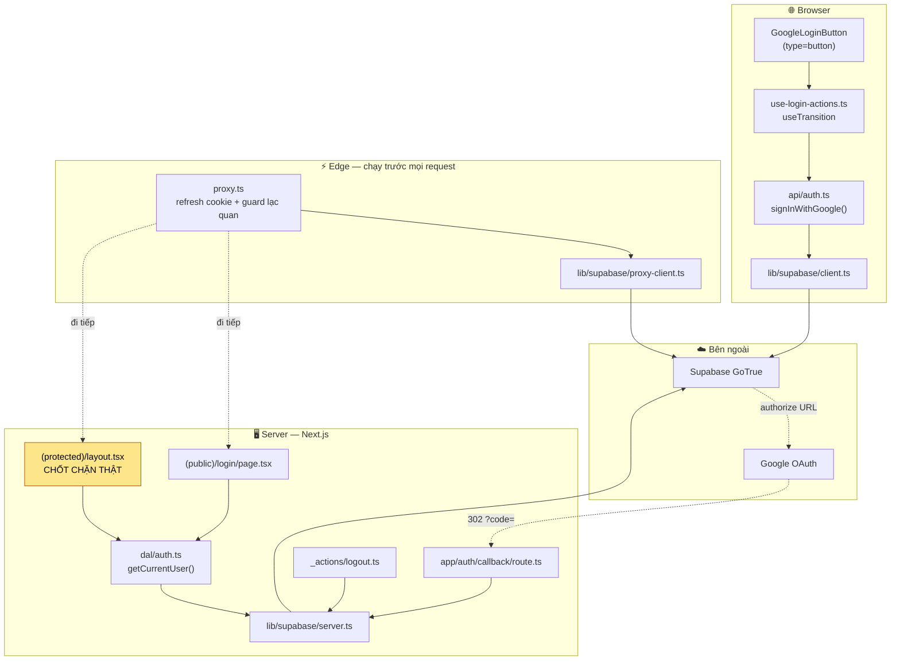
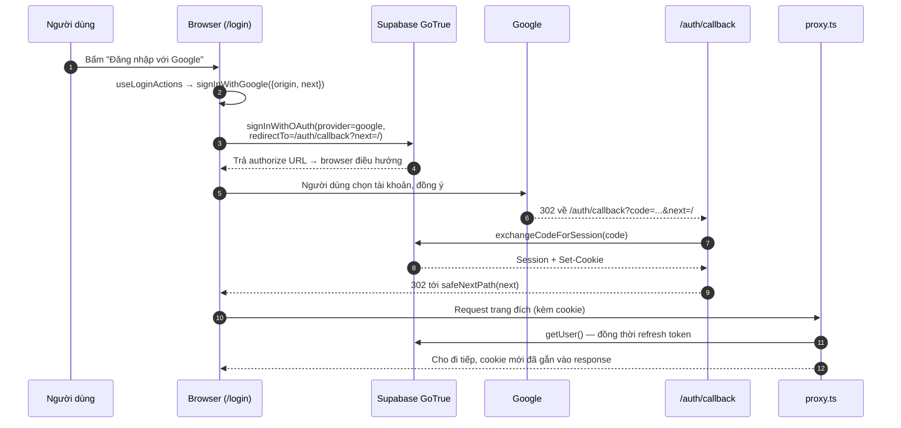
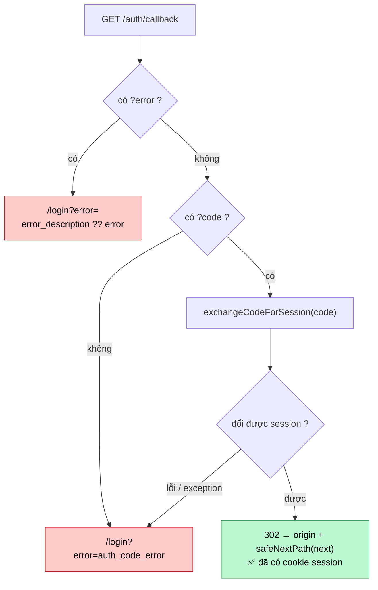
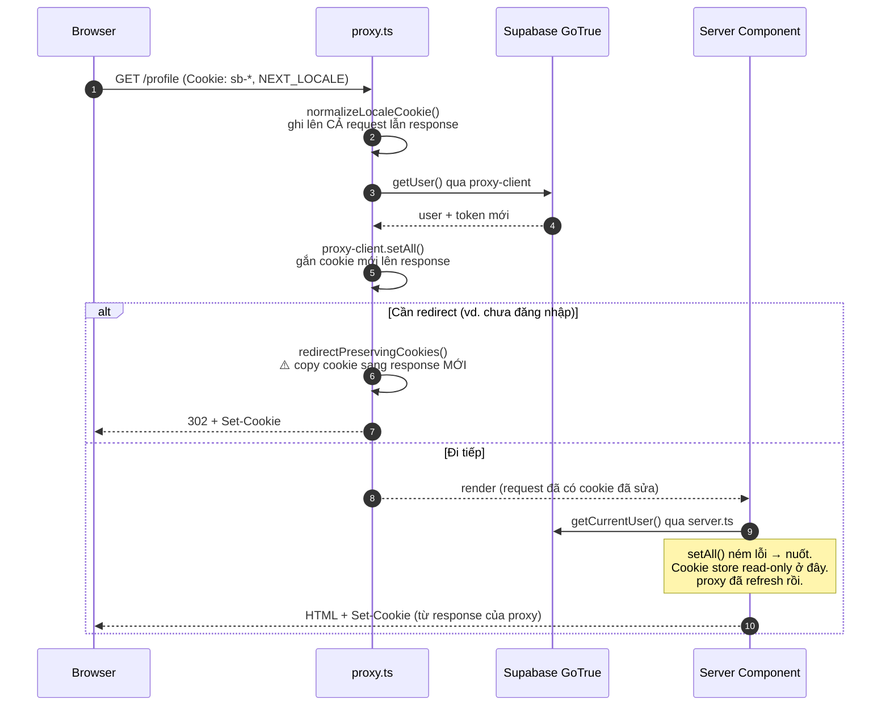
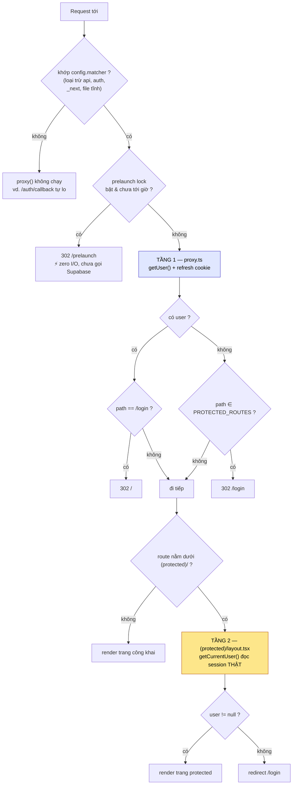
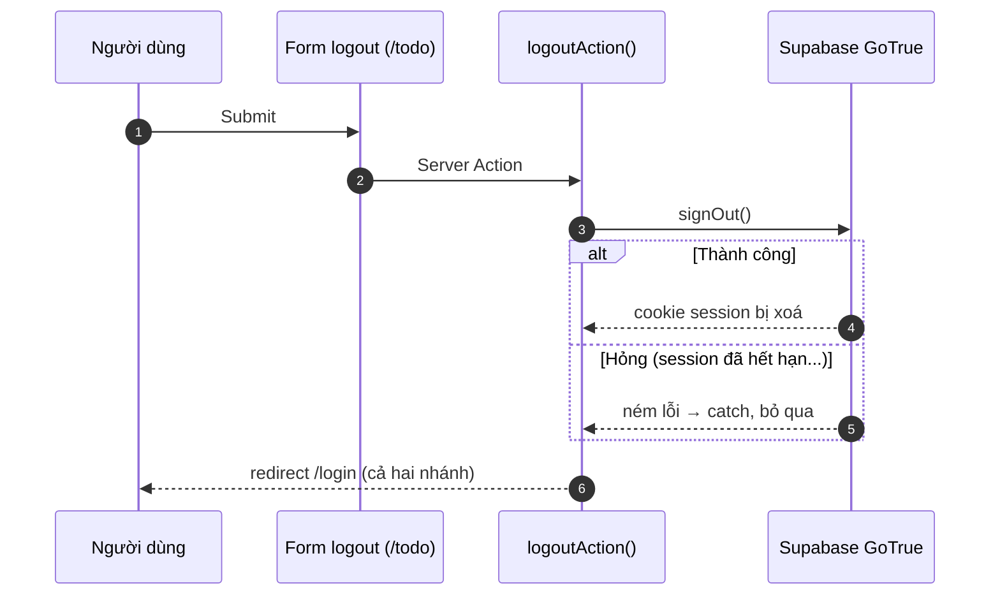

# Luồng đăng nhập (Google OAuth qua Supabase)

Tài liệu này mô tả **toàn bộ đường đi của một lần đăng nhập** trong dự án: từ lúc người dùng
bấm nút cho tới lúc trang protected chịu render, kèm cả đường về (logout) và các nhánh lỗi.

Đây là tài liệu viết tay, mô tả code thật tại thời điểm `docs/login-flow.md` được viết. Spec
sinh tự động của cùng tính năng nằm ở [`docs/vi/features/F001_GoogleOAuthLogin/`](vi/features/F001_GoogleOAuthLogin/).

---

## 1. Tóm tắt trong 5 dòng

1. App **không tự quản lý mật khẩu**. Danh tính do Google cấp, Supabase Auth (GoTrue) đứng giữa.
2. Trình duyệt mở OAuth theo chuẩn **PKCE** — verifier nằm ở browser, nên bước khởi động OAuth
   bắt buộc chạy ở **client component**, không phải server action.
3. Google trả người dùng về `/auth/callback?code=...`; route handler này **đổi code lấy session**
   và set cookie.
4. Session sống trong **cookie**, được `src/proxy.ts` refresh trên mỗi request.
5. Có **hai tầng chặn**: proxy (đoán nhanh, không đáng tin) và layout `(protected)` (đọc session
   thật, đây mới là chốt chặn).

---

## 2. Các nhân vật trong luồng

Trước khi đọc bảng, nhìn bức tranh tổng: ai gọi ai, và ranh giới browser / server nằm ở đâu.



| File | Vai trò |
|---|---|
| [src/app/(public)/login/page.tsx](../src/app/(public)/login/page.tsx) | Server Component `/login`. Đã đăng nhập thì redirect `/`. Dựng text đa ngữ. |
| [src/app/(public)/login/_components/login-client.tsx](../src/app/(public)/login/_components/login-client.tsx) | Ranh giới client, nối props với hành động. |
| [src/app/(public)/login/_hooks/use-login-actions.ts](../src/app/(public)/login/_hooks/use-login-actions.ts) | State pending/lỗi + gọi OAuth và đổi ngôn ngữ. |
| [src/api/auth.ts](../src/api/auth.ts) | `signInWithGoogle()` — gọi `supabase.auth.signInWithOAuth`. |
| [src/lib/supabase/client.ts](../src/lib/supabase/client.ts) | Supabase client phía browser (publishable key). |
| [src/app/auth/callback/route.ts](../src/app/auth/callback/route.ts) | Đổi `code` lấy session, quyết định redirect cuối. |
| [src/utils/url/next-path.ts](../src/utils/url/next-path.ts) | `safeNextPath()` — chốt chặn open-redirect / header injection. |
| [src/proxy.ts](../src/proxy.ts) | Refresh cookie session + guard lạc quan + chuẩn hoá cookie ngôn ngữ. |
| [src/lib/supabase/proxy-client.ts](../src/lib/supabase/proxy-client.ts) | Supabase client dùng trong proxy (ghi cookie lên cả request lẫn response). |
| [src/app/(protected)/layout.tsx](../src/app/(protected)/layout.tsx) | **Chốt chặn thật**: không có user → redirect `/login`. |
| [src/dal/auth.ts](../src/dal/auth.ts) | `getCurrentUser()` — mọi Server Component đọc user qua đây. |
| [src/lib/supabase/server.ts](../src/lib/supabase/server.ts) | Supabase client phía server (đọc cookie của Next). |
| [src/app/_actions/logout.ts](../src/app/_actions/logout.ts) | Server Action đăng xuất. |

---

## 3. Luồng thành công, từng bước



### Bước 1 — Bấm nút

`GoogleLoginButton` là `type="button"`, **không phải submit**. `useLoginActions.handleLoginClick`
mở một `useTransition` rồi gọi `signInWithGoogle`.

Hai chi tiết cố ý:

- **`isPending` không reset trong `finally`.** Khi thành công, browser đang trên đường rời trang
  sang Google — reset pending sẽ làm nút nhấp nháy.
- **Login và đổi ngôn ngữ dùng chung một transition.** Hệ quả: đổi ngôn ngữ cũng làm nút login
  vào trạng thái pending. Hành vi này được giữ nguyên từ trước lúc tách hook.

### Bước 2 — Khởi động OAuth

```ts
redirectTo: `${origin}/auth/callback?next=${safeNextPath(next)}`
```

`origin` được **truyền vào** (`window.location.origin`) chứ không đọc `window` bên trong
`src/api/auth.ts` — nhờ vậy module không dính DOM và test không cần dựng browser.

`next` đi qua `safeNextPath` **ngay từ chiều đi**, không chỉ chiều về. Ràng buộc nằm ở code, không
nằm ở lời dặn trong comment.

Hàm trả về `{ ok: boolean }`, nuốt mọi lỗi. Có chủ đích: UI chỉ hiện một dòng thông báo cố định
đã dịch sẵn, **không bao giờ render text lỗi thô của nhà cung cấp** ra trang. `ok: true` nghĩa là
"đã bàn giao cho browser", không phải "đã đăng nhập xong".

### Bước 3 — `/auth/callback`

Route này **nằm ngoài matcher của proxy** (`auth` bị loại trừ) — nó tự quyết định redirect của mình.

| Query nhận được | Xử lý |
|---|---|
| `?error=...` | Redirect `/login?error=<error_description ?? error>` |
| `?code=...`, đổi thành công | Redirect `origin + safeNextPath(next)` |
| `?code=...`, đổi thất bại / ném exception | Redirect `/login?error=auth_code_error` |
| Không code, không error | Redirect `/login?error=auth_code_error` |



Mọi nhánh hỏng đều đổ về **một** đích duy nhất — không có đường nào để lỗi rò ra ngoài dưới dạng
text thô.

`code` và `error_description` **không bao giờ được log** — chúng có thể mang thông tin nhạy cảm.

### Bước 4 — `/login` render lỗi (nếu có)

`page.tsx` chỉ nhìn **sự hiện diện** của `?error=`, không đọc giá trị. Next parse `?error=` lặp lại
thành `string[]`, một lần thành `string` — cả hai dạng được quy về boolean. Text hiện ra là chuỗi
cố định đã dịch, nên không thể phản chiếu nội dung do kẻ tấn công điều khiển vào trang.

Lỗi phía client (OAuth hỏng mà chưa kịp round-trip qua `?error=`) dùng **cùng một chuỗi** đó —
`errorText` luôn được server resolve sẵn và truyền xuống client boundary.

---

## 4. Session sống ở đâu và được làm mới thế nào

Session là cookie do `@supabase/ssr` quản lý. Ba client factory, ba ngữ cảnh khác nhau:

| Factory | Dùng ở | Ghi cookie được không |
|---|---|---|
| `lib/supabase/client.ts` | Client component | Browser tự lo |
| `lib/supabase/server.ts` | Server Component, Server Action, Route Handler | `setAll` bọc try/catch — trong Server Component thì cookie store read-only, ném lỗi là **bình thường**, không phải bug bị nuốt |
| `lib/supabase/proxy-client.ts` | `proxy.ts` | Ghi lên **cả** `request.cookies` lẫn `response.cookies` |

Việc refresh token thật sự xảy ra ở `proxy.ts`, trong `getUserOrNull()` — `getUser()` vừa đọc user
vừa gia hạn token. Đây là lý do Server Component không cần (và không thể) tự ghi cookie.

Vòng đời cookie trên **một** request bất kỳ sau khi đã đăng nhập:



> **Cạm bẫy đã được xử lý:** `NextResponse.redirect()` tạo một response object **mới toanh**. Mọi
> cookie đã gắn lên response cũ (token vừa refresh, locale vừa chuẩn hoá) sẽ **mất sạch** nếu không
> copy sang. `redirectPreservingCookies()` trong `src/proxy.ts` tồn tại chính vì lý do đó — đây là
> bug kinh điển của `@supabase/ssr` khi dùng chung với middleware.

---

## 5. Hai tầng chặn — và vì sao phải có cả hai



Tầng 1 (xanh) có thể sai — nó chỉ để cắt sớm cho phần lớn trường hợp. Tầng 2 (vàng) mới là thứ
quyết định trang protected có được render hay không.

### Tầng 1: `src/proxy.ts` — lạc quan, nhanh, KHÔNG đáng tin một mình

```
authed  & path == /login            → redirect /
!authed & path ∈ [/todo, /profile]  → redirect /login
còn lại                             → đi tiếp (kèm cookie đã refresh)
```

Trước cả nhánh auth, proxy chạy nhánh **prelaunch lock** (`src/domain/prelaunch-lock.ts`) — thuần
tính toán, **zero I/O**. Nhờ vậy việc nới `config.matcher` ra toàn site không thêm một round-trip
Supabase nào cho các route vốn không cần.

Tài liệu chính thức của Next nói thẳng: middleware/proxy "should not be your only line of defense".

### Tầng 2: `src/app/(protected)/layout.tsx` — chốt chặn thật

Đọc session thật qua `getCurrentUser()` (**không phải đọc cookie**), `null` thì `redirect('/login')`
trước khi bất kỳ page con nào render.

Muốn thêm route cần đăng nhập: đặt nó dưới `(protected)/` và **mở rộng mảng `PROTECTED_ROUTES`**
trong `proxy.ts` — đừng viết thêm nhánh `if` thứ hai.

### `getCurrentUser()` fail OPEN

```ts
try { ... } catch { return null }
```

Supabase sập thì trang **render như khách vãng lai**, không 500 cả site. Hàm này không bao giờ tự
redirect — quyết định redirect thuộc về layout `(protected)`.

---

## 6. `safeNextPath()` — vì sao một hàm nhỏ lại quan trọng

`?next=` là input người dùng điều khiển được, và giá trị của nó cuối cùng đi thẳng vào header
`Location`. Hàm này là **choke point duy nhất**, chặn:

| Input | Vì sao nguy hiểm |
|---|---|
| `https://evil.com` | Open redirect trắng trợn |
| `//evil.com`, `/\evil.com` | Browser parse thành URL tuyệt đối → vẫn rời origin |
| `/x://y` | Có `://` ở bất kỳ đâu → đổi scheme sau khi normalize |
| `%0d`, `%0a`, `%00` | Ký tự điều khiển → HTTP response splitting |
| `%e2%80%a8` / `%e2%80%a9` (U+2028/2029) | Line terminator với JS/JSON parser; quét theo từng byte **không** thấy, phải decode mới lộ |

Không hợp lệ → rơi về `/`. Node hiện cũng ném lỗi với mấy ký tự này, nhưng đó chỉ là lưới an toàn
tình cờ của try/catch phía caller — các check ở đây làm việc từ chối trở nên tường minh.

---

## 7. Đăng xuất

`logoutAction()` (Server Action, bind vào form logout ở `/todo`):

1. `supabase.auth.signOut()` — bọc try/catch.
2. **Luôn** `redirect('/login')`, kể cả khi `signOut()` hỏng (ví dụ session đã hết hạn phía server).



Lý do: ý định của người dùng là rời khu vực đã đăng nhập, còn guard của `/login` sẽ tự suy ra trạng
thái đúng. Không bao giờ để người dùng kẹt lại trên trang không còn phản ánh session của họ.

---

## 8. Ma trận lỗi — triệu chứng → nơi cần nhìn

| Triệu chứng | Nghi ngờ đầu tiên |
|---|---|
| Về lại `/login?error=auth_code_error` ngay | `exchangeCodeForSession` hỏng — sai Supabase project, code hết hạn, hoặc gọi callback hai lần |
| Google báo `redirect_uri_mismatch` | `origin` lúc chạy khác với Redirect URL khai trong Supabase/Google Console |
| Đăng nhập xong vẫn bị đá về `/login` | Cookie không tới được browser — kiểm tra `redirectPreservingCookies` và domain cookie |
| Vòng lặp redirect `/login` ↔ `/` | Proxy và layout `(protected)` bất đồng về trạng thái session |
| Bấm nút không có gì xảy ra, hiện dòng lỗi | `signInWithGoogle` trả `ok: false` — mở Network tab, lỗi thật bị nuốt có chủ đích |
| Nút login pending mà mình chỉ đổi ngôn ngữ | Đúng thiết kế — chung một `useTransition` (§3, bước 1) |

---

## 9. Biến môi trường

| Biến | Dùng ở |
|---|---|
| `NEXT_PUBLIC_SUPABASE_URL` | Cả ba client factory |
| `NEXT_PUBLIC_SUPABASE_PUBLISHABLE_KEY` | Cả ba — thay cho anon key cũ, an toàn khi lộ ra client |

Hai biến này dùng `!` (non-null assertion) có chủ đích: thiếu chúng thì app **phải chết ngay và
ồn ào**, chứ không âm thầm chạy với một client `undefined`.

> **Cảnh báo Vercel:** đặt biến `NEXT_PUBLIC_*` ở dạng **Secret** sẽ làm client bundle nhận
> `[SENSITIVE]` thay vì giá trị thật → login hỏng ở production nhưng local vẫn chạy ngon. Xem
> [docs/deployment.md](deployment.md) và nhật ký
> [260911-1845](journals/260911-1845-vercel-secret-env-breaks-client-bundle.md).

**Service-role / secret key không bao giờ được chạm vào luồng này.**

---

## 10. Test ở đâu

| Tầng | File |
|---|---|
| Unit — khởi động OAuth | `src/api/auth.test.ts` |
| Unit — DAL đọc user | `src/dal/auth.test.ts` |
| Unit — hook của màn login | `src/app/(public)/login/_hooks/use-login-actions.test.ts` |
| Unit — các supabase client | `src/lib/supabase/{client,server,proxy-client}.test.ts` |
| E2E | `playwright/` |

---

## Tài liệu liên quan

- Spec sinh tự động: [`docs/vi/features/F001_GoogleOAuthLogin/`](vi/features/F001_GoogleOAuthLogin/)
- Màn hình: [`docs/vi/screens/SCR001_Login/`](vi/screens/SCR001_Login/)
- Deploy & biến môi trường: [`docs/deployment.md`](deployment.md)
- Nhật ký dựng tính năng: [`260904-2016`](journals/260904-2016-login-google-oauth-momorph-takumi-pipeline.md)
