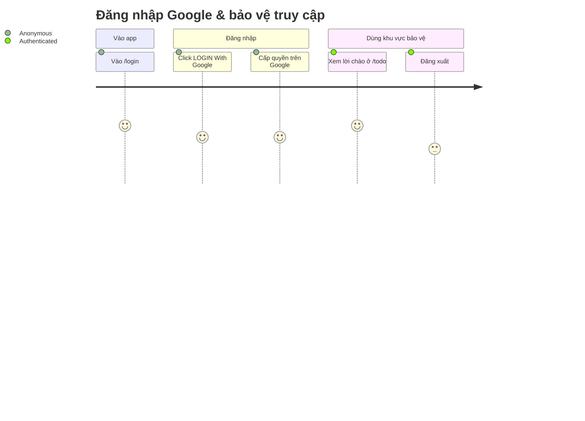

<!-- layout-exempt: rebuild-spec owns all docs/system|features|generated|flows paths -->
<!-- Contract: references/feature-spec-researcher-contract.md -->

# Functional Spec — F001_GoogleOAuthLogin

**Priority**: P0
**Type**: mixed
**Generated**: 2026-09-05

**See also:** [`technical-spec.md`](./technical-spec.md) — endpoint, Source citation, pseudocode,
key entities, DB writes cho audience Dev/QA/SA.

**Traceability:** F001 → SCR001, SCR002 → US002, US003 → BL001, BL002, BL003 → ROUTE001 → (chưa có TC### — pass generate-testcases chạy sau)

## 1. Overview

**Problem:** App cần một cách xác thực khách truy cập mà không tự quản lý mật khẩu/tài khoản, và
phải đảm bảo khu vực nội dung `/todo` chỉ những ai đã xác thực mới xem được — không có cơ chế đăng
ký/đăng nhập nào khác trong app.
**Solution:** Khách truy cập đăng nhập bằng tài khoản Google qua Supabase Auth (luồng PKCE); thành
công đưa vào `/todo` (placeholder được bảo vệ). Route-guard hai lớp — một lớp optimistic chạy trước
mọi trang, một lớp authoritative chạy lại ngay tại trang — enforce đúng MỘT trạng thái: đã đăng nhập
hay chưa. Đăng xuất là một Server Action best-effort, luôn đưa người dùng về màn hình đăng nhập.
**Scope:** đăng nhập bằng Google OAuth; bảo vệ route `/todo`; đăng xuất; chống open-redirect qua
tham số `?next=` của callback.
**Non-Scope:** không có đăng nhập bằng email/mật khẩu; không có phân quyền theo vai trò (admin/
manager/owner không tồn tại); `/todo` chưa có tính năng todo thật — chỉ là placeholder chứng minh
guard hoạt động end-to-end.

**Actors**

| Actor | Description | Primary goal |
|-------|--------------|---------------|
| Khách truy cập chưa đăng nhập (Anonymous) | Chưa có phiên Supabase hợp lệ | Đăng nhập bằng Google để vào được `/todo` |
| Người dùng đã đăng nhập (Authenticated) | Đã có phiên Supabase hợp lệ sau khi OAuth thành công | Xem nội dung được bảo vệ và đăng xuất khi xong |

## 2. Functional Capabilities

| ID | Capability | What the user can do | User Stories | Requirements | Business Rules | Screens |
|----|------------|------------------------|-----------------|---------------|-------------------|---------|
| CAP-01 | Đăng nhập Google & bảo vệ truy cập | Đăng nhập bằng tài khoản Google, được đưa vào khu vực bảo vệ, giữ được phiên trong lúc dùng, và đăng xuất đúng cách khi rời đi | US002, US003 | FR-001, FR-101, FR-201, FR-202, FR-203, FR-204, FR-301, FR-302, FR-401, FR-402, FR-601, FR-602, FR-603 | BR-001, BR-002, BR-003, BR-004, BR-005, DEC-001, DEC-002, SM-001 | SCR001, SCR002 |

## 3. Open Decisions

None — no unresolved domain confirmations.

## 4. Requirements

### Foundation (0xx)

- **FR-001** Hai biến môi trường Supabase (project URL + publishable key) phải được cấu hình trước —
  thiếu một trong hai làm toàn bộ tính năng đăng nhập ngưng hoạt động ngay từ lần gọi đầu tiên.

### Navigation (1xx)

- **FR-101** Truy cập route gốc `/` luôn đưa người dùng tới đúng nơi theo trạng thái đăng nhập —
  `/todo` nếu đã đăng nhập, `/login` nếu chưa.

### Login Screen (2xx)

- **FR-201** `/login` hiển thị form đăng nhập cùng copy đã dịch (vi mặc định, en qua next-intl) cho
  khách chưa đăng nhập; ai đã đăng nhập thì được đưa thẳng sang `/todo` trước khi form kịp render.
- **FR-202** Click nút "LOGIN With Google" khởi động luồng OAuth Google qua Supabase.
- **FR-203** Trong lúc chờ OAuth, nút đăng nhập chuyển sang trạng thái đang xử lý (disabled + hiệu
  ứng loading); nếu chính lần đăng nhập đó lỗi ngay phía trình duyệt, thông báo lỗi cố định hiện ra
  ngay, không cần chờ chuyển trang.
- **FR-204** Khi quay lại `/login` kèm tham số báo lỗi, màn hình hiện đúng một thông báo cố định đã
  dịch — không bao giờ hiện nguyên văn lỗi từ nhà cung cấp OAuth.

### Todo Screen (3xx)

- **FR-301** `/todo` chào người dùng đã đăng nhập bằng đúng email tài khoản Google của họ.
- **FR-302** `/todo` cung cấp nút đăng xuất để kết thúc phiên làm việc.

### Interaction (4xx)

- **FR-401** Sau khi OAuth thành công, người dùng được đưa từ màn hình đăng nhập sang trang chủ (`/`)
  mà không cần thao tác thêm — đổi từ màn hình todo kể từ F003_Homepage (2026-09-06); `/todo` vẫn là
  khu vực được bảo vệ, chỉ không còn là đích mặc định.
- **FR-402** Đường dẫn quay về sau khi đăng nhập (tham số `next` đầu vào) luôn được kiểm tra an
  toàn — không bao giờ đưa người dùng ra khỏi app.

### Security (6xx)

- **FR-601** Việc kiểm tra phiên tại `/login` không bao giờ chặn người dùng vào form, kể cả khi hệ
  thống xác thực gặp sự cố tạm thời.
- **FR-602** Route gốc `/` tự kiểm tra lại trạng thái đăng nhập một cách độc lập, phòng khi lớp
  kiểm tra sớm hơn không chạy.
- **FR-603** `/todo` không bao giờ hiện nội dung được bảo vệ cho người chưa đăng nhập, kể cả khi hệ
  thống xác thực gặp sự cố.

## 5. Business Rules

- Guard `/login` luôn cho qua (fail open) khi hệ thống xác thực gặp lỗi — đây là cổng vào duy nhất
  của app, chặn nhầm sẽ khoá mọi người dùng ra ngoài vĩnh viễn (BR-001)
- Đường dẫn quay về sau đăng nhập chỉ được chấp nhận khi thuộc cùng app và là đường dẫn nội bộ hợp
  lệ; bất kỳ giá trị khả nghi nào cũng lặng lẽ quay về trang todo mặc định (BR-002)
- Guard `/todo` luôn chặn (fail closed) khi thiếu người dùng hợp lệ hoặc hệ thống xác thực gặp lỗi —
  không có đường nào lộ nội dung bảo vệ (BR-003)
- Đăng xuất luôn đưa người dùng về màn hình đăng nhập, kể cả khi thao tác đăng xuất phía hệ thống
  xác thực thất bại (best-effort) (BR-004)
- Nút đăng nhập Google và nút đổi ngôn ngữ dùng chung một trạng thái "đang xử lý" theo chủ đích —
  đổi ngôn ngữ cũng tạm khoá nút đăng nhập trong lúc đó (BR-005)
- Có lỗi OAuth từ nhà cung cấp thì đưa về `/login` kèm thông báo cố định; có mã xác thực hợp lệ thì
  đổi lấy phiên rồi đưa tới đích đã xác thực an toàn — bất kỳ trường hợp nào khác đều rơi vào cùng
  một thông báo lỗi chung (DEC-001)
- Kết quả đổi mã xác thực lấy phiên quyết định đích đến cuối cùng của luồng đăng nhập: thành công
  thì vào khu vực bảo vệ, thất bại thì quay lại màn hình đăng nhập với thông báo lỗi chung (DEC-002)
- Trạng thái đăng nhập của một phiên chỉ có hai giá trị — chưa xác thực hoặc đã xác thực — chuyển từ
  giá trị này sang giá trị kia khi đăng nhập thành công hoặc khi đăng xuất (SM-001)

## 6. Screens

| Screen Name | SCR### | What User Sees | What User Can Do |
|-------------|--------|-----------------|-------------------|
| Login | SCR001_LoginScreen | Key visual, logo, dòng giới thiệu, nút "LOGIN With Google", alert lỗi (khi có), bộ chọn ngôn ngữ (thuộc F002) | Đăng nhập bằng Google; đổi ngôn ngữ VN/EN (F002) |
| Todo | SCR002_TodoScreen | Lời chào bằng email tài khoản, nút đăng xuất | Xem lời chào; đăng xuất |

### User Journey

1. Người dùng vào `/login` (trực tiếp, hoặc bị điều hướng từ `/` khi chưa đăng nhập) và thấy form
   đăng nhập.
2. Người dùng click "LOGIN With Google", chọn tài khoản và cấp quyền trên trang Google.
3. Người dùng được đưa tới màn hình Todo, thấy lời chào theo email của mình.
4. Người dùng click đăng xuất khi xong việc và được đưa trở lại màn hình đăng nhập.



## 7. User Stories

### US002_LoginWithGoogle — Login With Google

**Actor:** Khách truy cập chưa đăng nhập (Anonymous)
**Goal:** Đăng nhập bằng tài khoản Google của mình
**Business value:** Vào được khu vực nội dung được bảo vệ (`/todo`) mà không cần tạo tài khoản/mật
khẩu riêng cho app này

**Acceptance Criteria:**
- [ ] Click nút "LOGIN With Google" khởi động OAuth; nút chuyển trạng thái đang xử lý (disabled +
  hiệu ứng loading) trong lúc chờ.
- [ ] OAuth thành công → được đưa tới trang chủ (mặc định `/`, đổi từ `/todo`), không cần thao tác thêm.
- [ ] Nhà cung cấp OAuth trả lỗi, hoặc bước đổi mã xác thực thất bại/thiếu dữ liệu → quay lại
  `/login` kèm đúng một thông báo lỗi cố định đã dịch (không bao giờ hiện lỗi nguyên văn).
- [ ] Lỗi xảy ra ngay phía trình duyệt (chưa kịp chuyển trang) → cùng thông báo lỗi cố định hiện ra
  ngay lập tức.

### US003_LogOut — Log Out

**Actor:** Người dùng đã đăng nhập (Authenticated)
**Goal:** Đăng xuất khỏi tài khoản Google của mình
**Business value:** Kết thúc phiên làm việc đúng cách, tránh người khác dùng chung máy xem được nội
dung của mình

**Acceptance Criteria:**
- [ ] Click nút đăng xuất kết thúc phiên làm việc.
- [ ] Luôn được đưa về `/login` sau khi đăng xuất, kể cả khi thao tác đăng xuất phía hệ thống thất
  bại (session server đã hết hạn từ trước).
- [ ] Sau khi đăng xuất, truy cập lại `/todo` bằng đường dẫn trực tiếp bị chặn, đưa về `/login`.

## 8. Scenarios

### US002_LoginWithGoogle — Happy Path

**Given** khách chưa đăng nhập đang ở `/login`, **When** họ click "LOGIN With Google" và hoàn tất
cấp quyền trên Google, **Then** họ được đưa tới `/` (trang chủ, đổi từ `/todo`).

### US002_LoginWithGoogle — Error: nhà cung cấp OAuth từ chối/lỗi

**Given** khách chưa đăng nhập đang ở `/login`, **When** họ huỷ cấp quyền hoặc Google trả về lỗi,
**Then** họ được đưa về `/login` kèm thông báo "Đăng nhập không thành công, vui lòng thử lại".

### US003_LogOut — Happy Path

**Given** người dùng đã đăng nhập đang ở `/todo`, **When** họ click nút đăng xuất, **Then** phiên
làm việc kết thúc và họ được đưa về `/login`.

### US003_LogOut — Error: phiên đã hết hạn phía hệ thống xác thực

**Given** người dùng đã đăng nhập đang ở `/todo` nhưng phiên đã hết hạn phía hệ thống xác thực,
**When** họ click nút đăng xuất, **Then** thao tác đăng xuất phía hệ thống thất bại một cách im
lặng nhưng họ vẫn được đưa về `/login`.

## 9. Edge Cases

| Scenario | What Happens | User-Facing Message |
|----------|--------------|----------------------|
| Nhà cung cấp OAuth trả lỗi (người dùng huỷ cấp quyền) | Đưa về `/login` kèm tham số báo lỗi | "Đăng nhập không thành công, vui lòng thử lại" |
| Truy cập trực tiếp trang callback mà không có mã xác thực lẫn lỗi nào | Đưa về `/login` với thông báo lỗi chung | "Đăng nhập không thành công, vui lòng thử lại" |
| Đường dẫn quay về sau đăng nhập trỏ ra ngoài app (vd. một domain khác) | Lặng lẽ quay về trang todo mặc định, không đưa người dùng ra ngoài app | "None — silent handling" |
| Truy cập trực tiếp `/todo` khi chưa đăng nhập | Đưa về `/login` ngay, không có nội dung bảo vệ nào từng hiện ra | "None — silent handling" |
| Hệ thống xác thực tạm thời gặp sự cố khi vào `/login` | Form đăng nhập vẫn hiện ra bình thường, nút đăng nhập vẫn dùng được | "None — không có thông báo lỗi nào cho khách" |
| Hệ thống xác thực tạm thời gặp sự cố khi vào `/todo` | Không có nội dung bảo vệ nào hiện ra; người dùng được đưa về `/login` | "None — silent handling" |

## 10. Edge Behaviours to Verify

- **FR-601** → Xác nhận `/login` vẫn hiện form đăng nhập bình thường khi hệ thống xác thực gặp sự
  cố tạm thời.
- **FR-603** → Xác nhận `/todo` không bao giờ hiện nội dung bảo vệ khi hệ thống xác thực gặp sự cố
  hoặc khi chưa đăng nhập.
- **FR-402** → Xác nhận một đường dẫn quay về trỏ ra ngoài app không bao giờ đưa người dùng rời
  khỏi app.
- **FR-204** → Xác nhận lỗi nguyên văn từ nhà cung cấp OAuth không bao giờ hiện ra cho người dùng.

## 11. Risks & Known Issues

| ID | Type | Description | Impact | Status |
|----|------|--------------|--------|--------|
| RISK-01 | known-issue | Route gốc `/` tự kiểm tra lại trạng thái đăng nhập nhưng KHÔNG xử lý khi hệ thống xác thực gặp lỗi tạm thời (khác với `/login` luôn cho qua, và `/todo` luôn chặn một cách tường minh) | Khách truy cập `/` đúng lúc hệ thống xác thực gặp sự cố sẽ thấy trang lỗi kỹ thuật thay vì được đưa tới `/login` một cách êm ái | confirmed |
| RISK-02 | known-issue | Một mã xác thực không hợp lệ và một sự cố tạm thời của hệ thống xác thực khi đổi mã lấy phiên đều dẫn tới CÙNG một thông báo lỗi chung, không phân biệt được nguyên nhân | Khó chẩn đoán khi hỗ trợ người dùng gặp lỗi đăng nhập — không biết là lỗi thật hay hệ thống đang gặp sự cố | confirmed |

## 12. Dependencies

| Dependency | Type | Why this feature needs it | Evidence |
|------------|------|-----------------------------|----------|
| Supabase Auth (GoTrue) | external-service | Toàn bộ đăng nhập, đổi mã lấy phiên, kiểm tra phiên, đăng xuất đều do dịch vụ này xử lý | BL001, BL002, BL003 |
| Google (nhà cung cấp OAuth) | external-service | Là nhà cung cấp danh tính thực tế mà người dùng đăng nhập vào | US002 |
| F002_LanguageSwitch | feature | Vùng chọn ngôn ngữ trên cùng màn hình Login do F002 sở hữu và vận hành | SCR001 |
| Cấu hình Supabase (URL + publishable key) | config | Mọi client Supabase (BL001/002/003) đều cần 2 giá trị này để khởi tạo | FR-001 |

## 13. Configuration

```text
LOGIN_SUCCESS_DEFAULT_PATH = /    # nơi người dùng được đưa tới sau khi đăng nhập Google thành công (đổi từ /todo, F003_Homepage 2026-09-06)
CALLBACK_NEXT_FALLBACK_PATH = /   # đích dự phòng khi đường dẫn quay về không hợp lệ/không an toàn (đổi từ /todo)
```
