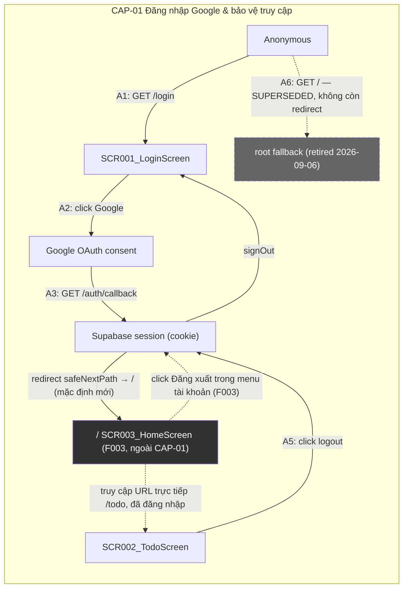
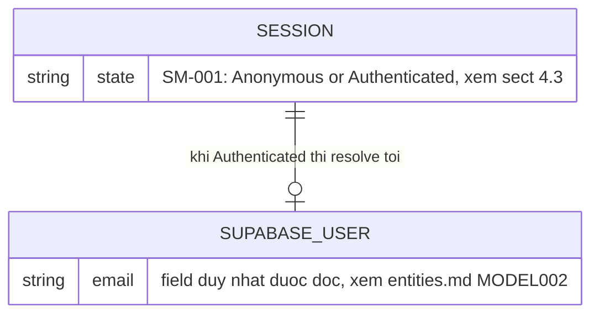
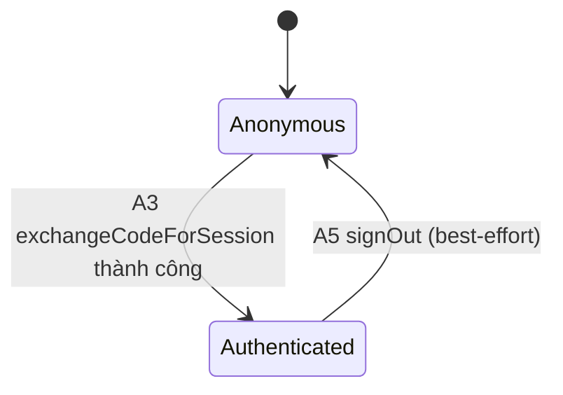

<!-- layout-exempt: rebuild-spec owns all docs/system|features|generated|flows paths -->
<!-- Contract: references/feature-spec-researcher-contract.md -->

# F001_GoogleOAuthLogin — Technical Spec

**Priority**: P0
**Type**: mixed
**Generated**: 2026-09-05

**See also:** [`functional-spec.md`](./functional-spec.md) — tổng quan ngôn ngữ thường, open
decisions, requirements/business rules một dòng mỗi rule, screens, user stories, scenarios,
edge cases, configuration cho audience BA/QA.

**Cách đọc file này:** § 2 là index — chọn action cần xem rồi đọc trọn block ở § 3. § 4 là
appendix dùng chung — chỉ nhảy vào khi một block ở § 3 trỏ tới.

## 1. Technical Overview

Khách truy cập đăng nhập bằng Google qua Supabase Auth (PKCE) từ `/login`; callback đổi code lấy
session rồi đưa vào `/` (trang chủ — đổi từ `/todo` kể từ F003_Homepage, 2026-09-06; `/todo` vẫn tồn
tại như khu vực được bảo vệ, chỉ không còn là đích mặc định). Route-guard hai lớp — `src/proxy.ts` (optimistic)
và một re-check tại chính trang (authoritative) — enforce đúng một trục duy nhất: đã đăng nhập hay
chưa, không có role/ownership nào khác. Đăng xuất là Server Action best-effort, luôn đưa về `/login`.



## 2. Action Index

| # | Action (handler) | Method · Path | Codes | Writes | Detail |
|---|---|---|---|---|---|
| **A0** | *cross-cutting — `proxy` optimistic guard, không thuộc riêng action nào* | proxy · `["/", "/login", "/todo/:path*"]` (`/` chỉ để refresh cookie, không redirect) | {FR-001, PERM002, PERM003} | — *(cookie refresh only)* | § 4.4 |
| **A1** | `LoginPage` | `GET` `/login` | {FR-201, FR-204, FR-601, BR-001, PERM002, US002, SCR001} | — *(read-only)* | § 3.1 |
| **A2** | `useLoginActions#handleLoginClick` → `signInWithGoogle` | client-SDK · *(no app path — browser navigates to Google)* | {FR-202, FR-203, BR-005, US002, BL001} | — *(read-only; browser leaves the page)* | § 3.1 |
| **A3** | `GET` (`src/app/auth/callback/route.ts`) | `GET` `/auth/callback` | {FR-401, FR-402, BR-002, DEC-001, DEC-002, SM-001, PERM004, US002, BL002} | — *(no app table; sets Supabase session cookie)* | § 3.1 |
| **A4** | `TodoPage` | `GET` `/todo` | {FR-301, FR-603, BR-003, PERM003, US003, SCR002} | — *(read-only)* | § 3.1 |
| **A5** | `logoutAction` | `POST` *(Server Action, no HTTP path)* | {FR-302, FR-603, BR-004, SM-001, US003, BL002} | — *(no app table; clears Supabase session cookie)* | § 3.1 |
| **A6** | ~~`Home`~~ — **SUPERSEDED**, xem F003_Homepage | `GET` `/` | {FR-101, FR-602, PERM001} (retired) | — *(retired — route nay thuộc F003, không redirect)* | § 3.1 |

**Rung set** (mỗi block ở § 3 dùng đúng thứ tự này; rung vắng mặt thì bỏ hẳn, không viết `N/A`):

> **Who** → **FE** → **Request** → **BE** → **Rule** → **Result** → **State** → **Source**

## 3. Actions

### 3.1 CAP-01 — Đăng nhập Google & bảo vệ truy cập

#### A1 · Vào `/login`, guard authoritative, render form

`GET` `/login` → `` `LoginPage` ``
`FR-201` `FR-204` `FR-601` `US002` · `SCR001_LoginScreen`

**Who** · Khách truy cập chưa đăng nhập *(gate A0 — § 4.4)*
**FE** · `src/app/(public)/login/_components/login-client.tsx:32-51` (`LoginClient`) render `LoginScreen` với `copy`
(bản dịch `vi`/`en` từ next-intl), `errorMessage` (server-side `?error=` hoặc client-side lỗi
sau này). Không chạm DOM/window — chỉ nối props.
**Request** · query `error` *(string | string[] | undefined)* — chuẩn hoá qua `hasErrorParam`
**BE** · `` `getCurrentUser` `` (`src/dal/auth.ts:16-27`) bọc try/catch, trả `null` khi
Supabase lỗi — **FR-601: guard fail OPEN**, không chặn ai vào form khi Supabase outage. `LoginPage`
(`src/app/(public)/login/page.tsx:33-67`) build `LoginCopy` từ `getTranslations("login")`.
**Rule** · Có session hợp lệ thì redirect ngay `/` trước khi render (đổi từ `/todo`, F003_Homepage
2026-09-06; single-field check, không phải DEC). **BR-001 — Guard `/login` luôn fail OPEN khi Supabase lỗi.** Không có form đăng nhập nào
khác trong app — chặn nhầm ở đây khoá toàn bộ người dùng ra ngoài vĩnh viễn; `getCurrentUser()` trả `null`
thay vì để lỗi văng ra, coi như Anonymous. `src/dal/auth.ts:16-27`, gọi từ `src/app/(public)/login/page.tsx:33-37`. **FR-204: `?error=` (string
hoặc string[] do Next.js parse key lặp) chỉ bật một cờ boolean qua `hasErrorParam`** — raw value
KHÔNG BAO GIỜ render, chỉ chọn hiển thị thông báo cố định đã dịch (`src/app/(public)/login/page.tsx:70-82`, hàm `hasErrorParam`).
**Result** · Read-only — **no DB write**. Trả về `copy`/`locale`/`errorText`/`errorMessage` làm
props cho `LoginClient`.
**Source:** `src/app/(public)/login/page.tsx:33-67` → `src/dal/auth.ts:16-27` (guard, `getCurrentUser`) → `src/app/(public)/login/page.tsx:70-82` (boundary validation, `hasErrorParam`)

<!-- No diagram: read-only, single decision (fail-open guard), không có branch phức tạp — bảng
     rule ở trên đã đủ rõ, một sequenceDiagram sẽ chỉ vẽ lại đúng 2 dòng văn xuôi này. -->

---

#### A2 · Click "LOGIN With Google" → khởi động OAuth

client-SDK *(browser điều hướng sang Google, không có app path)* → `` `signInWithGoogle` ``
`FR-202` `FR-203` `BR-005` `US002` · `SCR001_LoginScreen` · `BL001_SupabaseBrowserClient`

**Who** · Khách truy cập chưa đăng nhập, đang ở `/login`
**FE** · `src/app/(public)/login/_components/google-login-button.tsx:21-34` — nút disabled + spinner khi
`pending=true` (loading-spinner reveal, không phải DEC theo quy tắc anti-pattern). Click gọi
`src/app/(public)/login/_hooks/use-login-actions.ts:43-58` (`handleLoginClick`), chạy trong `useTransition` DÙNG CHUNG với
đổi ngôn ngữ — click "đổi ngôn ngữ" cũng làm nút Google vào trạng thái pending (xem **BR-005** ở
rung Rule ngay dưới).
**Request** · không có request đi từ app — `signInWithGoogle({ origin: window.location.origin, next: "/" })` (đổi từ `"/todo"`, F003_Homepage)
**BE** · `` `signInWithGoogle` `` (`src/api/auth.ts`, fn `signInWithGoogle`) gọi
`supabase.auth.signInWithOAuth({ provider: "google", options: { redirectTo: "${origin}/auth/callback?next=${next}" } })`
qua client Supabase phía trình duyệt (BL001, `src/lib/supabase/client.ts:13-18`).
**Rule** · **FR-202: click gọi `signInWithOAuth` qua BL001; redirectTo luôn trỏ về
`/auth/callback?next=/` (đổi từ `?next=/todo`, F003_Homepage).** **FR-203: `ok:false` khi Supabase trả error HOẶC ném exception (2
đường gộp làm 1 cờ boolean)** — UI chỉ hiển thị đúng 1 thông báo cố định, không bao giờ render lỗi
thô từ provider (`src/api/auth.ts`, fn `signInWithGoogle`, kết quả `{ok:false}`). **BR-005 — Nút Google login và nút đổi
ngôn ngữ (F002) dùng CHUNG một `useTransition`.** Click đổi ngôn ngữ cũng đẩy `isPending` của action
này lên `true`, khiến nút Google bị disabled trong lúc đó — chủ đích, giữ nguyên hành vi từ bản
trước khi tách hook, không phải bug. `src/app/(public)/login/_hooks/use-login-actions.ts:40-41,60-66`.
**Result** · Read-only về phía app — không ghi bảng nào; hệ quả quan sát được là trình duyệt điều
hướng sang trang authorize của Google (thành công) hoặc `hasClientError` bật (thất bại,
`src/app/(public)/login/_hooks/use-login-actions.ts:50-52`). Cố ý KHÔNG reset `isPending` trong `finally` khi thành công —
giữ pending tới lúc unmount để tránh nhấp nháy (TC 37eae882).
**Source:** `src/app/(public)/login/_components/google-login-button.tsx:28-34` → `src/app/(public)/login/_hooks/use-login-actions.ts:43-58` → `src/api/auth.ts` (fn `signInWithGoogle`)

<!-- No diagram: single hop tới Supabase SDK, không ghi bảng nào, không phải background action —
     dưới ngưỡng cả 2 tiêu chí diagram. -->

---

#### A3 · `GET /auth/callback` — đổi PKCE code lấy session

`GET` `/auth/callback` → `` `GET` `` (`src/app/auth/callback/route.ts`)
`FR-401` `FR-402` `BR-002` `DEC-001` `DEC-002` `US002` · `PERM004_CallbackNextPathGuard` · `BL002_SupabaseServerClient`

**Who** · Redirect tự động từ Google/GoTrue sau khi khách đồng ý (hoặc từ chối) OAuth
**FE** · *không có* — đây là backend route handler, không render UI, browser chỉ nhận `Location` header
**Request** · query `code` | `error` | `error_description` | `next` — tất cả untrusted (`src/app/auth/callback/route.ts:18-22`)
**BE** · `` `createClient` `` (BL002, `src/lib/supabase/server.ts:16-42`) rồi
`supabase.auth.exchangeCodeForSession(code)` — bọc try/catch, KHÔNG BAO GIỜ để lỗi exchange lộ ra
client (`src/app/auth/callback/route.ts:31-44`)
**Rule** · Quyết định redirect đích dựa trên 2 điều kiện độc lập (flow — navigation trong feature):

| DEC | subtype | Condition | What the user sees | Source |
|---|---|---|---|---|
| **DEC-001** | flow | `error` param có mặt | Redirect `/login?error=<message đã encode>` — `LoginErrorAlert` sau đó chỉ hiện thông báo cố định, không phải raw message này | `src/app/auth/callback/route.ts:24-29` |
| **DEC-002** | flow | `code` param có mặt AND `exchangeCodeForSession` thành công | Redirect `${origin}${safeNextPath(next)}` — mặc định `/` (đổi từ `/todo`, F003_Homepage) | `src/app/auth/callback/route.ts:31-39` |
| **DEC-002** | flow | `code` param có mặt AND exchange lỗi/throw, HOẶC cả `code` lẫn `error` đều thiếu | Redirect `/login?error=auth_code_error` (fallback chung) | `src/app/auth/callback/route.ts:40-46` |

**BR-002 — `next` chỉ được chấp nhận khi same-origin, root-relative, không chứa scheme separator
hay control/line-separator char (thô hoặc percent-encoded).** Giá trị nào không hợp lệ đều fallback
`/todo`, im lặng — chống open-redirect và HTTP header/response splitting. *(§ 4.4)*
**Result** · Không ghi bảng DB nào của app; side effect quan sát được là Supabase session cookie
được set (qua `exchangeCodeForSession`, refresh token + access token) khi DEC-002 nhánh thành công.
Khi thất bại (mọi nhánh khác) không có cookie session nào được set.
**State** · `SM-001`: `Anonymous` → `Authenticated` *(chỉ khi DEC-002 thành công, § 4.3)*
**Source:** `src/app/auth/callback/route.ts:17-47` → `src/lib/supabase/server.ts:16-42` → `src/utils/url/next-path.ts:87-105`

<!-- No diagram: nội dung thật của action này là bảng DEC 3 nhánh ở trên — ép vào
     sequenceDiagram sẽ giả vờ có một chuỗi tuần tự trong khi thực ra là 1 request rẽ 3 nhánh
     loại trừ nhau; bảng đọc rõ hơn. -->

---

#### A4 · Vào `/todo`, guard authoritative fail-closed

`GET` `/todo` → `` `TodoPage` ``
`FR-301` `FR-603` `US003` · `SCR002_TodoScreen`

**Who** · Người dùng đã đăng nhập (kỳ vọng) *(gate A0 — § 4.4)*
**FE** · `src/app/(protected)/todo/page.tsx:21-33` build props (`greeting`, `logoutLabel`, `logoutAction`) rồi render
qua component con `TodoScreen` (`src/app/(protected)/todo/_components/todo-screen.tsx:16-34`) — thuần trình bày, không có
state phía client.
**Request** · không có param — chỉ dựa vào cookie session hiện có
**BE** · **Cập nhật kiến trúc (không có trong bản gốc):** guard authoritative không còn nằm trong
`TodoPage` — nó đã dời sang `src/app/(protected)/layout.tsx:20-24` (`ProtectedLayout`), gate DUY NHẤT
dùng chung cho mọi route dưới `(protected)` (`/todo` VÀ `/profile`, F006_ProfilePage gia nhập đúng
cơ chế này). Layout gọi `getCurrentUser()` (`src/dal/auth.ts:16-27`, BL002 qua `src/lib/supabase/server.ts:16-42`,
bọc try/catch, fail-open về `null`) rồi `redirect(ROUTES.LOGIN)` nếu không có `user`. `TodoPage` tự nó
gọi lại `getCurrentUser()` một lần nữa (`src/app/(protected)/todo/page.tsx:22`) — không phải guard, chỉ để đọc
`user.email` cho lời chào; nếu layout đã cho qua thì lần gọi lại này gần như luôn có `user`.
**Rule** · **FR-603/BR-003 — Guard `/todo` fail CLOSED.** Không có `user` → `redirect(ROUTES.LOGIN)`
ngay tại layout, trước khi bất kỳ route con nào (kể cả `/todo`) render (`src/app/(protected)/layout.tsx:20-24`).
Vì `getCurrentUser()` tự fail-open về `null` khi Supabase lỗi, một lỗi Supabase ở bước này bị coi như
"chưa đăng nhập" và VẪN bị chặn — kết quả quan sát được (fail-closed cho nội dung bảo vệ) không đổi so
với bản trước tách `(protected)/layout.tsx`, dù cơ chế nội bộ (fail-open read + redirect-on-null) khác
với mô tả "getUser() không bọc try/catch, văng exception thẳng" của bản cũ. *(§ 4.4)*
**Result** · Read-only — **no DB write**. Hiển thị `t("greeting", { email: user.email ?? "" })`
(field DUY NHẤT của `MODEL002_SupabaseUser` được đọc trong toàn bộ repo).
**Source:** `src/app/(protected)/layout.tsx:1-27` (guard) → `src/app/(protected)/todo/page.tsx:1-33` (đọc email) → `src/dal/auth.ts:16-27` → `src/lib/supabase/server.ts:16-42` → `src/app/(protected)/todo/_components/todo-screen.tsx:1-34`

<!-- No diagram: read-only, 1 điều kiện guard, không background — dưới ngưỡng. -->

---

#### A5 · Click đăng xuất → `logoutAction`

`POST` *(Server Action, không có HTTP path riêng)* → `` `logoutAction` ``
`FR-302` `FR-603` `BR-004` `US003` · `BL002_SupabaseServerClient`

**Who** · Người dùng đã đăng nhập, đang ở `/todo`
**FE** · `src/app/(protected)/todo/_components/todo-screen.tsx:24-31` — `<form action={logoutAction}>`, không có client JS nào chặn
submit (không optimistic UI, không confirm dialog).
**Request** · form submit thuần, không có field nào
**BE** · `` `logoutAction` `` (`src/app/_actions/logout.ts:15-25`) gọi `createClient()` (BL002) rồi
`supabase.auth.signOut()` bọc try/catch.
**Rule** · **BR-004 — Đăng xuất là best-effort.** `signOut()` lỗi (vd. session server đã hết hạn)
KHÔNG chặn redirect — catch rỗng, chủ đích: ý định người dùng là rời khu vực xác thực dù thành công
hay không, và guard của `/login` sẽ tự suy lại đúng trạng thái. `src/app/_actions/logout.ts:16-22`.
**Result** · Không ghi bảng DB nào của app; side effect quan sát được là Supabase session cookie bị
xoá/vô hiệu (khi `signOut()` thành công) — khi `signOut()` lỗi, cookie có thể vẫn còn nhưng session
phía Supabase đã không còn hợp lệ, guard `/todo` (A4, fail-closed) sẽ chặn lần truy cập kế tiếp dù
sao. Luôn `redirect("/login")` sau cùng, không điều kiện.
**State** · `SM-001`: `Authenticated` → `Anonymous` *(§ 4.3)*
**Source:** `src/app/_actions/logout.ts:15-25` → `src/lib/supabase/server.ts:16-42`

<!-- No diagram: 1 lệnh best-effort + 1 redirect vô điều kiện, không ghi bảng, không background. -->

---

#### A6 · `GET /` — fallback redirect authoritative — **SUPERSEDED, xem F003_Homepage**

**Đã lỗi thời kể từ 2026-09-06 (F003_Homepage).** File cũ này (`app/page.tsx` trong layout flat trước
route-colocation) đã được viết lại hoàn toàn thành `src/app/(public)/(home)/page.tsx` — nó không còn
`redirect()` nào, và route `/` (SCR003_HomeScreen) không còn thuộc F001. Nội dung dưới đây mô tả HÀNH
VI CŨ, giữ lại để tham chiếu lịch sử; không dùng để hiểu code hiện tại.

`GET` `/` → ~~`Home`~~ *(hàm này không còn tồn tại dưới hình hài cũ — `src/app/(public)/(home)/page.tsx`
nay export `HomePage`, một Server Component render trang chủ)*
`FR-101` `FR-602` · `PERM001_RootRouteGuard` (superseded) · `BL002_SupabaseServerClient`

**Rule (cũ, không còn đúng)** · ~~`redirect(user ? "/todo" : "/login")` — bản sao logic của A0
(proxy optimistic), chạy lại ở lớp authoritative phòng trường hợp matcher của proxy không khớp.~~
**Hiện tại:** `src/app/(public)/(home)/page.tsx` gọi `getUser()`/`getUserRole()` chỉ để cá nhân
hoá header của SCR003_HomeScreen — không redirect ai, không còn thuộc CAP-01 của F001. Chi tiết đầy
đủ (bao gồm rationale nghiệp vụ) thuộc về `docs/vi/features/F003_Homepage/technical-spec.md` và
`docs/vi/system/permissions.md` — không lặp lại ở đây để tránh hai nguồn sự thật. `FR-101`/`FR-602`
ở trên mô tả hành vi ĐÃ RETIRED; xem `functional-spec.md § 11 RISK-01` cho ghi chú lịch sử. Việc
di dời chính thức 2 mã FR này (và PERM001) ra khỏi F001 là việc của `/tkm:rebuild-spec --features
F001,F003`, không phải một surgical edit.

<!-- No diagram: action đã retired, không còn logic nào để vẽ. -->

### 3.2 Edge cases

| Action | Scenario | Behavior |
|---|---|---|
| A3 | `?error=` có mặt (Google/GoTrue trả lỗi consent) | Redirect `/login?error=<encoded message>` — `LoginErrorAlert` chỉ hiện thông báo cố định đã dịch, KHÔNG BAO GIỜ render raw `message` |
| A3 | Không có cả `code` lẫn `error` (truy cập trực tiếp `/auth/callback`) | Redirect `/login?error=auth_code_error` |
| A3 | `code` hợp lệ nhưng `next` off-origin/protocol-relative (`https://evil.com`, `//evil.com`) | `safeNextPath` fallback `/` im lặng (đổi từ `/todo`, F003_Homepage) — không có message nào cho user, redirect vẫn ở đúng origin |
| A3 | `code` không hợp lệ HOẶC Supabase không reachable lúc exchange | Cả 2 nguyên nhân đều rơi vào cùng 1 catch → redirect `/login?error=auth_code_error` giống hệt nhau (không phân biệt được — xem `RISK-02` functional-spec § 11) |
| A1 · A0 | Supabase unreachable khi vào `/login` | Guard fail OPEN — form vẫn render, nút Google vẫn clickable |
| A4 · A0 | Supabase unreachable khi vào `/todo` | Guard fail CLOSED — `getCurrentUser()` (`(protected)/layout.tsx`) fail-open về `null`, layout coi `null` là chưa đăng nhập và redirect `/login`; không có đường nào lộ nội dung bảo vệ |
| A2 | Click nút Google trong lúc `isPending` đã `true` do vừa đổi ngôn ngữ | Nút bị `disabled` (dùng chung transition, BR-005 § 3.1) — click không có tác dụng cho tới khi transition trước xong |

## 4. Shared Foundation

### 4.1 Components

| Component | Responsibility | Used in | File |
|---|---|---|---|
| `LoginPage` | Server entry `/login`, guard authoritative fail-open, build `LoginCopy` | A1 | `src/app/(public)/login/page.tsx` |
| `LoginClient` | Ranh giới client, nối props với `useLoginActions` | A1, A2 | `src/app/(public)/login/_components/login-client.tsx` |
| `useLoginActions` | Hook giữ `isPending`/`hasClientError`, gọi `signInWithGoogle` + `setLocale` (F002) | A2 | `src/app/(public)/login/_hooks/use-login-actions.ts` |
| `signInWithGoogle` | Khởi động OAuth qua Supabase, gộp mọi lỗi thành `{ok:boolean}` | A2 | `src/api/auth.ts` |
| `GET` (callback route) | PKCE code exchange + quyết định redirect (DEC-001/002) | A3 | `src/app/auth/callback/route.ts` |
| `safeNextPath` | Choke point chống open-redirect cho `next` | A3 | `src/utils/url/next-path.ts` |
| `getCurrentUser` | DAL dùng chung — đọc session, fail-open `null` | A1, A4 | `src/dal/auth.ts` |
| `ProtectedLayout` | Gate authoritative DUY NHẤT cho mọi route `(protected)` (`/todo`, `/profile`) — fail-closed, redirect `/login` khi `getCurrentUser()` trả `null` | A4 | `src/app/(protected)/layout.tsx` |
| `TodoPage` | Server entry `/todo` — không còn tự guard, chỉ đọc lại `user.email` cho lời chào | A4 | `src/app/(protected)/todo/page.tsx` |
| `TodoScreen` | Trình bày thuần `/todo` — nhận props, không tự gọi Supabase/i18n | A4 | `src/app/(protected)/todo/_components/todo-screen.tsx` |
| `logoutAction` | Server Action đăng xuất best-effort | A5 | `src/app/_actions/logout.ts` |
| ~~`Home`~~ | **SUPERSEDED** — `src/app/(public)/(home)/page.tsx` nay là `HomePage` (F003_Homepage), không còn redirect | A6 (retired) | `src/app/(public)/(home)/page.tsx` |
| `proxy` | Guard optimistic cross-cutting — **cập nhật F011**: `matcher` không còn giới hạn 3 route, nay negative-lookahead áp cho hầu hết mọi path; auth check trong `proxy` vẫn chỉ redirect cho `PROTECTED_ROUTES = [/todo, /profile]` + `/login`, xem § 4.4 A0 | A0 | `src/proxy.ts` |
| `createClient` (browser) | Factory Supabase client phía trình duyệt (BL001) | A2 | `src/lib/supabase/client.ts` |
| `createClient` (server) | Factory Supabase client phía server, async (BL002) | A1, A3, A4, A5, A6 | `src/lib/supabase/server.ts` |
| `createProxyClient` | Factory Supabase client cho lớp proxy (BL003) | A0 | `src/lib/supabase/proxy-client.ts` |

### 4.2 Data Model



| Entity | Table | Used for | Action |
|---|---|---|---|
| `SupabaseUser` (MODEL002) | *(không phải bảng repo — object trả về từ `supabase.auth.getUser()`, do `@supabase/supabase-js` định nghĩa)* | Existence-check cho mọi guard (A0, A1, A4, A6); đọc field `email` để hiển thị greeting | A0, A1, A4, A6 |
| Session (Supabase auth cookie) | *(cookie, tên do `@supabase/ssr` sinh theo project-ref — không phải literal string trong repo, xem § 5.3)* | Vật mang trạng thái `SM-001`; được set bởi A3 (exchange), refresh bởi A0 (proxy), xoá bởi A5 (signOut) | A0, A3, A5 |

**Ghi chú honest-scope:** app này không có bảng CSDL riêng nào — toàn bộ auth do Supabase GoTrue
quản lý ngoài repo; 2 dòng trên là toàn bộ "dữ liệu" mà F001 chạm tới, không phải một danh sách bị
cắt bớt (xem thêm `docs/vi/generated/entities.md` § MODEL002, cùng ghi chú honest-scope ở
MODEL003_LoginCopy).

#### Polymorphic Behavior

N/A — no discriminator fields in Key Entities. (`entities.md` § MODEL002_SupabaseUser: "Discriminator
Fields: None".)

### 4.3 State Management

### Vòng đời phiên đăng nhập (SM-001)
**kind:** entity
**Linked FR:** FR-601, FR-602, FR-603
**Source:** `src/app/auth/callback/route.ts:31-39` (Anonymous→Authenticated), `src/app/_actions/logout.ts:15-25` (Authenticated→Anonymous)



**Action transitions:** guard và side effect cho mỗi cạnh nằm trong rung **Result**/**State** của
action tương ứng (§ 3.1) — không lặp lại ở đây.

### 4.4 Shared Rules

#### Bin 3 — cross-cutting, không thuộc riêng action nào

**A0 · `PERM002`/`PERM003` — proxy optimistic guard áp dụng cho `PROTECTED_ROUTES = [/todo, /profile]`
và `/login` (`/` vẫn được `proxy` chạy qua để refresh cookie/normalize locale nhưng KHÔNG còn redirect
nào — `PERM001` superseded kể từ F003_Homepage, 2026-09-06).** `src/proxy.ts:84-97` gọi `getUserOrNull`
(qua BL003, `createProxyClient`, `src/proxy.ts:130-140`) rồi redirect theo ma trận: đã login & path
=== `/login` → `/` (đổi từ `/todo`); chưa login & path khớp `PROTECTED_ROUTES` (`/todo`, `/profile`)
→ `/login`; còn lại pass-through. Đây là lớp ĐẦU TIÊN, không phải lớp duy nhất — `/login` còn có
re-check authoritative riêng (A1); `/todo` (và `/profile`, F006) có re-check authoritative riêng tại
`src/app/(protected)/layout.tsx` (§ 3.1 A4), KHÔNG còn tại chính page như bản trước khi tách layout
dùng chung. `/` không còn re-check nào vì không còn gì để guard (A6 bên dưới đã retired). `/auth/*`
bị loại khỏi `matcher` (route tự xử lý redirect riêng, xem A3). Lỗi Supabase khi gọi `getUserOrNull`
bị nuốt (try/catch), coi như chưa login — không bao giờ 500 cả site vì lỗi này.
**Cập nhật F011_CountdownPrelaunchPage (2026-09-08, nhánh chưa merge `main`):** `config.matcher`
(`src/proxy.ts:187-189`) không còn là whitelist 3-route cũ (`/`, `/login`, `/todo/:path*`) — nay là
negative-lookahead áp cho hầu hết mọi path (loại trừ `api`, `auth`, `_next/static`, `_next/image`,
`favicon.ico`, file tĩnh). Widening này phục vụ nhánh khoá prelaunch của F011 (chạy TRƯỚC nhánh auth
ở trên, xem `docs/vi/features/F011_CountdownPrelaunchPage/technical-spec.md`), KHÔNG đổi ma trận auth
mô tả ở trên — route mới lọt vào scope của `proxy` (vd. `/kudos`) vẫn đi qua đúng `getUserOrNull` +
`PROTECTED_ROUTES` y hệt, không có route nào mới bị auth-gate ngoài ý muốn. Đây là thay đổi thuộc
F011, không phải F001 — ghi lại ở đây chỉ vì cùng file `src/proxy.ts`.
**Source:** `src/proxy.ts:46-100` (`proxy`), `:19` (`PROTECTED_ROUTES`), `:187-189` (`config.matcher`)

<!-- BR-005 (Google login button shares its pending state with the language-switch button) is
     Bin 1 — used by exactly ONE action (A2) — so its full statement lives inline in A2's Rule
     rung (§ 3.1), not here. Nothing else in this feature is a genuine Bin-2/Bin-3 rule beyond
     A0 above. -->

### 4.5 Algorithms & Integrations

N/A — không có thuật toán tính toán không tầm thường ngoài `safeNextPath` (đã ghi đủ ở BR-002 §
3.1, không cần tách ALG riêng vì nó chỉ dùng ở đúng 1 action).

### Tích hợp Supabase Auth (INT-001)
**Linked FR:** FR-201, FR-202, FR-401, FR-301, FR-302
**Used in:** A1 → A2 → A3 → A4 → A5 (mọi action đều đi qua 1 trong 3 client factory BL001/002/003)
**Source:** `src/lib/supabase/client.ts:13-18`, `src/lib/supabase/server.ts:16-42`, `src/lib/supabase/proxy-client.ts:13-34`
**Type:** api-call
**Target:** Supabase Auth (GoTrue) qua `@supabase/ssr`/`@supabase/supabase-js`
**Payload:** `signInWithOAuth({provider:"google", options:{redirectTo}})` (A2) ·
`exchangeCodeForSession(code)` (A3) · `getUser()` (A0, A1, A4, A6) · `signOut()` (A5) — không có
field nào do repo tự định nghĩa, toàn bộ shape do SDK Supabase quyết định.
**Failure handling:** mỗi call site tự bọc try/catch và quy về `null`/`{ok:false}`/exception thẳng
tuỳ action (xem rung **Rule** của từng action) — không có retry, không có dead-letter, không có
compensating action nào ở tầng app; toàn bộ độ tin cậy phụ thuộc SLA của Supabase.

### 4.6 Configuration

```text
NEXT_PUBLIC_SUPABASE_URL              # Supabase project URL — bắt buộc, factory throw (assertion !) nếu thiếu (A0-A6)
NEXT_PUBLIC_SUPABASE_PUBLISHABLE_KEY  # Supabase publishable key — bắt buộc, factory throw nếu thiếu (A0-A6)
```

**Client behavior:** see
[`behavior-logic.md`](../../generated/behavior-logic.md) (client-side patterns — debounce, optimistic UI, polling, upload, realtime),
[`permissions.md`](../../system/permissions.md) (feature flags / experiments / env / locale gates),
[`screen-flow.md`](../../generated/screen-flow.md) (guards / deep-link state restoration / unsaved-changes protection).

## 5. Verification & Technical Notes

### 5.1 Technical Verification

- **SC-001** *(A1)* `/login` render form thành công ngay cả khi Supabase `getUser()` ném lỗi (covers FR-601, BR-001)
- **SC-002** *(A4)* `/todo` không bao giờ render nội dung khi thiếu `user` HOẶC khi `getUser()` ném lỗi (covers FR-603, BR-003)
- **SC-003** *(A3)* mọi giá trị `next` off-origin/protocol-relative/chứa control char đều fallback `/` (đổi từ `/todo`, F003_Homepage), không redirect ra ngoài origin hiện tại (covers FR-402, BR-002)
- **SC-004** *(A3)* raw `error`/`error_description` từ provider không bao giờ xuất hiện trong HTML render — chỉ có 1 thông báo cố định đã dịch (covers FR-204)
- **SC-005** *(A1)* `/login` render đúng copy đã dịch — hero title/description và nút "LOGIN With
  Google" đều visible (covers FR-201). Test: `tests/e2e/login.spec.ts` TC `42b82364` (Hero title and
  description text), TC `6ae76d15` (LOGIN With Google button).
- **SC-006** *(A2)* Click nút Google gọi thật `auth/v1/authorize` với `provider=google` VÀ nút
  chuyển `disabled`/pending trong lúc chờ (covers FR-202, FR-203). Test: `tests/e2e/login.spec.ts`
  TC `60bc5bbb` (Google button triggers OAuth flow (abort)), TC `37eae882` (Button disabled during
  authentication). *(đây chính là Independent Test của US002 bên dưới — được gắn mã SC-006 ở đây
  thay vì tách trùng lặp.)* **FR-401** (redirect `/todo` sau khi OAuth THÀNH CÔNG) không nằm trong
  phạm vi 2 test này — cả hai chỉ verify tới bước gọi `authorize`/trạng thái pending rồi abort, không
  chạy trọn round-trip Google thật. `[UNVERIFIED]` cho nhánh thành công của FR-401 bằng test thực
  thi; chỉ được xác nhận qua đọc source + giả định ở § 5.2 (Assumption 1).
- **SC-007** — **SUPERSEDED, không còn áp dụng cho F001** *(A6 đã retired)*. Test cũ
  (`tests/e2e/login.spec.ts` TC `45278c06`, "Unauthenticated GET / redirects to /login") đã bị XOÁ
  kể từ F003_Homepage — `/` nay public, không còn redirect nào để verify ở đây. Hành vi thật của `/`
  (public cho mọi actor) được verify bởi bộ test riêng của F003: `tests/e2e/home.spec.ts` TC `ID-0`
  ("Unauthenticated user can access public homepage"). Mã `SC-007` giữ lại (không xoá số) để chỗ cho
  lịch sử; không mô tả test nào đang chạy thật cho F001 nữa.
- **SC-008** *(A4)* `/todo` hiển thị đúng email trong greeting VÀ nút đăng xuất visible (covers
  FR-301, FR-302). Test: `tests/e2e/login.spec.ts` TC `e76aa170` ("/todo shows user email and logout
  button").
- **FR-001** (2 biến môi trường Supabase bắt buộc, factory throw khi thiếu) — `[UNVERIFIED]`: không
  tìm thấy test nào (e2e hay vitest) exercise nhánh thiếu env var của `src/lib/supabase/client.ts`,
  `src/lib/supabase/server.ts`, hay `src/lib/supabase/proxy-client.ts`. Không bịa mã test.

#### US002_LoginWithGoogle *(A1, A2, A3)*

**Independent Test:** Từ `/login` (anonymous), click "LOGIN With Google", giả lập
`auth/v1/authorize` trả về thành công → xác nhận redirect cuối cùng là `/` (đổi từ `/todo`,
F003_Homepage) và session cookie tồn tại. Test CI-safe tương ứng (→ **SC-006**):
`tests/e2e/login.spec.ts` TC `60bc5bbb`/`37eae882` (kiểm chứng đến bước gọi authorize + trạng thái
pending, không chạy trọn round-trip Google thật).

**Acceptance Scenarios:**

1. **Given** anonymous tại `/login`, **When** click nút Google và OAuth thành công, **Then**
   redirect `/` (đổi từ `/todo`), session cookie được set (DEC-002 nhánh thành công).
2. **Given** anonymous tại `/login`, **When** provider trả `?error=` (huỷ consent), **Then**
   redirect `/login?error=...`, `LoginErrorAlert` hiện đúng 1 thông báo cố định (DEC-001).

#### US003_LogOut *(A4, A5)*

**Independent Test:** Với session hợp lệ, `POST` `logoutAction` rồi xác nhận GET `/todo` kế tiếp
redirect `/login` (guard A4 fail-closed re-check session đã mất). Test tương ứng:
`tests/e2e/login.spec.ts` `[US003, BL002 signOut]`.

**Acceptance Scenarios:**

1. **Given** authenticated tại `/todo`, **When** click đăng xuất, **Then** `signOut()` thành công,
   redirect `/login`.
2. **Given** authenticated tại `/todo` nhưng session đã hết hạn phía Supabase, **When** click đăng
   xuất, **Then** `signOut()` lỗi bị nuốt (best-effort), vẫn redirect `/login` (BR-004).

### 5.2 Assumptions

- *(A2)* `signInWithOAuth`'s browser redirect được giả định là thực sự tới được màn hình consent
  của Google trong production — pass này chỉ đọc source, không chạy app, nên nhánh `?code=<hợp lệ>`
  thành công thật (cần một vòng Google thật) không được xác nhận bằng execution, chỉ bằng đọc
  source + tập con CI-safe của `tests/e2e/login.spec.ts`.
- *(A3)* nội dung chính xác của `error`/`error_description` mà Supabase trả về cho một lượt huỷ
  consent thật được giả định là text ngắn, an toàn để `encodeURIComponent` — rủi ro thực tế thấp vì
  code không bao giờ render giá trị này trực tiếp (FR-204 dùng thông báo cố định thay thế).
- *(A0, A1, A4)* matcher optimistic của `src/proxy.ts` được giả định chạy trên mọi request ở
  production giống hệt dev — pass này không xác nhận hành vi edge-runtime thật của nền tảng deploy.
  **Cập nhật F011**: matcher nay là negative-lookahead (§ 4.4 A0), không còn whitelist 3-route; giả
  định này áp dụng cho matcher mới y hệt matcher cũ.

### 5.3 Unresolved Questions

1. **[RESOLVED trong code, giữ lại lịch sử]** Mã US004 từng xuất hiện trong comment nguồn gắn
   nhầm với logout — bản code hiện tại (`src/app/(protected)/todo/page.tsx:10`,
   `src/app/_actions/logout.ts:10`) đã tự sửa, dùng đúng `US002_LoginWithGoogle`/`US003_LogOut`.
   Không còn là câu hỏi mở.
2. **Tên cookie session Supabase** *(A0, SM-001)*: `@supabase/ssr` tự sinh tên cookie theo
   project-ref lúc runtime, không phải literal string trong repo — không thể xác nhận tên chính xác
   chỉ bằng đọc source.
3. **[MOOT — A6 retired]** Thiếu try/catch ở root guard cũ: câu hỏi này không còn áp dụng —
   `src/app/(public)/(home)/page.tsx` đã được viết lại hoàn toàn cho F003_Homepage và nay bọc
   `getUser()` trong try/catch, fail-open về `null` (xem `getViewer()`,
   `docs/vi/features/F003_Homepage/technical-spec.md`). Giữ mục này lại chỉ để tham chiếu lịch sử;
   `functional-spec.md § 11 RISK-01` cũng nên được đọc với cùng lưu ý.

### 5.4 Source References

| Action | Order | Symbol | Path | Purpose |
|---|---|---|---|---|
| — | 1 | `SupabaseUser` (MODEL002) | *(kiểu ngoài repo, `@supabase/supabase-js`)* | entity duy nhất mà toàn bộ guard/greeting của feature xoay quanh |
| A1 | 2 | `LoginPage` | `src/app/(public)/login/page.tsx:1-82` | server entry + guard authoritative fail-open cho `/login` |
| A0 | 3 | `proxy` | `src/proxy.ts:1-189` | guard optimistic — `/login`, `PROTECTED_ROUTES` (redirect); `/` chỉ refresh cookie, không redirect |
| A2 | 4 | `signInWithGoogle` | `src/api/auth.ts` | khởi động OAuth qua BL001 |
| A3 | 5 | `GET` (callback) | `src/app/auth/callback/route.ts:1-47` | đổi PKCE code lấy session + 3 nhánh redirect (DEC-001/002) |
| A3 | 6 | `safeNextPath` | `src/utils/url/next-path.ts:1-105` | choke point chống open-redirect cho `next` |
| A4 | 7 | `ProtectedLayout` + `TodoPage` | `src/app/(protected)/layout.tsx:1-27` (guard) + `src/app/(protected)/todo/page.tsx:1-33` (greeting) | guard authoritative fail-closed dùng chung cho `(protected)` + build greeting props |
| A5 | 8 | `logoutAction` | `src/app/_actions/logout.ts:1-25` | Server Action đăng xuất best-effort |
| A6 | 9 | ~~`Home`~~ (superseded) | *(N/A — `src/app/(public)/(home)/page.tsx` nay thuộc F003_Homepage)* | retired 2026-09-06; xem `docs/vi/features/F003_Homepage/technical-spec.md` |

#### Data Flow

`request(?code|?error|?next)` (A3) `→` `GET handler đọc 3 query param` `→`
`exchangeCodeForSession(code) hoặc bỏ qua` `→` `safeNextPath(next) chọn đích` `→`
`Location header redirect (browser)`.

```text
{?code, ?error, ?error_description, ?next} -> src/app/auth/callback/route.ts GET
    -> (error?) encodeURIComponent(message) -> Location: /login?error=...
    -> (code?) exchangeCodeForSession -> ok? safeNextPath(next) : /login?error=auth_code_error
```

### 5.5 Artifact References

| Artifact | File | Codes Used | Reviewed |
|----------|------|------------|----------|
| System Overview | [system-overview.md](../../system/overview.md) | — | [ ] |
| Architecture | [architecture.md](../../system/architecture.md) | — | [ ] |
| Feature List | [feature-list.md](../../generated/feature-list.md) | F001 | [ ] |
| Route List | [route-list.md](../../generated/route-list.md) | ROUTE001 | [ ] |
| API Map | [api-map.md](../../generated/api-map.md) | BL002 | [ ] |
| Entities | [entities.md](../../generated/entities.md) | MODEL002 | [ ] |
| Screens | [functional-spec.md § 6](./functional-spec.md#6-screens) | SCR001, SCR002 | [ ] |
| Screen Flow | [screen-flow.md](../../generated/screen-flow.md) — see § Feature Entry Points → F001_GoogleOAuthLogin | F001, SCR001, SCR002, ROUTE001 | [ ] |
| Behavior Logic | [behavior-logic.md](../../generated/behavior-logic.md) | BL001, BL002, BL003 | [ ] |
| Permissions Matrix | [permissions-matrix.md](../../generated/permissions-matrix.md) | PERM001, PERM002, PERM003, PERM004 | [ ] |
| User Stories | [user-stories.md](../../generated/user-stories.md) | US002, US003 | [ ] |
