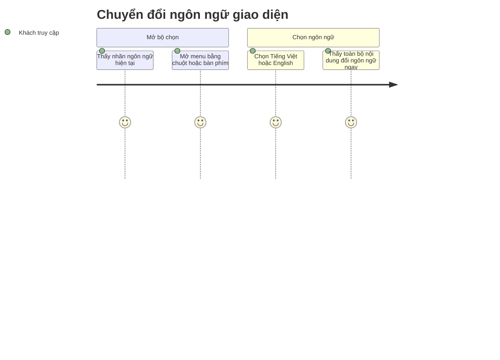

<!-- Contract: references/feature-spec-researcher-contract.md -->

# Functional Spec — F002_LanguageSwitch

**Priority**: P1
**Type**: ui
**Generated**: 2026-09-05

**See also:** [`technical-spec.md`](./technical-spec.md) — endpoint, Source citation, pseudocode,
key entity, DB write cho độc giả Dev/QA/SA.

**Traceability:** F002_LanguageSwitch → SCR001_LoginScreen → US001_SwitchLanguage → `tests/e2e/login.spec.ts` (10 case: TC 8415b629, TC 20d87e28, KB a1f8c2d1, c4e7d9f2, f7b2a4e8, e3c9b1a5, d6f1c3b9, b8e2d7a4, c5a9f2d3, a2d8e6f1)

## 1. Overview

**Problem:** Khách truy cập màn hình đăng nhập cần đọc nội dung bằng ngôn ngữ mình quen thuộc
(Tiếng Việt hoặc English), nhưng trước khi có bộ chọn này thì ngôn ngữ giao diện bị cố định.
**Solution:** Một bộ chọn ngôn ngữ đặt ở header của màn Đăng nhập, cho phép đổi giữa Tiếng Việt
và English; lựa chọn được ghi nhớ (khoảng 1 năm) và áp dụng lại toàn bộ nội dung ngay sau khi
chọn, không cần tải lại trang.
**Scope:** Hiển thị ngôn ngữ hiện tại, cho chọn giữa 2 ngôn ngữ hỗ trợ, ghi nhớ lựa chọn cho các
lần ghé thăm sau, điều hướng đầy đủ bằng bàn phím theo chuẩn accessibility.
**Non-Scope:** Không hỗ trợ ngôn ngữ nào khác ngoài vi/en; không đổi ngôn ngữ tự động theo trình
duyệt; không liên quan đến trạng thái đăng nhập (tính năng này hoạt động độc lập với F001, xem
`feature-list.md` § F002).

**Actors**

| Actor | Description | Primary goal |
|-------|--------------|---------------|
| Khách truy cập (Anonymous) | Người chưa đăng nhập, đang ở màn Đăng nhập | Đọc nội dung màn hình bằng ngôn ngữ mình quen thuộc |

## 2. Functional Capabilities

| ID | Capability | What the user can do | User Stories | Requirements | Business Rules | Screens |
|----|------------|------------------------|-----------------|---------------|-------------------|---------|
| CAP-01 | Chuyển đổi ngôn ngữ giao diện | Mở bộ chọn ngôn ngữ (chuột hoặc bàn phím), xem ngôn ngữ hiện tại, chọn Tiếng Việt hoặc English và thấy toàn bộ nội dung đổi theo ngay lập tức | US001 | FR-001, FR-101, FR-201, FR-202, FR-401, FR-402, FR-601 | BR-001, BR-002, SM-001 | SCR001 |

## 3. Open Decisions

None — no unresolved domain confirmations.

## 4. Requirements

### Foundation (0xx)

- **FR-001** Hệ thống chỉ chấp nhận đúng 2 giá trị ngôn ngữ (Tiếng Việt, English); mọi giá trị
  khác luôn được chuẩn hoá về Tiếng Việt trước khi dùng.

### Navigation (1xx)

- **FR-101** Bộ chọn ngôn ngữ luôn hiển thị sẵn ngay trong header của màn Đăng nhập, không cần
  điều hướng riêng để tìm tới nó.

### Login Screen (2xx)

- **FR-201** Bộ chọn ngôn ngữ hiển thị đúng nhãn ngôn ngữ đang active ("VN" hoặc "EN") và, khi
  kích hoạt, mở ra đúng 2 lựa chọn theo mẫu menu chuẩn accessibility.
- **FR-202** Toàn bộ điều hướng bàn phím trong menu (mũi tên mở và chạy vòng, Home/End nhảy hai
  đầu, Escape đóng và trả focus, Tab đóng nhưng không trả focus) hoạt động theo đúng chuẩn ARIA
  APG cho menu-button.

### Interaction (4xx)

- **FR-401** Chọn một ngôn ngữ ghi nhớ lựa chọn (hiệu lực khoảng 1 năm) và làm toàn bộ nội dung
  giao diện hiển thị lại theo ngôn ngữ mới ngay lập tức, không cần tải lại trang.
- **FR-402** Nếu lựa chọn ngôn ngữ đã ghi nhớ trước đó bị hỏng/không hợp lệ, hệ thống âm thầm
  quay về Tiếng Việt ở lần ghé thăm kế tiếp, không hiển thị lỗi nào.

### Security (6xx)

- **FR-601** Giá trị ngôn ngữ do người dùng gửi lên luôn phải được kiểm tra qua danh sách hợp lệ
  (Tiếng Việt/English) trước khi được dùng để chọn nội dung dịch, nhằm chặn nguy cơ giá trị độc
  hại ảnh hưởng tới cách hệ thống nạp nội dung.

## 5. Business Rules

- Mọi giá trị ngôn ngữ gửi từ phía người dùng luôn được kiểm tra và chuẩn hoá về đúng 1 trong 2
  giá trị hợp lệ trước khi ghi nhớ lại, bất kể giá trị gửi lên là gì (BR-001)
- Đổi ngôn ngữ dùng chung cơ chế "đang xử lý" với hành động đăng nhập Google, nên nút đăng nhập
  cũng thoáng chuyển sang trạng thái đang xử lý khi người dùng chỉ đổi ngôn ngữ — hành vi này là
  cố ý, được giữ nguyên qua lần chỉnh sửa gần nhất (BR-002)
- Trạng thái đóng/mở của menu chọn ngôn ngữ được theo dõi để focus bàn phím luôn đúng vào lựa
  chọn đang active (SM-001)

## 6. Screens

| Screen Name | SCR### | What User Sees | What User Can Do |
|-------------|--------|-----------------|-------------------|
| Login | SCR001_LoginScreen | Bộ chọn ngôn ngữ ở góc phải header, hiển thị cờ Việt Nam + nhãn "VN" hoặc "EN" kèm mũi tên chỉ xuống | Click hoặc dùng bàn phím (ArrowDown/ArrowUp) để mở menu; chọn Tiếng Việt hoặc English; điều hướng menu bằng mũi tên/Home/End; đóng menu bằng Escape hoặc Tab |

### User Journey

1. Khách truy cập vào màn Đăng nhập, thấy bộ chọn ngôn ngữ ở header đang hiển thị đúng ngôn ngữ
   hiện tại ("VN" hoặc "EN").
2. Khách click (hoặc dùng bàn phím) để mở menu — thấy đúng 2 lựa chọn Tiếng Việt/English.
3. Khách chọn một ngôn ngữ — menu đóng lại, nhãn trên bộ chọn đổi theo, và toàn bộ nội dung màn
   hình (tiêu đề, mô tả, nút đăng nhập, footer) hiển thị lại bằng ngôn ngữ vừa chọn ngay lập tức.



## 7. User Stories

### US001_SwitchLanguage — Switch Language

**Actor:** Khách truy cập (Anonymous)
**Goal:** Chuyển đổi ngôn ngữ hiển thị giữa Tiếng Việt và English trên màn Đăng nhập.
**Business value:** Đọc được nội dung màn hình bằng ngôn ngữ mình quen thuộc, giảm rào cản ngôn
ngữ ngay từ bước đầu tiên tiếp xúc với sản phẩm.

**Acceptance Criteria:**
- [ ] Mở bộ chọn ngôn ngữ hiển thị đúng 2 lựa chọn Tiếng Việt/English theo mẫu menu chuẩn
      accessibility.
- [ ] Chọn một ngôn ngữ làm nhãn trên bộ chọn cập nhật đúng theo lựa chọn, và nội dung trang
      hiển thị lại bằng ngôn ngữ mới.
- [ ] Một lựa chọn ngôn ngữ đã ghi nhớ trước đó nhưng bị hỏng/không hợp lệ luôn được âm thầm
      quay về Tiếng Việt mặc định ở lần ghé thăm kế tiếp.

## 8. Scenarios

### US001_SwitchLanguage — Happy Path

**Given** đang ở màn Đăng nhập với ngôn ngữ hiện tại là Tiếng Việt, **When** khách mở bộ chọn
ngôn ngữ và chọn English, **Then** nhãn trên bộ chọn đổi thành "EN" và toàn bộ nội dung màn hình
hiển thị lại bằng English, không cần tải lại trang.

### US001_SwitchLanguage — Error: Lựa chọn ngôn ngữ đã ghi nhớ bị hỏng

**Given** lựa chọn ngôn ngữ đã ghi nhớ trước đó mang giá trị rác (vd. một chuỗi không hợp lệ),
**When** khách ghé thăm lại màn Đăng nhập, **Then** hệ thống hiển thị màn hình bằng Tiếng Việt
mặc định, không có lỗi nào hiển thị cho khách.

## 9. Edge Cases

| Scenario | What Happens | User-Facing Message |
|----------|--------------|----------------------|
| Lựa chọn ngôn ngữ đã ghi nhớ mang giá trị rác/không hợp lệ | Hệ thống âm thầm dùng Tiếng Việt mặc định ở lần ghé thăm kế tiếp | "None — silent handling" |
| Chưa từng ghé thăm trước đó (chưa có lựa chọn ngôn ngữ nào được ghi nhớ) | Hệ thống hiển thị ngay bằng Tiếng Việt mặc định từ lần render đầu tiên, không có khoảng trống nội dung | "None — silent handling" |
| Click nhanh 2 lựa chọn ngôn ngữ khác nhau trước khi lựa chọn đầu xử lý xong | Không có cơ chế khoá/chờ — ngôn ngữ nào xử lý xong sau cùng sẽ là ngôn ngữ hiển thị cuối cùng | "None — silent handling" |
| Chọn lại đúng ngôn ngữ đang hiển thị | Lựa chọn vẫn được ghi nhớ lại (thời hạn ghi nhớ được làm mới), giao diện không có gì thay đổi để thấy | "None — silent handling" |

## 10. Edge Behaviours to Verify

- **FR-201** → Tester xác nhận bộ chọn luôn hiển thị đúng nhãn khớp với ngôn ngữ hiện tại mỗi khi
  tải lại màn hình.
- **FR-202** → Tester xác nhận toàn bộ phím tắt điều hướng (mũi tên, Home, End, Escape, Tab) hoạt
  động đúng như mô tả.
- **FR-401** → Tester xác nhận chọn ngôn ngữ đổi toàn bộ nội dung trang ngay lập tức, không tải
  lại trang, và lựa chọn được ghi nhớ khoảng 1 năm.
- **FR-402** → Tester xác nhận một lựa chọn ngôn ngữ đã ghi nhớ nhưng bị hỏng luôn quay về Tiếng
  Việt mặc định mà không có lỗi hiển thị.

## 11. Risks & Known Issues

| ID | Type | Description | Impact | Status |
|----|------|--------------|--------|--------|
| RISK-01 | known-issue | Nhãn ngôn ngữ mặc định (field `languageLabel` của MODEL003_LoginCopy, được server tính sẵn) không được màn hình đọc — màn hình tự tính lại nhãn của riêng nó từ ngôn ngữ hiện tại. Hai chỗ tính cùng một giá trị nhưng độc lập nhau. | Hiện tại vô hại vì cả hai luôn ra cùng kết quả; rủi ro là nếu sau này một trong hai chỗ bị sửa mà chỗ kia không được sửa theo, hai nơi sẽ lệch nhau âm thầm | confirmed |
| RISK-02 | known-issue | Đổi ngôn ngữ dùng chung cơ chế "đang xử lý" với hành động đăng nhập Google, nên nút đăng nhập Google cũng thoáng chuyển sang trạng thái đang xử lý/bị vô hiệu hoá khi người dùng chỉ đổi ngôn ngữ, không hề đụng tới đăng nhập | Hành vi thị giác gây khó hiểu nhẹ cho người dùng (nút đăng nhập "nháy" khi họ chỉ đổi ngôn ngữ), nhưng đây là đánh đổi có chủ đích để không đổi hành vi trong lần chỉnh sửa gần nhất | confirmed |
| RISK-03 | risk | Nếu việc ghi lại lựa chọn ngôn ngữ gặp lỗi ở phía server (một tình huống hiếm, chỉ xảy ra khi bị gọi sai ngữ cảnh), không có chỗ nào ở phía màn hình bắt lỗi đó — lỗi sẽ thoát ra ngoài hành động thay vì được xử lý êm | Nếu tình huống hiếm này thật sự xảy ra, người dùng có thể thấy lỗi hiển thị đột ngột thay vì một thông báo rõ ràng | [UNVERIFIED] |

## 12. Dependencies

| Dependency | Type | Why this feature needs it | Evidence |
|------------|------|-----------------------------|----------|
| next-intl (thư viện dịch, phiên bản 4.14.2) | infrastructure | Cung cấp cơ chế đọc gói nội dung dịch theo ngôn ngữ đang chọn (chế độ không dùng URL prefix) | FR-401, FR-402 |
| Server Actions của Next.js (App Router) | infrastructure | Cần thiết để ghi lại lựa chọn ngôn ngữ phía server mà không cần một API endpoint riêng | FR-401, BR-001 |
| F001_GoogleOAuthLogin | feature | Dùng chung khung màn hình Đăng nhập (header) và dùng chung cơ chế "đang xử lý" của nút đăng nhập (xem BR-002) — dù outcome nghiệp vụ hoàn toàn độc lập | BR-002 |

## 13. Configuration

```text
LOCALE_COOKIE = "NEXT_LOCALE"        # tên nơi lưu lựa chọn ngôn ngữ của người dùng
LOCALE_COOKIE_MAX_AGE = 31536000     # lựa chọn được ghi nhớ khoảng 1 năm trước khi hết hạn
DEFAULT_LOCALE = "vi"                 # ngôn ngữ mặc định khi chưa có lựa chọn hợp lệ nào
```
