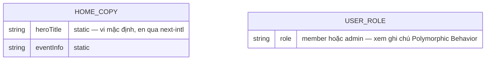
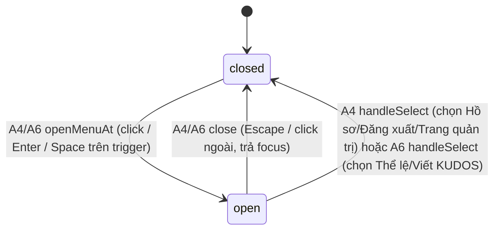

# F003_Homepage

**Priority**: P0
**Type**: ui
**Generated**: 2026-09-06

**See also:** [`functional-spec.md`](./functional-spec.md) — tổng quan bằng ngôn ngữ tự nhiên, Open Decisions, yêu cầu/business rule ở dạng one-liner, screens, user stories, scenarios, edge cases, configuration cho độc giả BA/QA.

**How to read this file:** § 2 là bảng chỉ mục — chọn action cần xem rồi đọc trọn block ở § 3. § 4 là phụ lục dùng chung — chỉ nhảy vào khi một block ở § 3 trỏ tới.

## 1. Technical Overview

Trang chủ công khai (`/`) của SAA 2025 — trước đây route này chỉ là redirect thuần theo trạng thái đăng nhập (`PERM001_RootRouteGuard`, nay lỗi thời — cập nhật thật ở F001/permissions-matrix.md lúc Delivery), giờ render đầy đủ nội dung marketing (hero, đếm ngược, thông tin sự kiện, 6 thẻ giải thưởng, quảng bá Sun* Kudos, footer) cho MỌI khách truy cập, đồng thời điều chỉnh header (chuông thông báo, menu tài khoản role-aware) và widget hành động nhanh theo trạng thái đăng nhập đọc được phía server. Không có route BE mới nào: `src/app/(public)/(home)/page.tsx` (Server Component) đọc session/role/unread-count qua `getViewer()`, build `HomeCopy`, rồi giao cho `HomeClient` → `HomeScreen` (ranh giới client) cộng vài client hook nhỏ (đếm ngược, mở/đóng menu) — không action nào ghi DB. Chỉ 1 capability (`CAP-01`), 6 action (`A1`-`A6`) tuyến tính, không action nào cần diagram (không action nào viết ≥2 bảng hoặc là background/async).

**Cập nhật kiến trúc (không có trong bản gốc):**
- Header/Footer đã được promote thành component DÙNG CHUNG ở `src/app/_components/` — `HomeHeader` nay là `SiteHeader` (`site-header.tsx`), `HomeFooter` nay là `SiteFooter` (`site-footer.tsx`), tái sử dụng bởi 4 screen (`/`, `/awards`, `/profile`, `/kudos`, xem F012_NotificationsPanel). Hành vi mô tả trong file này không đổi, chỉ tên/vị trí file đổi.
- `getViewer()` (đọc session + role + unread-count) đã dời ra khỏi `page.tsx`, sống ở `src/app/_utils/get-viewer.ts` — dùng chung bởi mọi route render `SiteHeader`, không còn riêng của Homepage.
- Trang tách thêm 1 lớp ranh giới client `HomeClient` (`_components/home-client.tsx`) → `HomeScreen` (`_components/home-screen.tsx`) giữa `page.tsx` và các component trình bày — cùng mẫu `LoginClient` của F001.
- **F012_NotificationsPanel đã ship thật** kể từ 2026-09-09: `NotificationBell` (A5) không còn là dialog rỗng tĩnh — xem ghi chú tại A5 bên dưới.

## 2. Action Index

| # | Action (handler) | Method · Path | Codes | Writes | Detail |
|---|---|---|---|---|---|
| **A0** | *cross-cutting — thuộc về không action nào* | — | FR-001 | — | § 4.4 |
| **A1** | `HomePage` (Server Component) | `GET` `/` | FR-002, FR-003, FR-101, FR-201, FR-203, FR-204, FR-205, FR-206, FR-207, FR-208, FR-209, BR-001, BR-004, INT-001, US001, US002 | — *(read-only)* | § 3.1 |
| **A2** | `useCountdown` *(client-only, no BE)* | — *(client tick, không HTTP)* | FR-202, BR-003, BR-004, ALG-001, US001 | — *(read-only)* | § 3.1 |
| **A3** | `NavLink` *(client-only)* | — *(client, không HTTP)* | FR-102, DEC-001, US001 | — *(read-only)* | § 3.1 |
| **A4** | `AccountMenu` + `useMenuKeyboardNav` + `logoutAction` | `POST` `/` *(Server Action, không phải route riêng)* | FR-401, FR-403, FR-601, BR-002, BR-006, SM-001, US002 | — *(kết thúc session — không phải bảng DB)* | § 3.1 |
| **A5** | `NotificationBell` *(client-only, no BE)* | — *(client render/open state)* | FR-402, BR-005, US003 | — *(read-only)* | § 3.1 |
| **A6** | `WidgetButton` + `useMenuKeyboardNav` *(client-only, no BE)* | — *(client render/open state)* | FR-210, FR-401, BR-006, SM-001, US004 | — *(read-only)* | § 3.1 |

## 3. Actions

### 3.1 CAP-01 — Xem & tương tác với trang chủ SAA 2025

#### A1 · Render trang chủ (đọc session + role, dựng toàn bộ nội dung)
`GET` `/` → `` `HomePage` ``
`FR-002` `FR-003` `FR-101` `FR-201` `FR-203` `FR-204` `FR-205` `FR-206` `FR-207` `FR-208` `FR-209` · `SCR003_Home` · `US001` `US002`

**Who** · Bất kỳ khách truy cập nào — Anonymous hoặc Authenticated (member/admin), không qua guard nào *(gate A0 — § 4.4)*
**FE** · `src/app/(public)/(home)/page.tsx` build `HomeCopy` rồi render `HomeClient` → `HomeScreen` (`_components/home-client.tsx`, `_components/home-screen.tsx`) — cây trang thật: `SiteHeader` (dùng chung, trước là `HomeHeader`), hero + `CountdownTimer` (props seed cho A2), khối thông tin sự kiện + CTA, nội dung Root Further, `AwardCard` × 6, khối Sun* Kudos, `SiteFooter` (dùng chung, trước là `HomeFooter`). Nội dung tĩnh lấy từ `src/app/(public)/(home)/_shared/home-copy.ts`'s `defaultHomeCopy` (vi) + `messages/{locale}.json` `home.*` (en, next-intl) — không bịa dữ liệu.
**Request** · không có tham số — chỉ có session cookie Supabase (đọc qua `@supabase/ssr` server client)
**BE** · `getViewer()` — nay ở `src/app/_utils/get-viewer.ts` (dùng chung, KHÔNG còn cục bộ trong `page.tsx` như bản gốc) — gọi `getCurrentUser()` (`src/dal/auth.ts`) rồi (nếu có user) đọc `role` qua `getUserRole(toUsersRoleClient(supabase), user.id)` (`src/dal/users.ts`, shim `src/dal/users-role-client.ts`) VÀ `unreadCount` qua `getUnreadCount(toNotificationsClient(supabase), user.id)` (`src/dal/notifications.ts`, F012) — cả 3 field gộp vào một `SiteViewer`, bọc chung 1 try/catch fail-open `null` *(INT-001 — § 4.5)*
**Rule**
- **BR-001 — Header chỉ hiện chuông thông báo và nút tài khoản khi đã đăng nhập; khách chưa đăng nhập thấy một link đăng nhập thay thế ở đúng vị trí đó.** Nhánh theo sự tồn tại (truthy) của `viewer`, không phải một field cụ thể. *(Bin 1 — chỉ dùng ở A1)*
- **BR-004 — Biến môi trường `EVENT_START_AT` thiếu/sai định dạng ISO-8601 không làm trang lỗi; parse ra `null`, countdown hiển thị trạng thái "chưa biết mốc" (00/00/00, vẫn hiện "Coming soon").** *(§ 4.4 Bin 2)*
**Result** · read-only — **không ghi DB nào**. Trả `targetIso`, `initialNowMs`, `viewer` ({`email`, `isAdmin`, `unreadCount`}) làm props cho `HomeClient` → `SiteHeader`/`CountdownTimer`/`AccountMenu`/`NotificationBell`. Không redirect (khác PERM001 cũ — xem A0 § 4.4).
**Source:** `src/app/(public)/(home)/page.tsx` → `src/app/_utils/get-viewer.ts` → `src/dal/users.ts` → `src/dal/notifications.ts` → `src/app/(public)/(home)/_shared/home-copy.ts`

---

#### A2 · Đếm ngược thời gian thực (client hook)
— *(client tick, không HTTP)* → `` `useCountdown` ``
`FR-202` · `SCR003_Home` · `US001`

**Who** · Bất kỳ khách truy cập nào đang xem trang chủ
**FE** · `src/app/(public)/(home)/_components/countdown-timer.tsx` gọi `useCountdown(targetIso, initialNowMs)` (`src/app/(public)/_hooks/use-countdown.ts` — nay dùng chung ở Zone A, climb lên từ F011_CountdownPrelaunchPage) — state đầu SEED từ prop server, không gọi `Date.now()` ở render đầu (khớp SSR); `setInterval` 1000ms cập nhật `nowMs` (hiển thị đổi theo phút); render client đầu trùng byte với SSR nhờ seed `initialNowMs`, KHÔNG dùng `suppressHydrationWarning`.
**Request** · không có — input là 2 prop tĩnh từ A1 (`targetIso`, `initialNowMs`)
**BE** · không có handler BE riêng — phép tính thuần chạy trong `src/utils/countdown.ts` *(ALG-001 — § 4.5)*
**Rule**
- **BR-003 — Khi còn lại ≤ 0 (đã tới/qua mốc sự kiện), 3 ô số giữ nguyên `00/00/00` và nhãn "Coming soon" bị ẩn; giá trị không bao giờ âm.** *(Bin 1 — chỉ dùng ở A2)*
- **BR-004 — Env thiếu/sai → `parseTargetDate` trả `null`, countdown hiện 00/00/00 + vẫn "Coming soon" vì chưa biết mốc.** *(§ 4.4 Bin 2, gloss giống A1)*
**Result** · read-only — không ghi DB. Re-render 3 ô số (DAYS/HOURS/MINUTES) khi giá trị phút đổi; không side effect khác.
**Source:** `src/app/(public)/_hooks/use-countdown.ts` → `src/utils/countdown.ts`

---

#### A3 · Click logo/nav link đang active → cuộn lên đầu trang
— *(client, không HTTP)* → `` `NavLink` ``
`FR-102` · `SCR003_Home` · `US001`

**Who** · Bất kỳ khách truy cập nào, đang ở `/` và click logo hoặc link "About SAA 2025"
**FE** · `src/app/_components/nav-link.tsx` — client leaf dùng `usePathname()` so khớp `href`; nếu đang active thì gắn `onClick` gọi `window.scrollTo({top:0, behavior:"smooth"})` thay vì để Next điều hướng lại
**Request** · không có
**BE** · không có
**Rule**

| DEC | subtype | Condition | What the user sees | Source |
|---|---|---|---|---|
| **DEC-001** | flow | `pathname === href` (đã ở đúng trang) | Trang cuộn mượt lên đầu, không tải lại; nếu KHÔNG active thì Next điều hướng bình thường | `src/app/_components/nav-link.tsx` |

**Result** · read-only — không ghi DB, không điều hướng khi active (chỉ scroll).
**Source:** `src/app/_components/nav-link.tsx`

---

#### A4 · Mở/đóng menu tài khoản, chọn Hồ sơ/Đăng xuất/Trang quản trị
`POST` `/` *(Server Action, không phải route riêng)* → `` `AccountMenu` + `useMenuKeyboardNav` + `logoutAction` ``
`FR-401` `FR-403` `FR-601` · `SCR003_Home` · `SM-001` · `US002`

**Who** · Người dùng đã đăng nhập (member hoặc admin)
**FE** · `src/app/_components/account-menu.tsx` render `button[aria-haspopup="menu"]` + `[role="menu"]`; mở/đóng/roving-focus qua `useMenuKeyboardNav` (đã có, tái dùng từ F002) *(BR-006 — § 4.4)*. Item "Trang quản trị" chỉ render khi prop `role === "admin"` (nhận từ A1, không tự tính lại).
**Request** · không có request cho việc mở menu; chọn "Đăng xuất" submit `<form action={logoutAction}>` (Server Action đã có, tái dùng nguyên trạng từ `src/app/_actions/logout.ts`)
**BE** · `logoutAction` (đã có) — gọi `supabase.auth.signOut()` rồi `redirect("/login")`
**Rule** · **BR-002 — Mục "Trang quản trị" trong menu tài khoản chỉ hiện khi vai trò người dùng (đọc phía server ở A1) là `admin`; mọi vai trò khác (kể cả lỗi đọc role, fail-open về `member`) không thấy mục này.** *(Bin 1 — chỉ dùng ở A4)*
**Result** · read-only cho việc mở/chọn menu; "Đăng xuất" kết thúc phiên (không phải ghi bảng DB) rồi điều hướng `/login`.
**State** · `SM-001`: `closed` → `open` *(§ 4.3)*
**Source:** `src/app/_components/account-menu.tsx` → `src/hooks/use-menu-keyboard-nav.ts` (đã có) → `src/app/_actions/logout.ts` (`logoutAction`, đã có, tái dùng)

---

#### A5 · Mở panel thông báo (bell)
— *(client render/open state)* → `` `NotificationBell` ``
`FR-402` · `SCR003_Home` · `US003`

**Who** · Người dùng đã đăng nhập (bell không render khi Anonymous — xem BR-001 ở A1)
**FE** · **Cập nhật kiến trúc — claim gốc đã lỗi thời (F012_NotificationsPanel, ship 2026-09-09).**
`src/app/_components/notification-bell.tsx` render `button[aria-haspopup="dialog"]` với badge SỐ
(không phải chấm tròn) khi `unreadCount > 0` (cap hiển thị `"9+"`); click mở `NotificationPanel`
(`_components/notifications/notification-panel.tsx`) hiện danh sách thông báo thật, phân trang
keyset, đánh dấu đã đọc — KHÔNG còn là dialog rỗng tĩnh "Bạn chưa có thông báo". Chi tiết đầy đủ
(schema, RLS, Realtime, 2 loại emitter) thuộc về
`docs/vi/features/F012_NotificationsPanel/technical-spec.md`; mục A5 này giữ nguyên vì `NotificationBell`
vẫn render bên trong cây `SiteHeader` mà F003 sở hữu (F012 không tạo screen/route mới, chỉ gắn dữ
liệu thật vào component đã có).
**Request** · `unreadCount` khởi tạo từ `viewer.unreadCount` (A1, server); sau đó
`useNotifications` (`src/app/_hooks/use-notifications.ts`, F012) tự fetch/subscribe Realtime phía
client — không còn "không có request" như claim gốc.
**BE** · `getUnreadCount` (`src/dal/notifications.ts`, gọi từ `getViewer()` ở A1) cho lần render đầu;
`markReadAction`/`markAllReadAction` (`src/app/_actions/notifications.ts`) cho tương tác trong panel.
**Rule** · **BR-005 đã lỗi thời — badge SỐ (không phải chấm), hiện khi `unreadCount > 0`, giá trị
đến từ `SiteViewer.unreadCount` thật (F012), không còn hằng số `0`.** *(Bin 1 — chỉ dùng ở A5)*
**Result** · Đọc + ghi thật: mở panel gọi thêm trang (keyset), đánh dấu đã đọc ghi
`public.notifications.is_read` qua Server Action — không còn "toàn bộ hành vi chỉ là mở/đóng UI"
như claim gốc.
**Source:** `src/app/_components/notification-bell.tsx` → `src/app/_hooks/use-notifications.ts` →
`src/dal/notifications.ts` → xem `docs/vi/features/F012_NotificationsPanel/technical-spec.md` cho
đầy đủ

---

#### A6 · Mở menu hành động nhanh (widget)
— *(client render/open state)* → `` `WidgetButton` + `useMenuKeyboardNav` ``
`FR-210` `FR-401` · `SCR003_Home` · `SM-001` · `US004`

**Who** · Bất kỳ khách truy cập nào (không phân biệt trạng thái đăng nhập)
**FE** · `src/app/(public)/(home)/_components/widget-button.tsx` render pill cố định góc dưới phải (`button[aria-haspopup="menu"]`); mở `[role="menu"]` 2 `menuitem` ("Thể lệ" → `/standards`, "Viết KUDOS" → `/kudos`) — nội dung thật theo thiết kế MoMorph (component set `214:3916`), D001 **RESOLVED 2026-09-08** (xem functional-spec.md § 3), thay cho suy diễn cũ ("Sun* Kudos"/`/kudos`, "Award Information"/`/awards`). Cùng 1 `<button>` trigger morph pill 106×64 ↔ nút tròn 56×56 "×" theo `open`. Mở/đóng dùng chung `useMenuKeyboardNav` *(BR-006 — § 4.4)*.
**Request** · không có
**BE** · không có
**Rule** · Không có business rule riêng ngoài `BR-006` (§ 4.4) và `SM-001` (§ 4.3).
**Result** · read-only — không ghi DB. Chọn 1 mục điều hướng bằng `next/link` thường (không phải Server Action).
**State** · `SM-001`: `closed` → `open` *(§ 4.3)*
**Source:** `src/app/(public)/(home)/_components/widget-button.tsx` → `src/hooks/use-menu-keyboard-nav.ts` (đã có)

### 3.2 Edge cases

| Action | Scenario | Behavior |
|---|---|---|
| A1, A2 | `EVENT_START_AT` thiếu hoặc không parse được (TC ID-60) | `parseTargetDate` trả `null`; countdown hiện `00/00/00`, "Coming soon" VẪN hiện; không throw, không crash trang |
| A2 | Đã tới hoặc qua mốc sự kiện (TC ID-41/42) | 3 ô giữ `00/00/00`, "Coming soon" bị ẩn, không hiển thị số âm |
| A1 | Đọc role từ Supabase lỗi hoặc không có row `public.users` khớp `id` | `getUserRole` fail-open trả `"member"` — Trang quản trị không hiện dù người dùng thật có thể là admin (xem BR-002) |
| A1 (link `AwardCard`) | Slug hashtag rỗng/không khớp hạng mục nào (TC ID-62) | Điều hướng `/awards` KHÔNG có hashtag, không tự cuộn — không lỗi |
| A4, A6 | **Claim gốc lỗi thời (TC ID-59 mô tả thời điểm trước khi các trang này được xây).** Trong 5 route đích liên kết từ trang chủ (`/awards`, `/kudos`, `/standards`, `/profile`, `/admin`), CHỈ CÒN `/admin` là chưa tồn tại — `/awards` (F004), `/standards` (F005), `/kudos` (F007), `/profile` (F006) đều đã là route sống. | 4 route trên điều hướng thành công. Riêng `/admin`: `AccountMenu` (`src/app/_components/account-menu.tsx:94`) vẫn render `href="/admin"` cho `role === "admin"` nhưng route không tồn tại trong `src/app/**` (không có trong `ROUTES`, `src/constants/routes.ts`) — mục menu này 404 thật cho admin. Xem `docs/vi/system/permissions.md` cho ghi chú dead-link đầy đủ. |

## 4. Shared Foundation

### 4.1 Components

| Component | Responsibility | Used in | File |
|---|---|---|---|
| `HomePage` (Server Component) | Entry `/`, gọi `getViewer()` + build `HomeCopy`, giao cho `HomeClient` | A1 | `src/app/(public)/(home)/page.tsx` |
| `getViewer` | Đọc session + role + unread-count dùng chung (F012), fail-open `null` | A1 | `src/app/_utils/get-viewer.ts` |
| `HomeClient` / `HomeScreen` | Ranh giới client + composition thật của cây trang | A1 | `src/app/(public)/(home)/_components/home-client.tsx`, `home-screen.tsx` |
| `HomeHeader` | Header: logo, nav, LanguageSelector (F002), bell/account hoặc login link | A1, A4, A5 | `src/app/_components/site-header.tsx` |
| `CountdownTimer` | Hiển thị 3 ô số + nhãn, dùng `useCountdown` | A2 | `src/app/(public)/(home)/_components/countdown-timer.tsx` |
| `AwardCard` | Thẻ giải thưởng (ảnh+tiêu đề+mô tả+Chi tiết) | A1 | `src/app/(public)/(home)/_components/award-card.tsx` |
| `NotificationBell` | Nút chuông + panel thông báo thật (F012 — badge số, list, mark-read) | A5 | `src/app/_components/notification-bell.tsx` |
| `AccountMenu` | Nút tài khoản + menu Hồ sơ/Đăng xuất/Trang quản trị | A4 | `src/app/_components/account-menu.tsx` |
| `WidgetButton` | Nút nổi góc dưới phải + menu 2 mục | A6 | `src/app/(public)/(home)/_components/widget-button.tsx` |
| `HomeFooter` | Footer: logo+4 link+bản quyền | A1 | `src/app/_components/site-footer.tsx` |
| `getUserRole` | Đọc `public.users.role` phía server với client được inject, fail-open member | A1 | `src/dal/users.ts` |
| `useCountdown` | Hook tick 1s từ prop server-seeded, trả chuỗi pad 2 chữ số | A2 | `src/app/(public)/_hooks/use-countdown.ts` |
| `useMenuKeyboardNav` | Hook dùng chung mở/đóng+roving tabindex (tái dùng F002) | A4, A6 | `src/hooks/use-menu-keyboard-nav.ts` (đã có) |

### 4.2 Data Model



Không vẽ quan hệ nào — cả 2 shape mới của feature này độc lập, không tham chiếu entity nào khác (giống cách `entities.md` đã mô tả 3 shape hiện có của F001/F002).

| Entity | Table | Used for | Action |
|---|---|---|---|
| `HomeCopy` (chưa có MODEL### — nội dung tĩnh, xem `entities.md` honest-scope note) | — *(không persist, giống MODEL003_LoginCopy)* | Nguồn copy vi mặc định cho toàn bộ trang chủ; bản en qua next-intl `home.*` | A1 |
| `UserRole` (mở rộng MODEL002_SupabaseUser — chưa có MODEL### riêng) | `public.users` *(Supabase `saa-app`, schema committed tại `supabase/migrations/0001_users_table.sql`)* | Xác định hiện/ẩn mục "Trang quản trị" | A1, A4 |
| `AppLocale` (MODEL001, tái dùng nguyên trạng từ F002) | `NEXT_LOCALE` cookie | Nhãn ngôn ngữ hiện tại trên LanguageSelector tái dùng | A1 |

#### Polymorphic Behavior

N/A — no discriminator fields in Key Entities. `HomeCopy`/`UserRole` chưa có mục trong `entities.md` (feature mới); việc hiện/ẩn "Trang quản trị" theo `role` là single-predicate, ghi nhận ở `BR-002` thay vì DISC theo `code-formats.md` § DISC vs DEC boundary. `AppLocale`'s `DISC-001` thuộc F002, không re-spec ở đây.

### 4.3 State Management

#### Trạng thái đóng/mở của menu tài khoản & widget hành động nhanh (SM-001)
**kind:** ui
**Linked FR:** FR-401
**Source:** `src/hooks/use-menu-keyboard-nav.ts` (đã có, tái dùng nguyên trạng từ F002)



Ngưỡng `kind: ui` thoả: 2 state nhưng ≥2 transition dẫn tới `closed` (huỷ vs. chọn) — dùng CHUNG một SM cho cả 2 component (`AccountMenu`, `WidgetButton`) vì cả hai đều gọi cùng `useMenuKeyboardNav`, không phải trùng lặp DRY.

**Action transitions:** guard + side effect của mỗi cạnh nằm ở rung **Result**/**Rule** của action tương ứng (§ 3.1 A4, A6) — không lặp lại ở đây.

### 4.4 Shared Rules

#### Bin 3 — cross-cutting, thuộc về không action nào

**A0 · FR-001 — Route `/` không còn qua bất kỳ guard đăng nhập nào; mọi request tới `/` đều được render, không redirect.** Trước đây `PERM001_RootRouteGuard` (thuộc F001) redirect `anonymous→/login`, `authenticated→/todo`; guard này NGƯNG áp dụng cho `/` kể từ feature này — `proxy.ts` vẫn giữ `/` trong `config.matcher` để làm mới session cookie, nhưng nhánh redirect bị gỡ. **Đây là thay đổi thuộc F001** (permissions-matrix.md cần cập nhật PERM001 thành "lỗi thời" ở bước Delivery).
**Source:** `src/proxy.ts` (§ ma trận redirect nay mở rộng hơn, xem `docs/vi/features/F001_GoogleOAuthLogin/technical-spec.md § 4.4 A0` cho cập nhật F011) · `src/app/(public)/(home)/page.tsx` (thay thế `redirect()` cũ)

#### Bin 2 — used by ≥2 named actions

**BR-004 — Biến môi trường `EVENT_START_AT` thiếu hoặc không parse được theo ISO-8601 không làm hệ thống lỗi; `parseTargetDate` trả về `null`, và mọi nơi tiêu thụ giá trị này (server lẫn client) coi như "chưa biết mốc sự kiện" — vẫn hiện `00/00/00` và vẫn hiện "Coming soon".**
Used in: **A1** · **A2**. Server (A1) đọc `process.env.EVENT_START_AT` một lần, truyền `targetIso: string | null` xuống client; client hook (A2) nhận `null` thì trả thẳng trạng thái "chưa biết mốc".
**Source:** `src/utils/countdown.ts` (`parseTargetDate`) · `src/app/(public)/(home)/page.tsx`
```text
function parseTargetDate(iso):
  if not iso: return null
  d = new Date(iso)
  return isNaN(d) ? null : d
```

**BR-006 — Mọi menu điều khiển bởi `useMenuKeyboardNav` (tài khoản, widget) dùng chung một hợp đồng bàn phím: Enter/Space/click mở, ArrowDown/ArrowUp di chuyển vòng, Escape đóng + trả focus, click ngoài đóng, roving tabindex.**
Used in: **A4** · **A6**. Hook đã có (tái dùng nguyên trạng từ F002), không sửa — chỉ gọi lại với `itemCount` khác nhau (2 cho widget, 2-3 cho account tuỳ role).
**Source:** `src/hooks/use-menu-keyboard-nav.ts` (đã có)

### 4.5 Algorithms & Integrations

### Tính số ngày/giờ/phút còn lại tới mốc sự kiện, có 0-padding (ALG-001)
**Linked FR:** FR-202
**Used in:** A2
**Source:** `src/utils/countdown.ts`
**Input:** `(target: Date, nowMs: number)` · **Output:** `{days, hours, minutes, reached}` (số, `pad2` áp dụng ở tầng trình bày) · **Complexity:** O(1)
**Description:** Quy đổi chênh lệch `target - nowMs` (ms) sang tổng số phút, rồi tách thành ngày/giờ/phút; `reached=true` khi chênh lệch ≤ 0. Days không giới hạn 2 chữ số (≥100 hiện 3 chữ số), hours 00–23, minutes 00–59, luôn pad tối thiểu 2 chữ số.

**Pseudocode:**
```text
function remaining(target, nowMs):
  totalMin = floor(max(0, target - nowMs) / 60000)
  return {
    days: floor(totalMin / 1440),
    hours: floor((totalMin % 1440) / 60),
    minutes: totalMin % 60,
    reached: target <= nowMs
  }
```

### Đọc vai trò người dùng từ Supabase, fail-open (INT-001)
**Linked FR:** FR-003, FR-601
**Used in:** A1
**Source:** `src/dal/users.ts`
**Type:** api-call
**Target:** Supabase REST — `GET {SUPABASE_URL}/rest/v1/users?select=role&id=eq.<uuid>` (qua `@supabase/ssr` server client, RLS own-row)
**Payload:** không có body gửi đi (GET); response `[{role: "member"|"admin"}]` (mảng, vì `.maybeSingle()` trên GET dùng `Accept: application/json`)
**Failure handling:** try/catch bọc toàn bộ lời gọi — bất kỳ lỗi nào (network, RLS từ chối, không có row) đều fail-open về `role: "member"`, không throw, không chặn render trang (khác `/todo`'s fail-closed).

### 4.6 Configuration

```text
EVENT_START_AT   # server-only ISO-8601 datetime (không NEXT_PUBLIC_), mốc sự kiện SAA 2025 (A1, A2)
```

**Client behavior:** see [`behavior-logic.md`](../../generated/behavior-logic.md) (client-side patterns — debounce, optimistic UI, polling, upload, realtime — homepage hiện không dùng pattern nào trong 5 loại này), [`permissions.md`](../../system/permissions.md) (feature flags / experiments / env / locale gates — PERM001 lỗi thời được ghi thật ở F001 lúc Delivery), [`architecture.md`](../../system/architecture.md) (guards / deep-link state restoration / unsaved-changes protection).

## 5. Verification & Technical Notes

### 5.1 Technical Verification

- **SC-001** *(A1)* Trang `/` trả về nội dung thành công cho cả Anonymous và Authenticated, không redirect nào xảy ra (covers FR-001)
- **SC-002** *(A1)* Header hiện đúng theo trạng thái đăng nhập: login link khi Anonymous; chuông + nút tài khoản khi Authenticated (covers FR-208, BR-001)
- **SC-003** *(A2)* Sau 1 phút (giả lập bằng `page.clock`), số phút countdown giảm đúng 1 (hoặc giờ/ngày điều chỉnh theo) (covers FR-202)
- **SC-004** *(A1, A2)* Tới/qua mốc sự kiện: 3 ô giữ `00/00/00`, "Coming soon" ẩn, không âm; env thiếu/sai vẫn `00/00/00` nhưng "Coming soon" VẪN hiện (covers FR-202, BR-003, BR-004)
- **SC-005** *(A4)* Admin thấy "Trang quản trị" trong menu tài khoản; member không thấy (covers FR-403, FR-601, BR-002)
- **SC-006** *(A6)* Widget mở đúng 2 `menuitem`, mỗi mục điều hướng đúng route (covers FR-210)

#### US001_BrowseHomepage *(A1, A2, A3)*
**Independent Test:** Vào `/` không đăng nhập — xác nhận thấy đủ hero/đếm ngược/thông tin sự kiện/CTA/Root Further/6 thẻ giải thưởng/Sun* Kudos/footer, và mọi link dẫn đúng route/hashtag.
**Acceptance Scenarios:** **Given** `EVENT_START_AT` không hợp lệ, **When** vào `/`, **Then** countdown hiện `00/00/00` + "Coming soon" vẫn hiện, trang không lỗi.

#### US002_ManageAccountFromHeader *(A1, A4)*
**Independent Test:** Đăng nhập, mở menu tài khoản — xác nhận đúng danh sách mục theo role, đăng xuất về `/login`.
**Acceptance Scenarios:** **Given** đọc role lỗi (Supabase outage), **When** mở menu tài khoản, **Then** không thấy Trang quản trị (fail-open member).

#### US003_CheckNotifications *(A5)*
**Independent Test:** **Cập nhật F012** — Đăng nhập, gửi/nhận 1 Kudos hoặc 1 lượt tim, click bell —
xác nhận badge số hiện đúng `unreadCount`, panel mở hiện thông báo thật, đánh dấu đã đọc hoạt động.
Test chi tiết + acceptance scenarios đầy đủ: `docs/vi/features/F012_NotificationsPanel/technical-spec.md § 5.1`.
**Acceptance Scenarios:** **Given** chưa có thông báo nào, **When** click bell, **Then** panel mở,
hiện trạng thái rỗng (hành vi legacy trước F012 vẫn đúng làm empty-state, chỉ không còn VĨNH VIỄN
rỗng như claim gốc).

#### US004_UseQuickActionWidget *(A6)*
**Independent Test:** Click widget góc dưới phải — xác nhận menu mở đúng 2 mục, chọn 1 mục điều hướng đúng route.
**Acceptance Scenarios:** **Given** đang ở `/`, **When** click widget rồi chọn "Viết KUDOS", **Then** điều hướng `/kudos`.

### 5.2 Assumptions

- *(A1)* `public.users` RLS own-row (`authenticated` có SELECT) hoạt động đúng qua `@supabase/ssr` server client trong Server Component Next 16 — xác nhận bằng `supabase db query` (research report 02), chưa qua đúng code path thật của app.
- *(A2)* Render client đầu tiên trùng byte với SSR nhờ `useState(initialNowMs)` seed từ server; không dùng `suppressHydrationWarning` (research 01 § 1).
- *(A5)* **[RESOLVED — không còn là assumption]** Giả định gốc "bảng notifications sẽ thêm ở feature sau, panel rỗng vĩnh viễn là hành vi ĐÚNG" không còn đúng kể từ F012_NotificationsPanel (ship 2026-09-09) — bảng `public.notifications` tồn tại thật, panel có dữ liệu thật. Giữ dòng này lại chỉ để tham chiếu lịch sử.

### 5.3 Unresolved Questions

1. **Áp dụng RLS qua code path thật** *(A1)*: report 02 xác nhận quyền SELECT bằng `supabase db query` (superuser), chưa xác nhận bằng chính request thật từ `src/app/(public)/(home)/page.tsx` một khi code được viết.
2. **`itemCount` cố định của `useMenuKeyboardNav`** *(A4)*: hook giả định `itemCount` không đổi trong vòng đời component — menu tài khoản có 2 hoặc 3 mục tuỳ role; chưa xác nhận role đổi giữa các lần render trong cùng phiên có vi phạm giả định này hay không.

3. **Menu widget hành động nhanh** — **RESOLVED 2026-09-08** (không còn là câu hỏi mở): MoMorph cấp thiết kế thật (component set `214:3916`), thay cho suy diễn cũ (bút chì → Sun* Kudos `/kudos`, icon SAA → Award Information `/awards`). Nội dung thật đã ship: "Thể lệ" (`/standards`) + "Viết KUDOS" (`/kudos`), cùng trigger morph pill↔"×". Chi tiết: functional-spec.md § 3 D001.
4. **Thông tin sự kiện** *(gap other — auto-resolved theo recommended 2026-09-06)*: dùng giá trị spec/TC (18h30 · Nhà hát nghệ thuật quân đội · Group Facebook Sun* Family) thay cho design (26/12/2025 · Âu Cơ Art Center · Livestream); options: theo spec/TC / theo design / giá trị khác / TBD. Chờ chốt trước sự kiện.

### 5.4 Source References

| Action | Order | Symbol | Path | Purpose |
|---|---|---|---|---|
| — | 1 | `HomeCopy` | `src/app/(public)/(home)/_shared/home-copy.ts` | Nguồn nội dung tĩnh mặc định (vi) cho toàn trang chủ |
| A1 | 2 | `HomePage` | `src/app/(public)/(home)/page.tsx` | Server Component, entry point `/`, thay thế `redirect()` cũ |
| A1 | 3 | `getViewer`, `getUserRole` | `src/app/_utils/get-viewer.ts`, `src/dal/users.ts`, `src/dal/users-role-client.ts`, `src/dal/notifications.ts` | Đọc session + role + unread-count, fail-open `null`/`member` |
| A2 | 4 | `useCountdown`, `remaining`, `parseTargetDate` | `src/app/(public)/_hooks/use-countdown.ts`, `src/utils/countdown.ts` | Tính + tick đếm ngược |
| A3 | 5 | `NavLink` | `src/app/_components/nav-link.tsx` | Active-link scroll-to-top |
| A4, A6 | 6 | `useMenuKeyboardNav` | `src/hooks/use-menu-keyboard-nav.ts` (đã có) | Hook dùng chung mở/đóng menu (tái dùng nguyên trạng từ F002) |

#### Data Flow

```text
GET / -> HomePage [đọc cookie session] -> getViewer() [src/app/_utils/get-viewer.ts]: getCurrentUser() -> getUserRole(...) + getUnreadCount(...) -> {email, isAdmin, unreadCount}
  -> HomeClient -> HomeScreen -> props xuống SiteHeader/CountdownTimer/AccountMenu/NotificationBell -> render + targetIso/initialNowMs
client tick: useCountdown(targetIso, initialNowMs) -> setInterval 1000ms -> remaining() -> re-render 3 ô số
```

### 5.5 Artifact References

| Artifact | File | Codes Used | Reviewed |
|----------|------|------------|----------|
| System Overview | [overview.md](../../system/overview.md) | — | [ ] |
| Architecture | [architecture.md](../../system/architecture.md) | — | [ ] |
| Feature List | [feature-list.md](../../generated/feature-list.md) | F003 | [ ] |
| Entities | [entities.md](../../generated/entities.md) | MODEL001 (tái dùng từ F002); HomeCopy/UserRole: TBD (draft) | [ ] |
| Screens | [functional-spec.md § 6](./functional-spec.md#6-screens) | SCR003_Home (draft) | [ ] |
| Route List | [route-list.md](../../generated/route-list.md) | TBD (draft) | [ ] |
| Behavior Logic | [behavior-logic.md](../../generated/behavior-logic.md) | TBD (draft) | [ ] |
| Permissions Matrix | [permissions-matrix.md](../../generated/permissions-matrix.md) | PERM001 (ghi chú lỗi thời — xem § 4.4 Bin 3, cập nhật thật ở F001 lúc Delivery) | [ ] |
| User Stories | [user-stories.md](../../generated/user-stories.md) | US001-US004 (draft, local, chưa promote) | [ ] |
