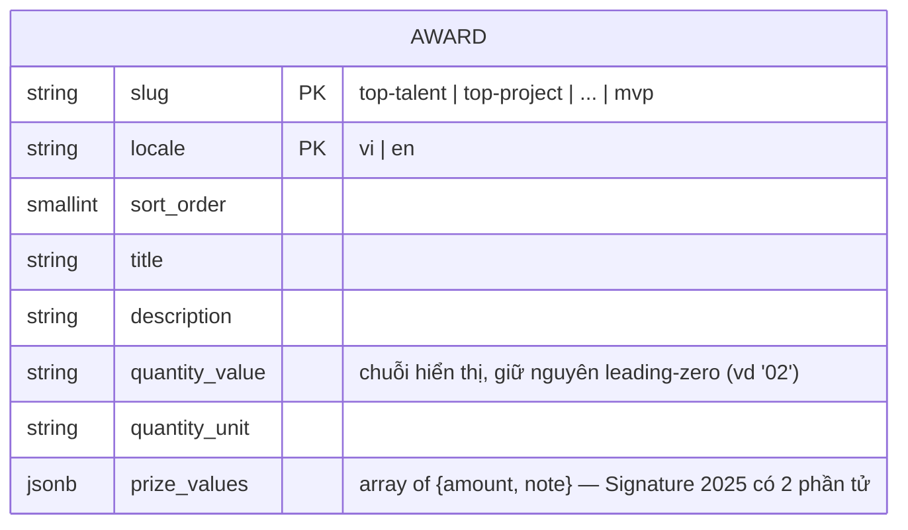

# F004_AwardSystemPage

**Priority**: P1
**Type**: ui
**Generated**: 2026-09-07

**See also:** [`functional-spec.md`](./functional-spec.md) — tổng quan, Open Decisions, FR/BR
one-liner, screens, user stories, scenarios, edge cases cho độc giả BA/QA.

**How to read this file:** § 2 bảng chỉ mục. § 3 chi tiết action. § 4 schema/DAL/DOM contract/
component reuse. § 5 verification + nguồn.

## 1. Technical Overview

Trang công khai mới `/awards` (`src/app/(public)/awards/page.tsx`) — 1 Server Component đọc 6
hạng mục giải từ bảng mới `public.awards` qua DAL (mirror `src/dal/users.ts`), cộng session/role
đọc chung với F003 (`getViewer()`, hoisted lên `src/app/_utils/get-viewer.ts` — xem §
4.1), cộng 1 client hook (`useAwardCategoryNav`) cho nav trái (click-scroll + scroll-spy). Không
action nào ghi DB — toàn bộ read-only. `KudosSection`/`SiteHeader`/`SiteFooter` (đã có ở F003)
được PROMOTE từ `(home)/_components/` lên `(public)/_components/` để dùng chung 2 route — xem §
4.1. Chỉ 1 capability (`CAP-01`), 2 action, không action nào cần diagram.

## 2. Action Index

| # | Action (handler) | Method · Path | Codes | Writes | Detail |
|---|---|---|---|---|---|
| **A1** | `AwardsPage` (Server Component) → `AwardsClient` → `AwardsScreen` | `GET` `/awards` | FR-001, FR-002, FR-003, FR-201, FR-202, FR-203, FR-204, FR-205, FR-206, BR-001, BR-002, BR-005, BR-006, US001, US003 | — *(read-only)* | § 3.1 |
| **A2** | `AwardCategoryNav` + `useAwardCategoryNav` *(client-only, no BE)* | — *(click/scroll, không HTTP)* | FR-101, FR-102, FR-103, FR-104, BR-003, BR-004, US002 | — *(read-only)* | § 3.1 |

## 3. Actions

### 3.1 CAP-01 — Xem & điều hướng Hệ thống giải thưởng SAA 2025

#### A1 · Render trang `/awards` (đọc 6 hạng mục giải, dựng nội dung)

`GET` `/awards` → `` `AwardsPage` ``
`FR-001` `FR-002` `FR-003` `FR-201` `FR-202` `FR-203` `FR-204` `FR-205` `FR-206` · `SCR004_Awards`
· `US001` `US003`

**Who** · Bất kỳ khách truy cập nào — Anonymous hoặc Authenticated, không qua guard nào (khác
`/todo`; giống `/`).
**FE** · `src/app/(public)/awards/page.tsx` đọc `viewer` (`getViewer()`, dùng chung với F003),
locale (`getLocale()` + `normalizeLocale`), dựng `copy` (hàm `buildCopy` cục bộ, gộp nhãn `home.*`
tái dùng với nhãn `awards.*` riêng), rồi giao toàn bộ cho `AwardsClient` (client boundary, mirror
`(home)/_components/home-client.tsx`) — vì props hàm (`onSelectLocale`, `logoutAction`) không thể
băng qua ranh giới Server Component. `AwardsClient` render `AwardsScreen` (presentational,
`_components/awards-screen.tsx`): `KeyvisualBackground`, `SiteHeader`/`SiteFooter` (tái dùng),
caption + `<h1>`, `AwardCategoryNav` + 6× `AwardSection` (chỉ render khi `awards` không rỗng,
xem BR-002), `KudosSection`. Chrome tĩnh (caption, heading, nhãn nav/cột, empty-state) từ
`messages/*.json` khoá `awards.*`; nhãn dùng chung với trang chủ (logo alt, nav, header, kudos,
footer, account, notifications) đọc lại từ khoá `home.*` — không nhân bản chuỗi.
**Request** · không tham số — chỉ `NEXT_LOCALE` cookie (qua `getLocale()`, giống F003)
**BE** · `getAwards(toAwardsClient(supabase), locale)` (`src/dal/awards.ts`) — 1 lần đọc
`public.awards` lọc theo `locale`, sắp theo `sort_order`.
**Rule**
- **BR-001 — Không guard đăng nhập nào áp dụng cho `/awards`.** *(§ permissions.md delta)*
- **BR-002 — DAL lỗi/rỗng → `getAwards` trả `[]`; trang render `AwardsScreen` với
  `awards=[]`, `AwardCategoryNav` và 6 `AwardSection` không render, `AwardsEmptyState` hiện
  thay thế trong vùng nội dung; header/footer/h1 vẫn render bình thường.** *(Bin 1 — chỉ dùng
  ở A1)*
- **BR-005 — `prizeValues` là `{amount, note}[]`; render mỗi phần tử thành 1 dòng giá trị.**
**Result** · read-only — không ghi DB. Props xuống `AwardsScreen`: `awards: Award[]`, `copy`
(chrome tĩnh), `viewer`, `locale`.
**Source:** `src/app/(public)/awards/page.tsx` → `src/app/_utils/get-viewer.ts` →
`src/dal/awards.ts`

---

#### A2 · Nav trái: click-scroll + scroll-spy

— *(client, không HTTP)* → `` `AwardCategoryNav` + `useAwardCategoryNav` ``
`FR-101` `FR-102` `FR-103` `FR-104` · `SCR004_Awards` · `US002`

**Who** · Bất kỳ khách truy cập nào đang xem `/awards`
**FE** · `_components/award-category-nav.tsx` (client leaf) render `nav[aria-label="Danh mục
giải thưởng"]` + 6 `<a href="#<slug>">`; `AwardSection` (sibling, server component thuần) render
6 `<section id>` — vì không cùng cây ref, nav resolve `document.getElementById(slug)` sau mount
(effect riêng, `award-category-nav.tsx:46-55`) rồi feed vào `registerSection` của hook (điểm cần
chú ý khi bảo trì — xem § 5.2). Toàn bộ logic slug-picking uỷ quyền cho
`useAwardCategoryNav` (`_hooks/use-award-category-nav.ts`): pure layer `_utils/scroll-spy.ts`
(`pickActiveSlug`) tính section nào "active" từ danh sách `SpyEntry` thuần (không JSX, test được
bằng `jsdom` không cần `IntersectionObserver` thật); hook owns `useState<activeSlug>` +
`useEffect` gắn 1 `IntersectionObserver` (`rootMargin: "-96px 0px -60% 0px"`) + khoá tạm thời
(`isLockedRef`) để click thắng observer ngay lập tức, mở khoá lại ở sự kiện `scrollend` hoặc sau
700ms fallback (Safari không bắn `scrollend`).
**Request** · không có
**BE** · không có
**Rule**
- **BR-003 — Đúng 1 `aria-current="true"` tại một thời điểm; click ghi `activeSlug` ngay lập
  tức (không chờ observer) và khoá observer cho tới khi cuộn xong.** *(Bin 1 — chỉ dùng ở A2)*
- **BR-004 — `matchMedia("(prefers-reduced-motion: reduce)").matches` → `scrollIntoView` dùng
  `behavior: "auto"` thay vì `"smooth"`.**
**Result** · read-only — không ghi DB, không điều hướng trang (chỉ hash `#slug` qua
`history.replaceState` + scroll nội trang).
**Source:** `src/app/(public)/awards/_components/award-category-nav.tsx` →
`src/app/(public)/awards/_hooks/use-award-category-nav.ts` →
`src/app/(public)/awards/_utils/scroll-spy.ts`

### 3.2 Edge cases

| Action | Scenario | Behavior |
|---|---|---|
| A1 | Supabase lỗi hoặc `awards` rỗng cho locale hiện tại | `getAwards` trả `[]`; `AwardsScreen` render `AwardsEmptyState`, không throw, không 500 |
| A2 | `prefers-reduced-motion: reduce` (TC ID-9 biến thể) | Cuộn tức thời, active vẫn cập nhật đúng |
| A1 (link Kudos) | RISK-01 **resolved (route)** — `/kudos` đã live kể từ F007_KudosLiveBoard (TC ID-12/ID-14 cần rerun) | Link render `href="/kudos"`, điều hướng thật nay tới SCR007_KudosLiveBoard — E2E hiện chỉ assert `href` |

## 4. Shared Foundation

### 4.1 Components

| Component | Responsibility | Used in | File | Status |
|---|---|---|---|---|
| `AwardsPage` (Server Component) | Entry point `/awards`, đọc locale + viewer + gọi DAL, dựng `copy` | A1 | `src/app/(public)/awards/page.tsx` | shipped |
| `AwardsClient` | Client boundary — nối `useSelectLocale`/`logoutAction` xuống `AwardsScreen` (mirror `home-client.tsx`) | A1 | `src/app/(public)/awards/_components/awards-client.tsx` | shipped |
| `AwardsScreen` | Presentational root — h1/caption, nav, 6 section hoặc empty-state, Kudos | A1 | `src/app/(public)/awards/_components/awards-screen.tsx` | shipped |
| `AwardsEmptyState` | Khung empty-state khi `awards.length === 0` | A1 | `src/app/(public)/awards/_components/awards-empty-state.tsx` | shipped |
| `AwardCategoryNav` | Nav trái/thanh chip, render `useAwardCategoryNav` | A2 | `src/app/(public)/awards/_components/award-category-nav.tsx` | shipped |
| `AwardSection` | 1 section giải: ảnh + h2 + mô tả + số lượng + giá trị, layout xen kẽ theo index | A1 | `src/app/(public)/awards/_components/award-section.tsx` | shipped |
| `useAwardCategoryNav` | Hook click-scroll + IntersectionObserver scroll-spy + reduced-motion + khoá tạm thời khi click | A2 | `src/app/(public)/awards/_hooks/use-award-category-nav.ts` | shipped |
| `pickActiveSlug` | Hàm thuần chọn slug active từ `SpyEntry[]` | A2 | `src/app/(public)/awards/_utils/scroll-spy.ts` | shipped |
| `AwardsCopy` / `defaultAwardsCopy` | Content contract cho `/awards`, mở rộng `SiteChromeCopy` dùng chung với F003 | A1 | `src/app/(public)/awards/_shared/awards-copy.ts` | shipped |
| `IconTarget`/`IconDiamond`/`IconLicense` | 3 icon 24px (nav/tiêu đề, số lượng, giá trị) | A1, A2 | `src/app/(public)/awards/_components/icons/icon-{target,diamond,license}.tsx` | shipped, mirror `(home)/_components/icons/icon-*.tsx` |
| `getViewer` | Đọc session + role dùng chung — hoisted khỏi `(home)/page.tsx` vì `/awards` cần đúng lời đọc này | A1 | `src/app/_utils/get-viewer.ts` | **promoted** (mới ở feature này) |
| `HomeHeader` → **`SiteHeader`** (đã đổi tên lúc promote) | Header dùng chung — role-aware bell/account | A1 | `src/app/_components/site-header.tsx` | promoted (F004 lúc phát triển; nay dùng chung F003+F004) |
| `HomeFooter` → **`SiteFooter`** | Footer dùng chung | A1 | `src/app/_components/site-footer.tsx` | promoted |
| `KudosSection` | Khối Sun* Kudos — cùng component instance Figma, không sửa nội dung | A1 | `src/app/_components/kudos-section.tsx` | promoted |
| `getAwards` | Đọc `public.awards` theo locale, fail-open `[]` | A1 | `src/dal/awards.ts` | shipped |
| `toAwardsClient` | Shim thu hẹp kiểu client Supabase cho `getAwards` | A1 | `src/dal/awards-client.ts` | shipped |

**Vì sao promote Header/Footer/KudosSection/`getViewer`:** scope-ladder rule (`nextjs-route-
colocation-architecture` SKILL.md:30) — file leo đúng 1 nấc khi có consumer ngoài scope hiện
tại. `(home)` và `awards` là 2 segment anh em cùng group `(public)`; cả 4 đều nay có consumer ở
cả 2 segment → nấc đúng là `(public)/_components/` hoặc `(public)/_utils/`, không nhân bản (delta
ghi ở `architecture.md`). `AwardCard`/lưới giải trên `/` KHÔNG đổi — 2 UI khác nhau (thẻ tóm tắt
vs. section chi tiết).

**Assets tái dùng (không tải mới):** ảnh 336×336 của `AwardSection` dùng lại đúng cặp
`/home/Award_BG.png` + PNG tên giải theo slug — map `AWARD_NAME_GRAPHIC` leo lên
`src/app/(public)/_shared/award-name-graphics.ts` (2 consumer: `award-card.tsx` của F003 và
`award-section.tsx` của F004), `award-card.tsx` đổi import, hành vi không đổi. Hero decorative
image (`/home/Root_Further_Logo.png`) cũng tái dùng nguyên trạng từ `(home)/_components/hero-
section.tsx`.

### 4.2 Data Model



Không vẽ quan hệ — bảng độc lập, không tham chiếu `public.users` hay entity nào khác.

| Entity | Table | Used for | Action |
|---|---|---|---|
| `Award` (chưa có MODEL### — cấp bởi `rebuild-spec` Core pass kế tiếp) | `public.awards` *(Supabase `saa-app`, schema committed tại `supabase/migrations/` trong repo)* | Nguồn sự thật nội dung 6 hạng mục giải | A1 |
| `AppLocale` (MODEL001, tái dùng nguyên trạng từ F002) | `NEXT_LOCALE` cookie | Lọc `awards.locale`, nhãn chrome tĩnh | A1 |

#### Polymorphic Behavior

N/A — không có discriminator field. `locale` là khoá lọc (kèm `slug` làm composite PK), không
phải nhánh hành vi theo `code-formats.md` § DISC vs DEC.

### 4.3 Schema — bảng mới `public.awards`

Migration `supabase/migrations/0003_awards_table.sql` — **đã shipped, committed trong chính repo
này** cùng `supabase/config.toml`. `supabase start` từ repo root áp toàn bộ migration (bao gồm
seed rows của bảng này); để áp migration mới lên một stack đang chạy, dùng `supabase migration
up` — **không** `supabase db reset` (instance local đang giữ 166 tài khoản `auth.users` thật,
reset sẽ xoá sạch). Seed rows nằm trong chính migration này thay vì `supabase/seed.sql` vì
Supabase chỉ đọc `seed.sql` khi `supabase db reset` chạy — đặt seed ở đó nghĩa là nó chỉ tới được
qua đúng lệnh không được phép gọi.

```sql
CREATE TABLE IF NOT EXISTS public.awards (
    slug            text         NOT NULL,
    locale          text         NOT NULL CHECK (locale IN ('vi', 'en')),
    sort_order      smallint     NOT NULL,
    title           text         NOT NULL,
    description     text         NOT NULL,
    quantity_value  text         NOT NULL,
    quantity_unit   text         NOT NULL,
    prize_values    jsonb        NOT NULL,
    created_at      timestamptz  NOT NULL DEFAULT now(),
    updated_at      timestamptz  NOT NULL DEFAULT now(),
    PRIMARY KEY (slug, locale)
);

ALTER TABLE public.awards ENABLE ROW LEVEL SECURITY;
ALTER TABLE public.awards FORCE ROW LEVEL SECURITY;

CREATE POLICY awards_select_all ON public.awards
    FOR SELECT TO anon, authenticated
    USING (true);

GRANT SELECT ON public.awards TO anon, authenticated;
```

**Khác `0001_users_table.sql` có chủ đích:** không `TO authenticated`-only — trang PUBLIC nên
cả `anon` lẫn `authenticated` cần SELECT; không cột owner nên `USING (true)` thay vì
`auth.uid() = id`; không policy UPDATE/INSERT/DELETE (default-deny, bảng chỉ đọc). RLS một mình
không đủ nếu role chưa có GRANT bảng — comment trong migration nhắc rõ `anon` chưa từng được xác
nhận có SELECT mặc định trên schema `public` của instance này (khác `authenticated`), nên GRANT
được ghi tường minh.

**PK `(slug, locale)`** thay vì `id uuid` riêng — không entity nào FK vào `awards`, composite
key vừa định danh vừa là unique constraint tự nhiên (KISS).

**Cột `quantity_value` là text, không phải số:** migration ghi rõ trong comment cột — leading
zero (`"02"`, `"01"`) là nội dung thật, được E2E assert nguyên văn; ép kiểu số sẽ làm mất số 0
đứng đầu.

**`prize_values.note` rỗng ("") có nghĩa "không có dòng chú thích"** — đây KHÔNG phải dữ liệu
thiếu; `best-manager` và `mvp` có `note: ""` theo đúng thiết kế (chỉ 1 số tiền, không có dòng phụ
đi kèm), khác 4 hạng mục còn lại đều có `note` không rỗng.

### 4.4 Seed data

**Đính chính quan trọng so với bản draft ban đầu của technical-spec:** bản đầu kết luận "4/6 mô
tả giải không trích được từ MoMorph" và seed lại placeholder lặp mô tả Top Talent cho Top Project,
Top Project Leader, Best Manager, MVP. **Kết luận đó sai, và migration đã shipped KHÔNG seed theo
bản đó.** Bốn node MoMorph tương ứng (`313:8468`, `313:8469`, `313:8470`, `313:8510`) là component
instance; đọc chúng bằng `query_by_type(TEXT)` trả về text MẶC ĐỊNH của component, không phải
override thật của instance đó — nên tất cả đều lặp lại y hệt chữ "Top Talent". Ba nguồn độc lập
khác (ảnh render từng thẻ qua `get_design_item_image`, ảnh render toàn màn hình qua
`get_frame_image`, và `download_specs` CSV) đều xác nhận mỗi thẻ có tiêu đề, mô tả, số lượng, giá
trị RIÊNG, khác nhau rõ ràng — ví dụ Top Project: text node ghi "10 / Đơn vị" nhưng ảnh render lẫn
CSV đều ghi "02 / Tập thể". Thứ tự tin cậy đúng cho màn hình này là **ảnh render > specs CSV >
text node**. Migration thật seed đúng 6 mô tả riêng biệt, trích nguyên văn từ ảnh render (giữ
nguyên gạch ngang `–`, nháy cong `" "`, và dấu `*` trong "Sun*").

Chỉ seed `locale = 'vi'` (D002 — MoMorph chỉ có tiếng Việt, không tự dịch EN). Seed nằm cùng
trong `0003_awards_table.sql` (không tách `seed.sql` riêng, KISS).

| slug | title | qty | unit | prize |
|---|---|---|---|---|
| `top-talent` | Top Talent | 10 | Cá nhân | 7.000.000 VNĐ — *cho mỗi giải thưởng* |
| `top-project` | Top Project | 02 | Tập thể | 15.000.000 VNĐ — *cho mỗi giải thưởng* |
| `top-project-leader` | Top Project Leader | 03 | Cá nhân | 7.000.000 VNĐ — *cho mỗi giải thưởng* |
| `best-manager` | Best Manager | 01 | Cá nhân | 10.000.000 VNĐ — *(không có dòng chú)* |
| `signature-2025-creator` | Signature 2025 - Creator | 01 | Cá nhân hoặc tập thể | 5.000.000 VNĐ — *cho giải cá nhân* **và** 8.000.000 VNĐ — *cho giải tập thể* |
| `mvp` | MVP (Most Valuable Person) | 01 | Cá nhân | 15.000.000 VNĐ — *(không có dòng chú)* |

Thứ tự hiển thị = `sort_order` 1…6 ở trên. Mô tả đầy đủ (mỗi hạng mục 1-2 đoạn văn) nằm nguyên
văn trong migration đã shipped — không chép lại toàn văn ở đây để tránh trùng lặp nguồn sự thật;
đọc trực tiếp `0003_awards_table.sql` (đường dẫn ở § 4.3) khi cần đối chiếu chữ chính xác.

**Quan trọng cho ai đọc test:** `tests/e2e/awards.spec.ts` (366 dòng) tách 2 nhóm bằng tag —
nhóm mặc định (không tag) không phụ thuộc nội dung DB thật, còn `test.describe("Awards content",
{ tag: "@local-db" }, ...)` (dòng 161) assert đúng các giá trị ở bảng trên; nhóm `@local-db` đòi
hỏi Supabase local reachable nên bị loại khỏi CI (xem functional-spec.md § 14).

### 4.5 DAL Contract

`src/dal/awards.ts` (mirror `src/dal/users.ts` — `import "server-only"`, client hẹp được inject,
fail-open). Chữ ký thật:

```ts
export type AwardPrizeValue = { amount: string; note: string };
export type Award = {
  slug: string;
  title: string;
  description: string;
  quantityValue: string;
  quantityUnit: string;
  prizeValues: AwardPrizeValue[];
};

export async function getAwards(
  supabase: AwardsClient,
  locale: string,
): Promise<Award[]>;
```

`getAwards` bọc try/catch quanh `select(...).eq("locale", locale).order("sort_order", {ascending:
true})`; `error || !data` → trả `[]`. Điểm KHÁC bản draft ban đầu: cột `prize_values` là `jsonb`
nên type-level chỉ đảm bảo "JSON hợp lệ", KHÔNG đảm bảo là mảng — implementer thêm
`Array.isArray(row.prize_values) ? row.prize_values : []` khi map từng row (`src/dal/awards.ts`
comment tại chỗ mapping) để một giá trị không-phải-mảng không sống sót tới
`prizeValues.map(...)` bên trong Server Component render (sẽ là một 500 ngay trên trang mà
DAL này tồn tại để giữ luôn phục vụ được).

`src/dal/awards-client.ts` (mirror `src/dal/users-role-client.ts`) — shim `toAwardsClient` tránh
lỗi TS2589 ("type instantiation is excessively deep") khi so khớp trực tiếp kiểu builder
`@supabase/ssr` với `AwardsClient`; re-issue lại chain `.from().select().eq().order()` qua arrow
function tường minh thay vì `as unknown as`.

### 4.6 DOM / a11y Contract (authoritative — E2E viết đúng theo đây)

- `<h1>` text `Hệ thống giải thưởng SAA 2025`; caption phụ phía trên `Sun* Annual Awards 2025`
  (viết hoa, đúng `character` node `313:8454` — *sửa 2026-09-07*, trước đó ghi nhầm chữ thường).
- `<nav aria-label="Danh mục giải thưởng">` chứa ĐÚNG 6 `<a>` theo thứ tự với href:
  `#top-talent`, `#top-project`, `#top-project-leader`, `#best-manager`,
  `#signature-2025-creator`, `#mvp`.
- Mục active mang `aria-current="true"`; đúng 1 mục tại một thời điểm.
- 6 `<section>` với `id` bằng slug tương ứng, mỗi section chứa `<h2>` tiêu đề giải.
- Tiêu đề theo thứ tự: `Top Talent`, `Top Project`, `Top Project Leader`, `Best Manager`,
  `Signature 2025 - Creator`, `MVP (Most Valuable Person)`.
- Mỗi section có 1 dòng số lượng và ít nhất 1 dòng giá trị giải.
- Khối Kudos: `<h2>Sun* Kudos</h2>` cùng 1 link `href="/kudos"`.
- Khi `awards=[]`: nav và 6 section không render; `AwardsEmptyState` render 1 đoạn text thay thế
  trong cùng khung layout, header/footer không đổi.

## 5. Verification & Technical Notes

### 5.1 Technical Verification

- **SC-001** *(A1)* `/awards` trả nội dung thành công cho cả Anonymous và Authenticated, không
  redirect (covers FR-001, TC ID-0)
- **SC-002** *(A1)* Thứ tự DOM header→h1→nav→6 section→Kudos→footer đúng (covers FR-202, TC ID-3)
- **SC-003** *(A1)* Cả 6 section đúng tiêu đề/số lượng/giá trị theo § 4.4 seed (covers FR-204,
  TC ID-6) — *(nhóm `@local-db`, không chạy trong CI)*
- **SC-004** *(A2)* Click nav cuộn đúng section + active đúng 1 mục (covers FR-102/103, TC ID-9,
  ID-11)
- **SC-005** *(A1)* Supabase lỗi → không 500, header/footer còn nguyên (covers FR-003)

**Kết quả Delivery:** `tsc` 0, `lint` 0, `format:check` sạch, 151 unit test 100% coverage,
`build` xanh, Playwright 66 passed / 3 skipped / 0 failed.

### 5.2 Assumptions & Unresolved Questions

- *(§ 4.3)* `GRANT SELECT ON public.awards TO anon` đủ để PostgREST phục vụ `anon` — CHƯA verify
  bằng `supabase db query` (constraint: doc-writer/agent không được chạy lệnh `supabase` ở dự án
  này); khác `public.users` nơi `authenticated` đã xác nhận có SELECT mặc định — `anon` chưa từng
  xác nhận tương tự.
- *(A2)* `IntersectionObserver` không cần polyfill (target hiện tại của repo).
- **Nợ kỹ thuật cố ý chưa sửa (reviewer, mức Medium, để nguyên có chủ đích):**
  1. `award-category-nav.tsx:46-55` dùng `document.getElementById(slug)` để lấy `Element` của
     `AwardSection` (server component sibling, không cùng cây ref) — cross-boundary DOM lookup
     này sẽ vỡ nếu 6 section sau này render sau một `Suspense`/streaming boundary khác thời điểm
     với nav.
  2. `use-award-category-nav.ts` gắn `IntersectionObserver.observe()` một lần trong effect đầu
     (`[slugs, clearScrollLockTimers]`) — nếu các section di chuyển ra khỏi cây DOM hiện tại
     (vd. bọc trong `Suspense` streaming sau này), observer sẽ không tự gắn lại.
  Cả hai được chấp nhận vì trang hiện là 1 Server Component render đồng bộ, không có boundary nào
  như vậy — chỉ cần sửa nếu kiến trúc trang đổi.
- **TC ID-1 superseded, chờ sign-off** *(RISK-03, functional-spec.md § 11)*: quyết định kiến
  trúc coi `/awards` là public đã supersede TC ID-1 (kỳ vọng redirect `/login`), nhưng đây là
  quyết định kỹ thuật của phiên làm việc — chưa có xác nhận chính thức từ spec owner.
- Nội dung EN cho 6 giải chưa tồn tại (RISK-02) — MoMorph chỉ có tiếng Việt.
- TC ID-12/ID-14 không thoả được cho tới khi `/kudos` tồn tại (RISK-01).

### 5.3 Source References

| Action | Order | Symbol | Path | Purpose |
|---|---|---|---|---|
| A1 | 1 | `AwardsPage` | `src/app/(public)/awards/page.tsx` | Entry point `/awards` |
| A1 | 2 | `getViewer` | `src/app/_utils/get-viewer.ts` | Session + role, dùng chung F003/F004 |
| A1 | 3 | `getAwards`, `toAwardsClient` | `src/dal/awards.ts`, `src/dal/awards-client.ts` | Đọc bảng `awards`, fail-open |
| A1 | 4 | `AwardsClient`, `AwardsScreen`, `AwardSection`, `AwardsEmptyState` | `_components/awards-client.tsx`, `_components/awards-screen.tsx`, `_components/award-section.tsx`, `_components/awards-empty-state.tsx` | Client boundary + render 6 section/Kudos/empty-state |
| A2 | 5 | `AwardCategoryNav`, `useAwardCategoryNav`, `pickActiveSlug` | `_components/award-category-nav.tsx`, `_hooks/use-award-category-nav.ts`, `_utils/scroll-spy.ts` | Nav click-scroll + scroll-spy |
| — | 6 | `SiteHeader`, `SiteFooter`, `KudosSection` | `(public)/_components/*` (promoted) | Chrome dùng chung F003+F004 |

#### Data Flow

```text
GET /awards -> AwardsPage [đọc locale cookie + viewer] -> getAwards(toAwardsClient(supabase), locale)
  -> Award[] (hoặc [] nếu lỗi) -> AwardsClient -> AwardsScreen render nav + 6 section + Kudos + empty-state
client: click nav -> useAwardCategoryNav.handleNavClick(slug) -> scrollIntoView + setActiveSlug + khoá observer
client: cuộn tay -> IntersectionObserver callback -> pickActiveSlug (pure fn) -> setActiveSlug(slug)
```

### 5.4 Artifact References

| Artifact | File | Codes Used | Reviewed |
|----------|------|------------|----------|
| Architecture (delta) | [architecture.md](../../system/architecture.md) | — | [x] |
| Permissions (delta) | [permissions.md](../../system/permissions.md) | — | [x] |
| F003_Homepage | [technical-spec.md](../F003_Homepage/technical-spec.md) | KudosSection/SiteHeader/SiteFooter/getViewer reuse | [x] |
| Screens | [SCR004_Awards/spec.md](../../screens/SCR004_Awards/spec.md) | SCR004_Awards | [x] |
