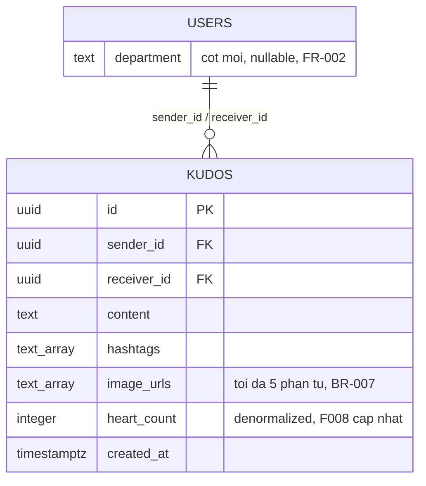
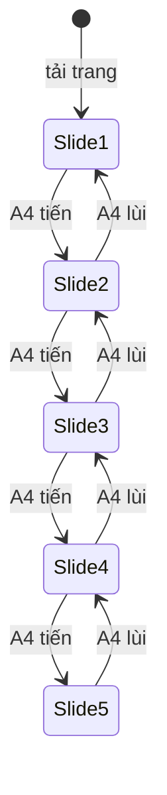

# F007_KudosLiveBoard

## 1. Technical Overview

`/kudos` (planned, `src/app/(public)/kudos/`) là một Server Component đọc toàn bộ board Kudos
trong một request qua DAL mới `src/dal/kudos.ts`, cùng nhóm route `(public)` với `/`, `/awards`,
`/standards` — không qua route-guard nào. Mọi tương tác (lọc, lật carousel, tìm Sunner, cuộn thêm
feed, copy link, mở hồ sơ) chạy client-side trên dữ liệu đã tải hoặc qua một Server Action đọc
thêm trang tiếp theo; không action nào ghi vào cơ sở dữ liệu — toàn bộ F007 là read-only, bấm/thu
hồi trái tim là điểm nối sang `F008_KudosHeartReaction`. Chỉ 1 capability (`CAP-01`), 8 action,
không action nào cần diagram (không action nào ghi ≥2 bảng, không action nào là background/async).

## 2. Action Index

| # | Action (handler) | Method · Path | Codes | Writes | Detail |
|---|---|---|---|---|---|
| **A0** | *cross-cutting — belongs to no single action* | — | FR-102, BR-015 | — | § 4.4 |
| **A1** | `KudosPage` (Server Component, planned) | `GET` `/kudos` | FR-001, FR-002, FR-101, FR-201, FR-202, FR-203, FR-205, FR-206, FR-207, FR-208, FR-211, FR-212, FR-213, BR-001, BR-003, BR-004, BR-005, BR-006, BR-007, BR-008, BR-009, BR-011, BR-012, US001, US003, US007 | — *(read-only)* | § 3.1 |
| **A2** | `loadMoreKudos` (Server Action, planned) | — *(gọi từ client khi cuộn hết trang hiện có, không phải HTTP path riêng)* | FR-210, BR-005, BR-006, BR-007, BR-008, US005 | — *(read-only)* | § 3.1 |
| **A3** | `KudosSpotlightSearch` (client-only, planned, không BE) | — *(gõ/click icon, không HTTP)* | FR-209, BR-010, US004 | — *(read-only)* | § 3.1 |
| **A4** | `KudosHighlightCarouselNav` (client-only, planned, không BE) | — *(click, không HTTP)* | FR-204, BR-002, SM-001, US002 | — *(read-only)* | § 3.1 |
| **A5** | `CopyKudosLink` (client-only, planned, không BE) | — *(click, clipboard)* | FR-401, US006 | — *(read-only)* | § 3.1 |
| **A6** | `KudosProfileLink` (planned — Link tới `/profile?id=`, gate tái dùng `(protected)/layout.tsx`) | `GET` `/profile?id=` *(đích đã có sẵn, F006_ProfilePage)* | FR-402, FR-601, BR-013, US008 | — *(read-only)* | § 3.1 |
| **A7** | `KudosHeartDisplay` (render-only, planned) | — *(không HTTP — bấm tim thuộc F008)* | FR-205, FR-602, BR-014 | — *(read-only)* | § 3.1 |

## 3. Actions

### 3.1 CAP-01 — Xem, lọc & lan toả bảng Kudos trực tiếp

#### A1 · Render trang `/kudos` (đọc toàn bộ board: banner, carousel, Spotlight, feed trang đầu, sidebar)
`GET` `/kudos` → `` `KudosPage` `` *(planned)*
`FR-001` `FR-002` `FR-101` `FR-201` `FR-202` `FR-203` `FR-205` `FR-206` `FR-207` `FR-208` `FR-211` `FR-212` `FR-213` · `SCR007_KudosLiveBoard` · `US001` `US003` `US007`

**Who** · Bất kỳ khách truy cập nào — Anonymous hoặc Authenticated, không qua guard nào *(gate A0 — § 4.4)*.
**FE** · `src/app/(public)/kudos/page.tsx` *(planned)* đọc `searchParams.hashtag`/`searchParams.department`, dựng `copy` (`_shared/kudos-copy.ts` — chrome dùng chung namespace `home`, leaf riêng namespace `kudos`), giao cho `KudosClient` → `KudosScreen` *(planned)* render: banner ghi nhận (`FR-201`, chỉ đọc), ô nhập A.1 (`FR-002`/`FR-202` — chỉ render, KHÔNG mở dialog Viết Kudo trong phạm vi F007), `KudosFilterBar` (`FR-206`/`FR-207` — dropdown Hashtag/Phòng ban lấy danh sách distinct từ DB; click 1 hashtag trên thẻ set lại filter), carousel Highlight 5 thẻ (`FR-203`), Spotlight tổng "N KUDOS" + scatter tĩnh (`FR-208`), feed ALL KUDOS trang đầu, sidebar 5 chỉ số + 2 leaderboard (`FR-211`). Khi không có kudo nào, carousel và feed cùng hiện thông báo rỗng (`FR-212`); khi 1 leaderboard rỗng, chỉ leaderboard đó hiện thông báo rỗng riêng (`FR-213`). `FR-101` được thoả đơn giản bởi việc `GET /kudos` resolve `200` thay vì 404.
**Request** · query `hashtag` *(string, optional)*, `department` *(string, optional)* — không tham số nào bắt buộc.
**BE** · `` `getKudosBoard(toKudosClient(supabase), { hashtag, department })` `` *(planned, `src/dal/kudos.ts`)* — 1 lần đọc view `public.kudos_cards` (lọc theo `hashtag`/`department` nếu có), sắp `heart_count` giảm dần lấy 5 dòng đầu cho carousel, `COUNT(*)` trên `public.kudos` cho tổng Spotlight, trang đầu (giới hạn cursor) cho feed, cộng 1 lần đọc thống kê cá nhân (chỉ khi đã đăng nhập — xem D001, `functional-spec.md § 3`) và 2 leaderboard.
**Rule**
- **BR-001 — Carousel Highlight luôn lấy đúng 5 kudo có `heart_count` cao nhất tại thời điểm tải trang.** *(Bin 1 — chỉ dùng ở A1)*
- **BR-003 — Chọn filter Hashtag/Phòng ban lọc lại đồng thời carousel Highlight và feed ALL KUDOS, đưa carousel về slide 1.** *(Bin 1 — chỉ dùng ở A1)*
- **BR-004 — Click 1 hashtag trên thẻ áp dụng đúng bộ lọc Hashtag đó, tương đương chọn từ dropdown.** *(Bin 1 — chỉ dùng ở A1)*
- **BR-005 — Nội dung cắt ở dòng 3 (thẻ Highlight) / dòng 5 (thẻ ALL KUDOS), quá hiện "...".** *(§ 4.4)*
- **BR-006 — Hashtag hiển thị tối đa 5 tag/dòng, quá dòng hiện "...".** *(§ 4.4)*
- **BR-007 — Ảnh đính kèm hiển thị tối đa 5 ảnh/thẻ, căn trái.** *(§ 4.4)*
- **BR-008 — Số hoa thị tính từ tổng kudo đã NHẬN: 10→1, 20→2, 50→3.** *(§ 4.4)*
- **BR-009 — Tổng "N KUDOS" ở Spotlight là `COUNT(*)` thật của bảng `kudos`, không phải giá trị tĩnh.** *(Bin 1 — chỉ dùng ở A1)*
- **BR-011 — Không có kudo nào → carousel và feed cùng hiện "Hiện tại chưa có Kudos nào.".** *(Bin 1 — chỉ dùng ở A1)*
- **BR-012 — 1 leaderboard chưa có dữ liệu → chỉ leaderboard đó hiện "Chưa có dữ liệu".** *(Bin 1 — chỉ dùng ở A1)*
**Result** · read-only — không ghi DB. Props xuống `KudosScreen`: `highlight: KudosCard[5]`, `feed: { items: KudosCard[], nextCursor }`, `spotlightTotal: number`, `spotlightNames: string[]`, `sidebarStats | null` (null khi anonymous, D001), `leaderboards`.
**Source:** TBD (draft) — chưa có code; hành vi đã chốt tại `functional-spec.md §§ 2, 4, 5` và `clarifications.md`.

<!-- Không cần diagram: đọc 1 lần, không ghi bảng nào, không phải background/async. -->

---

#### A2 · Tải thêm kudo khi cuộn hết feed (infinite scroll)
— *(gọi từ client khi cuộn hết trang hiện có)* → `` `loadMoreKudos` `` *(planned Server Action)*
`FR-210` · `SCR007_KudosLiveBoard` · `US005`

**Who** · Bất kỳ khách truy cập nào đang xem `/kudos` *(gate A0)*.
**FE** · `KudosFeed` *(planned)* theo dõi vị trí cuộn (`IntersectionObserver` trên sentinel cuối danh sách, cùng kỹ thuật scroll-spy đã dùng ở `AwardCategoryNav`), gọi Server Action khi sentinel vào viewport.
**Request** · `cursor` *(string, từ `nextCursor` của trang trước)*.
**BE** · `` `getKudosBoard` `` *(cùng DAL với A1, planned)* đọc trang tiếp theo của `public.kudos_cards`, sắp `created_at` giảm dần.
**Rule**
- **BR-005 — nội dung cắt dòng (`maxLines=5` cho feed).** *(§ 4.4 — cùng rule A1 dùng)*
- **BR-006 — hashtag tối đa 5/dòng.** *(§ 4.4)*
- **BR-007 — ảnh tối đa 5/thẻ.** *(§ 4.4)*
- **BR-008 — hoa thị tính từ tổng kudo đã nhận.** *(§ 4.4)*
**Result** · read-only — không ghi DB. Nối thêm `items` vào danh sách hiện có; hết dữ liệu thì ngừng gọi thêm, không hiện thông báo lỗi (khác trạng thái rỗng của BR-011 — đây là "đã tải hết", một trạng thái bình thường của phân trang).
**Source:** TBD (draft) — chưa có code; hành vi đã chốt tại `functional-spec.md §§ 4, 5`.

---

#### A3 · Tìm Sunner trong Spotlight
— *(gõ/click icon tìm, không HTTP)* → `` `KudosSpotlightSearch` `` *(planned, client-only)*
`FR-209` · `SCR007_KudosLiveBoard` · `US004`

**Who** · Bất kỳ khách truy cập nào đang xem Spotlight *(gate A0)*.
**FE** · `KudosSpotlight` *(planned)* giữ `query` (`useState`, client-local); Enter hoặc click icon lọc/làm nổi bật đúng (các) tên khớp trong scatter tĩnh đã tải sẵn — không round-trip server (D002, `functional-spec.md § 3`).
**Request** · không có (client-only).
**BE** · không có.
**Rule**
- **BR-010 — Ô tìm nhận tối đa 100 ký tự (`maxLength=100`, chặn ký tự thứ 101); nút tìm disable khi ô rỗng.** *(Bin 1 — chỉ dùng ở A3)*
**Result** · read-only — không ghi DB, không điều hướng trang.
**Source:** TBD (draft) — chưa có code; hành vi đã chốt tại `functional-spec.md § 5` và `clarifications.md § Chưa giải quyết`.

---

#### A4 · Lật carousel Highlight Kudos
— *(click mũi tên, không HTTP)* → `` `KudosHighlightCarouselNav` `` *(planned, client-only)*
`FR-204` · `SCR007_KudosLiveBoard` · `SM-001` · `US002`

**Who** · Bất kỳ khách truy cập nào đang xem carousel *(gate A0)*.
**FE** · `KudosHighlightCarousel` *(planned)* giữ `activeIndex` (`useState`, client-local — `SM-001`, vị trí trượt hiện tại, xem § 4.3); 2 cặp nút (cạnh thẻ và cạnh số trang "x/5") cùng gọi 1 handler tiến/lùi.
**Request** · không có (client-only).
**BE** · không có.
**Rule**
- **BR-002 — Nút lùi disable ở slide 1, nút tiến disable ở slide 5; cả 2 vị trí nút dùng chung 1 state.** *(Bin 1 — chỉ dùng ở A4)*
**Result** · read-only — không ghi DB. Đổi `activeIndex`, đổi thẻ nổi bật ở giữa + 2 bên mờ, cập nhật số trang "x/5".
**State** · `SM-001`: `{Slide_n}` → `{Slide_n±1}` *(§ 4.3)*
**Source:** TBD (draft) — chưa có code; hành vi đã chốt tại `functional-spec.md § 5`.

---

#### A5 · Copy link 1 kudo
— *(click, clipboard)* → `` `CopyKudosLink` `` *(planned, client-only)*
`FR-401` · `SCR007_KudosLiveBoard` · `US006`

**Who** · Bất kỳ khách truy cập nào đang xem 1 thẻ Kudos *(gate A0)*.
**FE** · `KudosCard` *(planned)* nút "Copy Link" gọi `navigator.clipboard.writeText(url)` rồi hiện toast.
**Request** · không có.
**BE** · không có.
**Result** · read-only — không ghi DB. URL kudo được sao chép vào clipboard; toast "Link copied — ready to share!" hiện ngay, tự ẩn sau vài giây.
**Source:** TBD (draft) — chưa có code; hành vi đã chốt tại `functional-spec.md § 4`.

---

#### A6 · Mở hồ sơ người gửi/nhận/leaderboard
`GET` `/profile?id=` *(đích đã tồn tại — F006_ProfilePage)* → `` `KudosProfileLink` `` *(planned)*
`FR-402` `FR-601` · `SCR007_KudosLiveBoard` · `US008`

**Who** · Bất kỳ khách truy cập nào bấm avatar/tên trên thẻ Kudos hoặc leaderboard.
**FE** · `KudosCard`/`KudosSidebar` *(planned)* render `<Link href="/profile?id={uuid}">` bọc avatar và tên — không tự viết logic redirect, không dựng gate riêng.
**Request** · param `id` *(uuid của Sunner được click)*.
**BE** · không có handler mới — request đi thẳng tới route `/profile` đã có (F006), qua `(protected)/layout.tsx` (gate AUTHORITATIVE hiện có).
**Rule**
- **BR-013 — Người chưa đăng nhập bấm avatar/tên bị chuyển hướng sang đăng nhập; xem chính `/kudos` không bị chặn.** *(Bin 1 — chỉ dùng ở A6 — cơ chế redirect TÁI SỬ DỤNG nguyên vẹn gate `(protected)/layout.tsx` của F006, không xây gate mới trong F007)*
**Result** · read-only trong phạm vi F007 — không ghi DB. Điều hướng thành công tới `/profile?id=...` khi đã đăng nhập; điều hướng `/login` khi chưa đăng nhập (hành vi của gate đã có, không phải code mới của F007).
**Source:** TBD (draft) — chưa có code; hành vi đã chốt tại `functional-spec.md § 5` và `permissions.md`.

<!-- Nút "Xem chi tiết" (B.3/C.3.5) KHÔNG có action riêng ở đây: đích của nó (trang chi tiết kudo,
     frame `onDIohs2bS`) chưa tồn tại — nút render nhưng không điều hướng đi đâu trong phạm vi
     F007 (xem § 5.3 Unresolved Questions, TC 31693bb7-.../8c0d1781-...). -->

---

#### A7 · Hiển thị trạng thái trái tim trên thẻ Kudos
— *(render-only, không HTTP — bấm tim thuộc F008)* → `` `KudosHeartDisplay` `` *(planned)*
`FR-205` `FR-602` · `SCR007_KudosLiveBoard`

**Who** · Bất kỳ khách truy cập nào đang xem 1 thẻ Kudos.
**FE** · `KudosCard` *(planned)* render icon tim + `heart_count` đọc từ `public.kudos.heart_count` (denormalized, do F008 cập nhật khi thả/thu hồi tim). Với người chưa đăng nhập, nút render `disabled` kèm `title` mời đăng nhập; KHÔNG gắn handler click nào trong phạm vi F007.
**Request** · không có.
**BE** · không có — F007 chỉ đọc `heart_count`, không có action nào ghi lại trường này (thuộc F008_KudosHeartReaction).
**Rule**
- **BR-014 — Nút tim luôn hiển thị số tim hiện tại; người chưa đăng nhập thấy nút disabled kèm gợi ý đăng nhập — hành vi bấm tim khi đã đăng nhập là điểm nối sang F008, không phải quy tắc của F007.** *(Bin 1 — chỉ dùng ở A7)*
**Result** · read-only — không ghi DB, không có handler bấm trong F007.
**Source:** TBD (draft) — chưa có code; hành vi đã chốt tại `functional-spec.md § 5` và `feature-list.md § F008`.

### 3.2 Edge cases

| Action | Scenario | Behavior |
|---|---|---|
| A1 | Hệ thống chưa có kudo nào | Carousel Highlight và feed ALL KUDOS đều hiện "Hiện tại chưa có Kudos nào." (BR-011) |
| A1 | 1 leaderboard sidebar chưa có dữ liệu | Chỉ leaderboard đó hiện "Chưa có dữ liệu"; 5 chỉ số cá nhân và leaderboard còn lại vẫn render bình thường (BR-012) |
| A1 | Người dùng ẩn danh xem sidebar | 5 chỉ số cá nhân + nút "Mở quà" ẩn hoàn toàn; 2 leaderboard vẫn hiện (D001, `functional-spec.md § 3`) |
| A2 | Cuộn tới cuối danh sách đã tải hết dữ liệu | Ngừng gọi tải thêm, không hiện thông báo lỗi/rỗng nào (khác BR-011 — đây là hết trang, không phải hệ thống rỗng) |
| A3 | Nhập ký tự thứ 101 vào ô tìm Sunner | Ký tự bị chặn ngay tại input (`maxLength=100`), không có thông báo lỗi hiển thị |
| A3 | Ô tìm Sunner để trống | Nút tìm bị disable, không gửi được yêu cầu tìm |
| A4 | Carousel đang ở slide 1 hoặc slide 5 | Nút lùi (slide 1) hoặc nút tiến (slide 5) tương ứng bị disable |
| A6 | Người chưa đăng nhập bấm avatar/tên | Chuyển hướng `/login` qua gate có sẵn của `/profile` — không phải code mới của F007 |
| A6 · A7 | Người chưa đăng nhập bấm "Xem chi tiết" hoặc nút tim | Cả 2 đều không có đích/handler thật trong phạm vi F007 — "Xem chi tiết" không điều hướng đi đâu, nút tim chỉ hiển thị disabled (xem § 5.3) |

## 4. Shared Foundation

### 4.1 Components

| Component | Responsibility | Used in | File |
|---|---|---|---|
| `KudosPage` (Server Component) | Entry point `/kudos`, đọc searchParams + gọi DAL + dựng copy | A1 | `src/app/(public)/kudos/page.tsx` *(planned)* |
| `KudosClient` | Client boundary — nối handler xuống `KudosScreen` (mirror `awards-client.tsx`) | A1-A7 | `src/app/(public)/kudos/_components/kudos-client.tsx` *(planned)* |
| `KudosScreen` | Presentational root — banner, filter bar, carousel, Spotlight, feed, sidebar | A1 | `src/app/(public)/kudos/_components/kudos-screen.tsx` *(planned)* |
| `KudosFilterBar` | Dropdown Hashtag + Phòng ban | A1 | `src/app/(public)/kudos/_components/kudos-filter-bar.tsx` *(planned)* |
| `KudosHighlightCarousel` | Carousel 5 thẻ + 2 cặp nút điều hướng + pagination "x/5" | A4 | `src/app/(public)/kudos/_components/kudos-highlight-carousel.tsx` *(planned)* |
| `KudosSpotlight` | Tổng "N KUDOS" + scatter tĩnh tên + ô tìm Sunner | A3 | `src/app/(public)/kudos/_components/kudos-spotlight.tsx` *(planned)* |
| `KudosFeed` | Danh sách ALL KUDOS + infinite scroll sentinel | A2 | `src/app/(public)/kudos/_components/kudos-feed.tsx` *(planned)* |
| `KudosCard` | Thẻ Kudos dùng chung (Highlight + feed) — thông tin gửi/nhận, nội dung, hashtag, ảnh, tim, Copy Link | A1, A2, A5, A6, A7 | `src/app/(public)/kudos/_components/kudos-card.tsx` *(planned)* |
| `KudosSidebar` | 5 chỉ số cá nhân + 2 leaderboard | A1 | `src/app/(public)/kudos/_components/kudos-sidebar.tsx` *(planned)* |
| `KudosCopy` / `defaultKudosCopy` | Content contract cho leaf riêng `/kudos`, chrome dùng chung `SiteChromeCopy` | A1 | `src/app/(public)/kudos/_shared/kudos-copy.ts` *(planned)* |
| `getKudosBoard` | Đọc `public.kudos_cards` + `public.kudos` (count), lọc theo hashtag/department, fail-open rỗng | A1, A2 | `src/dal/kudos.ts` *(planned)* |
| `toKudosClient` | Shim thu hẹp kiểu client Supabase cho `getKudosBoard` (mirror `toAwardsClient`) | A1, A2 | `src/dal/kudos-client.ts` *(planned)* |

### 4.2 Data Model



| Entity | Table | Used for | Action |
|---|---|---|---|
| `Kudo` | `kudos` | Nguồn duy nhất cho carousel Highlight, feed ALL KUDOS, tổng Spotlight, sidebar | A1, A2 |
| `KudoCard` | `kudos_cards` (view, join `kudos` + `users` × 2) | Hình chiếu đọc sẵn cho thẻ Kudos — gộp tên/avatar/phòng ban/số hoa thị của cả người gửi và người nhận, tránh N+1 query | A1, A2 |

**Migration dự kiến (`0006_kudos.sql`, planned — chưa tạo):**

```sql
CREATE TABLE public.kudos (
    id           uuid PRIMARY KEY DEFAULT gen_random_uuid(),
    sender_id    uuid NOT NULL REFERENCES public.users(id) ON DELETE CASCADE,
    receiver_id  uuid NOT NULL REFERENCES public.users(id) ON DELETE CASCADE,
    content      text NOT NULL,
    hashtags     text[] NOT NULL DEFAULT '{}',
    image_urls   text[] NOT NULL DEFAULT '{}',
    heart_count  integer NOT NULL DEFAULT 0,
    created_at   timestamptz NOT NULL DEFAULT now()
);

ALTER TABLE public.kudos ENABLE ROW LEVEL SECURITY;
ALTER TABLE public.kudos FORCE  ROW LEVEL SECURITY;

DROP POLICY IF EXISTS kudos_select_all ON public.kudos;
CREATE POLICY kudos_select_all ON public.kudos
    FOR SELECT TO anon, authenticated
    USING (true);

-- Default privileges đã cấp ALL cho anon/authenticated (xem 0005) — revoke rồi grant lại đúng SELECT.
REVOKE ALL ON public.kudos FROM anon, PUBLIC, authenticated;
GRANT SELECT ON public.kudos TO anon, authenticated;

-- Không có policy INSERT/UPDATE/DELETE nào ở đây — F007 read-only; F008 (thả tim) và dialog Viết
-- Kudo (hoãn) sẽ tự thêm policy ghi khi tới lượt chúng, không thêm trước cho một hành vi chưa build.

ALTER TABLE public.users ADD COLUMN IF NOT EXISTS department text;

CREATE OR REPLACE VIEW public.kudos_cards
    WITH (security_invoker = false)
AS
SELECT
    k.id, k.content, k.hashtags, k.image_urls, k.heart_count, k.created_at,
    su.id AS sender_id, su.full_name AS sender_full_name,
    su.avatar_url AS sender_avatar_url, su.department AS sender_department,
    (SELECT count(*) FROM public.kudos WHERE receiver_id = su.id) AS sender_kudos_received,
    ru.id AS receiver_id, ru.full_name AS receiver_full_name,
    ru.avatar_url AS receiver_avatar_url, ru.department AS receiver_department,
    (SELECT count(*) FROM public.kudos WHERE receiver_id = ru.id) AS receiver_kudos_received
FROM public.kudos k
JOIN public.users su ON su.id = k.sender_id
JOIN public.users ru ON ru.id = k.receiver_id;

REVOKE ALL ON public.kudos_cards FROM anon, PUBLIC, authenticated;
GRANT SELECT ON public.kudos_cards TO anon, authenticated;
```

`anon` được GRANT (khác `0005_profile_cards_view.sql`, chỉ `authenticated`) vì `/kudos` là trang
PUBLIC — cùng lý do `0003_awards_table.sql` GRANT `anon`. Cột `department` KHÔNG lộ `email`/`role`/
`locale` của `users` — `kudos_cards` chỉ SELECT đúng 4 cột mỗi phía (id, full_name, avatar_url,
department) cộng 1 subquery đếm, không có `SELECT *`.

#### Polymorphic Behavior

N/A — no discriminator fields in Key Entities.

### 4.3 State Management

### Vị trí trượt hiện tại của carousel Highlight Kudos (SM-001)
**kind:** ui
**Linked FR:** FR-204
**Source:** TBD (draft) — chưa có code; hành vi đã chốt tại `functional-spec.md § 5`.



**Action transitions:** guard/disable logic (nút lùi disable ở Slide1, nút tiến disable ở Slide5)
sống trong Result rung của A4 (§ 3.1) — không lặp lại ở đây.

### 4.4 Shared Rules

#### Bin 2 — used by ≥2 named actions

**BR-005 — Nội dung lời cảm ơn cắt ở dòng thứ 3 (thẻ Highlight) hoặc dòng thứ 5 (thẻ ALL KUDOS), phần dư hiện "...".**
Used in: **A1** · **A2**. Cả 2 hành động cùng dùng chung component thẻ Kudos (`kudos-card.tsx`) —
chỉ khác `maxLines` theo khu vực hiển thị (Highlight = 3, ALL KUDOS = 5).
**Source:** TBD (draft)
```text
maxLines = isHighlight ? 3 : 5
truncated = clampLines(content, maxLines) + (isTruncated ? "..." : "")
```

**BR-006 — Hashtag hiển thị tối đa 5 tag trên 1 dòng, quá dòng hiện "...".**
Used in: **A1** · **A2**. Cùng component thẻ Kudos dùng chung.
**Source:** TBD (draft)

**BR-007 — Ảnh đính kèm hiển thị tối đa 5 ảnh mỗi thẻ, căn lề trái.**
Used in: **A1** · **A2**. Cùng component thẻ Kudos dùng chung.
**Source:** TBD (draft)

**BR-008 — Số hoa thị người gửi/nhận tính từ tổng kudo họ đã NHẬN: 10→1, 20→2, 50→3.**
Used in: **A1** · **A2**. Giá trị đọc từ cột đếm sẵn (`sender_kudos_received`/`receiver_kudos_received`) của view `kudos_cards`.
**Source:** TBD (draft)
```text
tier = receivedCount >= 50 ? 3 : receivedCount >= 20 ? 2 : receivedCount >= 10 ? 1 : 0
```

#### Bin 3 — cross-cutting, thuộc về không action riêng nào

**A0 · FR-102 / BR-015 — `/kudos` không áp dụng route-guard nào.**
Không middleware/guard nào chặn route `/kudos` trong `proxy.ts` hay một layout `(protected)` —
route nằm trong nhóm `(public)`, cùng cơ chế với `/`, `/awards`, `/standards`. Áp dụng cho **mọi
action trong § 3**, không riêng action nào.
**Source:** TBD (draft) — chưa có code; hành vi đã chốt tại `clarifications.md` § "Q: `/kudos` là
public hay protected?".

### 4.5 Algorithms & Integrations

None.

### 4.6 Configuration

N/A — no technical configuration beyond framework defaults.

**Client behavior:** see
[`behavior-logic.md`](../../../../docs/vi/generated/behavior-logic.md) (client-side patterns — debounce, optimistic UI, polling, upload, realtime),
[`permissions.md`](../../../../docs/vi/system/permissions.md) (feature flags / experiments / env / locale gates),
[`architecture.md`](../../../../docs/vi/system/architecture.md) (guards / deep-link state restoration / unsaved-changes protection).

## 5. Verification & Technical Notes

### 5.1 Technical Verification

- **SC-001** *(A1)* `GET /kudos` trả `200` cho cả Anonymous và Authenticated; banner, carousel, Spotlight, feed và sidebar đều render (covers FR-101, FR-102, FR-201)
- **SC-002** *(A1)* Chọn 1 hashtag hoặc phòng ban lọc lại cả carousel Highlight và feed ALL KUDOS đồng thời (covers FR-206, BR-003)
- **SC-003** *(A4)* Nút lùi/tiến carousel disable đúng ở slide 1 và slide 5 (covers FR-204, BR-002)
- **SC-004** *(A3)* Ô tìm Sunner chặn ký tự thứ 101, nút tìm disable khi rỗng (covers FR-209, BR-010)
- **SC-005** *(A2)* Cuộn tới cuối feed hiện có tự tải thêm kudo (covers FR-210)
- **SC-006** *(A6)* Người chưa đăng nhập bấm avatar/tên bị chuyển hướng `/login` (covers FR-601, BR-013)

#### US001_ViewKudosLiveBoard *(A1)*

**Independent Test:** Mở `/kudos` ở chế độ ẩn danh (không cookie session) — trang phải trả `200`
và render đầy đủ banner/carousel/Spotlight/feed/sidebar (rút gọn theo D001).

**Acceptance Scenarios:**
1. **Given** chưa đăng nhập, **When** vào `/kudos` trực tiếp bằng URL, **Then** trang trả `200`, không redirect `/login`.
2. **Given** chưa đăng nhập, **When** trang tải xong, **Then** carousel Highlight và feed ALL KUDOS hiển thị dữ liệu thật từ `kudos_cards`.

#### US003_FilterKudosByHashtagOrDepartment *(A1)*

**Independent Test:** Gọi `/kudos?hashtag=Dedicated` trực tiếp — carousel và feed phải cùng chỉ chứa kudo mang hashtag đó.

**Acceptance Scenarios:**
1. **Given** board hiển thị mọi kudos, **When** chọn hashtag từ dropdown, **Then** cả carousel và feed lọc lại, carousel về slide 1.
2. **Given** bộ lọc không khớp kudo nào, **When** áp dụng xong, **Then** cả 2 khu vực hiện "Hiện tại chưa có Kudos nào." thay vì lỗi.

#### US005_BrowseAllKudosFeed *(A2)*

**Independent Test:** Seed >1 trang kudo, cuộn `KudosFeed` tới cuối — assert `loadMoreKudos` được gọi đúng 1 lần với `cursor` của trang trước.

**Acceptance Scenarios:**
1. **Given** feed còn dữ liệu, **When** sentinel cuối danh sách vào viewport, **Then** trang tiếp theo được nối vào cuối danh sách hiện có.
2. **Given** feed đã hết dữ liệu, **When** sentinel vào viewport lần nữa, **Then** không có request nào được gửi thêm.

### 5.2 Assumptions

- *(A1)* Giả định carousel Highlight tính "5 kudo nhiều tim nhất" tại thời điểm request (không cache riêng) — khi ≥2 kudo hoà điểm tim, thứ tự phụ tie-break theo `created_at` giảm dần (chưa có TC nào xác nhận tie-break, ghi nhận như một giả định thiết kế).
- *(A3)* Giả định danh sách tên Spotlight (8 Sunner theo mock Figma) là toàn bộ nguồn tìm kiếm ở quy mô demo; khi seed dữ liệu thật lớn hơn, cơ chế tìm kiếm client-side hiện tại có thể cần chuyển sang server-side.
- *(A6)* Giả định gate đăng nhập cho việc mở hồ sơ được TÁI SỬ DỤNG nguyên vẹn từ `(protected)/layout.tsx` hiện có (F006) — F007 không xây gate mới.

### 5.3 Unresolved Questions

1. **Tie-break carousel** *(A1)*: chưa xác nhận thứ tự phụ khi ≥2 kudo hoà số tim cao nhất — xem giả định § 5.2.
2. **Khả năng mở rộng tìm kiếm Spotlight** *(A3)*: chưa xác nhận ngưỡng số Sunner mà tìm kiếm client-side còn chấp nhận được trước khi cần chuyển server-side.
3. **4 test case F007 không thể thoả** *(ghi nhận theo yêu cầu spec, không phải câu hỏi kỹ thuật cần đọc thêm code)*:
   - `ca8f60b3-3e33-4623-8349-dbb96ebaee82` (Check business logic / Form submission / Save Kudos to database) — cần "Kudos submission dialog" đang mở; A.1 trong F007 chỉ render ô nhập, KHÔNG mở dialog Viết Kudo (frame `ihQ26W78P2` chưa build). Cùng lý do, TC `f183a3e4-249b-4db2-9380-131408583c10` (Required check trên input trong dialog) cũng không thoả.
   - `43b54c29-1ff5-4f51-b500-e3d8f42d07b5` (Check business logic / Open box / Button opens Secret Box dialog) — dialog Secret Box (frame `J3-4YFIpMM` + 8 state) chưa build.
   - `31693bb7-b22e-4874-9dae-378b2dcd1f9b` (Check navigation path / Kudos detail navigation) — trang chi tiết kudo (frame `onDIohs2bS`) chưa build. Cùng lý do, TC `8c0d1781-6605-44e7-97ec-5661c19d7ccc` (nút "Xem chi tiết") cũng không thoả.
   - `31936b72-9c0f-4e01-b022-cd8e22a18677` (Check business logic / Like on special day / Admin configuration, 2 hearts) — không có màn admin cấu hình "ngày đặc biệt", không bảng config nào tồn tại để dựng precondition của TC này (YAGNI, tiền lệ F005 — xem `clarifications.md`).

### 5.4 Source References

No source code written yet — see `functional-spec.md § 7 User Stories` for planned behavior; the
planned file layout is listed in `## 4.1 Components` above.

#### Data Flow

```text
{searchParams hashtag/department/cursor} -> KudosPage Server Component -> getKudosBoard (DAL) -> kudos_cards VIEW read -> KudosScreen render (banner/carousel/spotlight/feed/sidebar)
```

### 5.5 Artifact References

| Artifact | File | Codes Used | Reviewed |
|----------|------|------------|----------|
| System Overview | [system-overview.md](../../../../docs/vi/system/system-overview.md) | — | [ ] |
| Architecture | [architecture.md](../../../../docs/vi/system/architecture.md) | — | [ ] |
| Feature List | [feature-list.md](../feature-list.md) | F007 | [ ] |
| API Map | [api-map.md](../../../../docs/vi/generated/api-map.md) | TBD (draft) | [ ] |
| Entities | [entities.md](../../../../docs/vi/generated/entities.md) | TBD (draft) | [ ] |
| Screens | [functional-spec.md § 6](./functional-spec.md#6-screens) | SCR007 | [ ] |
| Behavior Logic | [behavior-logic.md](../../../../docs/vi/generated/behavior-logic.md) | TBD (draft) | [ ] |
| Permissions Matrix | [permissions-matrix.md](../../../../docs/vi/generated/permissions-matrix.md) | TBD (draft) | [ ] |
| User Stories | [user-stories.md](../../../../docs/vi/generated/user-stories.md) | TBD (draft) | [ ] |
