# Entities

**Project**: agentic-coding-hands-on
**Generated**: 2026-09-06

> **Honest-scope note**: repo này không dùng ORM (không có ORM model) — schema CSDL được định nghĩa bằng SQL migrations committed tại `supabase/migrations/` trong chính repo này (`0001_users_table.sql`, `0002_handle_new_user_trigger.sql`, `0003_awards_table.sql`, `0005_profile_cards_view.sql`, `0006_kudos.sql`, `0007_kudo_hearts.sql`; xem `README.md` § Database). Persistence chạy qua một Supabase stack khởi động bằng `supabase start` từ repo root (`project_id` `saa-app`, API `http://127.0.0.1:55321`) — ngoài các migration, thứ duy nhất app tự đọc qua code là session/user object trả về từ `@supabase/ssr`, cộng (từ F003_Homepage) một cột `role` đọc qua PostgREST từ bảng `public.users` (schema ở `0001_users_table.sql`), cộng (từ F004_AwardSystemPage) bảng thứ 2, `public.awards` (schema ở `0003_awards_table.sql`), đọc read-only qua DAL `src/dal/awards.ts`, cộng (từ F006_ProfilePage) view thứ 3, `public.profile_cards` (schema ở `0005_profile_cards_view.sql`, phái sinh từ `public.users`, KHÔNG phải bảng độc lập), đọc read-only qua DAL `src/dal/profile-cards.ts`, cộng (từ F007_KudosLiveBoard + F008_KudosHeartReaction, 2026-09-07) bảng thứ 4 `public.kudos` + view thứ 5 `public.kudos_cards` (schema ở `0006_kudos.sql`, đọc qua `src/dal/kudos.ts`/`kudos-cards-query.ts`) và bảng thứ 6 `public.kudo_hearts` (schema ở `0007_kudo_hearts.sql`, đọc/ghi qua `src/dal/kudo-hearts.ts` + Server Action `toggleKudoHeart`) — cộng một cột mới `department` (nullable) trên `public.users`, chỉ lộ ra qua view `kudos_cards`, KHÔNG đọc trực tiếp `public.users.department` ở bất kỳ đâu khác trong app. Từ F009_KudosCompose (2026-09-08): migration `0009_kudos_write_anonymity.sql` thêm 2 cột ghi-only trên `public.kudos` (`is_anonymous boolean NOT NULL DEFAULT false`, `anonymous_name text`, đọc/ghi qua Server Action `createKudo`, `src/app/(public)/kudos/_actions/create-kudo.ts`) và patch `CREATE OR REPLACE VIEW public.kudos_cards` để `CASE WHEN is_anonymous` che 5 cột phía sender; migration `0010_kudo_images_bucket.sql` thêm bucket Supabase Storage đầu tiên của repo (`kudo-images`, đọc/ghi qua `src/app/(public)/kudos/_actions/upload-kudo-images.ts`) — bucket này không có DAL SELECT nào đọc lại nên không lên ERD như một entity riêng, chỉ ghi chú trong mục `KUDOS_KudosCard` bên dưới. `/todo` chỉ là placeholder chứng minh auth guard, không có entity todo thật (`src/app/(protected)/todo/page.tsx`). Từ F010_SecretBoxModal (migration `0011_secret_box.sql`): bảng thứ 7 `public.secret_box_openings` — log append-only, ghi DUY NHẤT qua RPC `SECURITY DEFINER` `open_secret_box()`, `authenticated` không có GRANT INSERT nào. Từ F012_NotificationsPanel (migration `0012_notifications.sql`): bảng thứ 8 `public.notifications` — inbox 4 loại sự kiện, RLS + `GRANT UPDATE (is_read)` cột-hẹp là lớp thực thi; writer duy nhất là trigger `SECURITY DEFINER` ở migration `0013` (ngoài phạm vi bảng này). Vì vậy ERD dưới đây liệt kê 9 **data shape** thật sự tồn tại trong source (2 do repo định nghĩa qua code app, 1 do SDK định nghĩa và chỉ bị đọc một phần field, 6 do repo định nghĩa qua SQL migration và đọc/ghi qua DAL — `kudos`/`kudo_hearts`/`secret_box_openings`/`notifications` là 4 bảng trong ERD này có FK thật, xem ghi chú dưới sơ đồ) — không có bảng, cột, hay migration nào bị bịa ra.

## Entity Relationship Diagram

```mermaid
erDiagram
    MODEL001_AppLocale {
        string value "vi | en"
    }
    MODEL002_SupabaseUser {
        string email "as consumed — nullable"
        string id "UUID — khoa tra cuu public.users.role"
        string role "member | admin — fail-open member, tu public.users"
    }
    MODEL003_LoginCopy {
        string subtitle
        string tagline
        string loginButton
        string footer
        string logoAlt
        string heroAlt
        string languageLabel
    }
    AWARD_Award {
        string slug PK "top-talent | top-project | top-project-leader | best-manager | signature-2025-creator | mvp"
        string locale PK "vi | en - chi seed vi"
        string title
        string description
        string quantityValue "chuoi, giu leading-zero, vd 02"
        string quantityUnit
        json prizeValues "array cua amount/note - Signature 2025 co 2 phan tu"
    }
    PROFILE_ProfileCard {
        string id PK "UUID - trung id cua public.users"
        string fullName "nullable, fallback 'Sunner' khi null"
        string avatarUrl "nullable, placeholder xam khi null"
    }
    KUDOS_KudosCard {
        string id PK "UUID - id cua public.kudos"
        string content
        json hashtags "text[] o DB - mang chuoi"
        json imageUrls "text[] o DB - toi da 5 phan tu, BR-007"
        int heartCount "denormalized, CHI ghi boi trigger 0007"
        string createdAt "cung la cursor keyset cua Feed"
        string senderId FK "-> public.users.id"
        string receiverId FK "-> public.users.id"
        string senderDepartment "nullable - cot users.department moi"
        string receiverDepartment "nullable - cot users.department moi"
    }
    KUDOS_KudoHeart {
        string id PK "UUID"
        string kudoId FK "-> public.kudos.id"
        string userId FK "-> public.users.id"
        boolean special "luon false - luat +2 tim da hoan"
        string createdAt
    }
    KUDOS_KudosCard ||--o{ KUDOS_KudoHeart : "heart_count duoc trigger tinh tu"
    SECRETBOX_SecretBoxOpening {
        string id PK "UUID"
        string userId FK "-> public.users.id"
        string badgeKey "1 trong 6 gia tri co dinh, CHECK constraint"
        string openedAt "timestamptz, default now()"
    }
    NOTIFICATIONS_Notification {
        string id PK "UUID"
        string userId FK "-> public.users.id - la NGUOI NHAN, khong phai actor"
        string type "1 trong 4 gia tri, CHECK constraint"
        json payload "jsonb, mac dinh {}"
        boolean isRead "default false - cot duy nhat authenticated duoc UPDATE"
        string createdAt "timestamptz, default now()"
    }
```

9 shape trong ERD này, nhưng chỉ 4 cái (`KUDOS_KudosCard`/`public.kudos`, `KUDOS_KudoHeart`/`public.kudo_hearts`, `SECRETBOX_SecretBoxOpening`/`public.secret_box_openings`, `NOTIFICATIONS_Notification`/`public.notifications`) có FK thật ở tầng DB — 5 shape còn lại (`MODEL001-003`, `AWARD_Award`, `PROFILE_ProfileCard`) không có FK nào, giữ nguyên nhận định trước đây. `kudos.sender_id`/`kudos.receiver_id`, `kudo_hearts.kudo_id`/`kudo_hearts.user_id`, `secret_box_openings.user_id`, VÀ `notifications.user_id` đều là FK thật (`REFERENCES ... ON DELETE CASCADE`, xem `0006_kudos.sql`/`0007_kudo_hearts.sql`/`0011_secret_box.sql`/`0012_notifications.sql`) — đây là nhóm bảng ĐẦU TIÊN trong dự án ràng buộc quan hệ ở tầng DB thay vì chỉ "dùng chung một id" như `profile_cards`. Cạnh `KUDOS_KudosCard ||--o{ KUDOS_KudoHeart` trong sơ đồ trên diễn tả đúng 1 quan hệ thật (1 kudo có 0..N heart) — không vẽ cạnh nào khác (`sender_id`/`receiver_id`/`user_id` (kudo_hearts) → `users.id`, `secret_box_openings.user_id` → `users.id`, `notifications.user_id` → `users.id`) vì `MODEL002_SupabaseUser` không phải một bảng CSDL độc lập trong ERD này (là object SDK, xem mục riêng bên dưới), nên không có node `users` nào để nối tới. Xem mục **Relationships** của từng entity bên dưới để biết chi tiết.

## Entities

### MODEL001_AppLocale

**Description**: Locale hợp lệ duy nhất mà app hỗ trợ — không phải bảng CSDL, mà là một union type + hằng số module-level, là "chốt chặn" duy nhất mọi giá trị locale (cookie, tham số Server Action) phải đi qua trước khi được dùng. Nguồn: `src/lib/i18n/locale.ts:9-14` (`SUPPORTED_LOCALES`, `AppLocale`, `DEFAULT_LOCALE`), `src/lib/i18n/locale.ts:28-31` (`LOCALE_LABEL`).

| Attribute | Type | Constraints | Description |
|-----------|------|-------------|-------------|
| value | `"vi" \| "en"` | enum(2), NOT NULL | Mã locale — chỉ 2 giá trị hợp lệ (`src/lib/i18n/locale.ts:9`) |

**Relationships**:
- None (không có FK). Được *tham chiếu như kiểu field* trong 2 props shape khác — `LoginClientProps.locale` (`src/app/(public)/login/_components/login-client.tsx:13`) và `LanguageSelectorProps` (`src/app/_components/language-selector/language-selector.tsx:9,13`) — đây là type-level reuse, không phải quan hệ entity-entity của ERD.

**Discriminator Fields**:

| Field | DISC-### | Values | Description |
|-------|----------|--------|-------------|
| value | DISC-001 | vi, en | `vi` = tiếng Việt (mặc định khi cookie thiếu/rỗng/không hợp lệ), `en` = tiếng Anh — mỗi giá trị chọn ra một message bundle khác nhau (`i18n/request.ts:21`, `import(../messages/${locale}.json)`) và một nhãn hiển thị khác nhau trên language selector (`src/lib/i18n/locale.ts:28-31`, `LOCALE_LABEL`: "VN"/"EN") |

---

### MODEL002_SupabaseUser

**Description**: Object user trả về từ `supabase.auth.getUser()` — **không do repo này định nghĩa** (kiểu gốc thuộc `@supabase/supabase-js`, được `@supabase/ssr` re-export qua `createClient()`/`createProxyClient()`). Repo chỉ *đọc*, không lưu lại bản sao nào. Grep toàn repo (`src/app`, `src/dal`, `src/lib`) xác nhận 2 field từng được truy cập: `user.email` (`src/app/(protected)/todo/page.tsx:28`, `t("greeting", { email: user?.email ?? "" })`) và `user.id` (`src/app/_utils/get-viewer.ts:37`, truyền vào `getUserRole(toUsersRoleClient(supabase), user.id)`). Sự tồn tại (truthy) của `user` — không phải field nào của nó — cũng được dùng làm điều kiện rẽ nhánh tại `src/proxy.ts:91,95` và `src/app/(protected)/layout.tsx:24` (guard fail-closed AUTHORITATIVE của `/todo`+`/profile`, hoisted khỏi từng `page.tsx` — xem `permissions-matrix.md`).

**Cập nhật 2026-09-06 (F003_Homepage)**: `id` của user nay được dùng để đọc thêm `role` từ bảng `public.users` (bảng riêng, KHÔNG phải trường của object `User` gốc — xem dòng `role` bên dưới, đánh dấu nguồn khác biệt).

| Attribute | Type (as consumed) | Constraints | Description |
|-----------|------|-------------|-------------|
| email | `string \| undefined` (thực tế code: `user.email ?? ""`) | nullable | Email hiển thị trong lời chào ở `/todo` (`src/app/(protected)/todo/page.tsx:28`) và trong `HeaderViewer.email` ở SCR003_HomeScreen (`src/app/_utils/get-viewer.ts:42`) |
| id | `string` (UUID) | NOT NULL | Khoá tra cứu `public.users.role` — truyền vào `getUserRole(toUsersRoleClient(supabase), user.id)` (`src/app/_utils/get-viewer.ts:37`, `src/dal/users.ts:51-70`) |
| role *(nguồn khác — `public.users`, không phải field gốc của `User`)* | `"member" \| "admin"` (as consumed) | fail-open `"member"` khi lỗi/không có row | Đọc qua `src/dal/users.ts:51-70` (`getUserRole`) bằng client PostgREST hẹp `src/dal/users-role-client.ts` (`toUsersRoleClient` — shim thu hẹp `@supabase/ssr` server client về đúng slice `.from("users").select("role").eq("id",…).maybeSingle()`, tránh lỗi TS2589 "type instantiation is excessively deep" khi so khớp kiểu SDK trực tiếp). Quyết định `HeaderViewer.isAdmin` (`role === "admin"`) — chỉ ẩn/hiện mục "Trang quản trị" trong menu tài khoản, KHÔNG phải một authorization gate (xem `permissions-matrix.md § Role-based screen-permission`) |

Các field khác của kiểu `User` thật (vd. `user_metadata`, `app_metadata`, `aud`, `created_at`, ...) tồn tại trên SDK nhưng **không có dòng code nào trong repo đọc chúng** — không liệt kê để tránh bịa cột.

**Relationships**:
- None — object này không được persist lại bởi repo (không bảng nào giữ FK trỏ tới nó); nó được lấy lại mỗi request từ session Supabase (`src/lib/supabase/server.ts:16-42`, `src/lib/supabase/proxy-client.ts:13-34`, `src/lib/supabase/client.ts:13-18`).
- `role` được join thủ công (không phải FK trong ERD — đọc bằng 2 lời gọi Supabase riêng biệt trong cùng 1 request): `getUser()` lấy `id`, rồi `getUserRole(toUsersRoleClient(supabase), id)` query `public.users` dưới RLS own-row (JWT của chính user). Không có API nào trong app trả role của người khác.

**Discriminator Fields**:

| Field | DISC-### | Values | Description |
|-------|----------|--------|-------------|
| role | DISC-002 | member, admin | `member` = mặc định/fail-open (không thấy mục "Trang quản trị"); `admin` = thấy thêm mục "Trang quản trị" (`/admin`, route chưa implement) trong menu tài khoản của SCR003_HomeScreen (`src/dal/users.ts:16`, `src/app/_components/account-menu.tsx`) |

---

### MODEL003_LoginCopy

**Description**: Content contract cho copy tĩnh của màn `/login` (mm:662:14387) — **không phải domain/persisted data**, mà là bản copy mặc định (giá trị `vi`, đúng nguyên văn Figma `characters`) được truyền xuống làm props; bản dịch `en` do next-intl cung cấp riêng (Track B, xem `clarifications.md`). Đưa vào đây theo đúng yêu cầu honest-scope vì nó là structured data shape có thật, không phải vì nó là bảng CSDL. Nguồn: `src/app/(public)/login/_shared/login-copy.ts:7-25` (type `LoginCopy` dòng 7-15 + hằng số `defaultLoginCopy` dòng 17-25).

| Attribute | Type | Constraints | Description |
|-----------|------|-------------|-------------|
| subtitle | string | NOT NULL | Dòng phụ đề dưới logo |
| tagline | string | NOT NULL | Câu tagline mời đăng nhập |
| loginButton | string | NOT NULL | Label nút Google login |
| footer | string | NOT NULL | Dòng bản quyền cuối trang |
| logoAlt | string | NOT NULL | Alt text ảnh logo |
| heroAlt | string | NOT NULL | Alt text ảnh hero |
| languageLabel | string | NOT NULL | Nhãn mặc định của language selector ("VN") |

**Relationships**:
- None (presentational prop, không phải entity được persist). Được truyền làm prop `copy` vào `LoginClient` (`src/app/(public)/login/_components/login-client.tsx:12,43`).

**Discriminator Fields**: None.

---

### AWARD_Award

**Description**: 6 hạng mục giải thưởng SAA 2025 hiển thị trên `/awards` (F004_AwardSystemPage) — bảng THỨ 2 mà repo đọc từ Supabase `saa-app` (sau `public.users`), read-only, không tham chiếu entity nào khác. Nguồn: `src/dal/awards.ts` (`Award`, `getAwards`), migration `supabase/migrations/0003_awards_table.sql` (đã shipped, committed trong chính repo này — áp bằng `supabase migration up`).

| Attribute | Type (as consumed) | Constraints | Description |
|-----------|------|-------------|-------------|
| slug | `string` | PK (cùng `locale`), NOT NULL | Định danh hạng mục — 1 trong 6 giá trị cố định, cũng là `id` của `<section>` và `href="#<slug>"` của nav |
| locale | `"vi" \| "en"` | PK (cùng `slug`), NOT NULL | Chỉ có dòng `vi` được seed; `en` để trống (D002, chưa có bản dịch) |
| title | `string` | NOT NULL | Tên hạng mục giải, hiển thị ở `<h2>` và nav |
| description | `string` | NOT NULL | Mô tả đầy đủ, `white-space: pre-line` (giữ đoạn ngắt) |
| quantityValue | `string` (không phải số) | NOT NULL | Giữ nguyên leading-zero (`"02"`, `"01"`) — ép kiểu số sẽ mất số 0 đứng đầu |
| quantityUnit | `string` | NOT NULL | "Cá nhân" / "Tập thể" / "Cá nhân hoặc tập thể" |
| prizeValues | `{amount: string, note: string}[]` | NOT NULL, jsonb ở DB | 5 hạng mục có 1 phần tử; Signature 2025 có 2 (cá nhân + tập thể); `note` rỗng nghĩa là "không có dòng chú" |

**Relationships**:
- None — bảng độc lập, không FK vào/từ `public.users` hay entity nào khác. Đọc qua client hẹp `toAwardsClient` (`src/dal/awards-client.ts`), lọc theo `locale`, sắp theo `sort_order` (không phải attribute hiển thị, chỉ dùng để `ORDER BY` phía server).

**Discriminator Fields**: None — `locale` là khoá lọc kèm `slug` (composite PK), không phải nhánh hành vi.

---

### PROFILE_ProfileCard

**Description**: Hồ sơ hiển thị trên `/profile` (F006_ProfilePage) — KHÔNG phải một bảng CSDL độc
lập, mà là view `public.profile_cards` (migration `0005_profile_cards_view.sql`) phái sinh 1-1 từ
`public.users`, phơi ra ĐÚNG 3 cột. View chạy với quyền của owner (`security_invoker = false`,
role `BYPASSRLS`) để bỏ qua RLS own-row (`users_select_own`) của `public.users` — cho phép bất kỳ
Sunner đã đăng nhập nào đọc 3 cột này của BẤT KỲ hàng nào, trong khi `email`/`role`/`locale`/
`created_at`/`updated_at` không bao giờ lọt qua (`REVOKE ALL` rồi chỉ `GRANT SELECT` cho
`authenticated`, không `anon`). Nguồn: `src/dal/profile-cards.ts` (`ProfileCard`,
`getProfileCard`), `supabase/migrations/0005_profile_cards_view.sql`.

| Attribute | Type (as consumed) | Constraints | Description |
|-----------|------|-------------|-------------|
| id | `string` (UUID) | PK, NOT NULL | Trùng `id` của hàng `public.users` tương ứng — khoá tra cứu duy nhất, dùng cho cả nhánh self và other |
| fullName | `string \| null` | nullable | Tên hiển thị ở hero (`ProfileHero`); `null` → fallback `copy.hero.fallbackName` ("Sunner") |
| avatarUrl | `string \| null` | nullable | Ảnh avatar tròn; `null` → placeholder nền `#323231`, không ảnh |

**Relationships**:
- None trong ERD (không vẽ FK) — nhưng `id` phái sinh 1-1 từ `MODEL002_SupabaseUser.id`/
  `public.users.id` qua view `profile_cards`; đọc bằng client hẹp `toProfileCardsClient`
  (`src/dal/profile-cards-client.ts`), cùng shim pattern `toAwardsClient`/`toUsersRoleClient`
  (tránh lỗi TS2589).

**Discriminator Fields**: None.

**Fail-open note**: `getProfileCard` fail-open trả `null` khi Supabase lỗi HOẶC không có hàng khớp
`id` — cả 2 nguyên nhân dẫn tới cùng `notFound()` phía caller (`page.tsx`); không phải một quyết
định phân quyền, xem `docs/vi/system/permissions.md` § Special Conditions.

---

### KUDOS_KudosCard

**Description**: Board đọc-được cho `/kudos` (F007_KudosLiveBoard) — KHÔNG phải bảng `public.kudos`
trực tiếp, mà là view `public.kudos_cards` (migration `0006_kudos.sql`) join `kudos` với `public.users`
2 lần (sender + receiver). View chạy `security_invoker = false` (SECURITY DEFINER-equivalent, bỏ qua
RLS) nên `anon` VÀ `authenticated` đều đọc được — khác `profile_cards` (chỉ `authenticated`), vì
`/kudos` là trang PUBLIC (BR-015). Danh sách cột tường minh, KHÔNG `SELECT *`: `public.users` còn có
`email`/`role`/`locale`/`created_at`/`updated_at`, không cột nào trong số đó lọt qua view này. Nguồn:
`supabase/migrations/0006_kudos.sql` (định nghĩa view gốc), `supabase/migrations/0009_kudos_write_anonymity.sql`
(`CREATE OR REPLACE VIEW` — patch ẩn danh, xem dưới), `src/dal/kudos-cards-query.ts` (`CardRow`,
`selectCards`), `src/dal/kudos.ts` (`KudosCard`, `KudosPerson`, `toCard` — ráp lại 10 cột phẳng
`sender_*`/`receiver_*` của view thành 2 object lồng nhau `sender`/`receiver`, thuần app-layer, view
không có cấu trúc lồng nào ở DB).

**Cập nhật 2026-09-08 (F009_KudosCompose — ẩn danh)**: `public.kudos` có thêm 2 cột ghi-only
(`is_anonymous boolean NOT NULL DEFAULT false`, `anonymous_name text`) — KHÔNG lộ ra qua
`KudosCard`/`KudosPerson` như field riêng, mà làm đổi GIÁ TRỊ của 5 cột sender đã có sẵn: khi
`is_anonymous = true`, view trả `sender_id/sender_avatar_url/sender_department = NULL`,
`sender_full_name = anonymous_name`, `sender_kudos_received = 0` thay vì dữ liệu thật của
`public.users` (`CASE WHEN k.is_anonymous`, `0009_kudos_write_anonymity.sql:46-61`). `sender_id
=== null` là tín hiệu ẩn danh DUY NHẤT ứng dụng cần — không có cột `isAnonymous` boolean riêng nào
trên `KudosCard`. Hàng gốc trong `public.kudos` vẫn giữ `sender_id` thật (cần cho RLS
`kudos_insert_own` và audit) — chỉ view này che, đã verify trực tiếp trên Postgres
(`plans/260907-2338-kudos-write-modal/evidence/migration-transcript.md` § 6(a):
`SET ROLE anon` đọc lại một hàng vừa bật `is_anonymous` ra đúng `sender_id: NULL`,
`sender_full_name: anonymous_name`).

| Attribute | Type (as consumed) | Constraints | Description |
|-----------|------|-------------|-------------|
| id | `string` (UUID) | PK, NOT NULL | `kudos.id` |
| content | `string` | NOT NULL | Nội dung lời cảm ơn |
| hashtags | `string[]` | NOT NULL, `text[]` ở DB | Lọc qua GIN index (`idx_kudos_hashtags_gin`) |
| imageUrls | `string[]` | NOT NULL, tối đa 5 phần tử (BR-007, ràng buộc UI — KHÔNG phải CHECK constraint ở DB) | Ảnh đính kèm |
| heartCount | `number` | NOT NULL, `integer` ở DB, default `0` | Denormalized — CHỈ được ghi bởi trigger `sync_kudo_heart_count` (`0007_kudo_hearts.sql`); `authenticated` không có quyền UPDATE trực tiếp trên `kudos` (`REVOKE ALL`, chỉ `GRANT SELECT`) |
| createdAt | `string` (ISO timestamp) | NOT NULL | Cũng là giá trị cursor keyset của Feed (AD-5 — không dùng `OFFSET`) |
| sender.id, sender.fullName, sender.avatarUrl, sender.department, sender.kudosReceived | `string\|null` / `string\|null` ×3 / `number` | tất cả nullable (từ F009: `id` → `null` khi kudo gửi ẩn danh, AD-2 — trước đó luôn NOT NULL) | Người gửi, join qua `kudos.sender_id`; `kudosReceived` là subquery đếm số kudo người NÀY từng NHẬN (`0` khi ẩn danh) — không phải cột thật, tính lại mỗi lần đọc view; `department` đọc cột MỚI `public.users.department` (nullable, thêm ở `0006_kudos.sql`) |
| receiver.id, receiver.fullName, receiver.avatarUrl, receiver.department, receiver.kudosReceived | (giống hệt 5 field trên) | (giống hệt trên) | Người nhận, join qua `kudos.receiver_id` — cùng 5 field, cùng nguồn `department` mới |

**Relationships**:
- `kudos.sender_id` VÀ `kudos.receiver_id` là FK THẬT tới `public.users.id` (`ON DELETE CASCADE`,
  `0006_kudos.sql`) — 2 bảng ĐẦU TIÊN trong ERD này (`kudos`, `kudo_hearts`) có ràng buộc FK ở tầng
  DB, khác 5 shape phía trên (không FK nào). Không vẽ node `users` riêng trong ERD vì `public.users`
  không có entity riêng ở đây — `MODEL002_SupabaseUser` chỉ mô hình hoá object SDK, không phải bảng.
- `KUDOS_KudoHeart.kudo_id` → `KUDOS_KudosCard.id` (vẽ trong ERD, `||--o{`) — 1 kudo có 0..N heart.
- Đọc thêm bằng client hẹp `toKudosClient` (`src/dal/kudos-client.ts`), cùng shim pattern
  `toAwardsClient`/`toProfileCardsClient` (tránh lỗi TS2589).

**Discriminator Fields**: None.

**Fail-open note**: `getKudosBoard` fail-open trả board rỗng toàn bộ (`highlight`/`feed`/`spotlight`/
`filters` đều rỗng) khi BẤT KỲ trong 3 read `Promise.all` lỗi Supabase, trả null, hoặc throw — không
phân biệt nguyên nhân, không có board "một phần" nào được render.

---

### KUDOS_KudoHeart

**Description**: Một lượt thả tim của một Sunner trên một Kudo (F008_KudosHeartReaction) — bảng
`public.kudo_hearts` (migration `0007_kudo_hearts.sql`). Đây là bảng ĐẦU TIÊN của dự án app code
GHI trực tiếp (INSERT/DELETE), không chỉ đọc — mọi entity khác trong tài liệu này là read-only từ
phía app. Nguồn: `supabase/migrations/0007_kudo_hearts.sql`, `src/dal/kudo-hearts.ts`
(`getViewerHeartedKudoIds` — chỉ đọc `kudo_id`), `src/app/(public)/kudos/_actions/toggle-kudo-heart.ts`
(`toggleKudoHeart` — đọc/ghi `id`, ghi `kudo_id`+`user_id`).

| Attribute | Type (as consumed) | Constraints | Description |
|-----------|------|-------------|-------------|
| id | `string` (UUID) | PK, NOT NULL | Đọc lại trong `toggleKudoHeart` (`selectHeartId`) để biết có xoá hay không |
| kudoId | `string` (UUID) | NOT NULL, FK → `kudos.id` `ON DELETE CASCADE` | Đọc trong `getViewerHeartedKudoIds`; ghi trong `toggleKudoHeart` |
| userId | `string` (UUID) | NOT NULL, FK → `public.users.id` `ON DELETE CASCADE` | Chỉ dùng để lọc (`.eq()`) hoặc ghi khi INSERT — KHÔNG có dòng code app nào SELECT lại giá trị này |
| special | `boolean` | NOT NULL, default `false` | KHÔNG có dòng code APP nào đọc/ghi `true` — dành cho luật "+2 tim ngày đặc biệt" đã hoãn (chưa có màn admin cấu hình, `plan.md`/`clarifications.md`); trigger DB đọc field này (logic DB, không phải app code) |
| createdAt | `string` (ISO timestamp) | NOT NULL, default `now()` | Không có dòng code app nào đọc field này |

**Relationships**:
- `kudo_id` → `KUDOS_KudosCard.id` (FK thật, `ON DELETE CASCADE`) — vẽ trong ERD.
- `user_id` → `public.users.id` (FK thật, `ON DELETE CASCADE`) — không vẽ node `users` riêng, cùng lý
  do đã nêu ở `KUDOS_KudosCard`.
- `UNIQUE (kudo_id, user_id)` — ràng buộc DB duy nhất chống race 2 click nhanh (BR-001), KHÔNG được
  re-check bằng application code (đọc-rồi-ghi).

**Discriminator Fields**: None.

**Write-path note (khác mọi entity khác trong tài liệu này)**: `toggleKudoHeart` fail **CLOSED** —
khác triết lý fail-open của mọi DAL đọc kể trên. `!user` → `{ok:false, reason:"unauthenticated"}`;
mọi lỗi Postgres/DAL khác `23505` (unique-violation, tức đụng race) → `{ok:false, reason:"error"}`,
không ghi gì. RLS enforce ở tầng Postgres, không phải application code — xem Validation Rules bên dưới.

---

### SECRETBOX_SecretBoxOpening

**Description**: Một lượt Sunner mở Secret Box (F010_SecretBoxModal) — bảng `public.secret_box_openings`
(migration `0011_secret_box.sql`), append-only log, KHÔNG phải counter: `unopened` luôn được tính lại
(`floor(SUM(kudos.heart_count WHERE sender_id = me)/5) - count(secret_box_openings WHERE user_id = me)`),
không bao giờ lệch khỏi `kudos.heart_count`. Ghi DUY NHẤT qua RPC `SECURITY DEFINER` `open_secret_box()`
— `authenticated` không có GRANT INSERT nào trên bảng này. Nguồn: `supabase/migrations/0011_secret_box.sql`,
`src/dal/secret-box.ts` (`openSecretBox`, `SecretBoxBadgeKey`).

| Attribute | Type (as consumed) | Constraints | Description |
|-----------|------|-------------|-------------|
| id | `string` (UUID) | PK, NOT NULL | `gen_random_uuid()` |
| userId | `string` (UUID) | NOT NULL, FK → `public.users.id` `ON DELETE CASCADE` | Người mở — hearts tính trên kudo họ GỬI (`sender_id`), không phải nhận |
| badgeKey | `"stay-gold" \| "flow-to-horizon" \| "touch-of-light" \| "beyond-the-boundary" \| "revival" \| "root-further"` | NOT NULL, CHECK IN 6 giá trị | Huy hiệu rút được — trùng lặp giữa các lượt mở là hành vi CHỦ Ý (clarifications.md § "Trùng huy hiệu"), không dedupe |
| openedAt | `string` (ISO timestamp) | NOT NULL, default `now()` | Thời điểm mở |

**Relationships**:
- `user_id` → `public.users.id` (FK thật, `ON DELETE CASCADE`) — không vẽ node `users` riêng trong ERD, cùng lý do đã nêu ở `KUDOS_KudosCard`.

**Discriminator Fields**: None — `badgeKey` là kết quả rút ngẫu nhiên có trọng số (ALG-001, tổng 100:
Stay Gold 30/Flow to Horizon 25/Touch of Light 20/Beyond the Boundary 10/Revival 10/Root Further 5),
không phải nhánh hành vi.

**Write-path note**: chỉ 1 writer — hàm `open_secret_box()` (`SECURITY DEFINER`, chạy với quyền owner
để vượt `FORCE ROW LEVEL SECURITY`), tự resolve `auth.uid()`, khoá `pg_advisory_xact_lock` theo user để
chặn race 2 lần mở đồng thời, raise `unauthenticated`/`no_boxes_left` thay vì trả sentinel row khi
không đủ điều kiện.

---

### NOTIFICATIONS_Notification

**Description**: Một dòng inbox thuộc về người nhận (F012_NotificationsPanel) — bảng `public.notifications`
(migration `0012_notifications.sql`), cho 4 loại sự kiện (`kudos_received`, `heart_received`,
`secret_box_available`, `kudos_hidden`). RLS + GRANT ở tầng cột là lớp thực thi, không phải application
code. `secret_box_available` và `kudos_hidden` chưa có emitter (trigger) ở v1 — chỉ tồn tại qua insert
thủ công/seed cho tới migration tương lai. Nguồn: `supabase/migrations/0012_notifications.sql`,
`src/dal/notifications.ts` (`getUnreadCount`, `listNotifications`, `markRead`, `markAllRead`),
`src/api/notifications.ts` (`subscribeToNotifications` — Realtime).

| Attribute | Type (as consumed) | Constraints | Description |
|-----------|------|-------------|-------------|
| id | `string` (UUID) | PK, NOT NULL | `gen_random_uuid()` |
| userId | `string` (UUID) | NOT NULL, FK → `public.users.id` `ON DELETE CASCADE` | NGƯỜI NHẬN — không phải actor gây ra thông báo; mọi predicate RLS trên bảng này đều `user_id = auth.uid()` |
| type | `"kudos_received" \| "heart_received" \| "secret_box_available" \| "kudos_hidden"` | NOT NULL, CHECK IN 4 giá trị | Loại sự kiện |
| payload | `Record<string, unknown>` | NOT NULL, `jsonb` ở DB, default `{}` | Hợp đồng theo từng `type` (technical-spec.md § 2); với kudos ẩn danh chỉ được mang `anonymous_name` của sender, KHÔNG BAO GIỜ `sender_id`/tên thật — biên giới ẩn danh (`spec/system/permissions.md`) |
| isRead | `boolean` | NOT NULL, default `false` | CỘT DUY NHẤT `authenticated` được `GRANT UPDATE` (column-level) — sửa cột khác qua REST bị Postgres từ chối, không phải application code chặn |
| createdAt | `string` (ISO timestamp) | NOT NULL, default `now()` | Cũng là 1 nửa cursor keyset của `listNotifications` (`(created_at, id)` DESC) |

**Relationships**:
- `user_id` → `public.users.id` (FK thật, `ON DELETE CASCADE`) — không vẽ node `users` riêng trong ERD, cùng lý do đã nêu ở `KUDOS_KudosCard`.

**Discriminator Fields**:

| Field | DISC-### | Values | Description |
|-------|----------|--------|-------------|
| type | DISC-003 | kudos_received, heart_received, secret_box_available, kudos_hidden | Quyết định hình dạng `payload` (technical-spec.md § 2); `secret_box_available`/`kudos_hidden` chưa có trigger emitter trong v1 |

**Write-path note**: không ai — kể cả `authenticated` — có GRANT INSERT/DELETE trên bảng này; writer
duy nhất là trigger `SECURITY DEFINER` (migration `0013`, cùng nguyên tắc `sync_kudo_heart_count`/
`open_secret_box`). `markRead`/`markAllRead` fail CLOSED (`{ok:false}`/`{updated:0}`); `getUnreadCount`
fail OPEN về `0`; `listNotifications` throw khi lỗi (khác 2 hàm kia — panel đã có empty/error UI
riêng, không cần nuốt lỗi thành "0 items"). Dedupe `heart_received` (chặn thả tim rồi bỏ rồi thả lại
tạo nhiều dòng) thực thi bằng UNIQUE index từng phần trên
`(user_id, type, payload->>'kudosId', payload->>'actorId') WHERE type = 'heart_received'`, không phải
`ON CONFLICT` ở application code.

---

## Validation Rules

### AppLocale

| Rule | Field | Constraint | Error Message |
|------|-------|------------|---------------|
| Locale whitelist | value | Phải thuộc `SUPPORTED_LOCALES` (`isSupportedLocale`, `src/lib/i18n/locale.ts:34-39`) | N/A — không throw lỗi; giá trị sai được `normalizeLocale` (`src/lib/i18n/locale.ts:49-51`) âm thầm thay bằng `DEFAULT_LOCALE` ("vi"), không có message hiển thị cho user |

### SupabaseUser

No data. (Không có validation rule nào do repo này định nghĩa — xác thực identity/session thuộc về Supabase GoTrue, một hệ thống ngoài repo.)

### LoginCopy

No data. (Object hằng số tĩnh, không qua runtime validation nào.)

### Award

| Rule | Field | Constraint | Error Message |
|------|-------|------------|---------------|
| Locale check | locale | `CHECK (locale IN ('vi', 'en'))` ở DB (`0003_awards_table.sql`) | N/A — ràng buộc DB, app chỉ đọc, không ghi nên không kích hoạt |
| Fail-open | (toàn bộ hàng) | `getAwards` fail-open trả `[]` khi Supabase lỗi/không có dòng — không throw | N/A — không có message, trang render empty-state |

### ProfileCard

No data. (Không có CHECK constraint nào ở view `profile_cards` — kế thừa nguyên vẹn ràng buộc của
`public.users`, app chỉ đọc read-only qua view.) `getProfileCard` fail-open trả `null` khi Supabase
lỗi HOẶC không có hàng khớp `id` — không throw; caller chuyển thành `notFound()`, không có message
hiển thị riêng.

### KudosCard

| Rule | Field | Constraint | Error Message |
|------|-------|------------|----------------|
| Không có UPDATE/DELETE trên `kudos` | heartCount, mọi field khác | `authenticated` chỉ có `GRANT SELECT` (từ `0006_kudos.sql`) cộng `GRANT INSERT` own-row (từ `0009_kudos_write_anonymity.sql`, policy `kudos_insert_own`, `WITH CHECK sender_id = auth.uid()`, F009_KudosCompose) — KHÔNG có UPDATE/DELETE nào, kể cả trên hàng của chính mình; `heartCount` chỉ đổi được qua trigger `SECURITY DEFINER` | N/A — ràng buộc DB, không có message vì app không bao giờ tự ghi cột này |
| Fail-open (đọc) | (toàn bộ board) | `getKudosBoard` fail-open trả board rỗng khi Supabase lỗi/không có dòng — không throw | N/A — không có message, trang render empty-state |
| Fail-closed (ghi, F009) | (toàn bộ hàng `kudos` mới) | `createKudo` (`src/app/(public)/kudos/_actions/create-kudo.ts`) fail-closed: `!user` → `{ok:false, reason:"unauthenticated"}`; thiếu trường bắt buộc → `{ok:false, reason:"validation"}`; upload ảnh lỗi → `{ok:false, reason:"upload"}`, KHÔNG insert; insert lỗi (kể cả bị RLS `kudos_insert_own` từ chối) → best-effort xoá ảnh đã upload rồi trả `{ok:false, reason:"error"}` — không bao giờ để lại một hàng `kudos` thiếu ảnh | Copy lỗi theo từng trường, xem `docs/vi/features/F009_KudosCompose/functional-spec.md` § 9 |
| Ẩn danh là view-layer, không phải cột riêng trên `KudosCard` | sender.id, sender.fullName, sender.avatarUrl, sender.department, sender.kudosReceived | `kudos_cards`'s `CASE WHEN is_anonymous` (`0009_kudos_write_anonymity.sql:46-61`) — hàng gốc `public.kudos` vẫn giữ `is_anonymous`/`anonymous_name`/`sender_id` thật, chỉ VIEW che khi đọc | N/A — không phải lỗi, là hành vi hiển thị chủ đích (xem `docs/vi/system/permissions.md`) |

### KudoHeart

| Rule | Field | Constraint | Error Message |
|------|-------|------------|----------------|
| Một tim/người/kudo | (kudo_id, user_id) | `UNIQUE (kudo_id, user_id)` ở DB (`0007_kudo_hearts.sql`) — INSERT thứ 2 văng lỗi Postgres `23505`, `toggleKudoHeart` bắt mã này và đọc lại thay vì coi là lỗi | N/A — không throw ra ngoài, `applyToggle` tự re-read và trả `hearted: true` |
| Chặn tự thả tim | user_id | RLS policy `kudo_hearts_insert_own`: `WITH CHECK (user_id = auth.uid() AND user_id <> (SELECT sender_id FROM kudos WHERE id = kudo_id))` — chặn cả khi action bị gọi trực tiếp, bỏ qua nút đã disable trên UI | N/A — Postgres bác INSERT, `toggleKudoHeart` bắt lỗi trả `{ok:false, reason:"error"}` |
| Chỉ xoá tim của chính mình | user_id | RLS policy `kudo_hearts_delete_own`: `USING (user_id = auth.uid())` | N/A — Postgres bác DELETE nếu cố xoá tim người khác (không có đường nào trong UI thử làm việc này) |
| Fail-open (đọc) | (toàn bộ set đã thả tim) | `getViewerHeartedKudoIds` fail-open trả `Set` rỗng khi Supabase lỗi/không có dòng | N/A — mọi nút tim hiện "chưa thả", không có message |
| Fail-closed (ghi) | (toàn bộ thao tác thả/bỏ tim) | `toggleKudoHeart` fail-closed — bất kỳ lỗi nào (khác `unauthenticated`/`23505`) đều trả `{ok:false, reason:"error"}`, không ghi gì | Không có message cố định trong DAL — UI tự quyết định hiển thị gì cho `ok:false` |

### SecretBoxOpening

| Rule | Field | Constraint | Error Message |
|------|-------|------------|----------------|
| Badge whitelist | badgeKey | `CHECK (badge_key IN (6 giá trị))` ở DB (`0011_secret_box.sql`) | N/A — ràng buộc DB, giá trị luôn do hàm `open_secret_box()` tự sinh, app không bao giờ tự ghi |
| Không GRANT INSERT trực tiếp | (toàn bộ hàng) | `authenticated` chỉ có `GRANT SELECT`; INSERT duy nhất qua RPC `SECURITY DEFINER` `open_secret_box()` | N/A — Postgres bác mọi INSERT trực tiếp không qua RPC |
| Hết lượt mở | (toàn hàm RPC) | `open_secret_box()` raise `no_boxes_left` (`P0001`) khi `count(*) >= entitlement`, tính lại TRONG transaction đã khoá (`pg_advisory_xact_lock`) | Server Action `openSecretBoxAction` bắt lỗi này, không insert gì |
| Chưa đăng nhập | (toàn hàm RPC) | `open_secret_box()` raise `unauthenticated` (`28000`) khi `auth.uid()` NULL | Server Action trả `{ok:false, reason:"unauthenticated"}` |

### Notification

| Rule | Field | Constraint | Error Message |
|------|-------|------------|----------------|
| Type whitelist | type | `CHECK (type IN (4 giá trị))` ở DB (`0012_notifications.sql`) | N/A — ràng buộc DB |
| Chỉ đọc hàng của chính mình | user_id | RLS policy `notifications_select_own`: `USING (user_id = auth.uid())` — áp dụng cả cho Realtime | N/A — Postgres/Realtime lọc trước khi tới app |
| Chỉ sửa `is_read` của chính mình | is_read | RLS policy `notifications_update_own_read` (row) + `GRANT UPDATE (is_read)` (cột) — 2 lớp: policy chỉ đảm bảo quyền sở hữu hàng, GRANT cột-hẹp mới chặn sửa `type`/`payload` | N/A — Postgres bác UPDATE cột khác qua REST |
| Không GRANT INSERT/DELETE | (toàn bộ hàng) | Không role người dùng nào có 2 quyền này — writer duy nhất là trigger `SECURITY DEFINER` (migration `0013`) | N/A |
| Dedupe `heart_received` | (user_id, type, payload->>kudosId, payload->>actorId) | `UNIQUE INDEX ... WHERE type = 'heart_received'` (`0012_notifications.sql`) — chặn thả/bỏ/thả lại tim tạo nhiều dòng | N/A — ràng buộc DB, không phải `ON CONFLICT` app code |
| Fail-open (đếm) | (toàn bộ) | `getUnreadCount` fail-open trả `0` khi Supabase lỗi/count không phải số | N/A — badge ẩn khi lỗi, không crash header |
| Fail-closed (mark read) | (toàn bộ) | `markRead`/`markAllRead` fail-closed `{ok:false}`/`{updated:0}` khi lỗi | N/A |

---

## Summary

- **Total Entities**: 9 (6 shape đọc/ghi từ Supabase bởi repo — bảng `public.awards`, view `public.profile_cards`, view `public.kudos_cards`, bảng `public.kudo_hearts`, bảng `public.secret_box_openings`, bảng `public.notifications`; 3 còn lại là in-memory/type-level shape, không bảng/view nào trong số đó được persist bởi repo này)
- **Total Relationships**: 4 FK thật (`kudos.sender_id`/`kudos.receiver_id` → `public.users.id`, biểu diễn qua `KUDOS_KudosCard`; `kudo_hearts.kudo_id` → `kudos.id` VÀ `kudo_hearts.user_id` → `public.users.id`, biểu diễn qua `KUDOS_KudoHeart`; `secret_box_openings.user_id` → `public.users.id`, biểu diễn qua `SECRETBOX_SecretBoxOpening`; `notifications.user_id` → `public.users.id`, biểu diễn qua `NOTIFICATIONS_Notification`) — 4 bảng trong ERD này có FK ở tầng DB, chỉ 1 cạnh (`KUDOS_KudosCard ||--o{ KUDOS_KudoHeart`) được vẽ trong sơ đồ vì `public.users` không có node riêng trong ERD (xem ghi chú dưới sơ đồ); 5 shape còn lại vẫn 0 FK như trước
- **F009_KudosCompose (2026-09-08)**: không thêm entity mới vào ERD — mở rộng `public.kudos` (2 cột
  ghi-only `is_anonymous`/`anonymous_name`, đọc/ghi qua `createKudo`) và thêm bucket Supabase Storage
  `kudo-images` (`0010_kudo_images_bucket.sql`) — bucket này không có DAL SELECT nào đọc lại
  (`upload`/`getPublicUrl`/`remove` only qua `upload-kudo-images.ts`), nên không đủ điều kiện thành
  một ERD node riêng theo tiêu chí "data shape thật sự tồn tại trong source" đã áp dụng ở đầu tài
  liệu; ghi chú đầy đủ ở mục `KUDOS_KudosCard` phía trên.
- **F010_SecretBoxModal**: thêm `SECRETBOX_SecretBoxOpening`/`public.secret_box_openings` (migration
  `0011_secret_box.sql`) — bảng thứ 8, append-only, writer duy nhất là RPC `SECURITY DEFINER`
  `open_secret_box()`.
- **F012_NotificationsPanel**: thêm `NOTIFICATIONS_Notification`/`public.notifications` (migration
  `0012_notifications.sql`) — bảng thứ 9, writer duy nhất là trigger `SECURITY DEFINER` (migration
  `0013`, ngoài phạm vi bảng này); cũng là bảng đầu tiên trong repo nằm trong publication
  `supabase_realtime` (xem `docs/vi/generated/behavior-logic.md` § Realtime).
