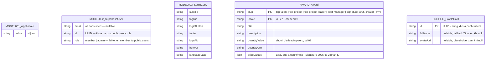

# Entities

**Project**: SAA 2025 — Login
**Generated**: 2026-09-06

> **Honest-scope note**: repo này không dùng ORM (không có ORM model) — schema CSDL được định nghĩa bằng SQL migrations committed tại `supabase/migrations/` trong chính repo này (`0001_users_table.sql`, `0002_handle_new_user_trigger.sql`, `0003_awards_table.sql`, `0005_profile_cards_view.sql`; xem `README.md` § Database). Persistence chạy qua một Supabase stack khởi động bằng `supabase start` từ repo root (`project_id` `saa-app`, API `http://127.0.0.1:55321`) — ngoài các migration, thứ duy nhất app tự đọc qua code là session/user object trả về từ `@supabase/ssr`, cộng (từ F003_Homepage) một cột `role` đọc qua PostgREST từ bảng `public.users` (schema ở `0001_users_table.sql`), cộng (từ F004_AwardSystemPage) bảng thứ 2, `public.awards` (schema ở `0003_awards_table.sql`), đọc read-only qua DAL `src/dal/awards.ts`, cộng (từ F006_ProfilePage) view thứ 3, `public.profile_cards` (schema ở `0005_profile_cards_view.sql`, phái sinh từ `public.users`, KHÔNG phải bảng độc lập), đọc read-only qua DAL `src/dal/profile-cards.ts`. `/todo` chỉ là placeholder chứng minh auth guard, không có entity todo thật (`app/todo/page.tsx:6-16`). Vì vậy ERD dưới đây liệt kê 5 **data shape** thật sự tồn tại trong source (2 do repo định nghĩa qua code app, 1 do SDK định nghĩa và chỉ bị đọc một phần field, 2 do repo định nghĩa qua SQL migration và đọc trọn vẹn read-only) — không có bảng, cột, hay migration nào bị bịa ra.

## Entity Relationship Diagram

Không vẽ đường quan hệ (FK) nào — cả 3 shape đều độc lập, không entity nào tham chiếu entity khác qua khóa ngoại. Xem mục **Relationships** của từng entity bên dưới để biết cách chúng được *dùng* (không phải *liên kết CSDL*).

## Entities

### MODEL001_AppLocale

**Description**: Locale hợp lệ duy nhất mà app hỗ trợ — không phải bảng CSDL, mà là một union type + hằng số module-level, là "chốt chặn" duy nhất mọi giá trị locale (cookie, tham số Server Action) phải đi qua trước khi được dùng. Nguồn: `lib/i18n/locale.ts:9-14` (`SUPPORTED_LOCALES`, `AppLocale`, `DEFAULT_LOCALE`), `lib/i18n/locale.ts:28-31` (`LOCALE_LABEL`).

| Attribute | Type | Constraints | Description |
|-----------|------|-------------|-------------|
| value | `"vi" \| "en"` | enum(2), NOT NULL | Mã locale — chỉ 2 giá trị hợp lệ (`lib/i18n/locale.ts:9`) |

**Relationships**:
- None (không có FK). Được *tham chiếu như kiểu field* trong 2 props shape khác — `LoginClientProps.locale` (`app/login/login-client.tsx:10`) và `LanguageSelectorProps` (`components/login/language-selector.tsx:7,13`) — đây là type-level reuse, không phải quan hệ entity-entity của ERD.

**Discriminator Fields**:

| Field | DISC-### | Values | Description |
|-------|----------|--------|-------------|
| value | DISC-001 | vi, en | `vi` = tiếng Việt (mặc định khi cookie thiếu/rỗng/không hợp lệ), `en` = tiếng Anh — mỗi giá trị chọn ra một message bundle khác nhau (`i18n/request.ts:21`, `import(../messages/${locale}.json)`) và một nhãn hiển thị khác nhau trên language selector (`lib/i18n/locale.ts:28-31`, `LOCALE_LABEL`: "VN"/"EN") |

---

### MODEL002_SupabaseUser

**Description**: Object user trả về từ `supabase.auth.getUser()` — **không do repo này định nghĩa** (kiểu gốc thuộc `@supabase/supabase-js`, được `@supabase/ssr` re-export qua `createClient()`/`createProxyClient()`). Repo chỉ *đọc*, không lưu lại bản sao nào. Grep toàn repo (`app`, `components`, `lib`) xác nhận 2 field từng được truy cập: `user.email` (`app/todo/page.tsx:34`, `t("greeting", { email: user.email ?? "" })`) và `user.id` (`app/page.tsx:161`, truyền vào `getUserRole(supabase, userId)`). Sự tồn tại (truthy) của `user` — không phải field nào của nó — cũng được dùng làm điều kiện rẽ nhánh tại `proxy.ts:36,40` và `app/todo/page.tsx:26-28`.

**Cập nhật 2026-09-06 (F003_Homepage)**: `id` của user nay được dùng để đọc thêm `role` từ bảng `public.users` (bảng riêng, KHÔNG phải trường của object `User` gốc — xem dòng `role` bên dưới, đánh dấu nguồn khác biệt).

| Attribute | Type (as consumed) | Constraints | Description |
|-----------|------|-------------|-------------|
| email | `string \| undefined` (thực tế code: `user.email ?? ""`) | nullable | Email hiển thị trong lời chào ở `/todo` (`app/todo/page.tsx:34`) và trong `HeaderViewer.email` ở SCR003_HomeScreen (`app/page.tsx:162`) |
| id | `string` (UUID) | NOT NULL | Khoá tra cứu `public.users.role` — truyền vào `getUserRole(supabase, userId)` (`app/page.tsx:161`, `lib/auth/get-user-role.ts:49-67`) |
| role *(nguồn khác — `public.users`, không phải field gốc của `User`)* | `"member" \| "admin"` (as consumed) | fail-open `"member"` khi lỗi/không có row | Đọc qua `lib/auth/get-user-role.ts:49-68` (`getUserRole`) bằng client PostgREST hẹp `lib/supabase/users-role-client.ts` (`toUsersRoleClient` — shim thu hẹp `@supabase/ssr` server client về đúng slice `.from("users").select("role").eq("id",…).maybeSingle()`, tránh lỗi TS2589 "type instantiation is excessively deep" khi so khớp kiểu SDK trực tiếp). Quyết định `HeaderViewer.isAdmin` (`role === "admin"`) — chỉ ẩn/hiện mục "Trang quản trị" trong menu tài khoản, KHÔNG phải một authorization gate (xem `permissions-matrix.md § Role-based screen-permission`) |

Các field khác của kiểu `User` thật (vd. `user_metadata`, `app_metadata`, `aud`, `created_at`, ...) tồn tại trên SDK nhưng **không có dòng code nào trong repo đọc chúng** — không liệt kê để tránh bịa cột.

**Relationships**:
- None — object này không được persist lại bởi repo (không bảng nào giữ FK trỏ tới nó); nó được lấy lại mỗi request từ session Supabase (`lib/supabase/server.ts:16-42`, `lib/supabase/proxy-client.ts:13-31`, `lib/supabase/client.ts:13-18`).
- `role` được join thủ công (không phải FK trong ERD — đọc bằng 2 lời gọi Supabase riêng biệt trong cùng 1 request): `getUser()` lấy `id`, rồi `getUserRole(toUsersRoleClient(supabase), id)` query `public.users` dưới RLS own-row (JWT của chính user). Không có API nào trong app trả role của người khác.

**Discriminator Fields**:

| Field | DISC-### | Values | Description |
|-------|----------|--------|-------------|
| role | DISC-002 | member, admin | `member` = mặc định/fail-open (không thấy mục "Trang quản trị"); `admin` = thấy thêm mục "Trang quản trị" (`/admin`, route chưa implement) trong menu tài khoản của SCR003_HomeScreen (`lib/auth/get-user-role.ts:14`, `components/home/account-menu.tsx`) |

---

### MODEL003_LoginCopy

**Description**: Content contract cho copy tĩnh của màn `/login` (mm:662:14387) — **không phải domain/persisted data**, mà là bản copy mặc định (giá trị `vi`, đúng nguyên văn Figma `characters`) được truyền xuống làm props; bản dịch `en` do next-intl cung cấp riêng (Track B, xem `clarifications.md`). Đưa vào đây theo đúng yêu cầu honest-scope vì nó là structured data shape có thật, không phải vì nó là bảng CSDL. Nguồn: `components/login/login-copy.ts:7-15` (type `LoginCopy` + hằng số `defaultLoginCopy`).

| Attribute | Type | Constraints | Description |
|-----------|------|-------------|-------------|
| subtitle | string | NOT NULL | Dòng phụ đề dưới logo |
| tagline | string | NOT NULL | Câu tagline mời đăng nhập |
| loginButton | string | NOT NULL | Label nút Google login |
| footer | string | NOT NULL | Dòng bản quyền cuối trang |
| logoAlt | string | NOT NULL | Alt text ảnh logo |
| heroAlt | string | NOT NULL | Alt text ảnh hero |
| languageLabel | string | NOT NULL | Nhãn mặc định của language selector ("VN") |

**Relationships**:
- None (presentational prop, không phải entity được persist). Được truyền làm prop `copy` vào `LoginClient` (`app/login/login-client.tsx:9,40`).

**Discriminator Fields**: None.

---

### AWARD_Award

**Description**: 6 hạng mục giải thưởng SAA 2025 hiển thị trên `/awards` (F004_AwardSystemPage) — bảng THỨ 2 mà repo đọc từ Supabase `saa-app` (sau `public.users`), read-only, không tham chiếu entity nào khác. Nguồn: `src/dal/awards.ts` (`Award`, `getAwards`), migration `supabase/migrations/0003_awards_table.sql` (đã shipped, committed trong chính repo này — áp bằng `supabase migration up`).

| Attribute | Type (as consumed) | Constraints | Description |
|-----------|------|-------------|-------------|
| slug | `string` | PK (cùng `locale`), NOT NULL | Định danh hạng mục — 1 trong 6 giá trị cố định, cũng là `id` của `<section>` và `href="#<slug>"` của nav |
| locale | `"vi" \| "en"` | PK (cùng `slug`), NOT NULL | Chỉ có dòng `vi` được seed; `en` để trống (D002, chưa có bản dịch) |
| title | `string` | NOT NULL | Tên hạng mục giải, hiển thị ở `<h2>` và nav |
| description | `string` | NOT NULL | Mô tả đầy đủ, `white-space: pre-line` (giữ đoạn ngắt) |
| quantityValue | `string` (không phải số) | NOT NULL | Giữ nguyên leading-zero (`"02"`, `"01"`) — ép kiểu số sẽ mất số 0 đứng đầu |
| quantityUnit | `string` | NOT NULL | "Cá nhân" / "Tập thể" / "Cá nhân hoặc tập thể" |
| prizeValues | `{amount: string, note: string}[]` | NOT NULL, jsonb ở DB | 5 hạng mục có 1 phần tử; Signature 2025 có 2 (cá nhân + tập thể); `note` rỗng nghĩa là "không có dòng chú" |

**Relationships**:
- None — bảng độc lập, không FK vào/từ `public.users` hay entity nào khác. Đọc qua client hẹp `toAwardsClient` (`src/dal/awards-client.ts`), lọc theo `locale`, sắp theo `sort_order` (không phải attribute hiển thị, chỉ dùng để `ORDER BY` phía server).

**Discriminator Fields**: None — `locale` là khoá lọc kèm `slug` (composite PK), không phải nhánh hành vi.

---

### PROFILE_ProfileCard

**Description**: Hồ sơ hiển thị trên `/profile` (F006_ProfilePage) — KHÔNG phải một bảng CSDL độc
lập, mà là view `public.profile_cards` (migration `0005_profile_cards_view.sql`) phái sinh 1-1 từ
`public.users`, phơi ra ĐÚNG 3 cột. View chạy với quyền của owner (`security_invoker = false`,
role `BYPASSRLS`) để bỏ qua RLS own-row (`users_select_own`) của `public.users` — cho phép bất kỳ
Sunner đã đăng nhập nào đọc 3 cột này của BẤT KỲ hàng nào, trong khi `email`/`role`/`locale`/
`created_at`/`updated_at` không bao giờ lọt qua (`REVOKE ALL` rồi chỉ `GRANT SELECT` cho
`authenticated`, không `anon`). Nguồn: `src/dal/profile-cards.ts` (`ProfileCard`,
`getProfileCard`), `supabase/migrations/0005_profile_cards_view.sql`.

| Attribute | Type (as consumed) | Constraints | Description |
|-----------|------|-------------|-------------|
| id | `string` (UUID) | PK, NOT NULL | Trùng `id` của hàng `public.users` tương ứng — khoá tra cứu duy nhất, dùng cho cả nhánh self và other |
| fullName | `string \| null` | nullable | Tên hiển thị ở hero (`ProfileHero`); `null` → fallback `copy.hero.fallbackName` ("Sunner") |
| avatarUrl | `string \| null` | nullable | Ảnh avatar tròn; `null` → placeholder nền `#323231`, không ảnh |

**Relationships**:
- None trong ERD (không vẽ FK) — nhưng `id` phái sinh 1-1 từ `MODEL002_SupabaseUser.id`/
  `public.users.id` qua view `profile_cards`; đọc bằng client hẹp `toProfileCardsClient`
  (`src/dal/profile-cards-client.ts`), cùng shim pattern `toAwardsClient`/`toUsersRoleClient`
  (tránh lỗi TS2589).

**Discriminator Fields**: None.

**Fail-open note**: `getProfileCard` fail-open trả `null` khi Supabase lỗi HOẶC không có hàng khớp
`id` — cả 2 nguyên nhân dẫn tới cùng `notFound()` phía caller (`page.tsx`); không phải một quyết
định phân quyền, xem `docs/vi/system/permissions.md` § Special Conditions.

---

## Validation Rules

### AppLocale

| Rule | Field | Constraint | Error Message |
|------|-------|------------|---------------|
| Locale whitelist | value | Phải thuộc `SUPPORTED_LOCALES` (`isSupportedLocale`, `lib/i18n/locale.ts:34-39`) | N/A — không throw lỗi; giá trị sai được `normalizeLocale` (`lib/i18n/locale.ts:49-51`) âm thầm thay bằng `DEFAULT_LOCALE` ("vi"), không có message hiển thị cho user |

### SupabaseUser

No data. (Không có validation rule nào do repo này định nghĩa — xác thực identity/session thuộc về Supabase GoTrue, một hệ thống ngoài repo.)

### LoginCopy

No data. (Object hằng số tĩnh, không qua runtime validation nào.)

### Award

| Rule | Field | Constraint | Error Message |
|------|-------|------------|---------------|
| Locale check | locale | `CHECK (locale IN ('vi', 'en'))` ở DB (`0003_awards_table.sql`) | N/A — ràng buộc DB, app chỉ đọc, không ghi nên không kích hoạt |
| Fail-open | (toàn bộ hàng) | `getAwards` fail-open trả `[]` khi Supabase lỗi/không có dòng — không throw | N/A — không có message, trang render empty-state |

### ProfileCard

No data. (Không có CHECK constraint nào ở view `profile_cards` — kế thừa nguyên vẹn ràng buộc của
`public.users`, app chỉ đọc read-only qua view.) `getProfileCard` fail-open trả `null` khi Supabase
lỗi HOẶC không có hàng khớp `id` — không throw; caller chuyển thành `notFound()`, không có message
hiển thị riêng.

---

## Summary

- **Total Entities**: 5 (2 shape đọc read-only từ Supabase bởi repo — bảng `public.awards`, view `public.profile_cards`; 3 còn lại là in-memory/type-level shape, không bảng/view nào trong số đó được persist bởi repo này)
- **Total Relationships**: 0 (không có FK nào giữa 5 shape trong ERD; `profile_cards.id` phái sinh 1-1 từ `public.users.id` nhưng không vẽ FK — xem ghi chú "as field type"/"Relationships" trong từng mục ở trên)
