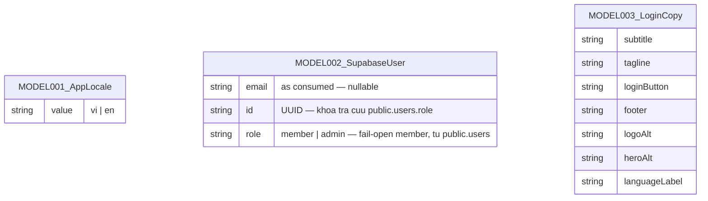

# Entities

**Project**: SAA 2025 — Login
**Generated**: 2026-09-06

> **Honest-scope note**: repo này không sở hữu schema CSDL nào (không có ORM model, không có migration). Toàn bộ persistence nghiệp vụ nằm ở một instance Supabase local bên ngoài repo (`saa-app`, `http://127.0.0.1:55321`) — thứ duy nhất app đọc được từ đó là session/user object trả về từ `@supabase/ssr`, cộng (từ F003_Homepage) một cột `role` đọc qua PostgREST từ bảng `public.users` mà repo không sở hữu schema. `/todo` chỉ là placeholder chứng minh auth guard, không có entity todo thật (`app/todo/page.tsx:6-16`). Vì vậy ERD dưới đây liệt kê 3 **data shape** thật sự tồn tại trong source (2 do repo định nghĩa, 1 do SDK/bảng ngoài định nghĩa và chỉ bị đọc một phần) — không có bảng, cột, hay migration nào bị bịa ra.

## Entity Relationship Diagram

Không vẽ đường quan hệ (FK) nào — cả 3 shape đều độc lập, không entity nào tham chiếu entity khác qua khóa ngoại. Xem mục **Relationships** của từng entity bên dưới để biết cách chúng được *dùng* (không phải *liên kết CSDL*).

## Entities

### MODEL001_AppLocale

**Description**: Locale hợp lệ duy nhất mà app hỗ trợ — không phải bảng CSDL, mà là một union type + hằng số module-level, là "chốt chặn" duy nhất mọi giá trị locale (cookie, tham số Server Action) phải đi qua trước khi được dùng. Nguồn: `lib/i18n/locale.ts:9-14` (`SUPPORTED_LOCALES`, `AppLocale`, `DEFAULT_LOCALE`), `lib/i18n/locale.ts:28-31` (`LOCALE_LABEL`).

| Attribute | Type | Constraints | Description |
|-----------|------|-------------|-------------|
| value | `"vi" \| "en"` | enum(2), NOT NULL | Mã locale — chỉ 2 giá trị hợp lệ (`lib/i18n/locale.ts:9`) |

**Relationships**:
- None (không có FK). Được *tham chiếu như kiểu field* trong 2 props shape khác — `LoginClientProps.locale` (`app/login/login-client.tsx:10`) và `LanguageSelectorProps` (`components/login/language-selector.tsx:7,13`) — đây là type-level reuse, không phải quan hệ entity-entity của ERD.

**Discriminator Fields**:

| Field | DISC-### | Values | Description |
|-------|----------|--------|-------------|
| value | DISC-001 | vi, en | `vi` = tiếng Việt (mặc định khi cookie thiếu/rỗng/không hợp lệ), `en` = tiếng Anh — mỗi giá trị chọn ra một message bundle khác nhau (`i18n/request.ts:21`, `import(../messages/${locale}.json)`) và một nhãn hiển thị khác nhau trên language selector (`lib/i18n/locale.ts:28-31`, `LOCALE_LABEL`: "VN"/"EN") |

---

### MODEL002_SupabaseUser

**Description**: Object user trả về từ `supabase.auth.getUser()` — **không do repo này định nghĩa** (kiểu gốc thuộc `@supabase/supabase-js`, được `@supabase/ssr` re-export qua `createClient()`/`createProxyClient()`). Repo chỉ *đọc*, không lưu lại bản sao nào. Grep toàn repo (`app`, `components`, `lib`) xác nhận 2 field từng được truy cập: `user.email` (`app/todo/page.tsx:34`, `t("greeting", { email: user.email ?? "" })`) và `user.id` (`app/page.tsx:161`, truyền vào `getUserRole(supabase, userId)`). Sự tồn tại (truthy) của `user` — không phải field nào của nó — cũng được dùng làm điều kiện rẽ nhánh tại `proxy.ts:36,40` và `app/todo/page.tsx:26-28`.

**Cập nhật 2026-09-06 (F003_Homepage)**: `id` của user nay được dùng để đọc thêm `role` từ bảng `public.users` (bảng riêng, KHÔNG phải trường của object `User` gốc — xem dòng `role` bên dưới, đánh dấu nguồn khác biệt).

| Attribute | Type (as consumed) | Constraints | Description |
|-----------|------|-------------|-------------|
| email | `string \| undefined` (thực tế code: `user.email ?? ""`) | nullable | Email hiển thị trong lời chào ở `/todo` (`app/todo/page.tsx:34`) và trong `HeaderViewer.email` ở SCR003_HomeScreen (`app/page.tsx:162`) |
| id | `string` (UUID) | NOT NULL | Khoá tra cứu `public.users.role` — truyền vào `getUserRole(supabase, userId)` (`app/page.tsx:161`, `lib/auth/get-user-role.ts:49-67`) |
| role *(nguồn khác — `public.users`, không phải field gốc của `User`)* | `"member" \| "admin"` (as consumed) | fail-open `"member"` khi lỗi/không có row | Đọc qua `lib/auth/get-user-role.ts:49-68` (`getUserRole`) bằng client PostgREST hẹp `lib/supabase/users-role-client.ts` (`toUsersRoleClient` — shim thu hẹp `@supabase/ssr` server client về đúng slice `.from("users").select("role").eq("id",…).maybeSingle()`, tránh lỗi TS2589 "type instantiation is excessively deep" khi so khớp kiểu SDK trực tiếp). Quyết định `HeaderViewer.isAdmin` (`role === "admin"`) — chỉ ẩn/hiện mục "Trang quản trị" trong menu tài khoản, KHÔNG phải một authorization gate (xem `permissions-matrix.md § Role-based screen-permission`) |

Các field khác của kiểu `User` thật (vd. `user_metadata`, `app_metadata`, `aud`, `created_at`, ...) tồn tại trên SDK nhưng **không có dòng code nào trong repo đọc chúng** — không liệt kê để tránh bịa cột.

**Relationships**:
- None — object này không được persist lại bởi repo (không bảng nào giữ FK trỏ tới nó); nó được lấy lại mỗi request từ session Supabase (`lib/supabase/server.ts:16-42`, `lib/supabase/proxy-client.ts:13-31`, `lib/supabase/client.ts:13-18`).
- `role` được join thủ công (không phải FK trong ERD — đọc bằng 2 lời gọi Supabase riêng biệt trong cùng 1 request): `getUser()` lấy `id`, rồi `getUserRole(toUsersRoleClient(supabase), id)` query `public.users` dưới RLS own-row (JWT của chính user). Không có API nào trong app trả role của người khác.

**Discriminator Fields**:

| Field | DISC-### | Values | Description |
|-------|----------|--------|-------------|
| role | DISC-002 | member, admin | `member` = mặc định/fail-open (không thấy mục "Trang quản trị"); `admin` = thấy thêm mục "Trang quản trị" (`/admin`, route chưa implement) trong menu tài khoản của SCR003_HomeScreen (`lib/auth/get-user-role.ts:14`, `components/home/account-menu.tsx`) |

---

### MODEL003_LoginCopy

**Description**: Content contract cho copy tĩnh của màn `/login` (mm:662:14387) — **không phải domain/persisted data**, mà là bản copy mặc định (giá trị `vi`, đúng nguyên văn Figma `characters`) được truyền xuống làm props; bản dịch `en` do next-intl cung cấp riêng (Track B, xem `clarifications.md`). Đưa vào đây theo đúng yêu cầu honest-scope vì nó là structured data shape có thật, không phải vì nó là bảng CSDL. Nguồn: `components/login/login-copy.ts:7-15` (type `LoginCopy` + hằng số `defaultLoginCopy`).

| Attribute | Type | Constraints | Description |
|-----------|------|-------------|-------------|
| subtitle | string | NOT NULL | Dòng phụ đề dưới logo |
| tagline | string | NOT NULL | Câu tagline mời đăng nhập |
| loginButton | string | NOT NULL | Label nút Google login |
| footer | string | NOT NULL | Dòng bản quyền cuối trang |
| logoAlt | string | NOT NULL | Alt text ảnh logo |
| heroAlt | string | NOT NULL | Alt text ảnh hero |
| languageLabel | string | NOT NULL | Nhãn mặc định của language selector ("VN") |

**Relationships**:
- None (presentational prop, không phải entity được persist). Được truyền làm prop `copy` vào `LoginClient` (`app/login/login-client.tsx:9,40`).

**Discriminator Fields**: None.

---

## Validation Rules

### AppLocale

| Rule | Field | Constraint | Error Message |
|------|-------|------------|---------------|
| Locale whitelist | value | Phải thuộc `SUPPORTED_LOCALES` (`isSupportedLocale`, `lib/i18n/locale.ts:34-39`) | N/A — không throw lỗi; giá trị sai được `normalizeLocale` (`lib/i18n/locale.ts:49-51`) âm thầm thay bằng `DEFAULT_LOCALE` ("vi"), không có message hiển thị cho user |

### SupabaseUser

No data. (Không có validation rule nào do repo này định nghĩa — xác thực identity/session thuộc về Supabase GoTrue, một hệ thống ngoài repo.)

### LoginCopy

No data. (Object hằng số tĩnh, không qua runtime validation nào.)

---

## Summary

- **Total Entities**: 3 (0 bảng CSDL thật — cả 3 đều là in-memory/type-level shape, không có bảng nào được persist bởi repo này)
- **Total Relationships**: 0 (không có FK nào giữa 3 shape; xem ghi chú "as field type" trong từng mục Relationships ở trên)
