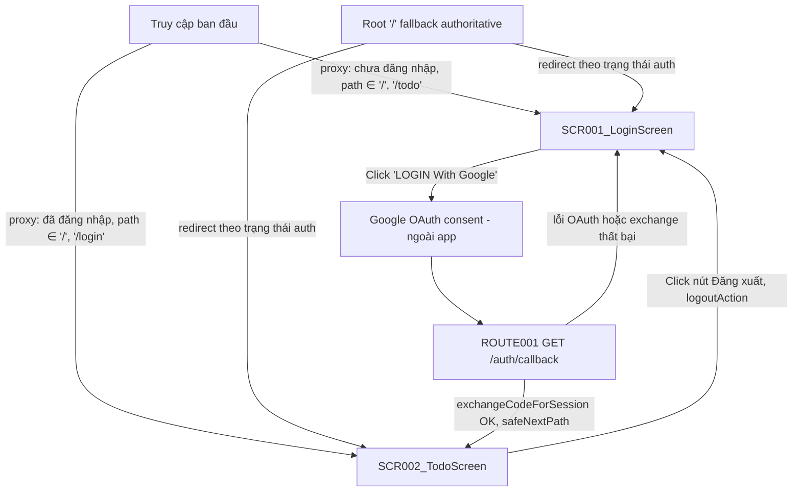
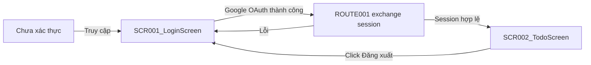

# Screen Flow

**Project**: agentic-coding-hands-on
**Generated**: 2026-09-05
**Analysis Scope**: route-view (Next.js 16 App Router) — 2 screens (`/login`, `/todo`) + 1 backend route (`/auth/callback`) + proxy guard layer

**Code Format**: All SCR codes MUST follow `SCR###_NameSlug` format (e.g., SCR001_LoginForm, SCR002_Dashboard) | `SCR###/REG###` for region-scoped transitions

## Navigation Map



## Feature Entry Points

### F001_GoogleOAuthLogin

- **Entry screen**: SCR001_LoginScreen — `/login`
- **Owned screens**:
  - SCR001_LoginScreen — `/login` (atomic)
  - SCR002_TodoScreen — `/todo` (atomic)
- **Exit screens**: SCR002_TodoScreen (on successful Google OAuth) → SCR001_LoginScreen (on logout)

### F002_LanguageSwitch

- **Entry screen**: SCR001_LoginScreen — `/login`
- **Owned screens**:
  - SCR001_LoginScreen (partial-scope: chỉ vùng LanguageSelector trong header — SCR001 không phát sinh REG### vì screen được phân loại atomic, nên tham chiếu dùng mã bare SCR001, không bịa `SCR001/REG###`) — `/login` (atomic)
- **Exit screens**: none (không điều hướng sang screen khác; chọn ngôn ngữ chỉ re-render tại chỗ)

---

## Screen Access Paths

| From Screen | To Screen | Action/Trigger | Conditions | Region |
|-------------|-----------|----------------|------------|--------|
| Start | SCR001_LoginScreen | Initial load / proxy redirect | Chưa đăng nhập, path ∈ `/`, `/todo`; hoặc truy cập `/login` trực tiếp | |
| Start | SCR002_TodoScreen | Initial load / proxy redirect | Đã đăng nhập, path ∈ `/`, `/login`; hoặc truy cập `/todo` trực tiếp | |
| SCR001_LoginScreen | SCR002_TodoScreen | Click "LOGIN With Google" → Google OAuth thành công → ROUTE001 exchange thành công | `signInWithOAuth` không lỗi, `code` hợp lệ, `exchangeCodeForSession` không lỗi | |
| ROUTE001 (`/auth/callback`) | SCR001_LoginScreen | Redirect khi có `?error` hoặc exchange thất bại | `error` param có giá trị, hoặc thiếu cả `code` lẫn `error` | |
| SCR002_TodoScreen | SCR001_LoginScreen | Click nút đăng xuất (submit `logoutAction`) | Luôn xảy ra, kể cả khi `signOut()` lỗi | |
| SCR002_TodoScreen | SCR001_LoginScreen | Guard xác thực `getUser()` thất bại | `!user` (không có session hợp lệ) | |

> Region column: để trống — app này không có REG### nào (xem screen-list.md).

## Screen Transitions

### SCR001_LoginScreen (Login)

**Entry Points**:
- Truy cập URL trực tiếp `/login` (chưa đăng nhập)
- Redirect từ `proxy.ts` khi path ∈ `/`, `/todo` và chưa đăng nhập
- Redirect từ ROUTE001 (`/auth/callback`) khi OAuth lỗi hoặc exchange thất bại (`?error=...`)

**Exit Points**:
- Đến SCR002_TodoScreen: OAuth Google thành công → ROUTE001 exchange session thành công → `safeNextPath` (mặc định `/todo`)

**Decision Points**:
- `getAuthenticatedUser()` (fail OPEN, `app/login/page.tsx:73-83`): nếu đã có `user` → redirect `/todo` ngay trước khi render; lỗi Supabase (catch) → coi như chưa đăng nhập, vẫn render `/login`

---

### SCR002_TodoScreen (Todo)

**Entry Points**:
- Redirect từ ROUTE001 sau OAuth thành công
- Redirect từ `proxy.ts` khi path ∈ `/`, `/login` và đã đăng nhập
- Truy cập URL trực tiếp `/todo` nếu đã đăng nhập

**Exit Points**:
- Đến SCR001_LoginScreen: click nút đăng xuất (`logoutAction` — luôn redirect dù `signOut()` thành công hay lỗi)
- Đến SCR001_LoginScreen: guard `getUser()` phát hiện không có session hợp lệ

**Decision Points**:
- `getUser()` (fail CLOSED, `app/todo/page.tsx:21-28`): `!user` → redirect `/login` ngay trước khi render

---

## Region Transitions

`N/A — không có REG### nào trong app này (cả SCR001 và SCR002 đều atomic — xem screen-list.md § Composite classification).`

---

## Authentication Flow



| Screen | Authentication Required | Authorization Level |
|--------|------------------------|-------------------|
| SCR001_LoginScreen | Không (nhưng tự redirect sang `/todo` nếu đã có session) | Public |
| SCR002_TodoScreen | Có | User (bất kỳ user Supabase hợp lệ nào — không phân role) |

---

## Error Handling Flows

| Screen | Error | Handling | Scope |
|--------|-------|----------|-------|
| SCR001_LoginScreen | OAuth provider trả `?error`/`?error_description` (Google/GoTrue hủy hoặc lỗi) | Redirect `/login?error=...`; server đọc `?error` (bất kể giá trị) và hiển thị 1 thông báo cố định đã dịch (không render raw value) | screen |
| SCR001_LoginScreen | `exchangeCodeForSession` thất bại hoặc thiếu cả `code` lẫn `error` | Redirect `/login?error=auth_code_error` | screen |
| SCR001_LoginScreen | `signInWithOAuth()` (phía client) trả lỗi hoặc throw | `clientError` state bật → hiển thị cùng thông báo cố định qua `LoginErrorAlert`, không cần round-trip `?error=` | screen |
| SCR002_TodoScreen | `supabase.auth.getUser()` không có session | Redirect `/login` (fail closed) | screen |
| SCR002_TodoScreen | `signOut()` lỗi (session đã hết hạn phía server) | Bỏ qua lỗi (best-effort), vẫn redirect `/login` | screen |

> Scope values: `screen` (không có REG### trong app này nên không có case `region:REG###`).

---

## Circular Dependencies Check

- [x] No circular dependencies detected — SCR001 ⇄ SCR002 là chu trình login/logout hợp lệ, mỗi chiều có trigger/điều kiện riêng biệt (không phải vòng lặp vô hạn)
- [x] All screens have valid entry/exit points
- [x] All navigation paths terminate

---

## Guard Logic

### GUARD-001 — Optimistic auth redirect (proxy layer) trên `/`, `/login`, `/todo/:path*`
**trigger:** `proxy` (Next 16, tên cũ `middleware`)
**source:** `proxy.ts:21-41`
**logic:**
```pseudo
if (user && path ∈ {"/", "/login"}) → redirect /todo (giữ cookie đã refresh)
if (!user && path ∈ {"/", "/todo"}) → redirect /login (giữ cookie đã refresh)
else → pass-through
```
**failure path:** lỗi gọi Supabase (`getUserOrNull` catch) → coi như `user = null`, không 500 toàn site

---

### GUARD-002 — Authoritative already-authenticated check trên `/login` (fail OPEN)
**trigger:** Server Component render (trước khi trả JSX)
**source:** `app/login/page.tsx:31-34,73-83`
**logic:**
```pseudo
try { user = await supabase.auth.getUser() } catch { user = null }
if (user) → redirect /todo
```
**failure path:** lỗi Supabase → `user = null` → vẫn render `/login` (fail OPEN, khác `/todo`)

---

### GUARD-003 — Authoritative auth guard trên `/todo` (fail CLOSED)
**trigger:** Server Component render
**source:** `app/todo/page.tsx:21-28`
**logic:**
```pseudo
user = await supabase.auth.getUser()
if (!user) → redirect /login
```
**failure path:** không có session hợp lệ (kể cả lỗi gọi Supabase) → redirect `/login`

---

### GUARD-004 — Root `/` fallback authoritative redirect
**trigger:** Server Component render (route không tự render UI)
**source:** `app/page.tsx:10-17`
**logic:**
```pseudo
user = await supabase.auth.getUser()
redirect(user ? "/todo" : "/login")
```
**failure path:** không có UI riêng để fail vào — luôn redirect theo kết quả `getUser()`

---

## Deep-Link State Restoration

### SCR001_LoginScreen
**URL pattern:** `/login?error={value}`
**State restored:**

| Param | Restores | Default if missing |
|-------|----------|--------------------|
| error | Hiển thị `LoginErrorAlert` (thông báo lỗi cố định, đã dịch) | Không hiển thị (`null`) |

**Failure mode:** bất kỳ giá trị `error` non-empty nào (kể cả mảng do Next.js parse `?error=` lặp lại) đều bật CÙNG một thông báo cố định — giá trị thô không bao giờ được render (an toàn XSS nhưng không mô tả chi tiết lỗi thật).

> Ghi chú (ngoài phạm vi SCR, không tự render UI): `ROUTE001 GET /auth/callback?next={path}` — param `next` phục hồi đích redirect sau đăng nhập qua `safeNextPath()` (`lib/supabase/next-path.ts`); giá trị không hợp lệ/không an toàn (không bắt đầu bằng đúng 1 `/`, chứa `://`, `//`, hoặc control-char/line-separator thô hay percent-encoded) sẽ fallback về `/todo`.

---

## Unsaved-Changes Protection

`N/A — no unsaved-changes guards detected.` Không có form nào giữ input người dùng cần bảo vệ khi rời trang — `/login` không có input tự nhập (chỉ nút OAuth + dropdown ngôn ngữ), `/todo` chỉ có 1 nút submit đăng xuất.

---

## Extraction Signatures

Framework-agnostic identifier patterns for locating the above constructs.

### Guard Logic
Function/method definitions tied to a route: `beforeEnter|canActivate|middleware|loader|before_action|authenticate|authorize` — check if called from a router config or route registration. Trong repo này: `proxy()` export trong `proxy.ts` (Next 16 proxy convention) + guard nội tuyến (`getAuthenticatedUser`/`getUser`) ở đầu mỗi Server Component `page.tsx`.

### Deep-Link State Restoration
URL param reads at component mount synced to state: `useSearchParams|useQuery|router\.query|URLSearchParams|params\[|$route\.query` — trong repo này là `searchParams` Promise prop của Server Component (`app/login/page.tsx`) và `new URL(request.url).searchParams` trong Route Handler (`app/auth/callback/route.ts`), không phải hook client-side.

### Unsaved-Changes Protection
`beforeunload|onbeforeunload|usePrompt|useBeforeUnload|leaveGuard|isDirty|formState\.isDirty|data-turbo-confirm` — không tìm thấy pattern nào trong repo.
