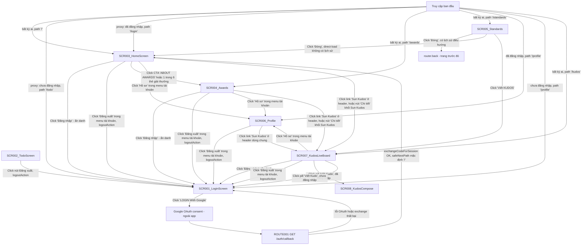
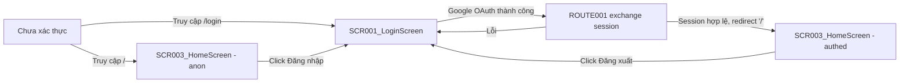

# Screen Flow

**Project**: agentic-coding-hands-on
**Generated**: 2026-09-06
**Analysis Scope**: route-view (Next.js 16 App Router) — 7 routes (`/`, `/awards`, `/kudos`, `/login`, `/profile`, `/standards`, `/todo`) + 8 screens (thêm SCR008_KudosCompose — dialog trên `/kudos`, không route riêng, F009_KudosCompose) + 1 backend route (`/auth/callback`) + proxy guard layer

**Code Format**: All SCR codes MUST follow `SCR###_NameSlug` format (e.g., SCR001_LoginForm, SCR002_Dashboard) | `SCR###/REG###` for region-scoped transitions

## Navigation Map



> `/` không còn là fallback redirect — `app/page.tsx` nay TỰ RENDER SCR003_HomeScreen cho mọi actor (PERM001_RootRouteGuard đã superseded, xem `permissions-matrix.md`). SCR002_TodoScreen chỉ còn tới được bằng truy cập URL `/todo` trực tiếp khi đã đăng nhập — không còn đường điều hướng tự động nào (proxy/OAuth thành công/root fallback) đưa tới đó nữa. Từ 2026-09-06 (F004_AwardSystemPage): `/awards` (SCR004_Awards) cũng PUBLIC, không guard — tới được bằng URL trực tiếp hoặc từ 6 link trên SCR003_HomeScreen (CTA "ABOUT AWARDS" + 6 thẻ giải thưởng, trước đây trỏ tới route chưa tồn tại). Từ 2026-09-07 (F005_StandardsRulesPage): `/standards` (SCR005_Standards) cũng PUBLIC, không guard, và KHÔNG có header/footer nào (khác SCR003/SCR004) — tới được bằng URL trực tiếp hoặc link "Tiêu chuẩn chung" ở footer của bất kỳ trang nào; nút "Đóng" thoát bằng `router.back()` khi có lịch sử điều hướng, hoặc `push("/")` khi direct-load (không có lịch sử trong tab). Từ 2026-09-07 đợt 2 (F006_ProfilePage): `/profile` (SCR006_Profile) là route PROTECTED mới — gác bởi ĐÚNG `(protected)/layout.tsx` mà SCR002_TodoScreen dùng (danh sách `PROTECTED_ROUTES` mở rộng, không phải gate riêng); tới được bằng click "Hồ sơ" trong menu tài khoản của SCR003/SCR004, hoặc URL trực tiếp (`?id={uuid}` cho hồ sơ người khác) khi đã đăng nhập — chưa đăng nhập thì redirect `/login` giống hệt `/todo`. Từ 2026-09-07 đợt 3 (F007_KudosLiveBoard + F008_KudosHeartReaction): `/kudos` (SCR007_KudosLiveBoard) cũng PUBLIC, không guard, dùng chung `SiteHeader`/`SiteFooter` với SCR003/SCR004/SCR006 — tới được bằng URL trực tiếp, bằng link "Sun Kudos" trên `SiteHeader` (hiện diện trên mọi trang dùng `SiteHeader`: SCR003, SCR004, SCR006), nút "Chi tiết" của khối `KudosSection` (SCR003, SCR004 — SCR006 KHÔNG có khối này), `WidgetButton` (chỉ trên SCR003), hoặc nút "Viết KUDOS" trên SCR005 (route duy nhất không dùng `SiteHeader` nhưng vẫn có 1 link riêng). Khác mọi screen PUBLIC trước đó: đây là route đầu tiên có đường GHI vào DB (thả tim, `toggleKudoHeart`) — chi tiết ở § Guard Logic và `permissions-matrix.md`. Từ 2026-09-08 (F009_KudosCompose): `/kudos` có thêm SCR008_KudosCompose — dialog `<dialog>` phủ lên trang, mở từ pill "Viết Kudo" khi đã đăng nhập (chưa đăng nhập thì điều hướng `/login` thay vì mở dialog); đây là đường INSERT đầu tiên vào `public.kudos` (trước đó chỉ có `kudo_hearts` được ghi) — chi tiết ở § Screen Access Paths và `permissions-matrix.md`.

## Feature Entry Points

### F001_GoogleOAuthLogin

- **Entry screen**: SCR001_LoginScreen — `/login`
- **Owned screens**:
  - SCR001_LoginScreen — `/login` (atomic)
  - SCR002_TodoScreen — `/todo` (atomic)
- **Exit screens**: SCR003_HomeScreen (on successful Google OAuth — đổi từ SCR002_TodoScreen, F003_Homepage 2026-09-06) → SCR001_LoginScreen (on logout)

### F002_LanguageSwitch

- **Entry screen**: SCR001_LoginScreen — `/login`
- **Owned screens**:
  - SCR001_LoginScreen (partial-scope: chỉ vùng LanguageSelector trong header — SCR001 không phát sinh REG### vì screen được phân loại atomic, nên tham chiếu dùng mã bare SCR001, không bịa `SCR001/REG###`) — `/login` (atomic)
  - SCR003_HomeScreen (partial-scope: tái dùng CÙNG `LanguageSelector` trong header — atomic, mã bare SCR003) — `/` (atomic)
- **Exit screens**: none (không điều hướng sang screen khác; chọn ngôn ngữ chỉ re-render tại chỗ)

### F003_Homepage

- **Entry screen**: SCR003_HomeScreen — `/`
- **Owned screens**:
  - SCR003_HomeScreen — `/` (atomic)
- **Exit screens**: SCR001_LoginScreen (click "Đăng nhập" khi ẩn danh, hoặc "Đăng xuất" trong menu tài khoản); SCR004_Awards (click CTA "ABOUT AWARDS" hoặc 1 trong 6 thẻ giải thưởng, mới từ F004_AwardSystemPage)

### F004_AwardSystemPage

- **Entry screen**: SCR004_Awards — `/awards`
- **Owned screens**:
  - SCR004_Awards — `/awards` (atomic)
- **Exit screens**: SCR001_LoginScreen (click "Đăng nhập" khi ẩn danh, hoặc "Đăng xuất" trong menu tài khoản — dùng chung `SiteHeader` với F003)

### F005_StandardsRulesPage

- **Entry screen**: SCR005_Standards — `/standards`
- **Owned screens**:
  - SCR005_Standards — `/standards` (atomic)
- **Exit screens**: không có SCR### nào khác trong tài liệu này (nút "Đóng" thoát bằng `router.back()`/`push("/")` — không phải một điều hướng có điều kiện tới màn hình cụ thể nào, mà là "trả khách về nơi họ đã ở"; nút "Viết KUDOS" trỏ `/kudos`, chưa có SCR### nào)

### F006_ProfilePage

- **Entry screen**: SCR006_Profile — `/profile`
- **Owned screens**:
  - SCR006_Profile — `/profile` (atomic)
- **Exit screens**: SCR001_LoginScreen (chưa đăng nhập bị redirect ngay, hoặc click "Đăng xuất"
  trong menu tài khoản dùng chung `SiteHeader`)

### F007_KudosLiveBoard

- **Entry screen**: SCR007_KudosLiveBoard — `/kudos`
- **Owned screens**:
  - SCR007_KudosLiveBoard — `/kudos` (composite; dùng CHUNG với F008 — F007 sở hữu board/render nút
    tim, F008 sở hữu bảng `kudo_hearts` và đường ghi)
- **Exit screens**: SCR001_LoginScreen (click "Đăng nhập" khi ẩn danh, hoặc "Đăng xuất" trong menu
  tài khoản); SCR006_Profile (click "Hồ sơ" trong menu tài khoản, dùng chung `SiteHeader` với
  F003/F004/F006)

### F008_KudosHeartReaction

- **Entry screen**: (không có — F008 không tạo screen mới, chỉ cấp đường ghi cho nút tim mà F007
  render trên SCR007_KudosLiveBoard)
- **Owned screens**: SCR007_KudosLiveBoard (dùng chung với F007 — xem mục trên)
- **Exit screens**: none (thả/bỏ tim không điều hướng đi đâu — `toggleKudoHeart` chỉ
  `revalidatePath(ROUTES.KUDOS)`, ở lại đúng trang)

---

## Screen Access Paths

| From Screen | To Screen | Action/Trigger | Conditions | Region |
|-------------|-----------|----------------|------------|--------|
| Start | SCR003_HomeScreen | Initial load | Truy cập `/` — public, mọi actor (đã hoặc chưa đăng nhập) | |
| Start | SCR004_Awards | Initial load | Truy cập `/awards` trực tiếp — public, mọi actor (đã hoặc chưa đăng nhập; F004_AwardSystemPage) | |
| SCR003_HomeScreen | SCR004_Awards | Click CTA "ABOUT AWARDS" hoặc 1 trong 6 thẻ giải thưởng (`href="/awards#<slug>"`) | Không điều kiện — public, mọi actor | |
| Start | SCR001_LoginScreen | Initial load / proxy redirect | Chưa đăng nhập, truy cập `/todo`; hoặc truy cập `/login` trực tiếp | |
| Start | SCR003_HomeScreen | proxy redirect | Đã đăng nhập, truy cập `/login` (đích đổi từ `/todo` sang `/`) | |
| Start | SCR002_TodoScreen | Truy cập URL trực tiếp | Đã đăng nhập, truy cập `/todo` trực tiếp (không còn đường điều hướng tự động nào khác dẫn tới đây) | |
| SCR001_LoginScreen | SCR003_HomeScreen | Click "LOGIN With Google" → Google OAuth thành công → ROUTE001 exchange thành công | `signInWithOAuth` không lỗi, `code` hợp lệ, `exchangeCodeForSession` không lỗi; đích mặc định đổi từ `/todo` sang `/` | |
| ROUTE001 (`/auth/callback`) | SCR001_LoginScreen | Redirect khi có `?error` hoặc exchange thất bại | `error` param có giá trị, hoặc thiếu cả `code` lẫn `error` | |
| SCR003_HomeScreen | SCR001_LoginScreen | Click link "Đăng nhập" (góc phải header, chỉ ẩn danh) | Chưa đăng nhập | |
| SCR003_HomeScreen | SCR001_LoginScreen | Click "Đăng xuất" trong menu tài khoản (submit `logoutAction`) | Đã đăng nhập; luôn xảy ra kể cả khi `signOut()` lỗi | |
| SCR002_TodoScreen | SCR001_LoginScreen | Click nút đăng xuất (submit `logoutAction`) | Luôn xảy ra, kể cả khi `signOut()` lỗi | |
| SCR002_TodoScreen | SCR001_LoginScreen | Guard xác thực `getUser()` thất bại | `!user` (không có session hợp lệ) | |
| Start | SCR005_Standards | Initial load | Truy cập `/standards` trực tiếp — public, mọi actor (đã hoặc chưa đăng nhập; F005_StandardsRulesPage) | |
| (bất kỳ trang nào có `SiteFooter`) | SCR005_Standards | Click link "Tiêu chuẩn chung" ở footer | Không điều kiện — public, mọi actor | |
| SCR005_Standards | (trang trước đó, bất kỳ) | Click "Đóng", có lịch sử điều hướng | `window.navigation.canGoBack === true` → `router.back()` | |
| SCR005_Standards | SCR003_HomeScreen | Click "Đóng", direct-load không có lịch sử | `window.navigation.canGoBack` là `false`/`undefined` → `router.push(ROUTES.HOME)` | |
| SCR003_HomeScreen, SCR004_Awards, SCR007_KudosLiveBoard | SCR006_Profile | Click "Hồ sơ" trong menu tài khoản (`AccountMenu`, dùng chung `SiteHeader`) | Đã đăng nhập | |
| Start | SCR006_Profile | Initial load / truy cập URL trực tiếp | Đã đăng nhập, truy cập `/profile` (không tham số → self; `?id={uuid}` hợp lệ khác self → other) | |
| Start | SCR001_LoginScreen | proxy + `(protected)/layout.tsx` redirect | Chưa đăng nhập, truy cập `/profile` | |
| SCR006_Profile | SCR001_LoginScreen | Click "Đăng xuất" trong menu tài khoản (`logoutAction`) | Đã đăng nhập; luôn xảy ra kể cả khi `signOut()` lỗi | |
| Start | SCR007_KudosLiveBoard | Initial load | Truy cập `/kudos` trực tiếp — public, mọi actor (đã hoặc chưa đăng nhập; F007_KudosLiveBoard); tuỳ chọn `?hashtag=`/`?department=` | |
| SCR003_HomeScreen, SCR004_Awards, SCR006_Profile | SCR007_KudosLiveBoard | Click link "Sun Kudos" ở `SiteHeader` (mọi trang dùng `SiteHeader`) | Không điều kiện — public, mọi actor | |
| SCR003_HomeScreen, SCR004_Awards | SCR007_KudosLiveBoard | Click nút "Chi tiết" khối `KudosSection` (SCR006 không có khối này) | Không điều kiện — public, mọi actor | |
| SCR005_Standards | SCR007_KudosLiveBoard | Click nút "Viết KUDOS" | Không điều kiện — public, mọi actor | |
| SCR007_KudosLiveBoard | SCR001_LoginScreen | Click link "Đăng nhập" (chỉ ẩn danh) | Chưa đăng nhập | |
| SCR007_KudosLiveBoard | SCR001_LoginScreen | Click "Đăng xuất" trong menu tài khoản (`logoutAction`) | Đã đăng nhập; luôn xảy ra kể cả khi `signOut()` lỗi | |
| SCR007_KudosLiveBoard | SCR008_KudosCompose | Click pill "Viết Kudo" (`kudos-compose-pill`, mở qua `<dialog>.showModal()`) | Đã đăng nhập — dialog phủ lên `/kudos`, không đổi URL (F009_KudosCompose, `kudos-compose-launcher.tsx`) | |
| SCR007_KudosLiveBoard | SCR001_LoginScreen | Click pill "Viết Kudo" | Chưa đăng nhập — điều hướng `/login` thay vì mở SCR008_KudosCompose (F009_KudosCompose, `handleActivate()` trong `kudos-compose-launcher.tsx`) | |

> Region column: để trống — app này không có REG### nào (xem screen-list.md).

## Screen Transitions

### SCR001_LoginScreen (Login)

**Entry Points**:
- Truy cập URL trực tiếp `/login` (chưa đăng nhập)
- Redirect từ `proxy.ts` khi path `/todo` và chưa đăng nhập
- Redirect từ ROUTE001 (`/auth/callback`) khi OAuth lỗi hoặc exchange thất bại (`?error=...`)
- Click link "Đăng nhập" trên SCR003_HomeScreen (ẩn danh)

**Exit Points**:
- Đến SCR003_HomeScreen: OAuth Google thành công → ROUTE001 exchange session thành công → `safeNextPath` (mặc định `/`, đổi từ `/todo`)

**Decision Points**:
- `getAuthenticatedUser()` (fail OPEN, `app/login/page.tsx:73-83`): nếu đã có `user` → redirect `/` ngay trước khi render (đổi từ `/todo`); lỗi Supabase (catch) → coi như chưa đăng nhập, vẫn render `/login`

---

### SCR003_HomeScreen (Trang chủ)

**Entry Points**:
- Truy cập URL trực tiếp `/` — public, không điều kiện (anonymous hoặc authenticated đều render cùng một trang, chỉ khác props `viewer`)
- Redirect từ `proxy.ts` khi path `/login` và đã đăng nhập (đổi đích từ `/todo` sang `/`)
- Redirect từ ROUTE001 (`/auth/callback`) sau OAuth thành công (đích mặc định mới, đổi từ `/todo`)

**Exit Points**:
- Đến SCR001_LoginScreen: click link "Đăng nhập" ở góc phải header (chỉ hiện khi ẩn danh)
- Đến SCR001_LoginScreen: click "Đăng xuất" trong menu tài khoản (`logoutAction` — tái dùng nguyên trạng từ `app/todo/actions.ts`, luôn redirect dù `signOut()` thành công hay lỗi)
- Đến SCR007_KudosLiveBoard: click link "Sun Kudos" ở `SiteHeader`, nút "Chi tiết" khối `KudosSection`, hoặc `WidgetButton` (3 điểm vào riêng biệt, cùng đích — F007_KudosLiveBoard, mới từ 2026-09-07; trước đây gộp vào "route chưa tồn tại" bên dưới)
- Đến SCR006_Profile: click "Hồ sơ" trong menu tài khoản (sửa lại từ ghi chú cũ — `/profile` đã có SCR006 từ F006_ProfilePage, không còn là "route chưa tồn tại")
- (Ngoài phạm vi phân tích) 1 link tới route chưa tồn tại: `/admin` — không phải SCR### nào trong tài liệu này (mục menu "Trang quản trị", chỉ hiện khi `role === "admin"`)

**Decision Points**:
- Không có guard chặn truy cập (`app/page.tsx` không redirect ai) — `getUser()`/`getUserRole()` chỉ đọc để cá nhân hoá header (bell + menu tài khoản + role, hoặc link đăng nhập), không quyết định có được xem trang hay không (PERM001_RootRouteGuard superseded, xem `permissions-matrix.md`)

---

### SCR004_Awards (Hệ thống giải thưởng SAA 2025)

**Entry Points**:
- Truy cập URL trực tiếp `/awards` — public, không điều kiện (anonymous hoặc authenticated đều render cùng một trang)
- Click CTA "ABOUT AWARDS" hoặc 1 trong 6 thẻ giải thưởng trên SCR003_HomeScreen (`href="/awards#<slug>"`)

**Exit Points**:
- Đến SCR001_LoginScreen: click link "Đăng nhập" ở header (chỉ hiện khi ẩn danh, dùng chung `SiteHeader` với SCR003_HomeScreen)
- Đến SCR001_LoginScreen: click "Đăng xuất" trong menu tài khoản (`logoutAction`, dùng chung `src/app/_actions/logout.ts`)
- Đến SCR007_KudosLiveBoard: click link "Sun Kudos" ở `SiteHeader`, hoặc nút "Chi tiết" khối `KudosSection` (2 điểm vào, F007_KudosLiveBoard, mới từ 2026-09-07; trước đây "1 link tới route chưa tồn tại")

**Decision Points**:
- Không có guard chặn truy cập (`src/app/(public)/awards/page.tsx` không redirect ai) — `getViewer()` chỉ đọc để cá nhân hoá header, giống hệt SCR003_HomeScreen
- `awards.length > 0` → render nav + 6 section; `=== 0` (Supabase lỗi/rỗng) → render `AwardsEmptyState` thay thế trong cùng khung trang

---

### SCR005_Standards (Thể lệ SAA 2025)

**Entry Points**:
- Truy cập URL trực tiếp `/standards` — public, không điều kiện (anonymous hoặc authenticated đều render cùng một trang, không props nào khác nhau giữa hai actor)
- Click link "Tiêu chuẩn chung" ở footer của bất kỳ trang nào (`site-footer.tsx:74`)

**Exit Points**:
- (không tới SCR### nào cụ thể) click "Đóng" khi có lịch sử điều hướng → `router.back()`, trả về đúng trang khách vừa rời (có thể là SCR003, SCR004, hoặc bất kỳ trang nào khác trong site)
- Đến SCR003_HomeScreen: click "Đóng" khi direct-load, không có lịch sử điều hướng trong tab → `router.push(ROUTES.HOME)`
- Đến SCR007_KudosLiveBoard: click nút "Viết KUDOS" (F007_KudosLiveBoard, mới từ 2026-09-07; trước đây "1 link tới route chưa tồn tại")

**Decision Points**:
- Không có guard chặn truy cập (`src/app/(public)/standards/page.tsx` không redirect ai, không đọc session/role) — khác SCR003/SCR004, trang này không cá nhân hoá theo trạng thái đăng nhập vì không có header/footer chrome nào cần đọc `viewer`
- `window.navigation?.canGoBack` (Navigation API) quyết định "Đóng": `true` → `router.back()`; `false`/`undefined` (Firefox/Safari không implement API này) → `router.push(ROUTES.HOME)`, không bao giờ đoán `back()` sai hướng

---

### SCR006_Profile (Hồ sơ Sunner)

**Entry Points**:
- Click "Hồ sơ" trong menu tài khoản (`AccountMenu`, dùng chung `SiteHeader`) trên SCR003_HomeScreen hoặc SCR004_Awards
- Truy cập URL trực tiếp `/profile` (self) hoặc `/profile?id={uuid}` (other) — cần đã đăng nhập

**Exit Points**:
- Đến SCR001_LoginScreen: click "Đăng xuất" trong menu tài khoản (`logoutAction`, dùng chung `src/app/_actions/logout.ts`)
- Đến SCR001_LoginScreen: guard `(protected)/layout.tsx` phát hiện chưa đăng nhập (redirect trước khi trang render)
- Đến SCR007_KudosLiveBoard: click link "Sun Kudos" ở `SiteHeader` dùng chung (F007_KudosLiveBoard, mới từ 2026-09-07) — **sửa lại ghi chú cũ**: `SiteHeader` có link "/kudos" cố định bất kể trang nào dùng nó (`site-header.tsx:70`), nên nhận định trước đây "không có nav-out riêng ngoài chrome dùng chung" đã bỏ sót chính cạnh này; SCR006 KHÔNG có khối `KudosSection` (khác SCR003/SCR004), nên đây là điểm vào /kudos DUY NHẤT từ màn này

**Decision Points**:
- `(protected)/layout.tsx` (fail-closed, dùng chung với `/todo`): `!user` → redirect `/login` trước khi `page.tsx` chạy
- `parseProfileId(rawId, viewerId)` (`_utils/parse-profile-id.ts`): rỗng/vắng mặt → self; non-string (lặp key) → `notFound()`; sai định dạng UUID → `notFound()`; trùng chính người xem → `redirect("/profile")` canonical; hợp lệ khác self → query `profile_cards`, không có hàng → `notFound()`, có hàng → render other view

---

### SCR007_KudosLiveBoard (Bảng Kudos trực tiếp)

**Entry Points**:
- Truy cập URL trực tiếp `/kudos` — public, không điều kiện (anonymous hoặc authenticated đều render cùng bố cục; tuỳ chọn `?hashtag=`/`?department=`)
- Click link "Sun Kudos" ở `SiteHeader` trên SCR003_HomeScreen, SCR004_Awards, hoặc SCR006_Profile (mọi trang dùng `SiteHeader`)
- Click nút "Chi tiết" khối `KudosSection` trên SCR003_HomeScreen hoặc SCR004_Awards (SCR006 không có khối này)
- Click `WidgetButton` (chỉ có trên SCR003_HomeScreen)
- Click nút "Viết KUDOS" trên SCR005_Standards (route duy nhất không dùng `SiteHeader` nhưng vẫn có 1 link riêng tới `/kudos`)

**Exit Points**:
- Đến SCR001_LoginScreen: click link "Đăng nhập" ở header (chỉ hiện khi ẩn danh, dùng chung `SiteHeader`)
- Đến SCR001_LoginScreen: click "Đăng xuất" trong menu tài khoản (`logoutAction`, dùng chung `src/app/_actions/logout.ts`)
- Đến SCR006_Profile: click "Hồ sơ" trong menu tài khoản (`AccountMenu`, dùng chung `SiteHeader`)
- Đến SCR008_KudosCompose: click pill "Viết Kudo" khi đã đăng nhập — dialog phủ lên trang, KHÔNG
  đổi URL/route (F009_KudosCompose, mới từ 2026-09-08)
- Đến SCR001_LoginScreen: click pill "Viết Kudo" khi CHƯA đăng nhập — điều hướng thẳng, không mở
  dialog (F009_KudosCompose)
- (không điều hướng) Thả/bỏ tim (`toggleKudoHeart`) — chỉ `revalidatePath(ROUTES.KUDOS)`, ở lại đúng trang; không phải một cạnh điều hướng
- (không điều hướng) Gửi Kudo thành công (`createKudo`, F009_KudosCompose) — dialog SCR008_KudosCompose
  đóng, `revalidatePath(ROUTES.KUDOS)`, ở lại `/kudos`; không phải một cạnh điều hướng sang route khác

**Decision Points**:
- Không có guard chặn truy cập (`src/app/(public)/kudos/page.tsx` không redirect ai) — `getViewer()`/`getCurrentUser()` chỉ đọc để cá nhân hoá header + sidebar thống kê, giống triết lý SCR003/SCR004; route này KHÔNG nằm trong `matcher` của `proxy.ts` (khác SCR003/SCR004/SCR006 — xem § Guard Logic)
- `getKudosBoard()`/`getViewerHeartedKudoIds()`/`getKudosStats()` fail-open: lỗi Supabase hoặc rỗng → board/heart-set/stats rỗng, render empty state (`kudos-empty-state`), KHÔNG 500
- `toggleKudoHeart(kudoId)` (Server Action, F008): fail CLOSED — `!user` → `{ok:false, reason:"unauthenticated"}`; lỗi Postgres/DAL khác `23505` → `{ok:false, reason:"error"}`; RLS `kudo_hearts_insert_own` (`WITH CHECK user_id = auth.uid() AND user_id <> kudos.sender_id`) chặn người gửi tự thả tim NGAY CẢ khi action bị gọi trực tiếp, bỏ qua nút đã disable trên UI
- `loadMoreKudos({cursor, hashtag, department})` (Server Action, F007): fail-open trả `{items: [], nextCursor: null}` khi `cursor` không phải ISO timestamp hợp lệ hoặc có lỗi bất kỳ; KHÔNG `revalidatePath` (khác `toggleKudoHeart`) — tránh việc revalidate làm mất các trang feed đã tải thêm phía client

---

### SCR002_TodoScreen (Todo)

**Entry Points**:
- Truy cập URL trực tiếp `/todo` nếu đã đăng nhập (đường DUY NHẤT còn lại — không còn redirect tự động nào (proxy, OAuth thành công, hay root fallback) đưa tới đây; xem Navigation Map)

**Exit Points**:
- Đến SCR001_LoginScreen: click nút đăng xuất (`logoutAction` — luôn redirect dù `signOut()` thành công hay lỗi)
- Đến SCR001_LoginScreen: guard `getUser()` phát hiện không có session hợp lệ

**Decision Points**:
- `getUser()` (fail CLOSED, `app/todo/page.tsx:21-28`): `!user` → redirect `/login` ngay trước khi render

---

## Region Transitions

`N/A — không có REG### nào trong app này (cả 3 SCR đều atomic — xem screen-list.md § Composite classification / Type).`

---

## Authentication Flow



| Screen | Authentication Required | Authorization Level |
|--------|------------------------|-------------------|
| SCR001_LoginScreen | Không (nhưng tự redirect sang `/` nếu đã có session — đổi từ `/todo`) | Public |
| SCR002_TodoScreen | Có | User (bất kỳ user Supabase hợp lệ nào — không phân role) |
| SCR003_HomeScreen | Không — public cho mọi actor (PERM001_RootRouteGuard superseded); nội dung header cá nhân hoá theo trạng thái đăng nhập + role, không phải một guard | Public (nội dung); cá nhân hoá theo `member`/`admin` khi đã đăng nhập |
| SCR004_Awards | Không — public cho mọi actor (F004_AwardSystemPage, cùng nhóm với `/`); nội dung 6 hạng mục giải không cá nhân hoá theo vai trò, chỉ header dùng chung đổi theo trạng thái đăng nhập | Public (toàn bộ nội dung, không riêng theo `member`/`admin`) |
| SCR005_Standards | Không — public cho mọi actor (F005_StandardsRulesPage, cùng nhóm với `/`, `/awards`); KHÔNG có phần nào cá nhân hoá — trang không đọc session/role, không có header/footer chrome nào (khác SCR003/SCR004) | Public (toàn bộ nội dung, giống hệt cho mọi actor) |
| SCR006_Profile | Có — gác bởi `(protected)/layout.tsx`, cùng gate với SCR002_TodoScreen (F006_ProfilePage) | User (bất kỳ user Supabase hợp lệ nào — không phân role); `?id=` quyết định self/other, không phải một authorization level khác |
| SCR007_KudosLiveBoard | Không — public cho mọi actor (F007_KudosLiveBoard, cùng nhóm với `/`, `/awards`; KHÔNG nằm trong `matcher` của `proxy.ts`, khác cả 3 route public còn lại); đọc board/tim/thống kê cá nhân hoá theo trạng thái đăng nhập, nhưng ĐỌC luôn public — GHI (thả tim, F008) mới cần đăng nhập | Public (đọc); Authenticated bắt buộc cho hành động GHI duy nhất của app tính tới nay (thả tim) — xem `permissions-matrix.md` § trục phân quyền GHI |

---

## Error Handling Flows

| Screen | Error | Handling | Scope |
|--------|-------|----------|-------|
| SCR001_LoginScreen | OAuth provider trả `?error`/`?error_description` (Google/GoTrue hủy hoặc lỗi) | Redirect `/login?error=...`; server đọc `?error` (bất kể giá trị) và hiển thị 1 thông báo cố định đã dịch (không render raw value) | screen |
| SCR001_LoginScreen | `exchangeCodeForSession` thất bại hoặc thiếu cả `code` lẫn `error` | Redirect `/login?error=auth_code_error` | screen |
| SCR001_LoginScreen | `signInWithOAuth()` (phía client) trả lỗi hoặc throw | `clientError` state bật → hiển thị cùng thông báo cố định qua `LoginErrorAlert`, không cần round-trip `?error=` | screen |
| SCR002_TodoScreen | `supabase.auth.getUser()` không có session | Redirect `/login` (fail closed) | screen |
| SCR002_TodoScreen | `signOut()` lỗi (session đã hết hạn phía server) | Bỏ qua lỗi (best-effort), vẫn redirect `/login` | screen |
| SCR003_HomeScreen | `getUser()` throw (Supabase lỗi khi đọc session cho header) | `try/catch` → coi như ẩn danh, vẫn render trang đầy đủ (fail-open, không chặn nội dung công khai) | screen |
| SCR003_HomeScreen | `getUserRole()` lỗi hoặc không có row trong `public.users` | Fail-open về `"member"` — không hiện lỗi, chỉ ẩn mục "Trang quản trị" | screen |
| SCR004_Awards | `getAwards()` lỗi hoặc bảng `awards` rỗng cho locale hiện tại | Fail-open trả `[]` → render `AwardsEmptyState` trong khung; header/footer/h1 vẫn nguyên, không 500 | screen |
| SCR006_Profile | `(protected)/layout.tsx` phát hiện chưa đăng nhập | Redirect `/login` (fail closed, cùng cơ chế SCR002_TodoScreen) | screen |
| SCR006_Profile | `?id=` sai định dạng UUID, lặp key, hoặc không có hàng tương ứng trong `profile_cards` | `notFound()` — trang "Not found" mặc định Next.js, không phải lỗi 500 | screen |
| SCR006_Profile | `getProfileCard()` lỗi Supabase (thoáng qua) | Fail-open trả `null` → cùng `notFound()` như "không có hàng" (không phân biệt được 2 nguyên nhân từ phía người dùng) | screen |
| SCR007_KudosLiveBoard | `getKudosBoard()` lỗi Supabase/thoáng qua (bất kỳ trong 3 read `Promise.all`) | Fail-open trả board rỗng toàn bộ (`highlight`/`feed`/`spotlight`/`filters` đều rỗng) → render `kudos-empty-state`, không 500 | screen |
| SCR007_KudosLiveBoard | `getViewerHeartedKudoIds()` lỗi Supabase | Fail-open trả `Set` rỗng → mọi nút tim hiện "chưa thả", không chặn render | screen |
| SCR007_KudosLiveBoard | `getKudosStats()` lỗi Supabase (chỉ chạy khi đã đăng nhập) | Fail-open trả `{received:0, sent:0, hearts:0}` → sidebar hiện số 0, không 500 | screen |
| SCR007_KudosLiveBoard | `toggleKudoHeart()` gọi khi chưa đăng nhập (bỏ qua nút đã disable trên UI) | `{ok:false, reason:"unauthenticated"}` — không ghi gì, không đổi `heart_count` | screen |
| SCR007_KudosLiveBoard | `toggleKudoHeart()` bị RLS `kudo_hearts_insert_own` từ chối (người gửi tự thả tim trên kudo của chính mình) | INSERT bị Postgres bác — action bắt lỗi, trả `{ok:false, reason:"error"}`, không ghi | screen |
| SCR007_KudosLiveBoard | `loadMoreKudos()` nhận `cursor` không phải ISO timestamp hợp lệ, hoặc lỗi bất kỳ | Fail-open trả `{items:[], nextCursor:null}` — `useInfiniteFeed` dừng tải thêm, không lỗi hiển thị | screen |

> Scope values: `screen` (không có REG### trong app này nên không có case `region:REG###`).

---

## Circular Dependencies Check

- [x] No circular dependencies detected — SCR001 ⇄ SCR003 là chu trình login/logout hợp lệ (đổi từ SCR001 ⇄ SCR002), mỗi chiều có trigger/điều kiện riêng biệt; SCR002 ⇄ SCR001 (logout) vẫn còn nhưng SCR002 không còn cạnh vào tự động nào (chỉ truy cập URL trực tiếp); SCR004 ⇄ SCR001 (login/logout) cùng hình dạng với SCR003 ⇄ SCR001, không tạo chu trình mới nào; SCR005 không tạo cạnh vào SCR001 nào cả (không có header/menu tài khoản) — "Đóng" chỉ là `router.back()`/`push("/")`, không phải một cạnh điều hướng có điều kiện tới một SCR### cụ thể, nên không góp thêm chu trình nào; SCR006 ⇄ SCR001 (login/logout, guard redirect) cùng hình dạng với SCR002/SCR003/SCR004 ⇄ SCR001, không tạo chu trình mới; SCR003/SCR004 → SCR006 (click "Hồ sơ") là cạnh một chiều, không có cạnh ngược SCR006 → SCR003/SCR004 nào trong tài liệu này (chrome dùng chung chỉ dẫn tới SCR001 khi đăng xuất); SCR007 ⇄ SCR001 (login/logout) cùng hình dạng với SCR003/SCR004/SCR006 ⇄ SCR001, không tạo chu trình mới; SCR003/SCR004/SCR005/SCR006 → SCR007 (4 điểm vào khác nhau: header, `KudosSection`, `WidgetButton`, nút "Viết KUDOS") đều là cạnh một chiều, không có cạnh ngược SCR007 → bất kỳ màn nào trong nhóm này (trừ SCR006 qua "Hồ sơ", cùng hình dạng SCR003/SCR004 → SCR006 đã có, không phải chu trình mới)
- [x] All screens have valid entry/exit points
- [x] All navigation paths terminate

---

## Guard Logic

### GUARD-001 — Optimistic auth redirect (proxy layer) trên `/login`, `/todo/:path*`, `/profile` (`/`, `/awards`, `/standards` vẫn khớp matcher, không còn redirect; `/kudos` KHÔNG khớp matcher — xem ghi chú bên dưới)
**trigger:** `proxy` (Next 16, tên cũ `middleware`)
**source:** `proxy.ts` (`PROTECTED_ROUTES = [ROUTES.TODO, ROUTES.PROFILE]`)
**logic:**
```pseudo
if (user && path === "/login") → redirect / (giữ cookie đã refresh; đổi từ /todo)
if (!user && path bắt đầu bằng bất kỳ route nào trong PROTECTED_ROUTES ["/todo", "/profile"]) → redirect /login (giữ cookie đã refresh)
path === "/" → pass-through LUÔN (không redirect — vẫn khớp matcher chỉ để refresh cookie)
else → pass-through
```
**failure path:** lỗi gọi Supabase (`getUserOrNull` catch) → coi như `user = null`, không 500 toàn site

**Cập nhật 2026-09-07 (F007_KudosLiveBoard + F008_KudosHeartReaction)**: `/kudos` KHÔNG được thêm
vào `matcher` (`proxy.ts:139` không đổi) — route này nằm HOÀN TOÀN ngoài `proxy`, khác `/`/`/awards`/
`/standards` (vẫn khớp matcher để refresh cookie dù không redirect) và khác `/profile` (protected
thật). Hệ quả: không có refresh session cookie hay chuẩn hoá `NEXT_LOCALE` nào chạy riêng cho
`/kudos` — trang tự đọc session qua `getCurrentUser()`/`getViewer()` trong `page.tsx`. Guard GHI của
F008 (chặn người gửi tự thả tim, chặn thả tim lần 2) không nằm ở lớp này — nó nằm ở RLS Postgres,
xem `permissions-matrix.md`.

---

### GUARD-005 — Authoritative auth guard trên `/profile` (fail CLOSED, dùng chung `(protected)/layout.tsx` với `/todo`)
**trigger:** Server Component render, TRƯỚC `profile/page.tsx`
**source:** `src/app/(protected)/layout.tsx` (không đổi so với GUARD-003 — chỉ thêm 1 route con vào danh sách nó bảo vệ)
**logic:**
```pseudo
user = await getCurrentUser()
if (!user) → redirect /login
```
**failure path:** không có session hợp lệ → redirect `/login`, giống hệt `/todo`. Sau gate này,
`profile/page.tsx` tự chạy thêm `parseProfileId()` (không phải một guard — một input-validation
quyết định self/other/404/canonical, xem § Screen Transitions SCR006_Profile).

---

### GUARD-002 — Authoritative already-authenticated check trên `/login` (fail OPEN)
**trigger:** Server Component render (trước khi trả JSX)
**source:** `app/login/page.tsx:31-34,73-83`
**logic:**
```pseudo
try { user = await supabase.auth.getUser() } catch { user = null }
if (user) → redirect / (đổi từ /todo)
```
**failure path:** lỗi Supabase → `user = null` → vẫn render `/login` (fail OPEN, khác `/todo`)

---

### GUARD-003 — Authoritative auth guard trên `/todo` (fail CLOSED)
**trigger:** Server Component render
**source:** `app/todo/page.tsx:21-28`
**logic:**
```pseudo
user = await supabase.auth.getUser()
if (!user) → redirect /login
```
**failure path:** không có session hợp lệ (kể cả lỗi gọi Supabase) → redirect `/login`

---

### GUARD-004 — Root `/` fallback authoritative redirect — **SUPERSEDED, không còn hoạt động**
**trigger:** ~~Server Component render (route không tự render UI)~~ — `app/page.tsx` nay TỰ RENDER SCR003_HomeScreen, không còn redirect nào
**source:** `app/page.tsx` (đã viết lại hoàn toàn — không còn logic guard này; xem `PERM001_RootRouteGuard` trong `permissions-matrix.md`)
**logic (cũ, không còn đúng — giữ lại để tham chiếu lịch sử):**
```pseudo
# TRƯỚC (superseded):
user = await supabase.auth.getUser()
redirect(user ? "/todo" : "/login")
```
**Hiện tại:** `app/page.tsx` gọi `getUser()`/`getUserRole()` chỉ để cá nhân hoá header (SCR003_HomeScreen), KHÔNG redirect ai. Chi tiết đầy đủ: `docs/vi/system/permissions.md`, `generated/permissions-matrix.md § PERM001`.
**failure path:** (N/A — guard đã retired)

---

## Deep-Link State Restoration

### SCR001_LoginScreen
**URL pattern:** `/login?error={value}`
**State restored:**

| Param | Restores | Default if missing |
|-------|----------|--------------------|
| error | Hiển thị `LoginErrorAlert` (thông báo lỗi cố định, đã dịch) | Không hiển thị (`null`) |

**Failure mode:** bất kỳ giá trị `error` non-empty nào (kể cả mảng do Next.js parse `?error=` lặp lại) đều bật CÙNG một thông báo cố định — giá trị thô không bao giờ được render (an toàn XSS nhưng không mô tả chi tiết lỗi thật).

> Ghi chú (ngoài phạm vi SCR, không tự render UI): `ROUTE001 GET /auth/callback?next={path}` — param `next` phục hồi đích redirect sau đăng nhập qua `safeNextPath()` (`lib/supabase/next-path.ts`); giá trị không hợp lệ/không an toàn (không bắt đầu bằng đúng 1 `/`, chứa `://`, `//`, hoặc control-char/line-separator thô hay percent-encoded) sẽ fallback về `/` (đổi từ `/todo`).

---

### SCR007_KudosLiveBoard
**URL pattern:** `/kudos?hashtag={value}&department={value}`
**State restored:**

| Param | Restores | Default if missing |
|-------|----------|--------------------|
| hashtag | Lọc Highlight + Feed theo hashtag đã chọn (`KudosFilterBar`) | Không lọc (`null`) |
| department | Lọc Highlight + Feed theo phòng ban đã chọn | Không lọc (`null`) |

**Failure mode:** `firstNonEmpty()` (`page.tsx`) chỉ nhận `string` không rỗng, lấy phần tử đầu nếu Next.js parse thành mảng (key lặp lại); giá trị rỗng/mảng rỗng đều fallback về `null` (không lọc) — không có thông báo lỗi nào hiển thị cho giá trị không khớp bất kỳ hashtag/department thật nào (kết quả tự nhiên: board rỗng, không phải một lỗi riêng).

---

## Unsaved-Changes Protection

`N/A — no unsaved-changes guards detected.` Không có form nào giữ input người dùng cần bảo vệ khi rời trang — `/login` không có input tự nhập (chỉ nút OAuth + dropdown ngôn ngữ), `/todo` chỉ có 1 nút submit đăng xuất.

---

## Extraction Signatures

Framework-agnostic identifier patterns for locating the above constructs.

### Guard Logic
Function/method definitions tied to a route: `beforeEnter|canActivate|middleware|loader|before_action|authenticate|authorize` — check if called from a router config or route registration. Trong repo này: `proxy()` export trong `proxy.ts` (Next 16 proxy convention) + guard nội tuyến (`getAuthenticatedUser`/`getUser`) ở đầu mỗi Server Component `page.tsx`.

### Deep-Link State Restoration
URL param reads at component mount synced to state: `useSearchParams|useQuery|router\.query|URLSearchParams|params\[|$route\.query` — trong repo này là `searchParams` Promise prop của Server Component (`app/login/page.tsx`) và `new URL(request.url).searchParams` trong Route Handler (`app/auth/callback/route.ts`), không phải hook client-side.

### Unsaved-Changes Protection
`beforeunload|onbeforeunload|usePrompt|useBeforeUnload|leaveGuard|isDirty|formState\.isDirty|data-turbo-confirm` — không tìm thấy pattern nào trong repo.
