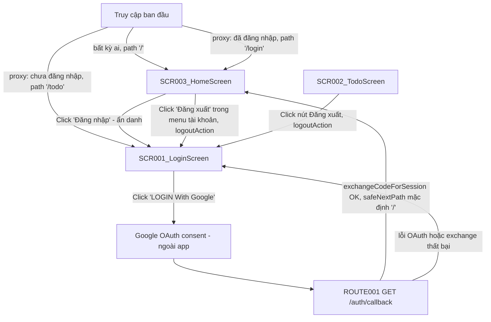
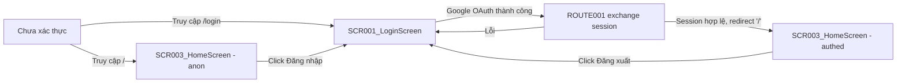

# Screen Flow

**Project**: agentic-coding-hands-on
**Generated**: 2026-09-06
**Analysis Scope**: route-view (Next.js 16 App Router) — 3 screens (`/`, `/login`, `/todo`) + 1 backend route (`/auth/callback`) + proxy guard layer

**Code Format**: All SCR codes MUST follow `SCR###_NameSlug` format (e.g., SCR001_LoginForm, SCR002_Dashboard) | `SCR###/REG###` for region-scoped transitions

## Navigation Map



> `/` không còn là fallback redirect — `app/page.tsx` nay TỰ RENDER SCR003_HomeScreen cho mọi actor (PERM001_RootRouteGuard đã superseded, xem `permissions-matrix.md`). SCR002_TodoScreen chỉ còn tới được bằng truy cập URL `/todo` trực tiếp khi đã đăng nhập — không còn đường điều hướng tự động nào (proxy/OAuth thành công/root fallback) đưa tới đó nữa.

## Feature Entry Points

### F001_GoogleOAuthLogin

- **Entry screen**: SCR001_LoginScreen — `/login`
- **Owned screens**:
  - SCR001_LoginScreen — `/login` (atomic)
  - SCR002_TodoScreen — `/todo` (atomic)
- **Exit screens**: SCR003_HomeScreen (on successful Google OAuth — đổi từ SCR002_TodoScreen, F003_Homepage 2026-09-06) → SCR001_LoginScreen (on logout)

### F002_LanguageSwitch

- **Entry screen**: SCR001_LoginScreen — `/login`
- **Owned screens**:
  - SCR001_LoginScreen (partial-scope: chỉ vùng LanguageSelector trong header — SCR001 không phát sinh REG### vì screen được phân loại atomic, nên tham chiếu dùng mã bare SCR001, không bịa `SCR001/REG###`) — `/login` (atomic)
  - SCR003_HomeScreen (partial-scope: tái dùng CÙNG `LanguageSelector` trong header — atomic, mã bare SCR003) — `/` (atomic)
- **Exit screens**: none (không điều hướng sang screen khác; chọn ngôn ngữ chỉ re-render tại chỗ)

### F003_Homepage

- **Entry screen**: SCR003_HomeScreen — `/`
- **Owned screens**:
  - SCR003_HomeScreen — `/` (atomic)
- **Exit screens**: SCR001_LoginScreen (click "Đăng nhập" khi ẩn danh, hoặc "Đăng xuất" trong menu tài khoản)

---

## Screen Access Paths

| From Screen | To Screen | Action/Trigger | Conditions | Region |
|-------------|-----------|----------------|------------|--------|
| Start | SCR003_HomeScreen | Initial load | Truy cập `/` — public, mọi actor (đã hoặc chưa đăng nhập) | |
| Start | SCR001_LoginScreen | Initial load / proxy redirect | Chưa đăng nhập, truy cập `/todo`; hoặc truy cập `/login` trực tiếp | |
| Start | SCR003_HomeScreen | proxy redirect | Đã đăng nhập, truy cập `/login` (đích đổi từ `/todo` sang `/`) | |
| Start | SCR002_TodoScreen | Truy cập URL trực tiếp | Đã đăng nhập, truy cập `/todo` trực tiếp (không còn đường điều hướng tự động nào khác dẫn tới đây) | |
| SCR001_LoginScreen | SCR003_HomeScreen | Click "LOGIN With Google" → Google OAuth thành công → ROUTE001 exchange thành công | `signInWithOAuth` không lỗi, `code` hợp lệ, `exchangeCodeForSession` không lỗi; đích mặc định đổi từ `/todo` sang `/` | |
| ROUTE001 (`/auth/callback`) | SCR001_LoginScreen | Redirect khi có `?error` hoặc exchange thất bại | `error` param có giá trị, hoặc thiếu cả `code` lẫn `error` | |
| SCR003_HomeScreen | SCR001_LoginScreen | Click link "Đăng nhập" (góc phải header, chỉ ẩn danh) | Chưa đăng nhập | |
| SCR003_HomeScreen | SCR001_LoginScreen | Click "Đăng xuất" trong menu tài khoản (submit `logoutAction`) | Đã đăng nhập; luôn xảy ra kể cả khi `signOut()` lỗi | |
| SCR002_TodoScreen | SCR001_LoginScreen | Click nút đăng xuất (submit `logoutAction`) | Luôn xảy ra, kể cả khi `signOut()` lỗi | |
| SCR002_TodoScreen | SCR001_LoginScreen | Guard xác thực `getUser()` thất bại | `!user` (không có session hợp lệ) | |

> Region column: để trống — app này không có REG### nào (xem screen-list.md).

## Screen Transitions

### SCR001_LoginScreen (Login)

**Entry Points**:
- Truy cập URL trực tiếp `/login` (chưa đăng nhập)
- Redirect từ `proxy.ts` khi path `/todo` và chưa đăng nhập
- Redirect từ ROUTE001 (`/auth/callback`) khi OAuth lỗi hoặc exchange thất bại (`?error=...`)
- Click link "Đăng nhập" trên SCR003_HomeScreen (ẩn danh)

**Exit Points**:
- Đến SCR003_HomeScreen: OAuth Google thành công → ROUTE001 exchange session thành công → `safeNextPath` (mặc định `/`, đổi từ `/todo`)

**Decision Points**:
- `getAuthenticatedUser()` (fail OPEN, `app/login/page.tsx:73-83`): nếu đã có `user` → redirect `/` ngay trước khi render (đổi từ `/todo`); lỗi Supabase (catch) → coi như chưa đăng nhập, vẫn render `/login`

---

### SCR003_HomeScreen (Trang chủ)

**Entry Points**:
- Truy cập URL trực tiếp `/` — public, không điều kiện (anonymous hoặc authenticated đều render cùng một trang, chỉ khác props `viewer`)
- Redirect từ `proxy.ts` khi path `/login` và đã đăng nhập (đổi đích từ `/todo` sang `/`)
- Redirect từ ROUTE001 (`/auth/callback`) sau OAuth thành công (đích mặc định mới, đổi từ `/todo`)

**Exit Points**:
- Đến SCR001_LoginScreen: click link "Đăng nhập" ở góc phải header (chỉ hiện khi ẩn danh)
- Đến SCR001_LoginScreen: click "Đăng xuất" trong menu tài khoản (`logoutAction` — tái dùng nguyên trạng từ `app/todo/actions.ts`, luôn redirect dù `signOut()` thành công hay lỗi)
- (Ngoài phạm vi phân tích) 5 link tới route chưa tồn tại: `/awards`, `/kudos`, `/standards`, `/profile`, `/admin` — không phải SCR### nào trong tài liệu này

**Decision Points**:
- Không có guard chặn truy cập (`app/page.tsx` không redirect ai) — `getUser()`/`getUserRole()` chỉ đọc để cá nhân hoá header (bell + menu tài khoản + role, hoặc link đăng nhập), không quyết định có được xem trang hay không (PERM001_RootRouteGuard superseded, xem `permissions-matrix.md`)

---

### SCR002_TodoScreen (Todo)

**Entry Points**:
- Truy cập URL trực tiếp `/todo` nếu đã đăng nhập (đường DUY NHẤT còn lại — không còn redirect tự động nào (proxy, OAuth thành công, hay root fallback) đưa tới đây; xem Navigation Map)

**Exit Points**:
- Đến SCR001_LoginScreen: click nút đăng xuất (`logoutAction` — luôn redirect dù `signOut()` thành công hay lỗi)
- Đến SCR001_LoginScreen: guard `getUser()` phát hiện không có session hợp lệ

**Decision Points**:
- `getUser()` (fail CLOSED, `app/todo/page.tsx:21-28`): `!user` → redirect `/login` ngay trước khi render

---

## Region Transitions

`N/A — không có REG### nào trong app này (cả 3 SCR đều atomic — xem screen-list.md § Composite classification / Type).`

---

## Authentication Flow



| Screen | Authentication Required | Authorization Level |
|--------|------------------------|-------------------|
| SCR001_LoginScreen | Không (nhưng tự redirect sang `/` nếu đã có session — đổi từ `/todo`) | Public |
| SCR002_TodoScreen | Có | User (bất kỳ user Supabase hợp lệ nào — không phân role) |
| SCR003_HomeScreen | Không — public cho mọi actor (PERM001_RootRouteGuard superseded); nội dung header cá nhân hoá theo trạng thái đăng nhập + role, không phải một guard | Public (nội dung); cá nhân hoá theo `member`/`admin` khi đã đăng nhập |

---

## Error Handling Flows

| Screen | Error | Handling | Scope |
|--------|-------|----------|-------|
| SCR001_LoginScreen | OAuth provider trả `?error`/`?error_description` (Google/GoTrue hủy hoặc lỗi) | Redirect `/login?error=...`; server đọc `?error` (bất kể giá trị) và hiển thị 1 thông báo cố định đã dịch (không render raw value) | screen |
| SCR001_LoginScreen | `exchangeCodeForSession` thất bại hoặc thiếu cả `code` lẫn `error` | Redirect `/login?error=auth_code_error` | screen |
| SCR001_LoginScreen | `signInWithOAuth()` (phía client) trả lỗi hoặc throw | `clientError` state bật → hiển thị cùng thông báo cố định qua `LoginErrorAlert`, không cần round-trip `?error=` | screen |
| SCR002_TodoScreen | `supabase.auth.getUser()` không có session | Redirect `/login` (fail closed) | screen |
| SCR002_TodoScreen | `signOut()` lỗi (session đã hết hạn phía server) | Bỏ qua lỗi (best-effort), vẫn redirect `/login` | screen |
| SCR003_HomeScreen | `getUser()` throw (Supabase lỗi khi đọc session cho header) | `try/catch` → coi như ẩn danh, vẫn render trang đầy đủ (fail-open, không chặn nội dung công khai) | screen |
| SCR003_HomeScreen | `getUserRole()` lỗi hoặc không có row trong `public.users` | Fail-open về `"member"` — không hiện lỗi, chỉ ẩn mục "Trang quản trị" | screen |

> Scope values: `screen` (không có REG### trong app này nên không có case `region:REG###`).

---

## Circular Dependencies Check

- [x] No circular dependencies detected — SCR001 ⇄ SCR003 là chu trình login/logout hợp lệ (đổi từ SCR001 ⇄ SCR002), mỗi chiều có trigger/điều kiện riêng biệt; SCR002 ⇄ SCR001 (logout) vẫn còn nhưng SCR002 không còn cạnh vào tự động nào (chỉ truy cập URL trực tiếp)
- [x] All screens have valid entry/exit points
- [x] All navigation paths terminate

---

## Guard Logic

### GUARD-001 — Optimistic auth redirect (proxy layer) trên `/login`, `/todo/:path*` (`/` vẫn khớp matcher, không còn redirect)
**trigger:** `proxy` (Next 16, tên cũ `middleware`)
**source:** `proxy.ts:25-44`
**logic:**
```pseudo
if (user && path === "/login") → redirect / (giữ cookie đã refresh; đổi từ /todo)
if (!user && path bắt đầu bằng "/todo") → redirect /login (giữ cookie đã refresh)
path === "/" → pass-through LUÔN (không redirect — vẫn khớp matcher chỉ để refresh cookie)
else → pass-through
```
**failure path:** lỗi gọi Supabase (`getUserOrNull` catch) → coi như `user = null`, không 500 toàn site

---

### GUARD-002 — Authoritative already-authenticated check trên `/login` (fail OPEN)
**trigger:** Server Component render (trước khi trả JSX)
**source:** `app/login/page.tsx:31-34,73-83`
**logic:**
```pseudo
try { user = await supabase.auth.getUser() } catch { user = null }
if (user) → redirect / (đổi từ /todo)
```
**failure path:** lỗi Supabase → `user = null` → vẫn render `/login` (fail OPEN, khác `/todo`)

---

### GUARD-003 — Authoritative auth guard trên `/todo` (fail CLOSED)
**trigger:** Server Component render
**source:** `app/todo/page.tsx:21-28`
**logic:**
```pseudo
user = await supabase.auth.getUser()
if (!user) → redirect /login
```
**failure path:** không có session hợp lệ (kể cả lỗi gọi Supabase) → redirect `/login`

---

### GUARD-004 — Root `/` fallback authoritative redirect — **SUPERSEDED, không còn hoạt động**
**trigger:** ~~Server Component render (route không tự render UI)~~ — `app/page.tsx` nay TỰ RENDER SCR003_HomeScreen, không còn redirect nào
**source:** `app/page.tsx` (đã viết lại hoàn toàn — không còn logic guard này; xem `PERM001_RootRouteGuard` trong `permissions-matrix.md`)
**logic (cũ, không còn đúng — giữ lại để tham chiếu lịch sử):**
```pseudo
# TRƯỚC (superseded):
user = await supabase.auth.getUser()
redirect(user ? "/todo" : "/login")
```
**Hiện tại:** `app/page.tsx` gọi `getUser()`/`getUserRole()` chỉ để cá nhân hoá header (SCR003_HomeScreen), KHÔNG redirect ai. Chi tiết đầy đủ: `docs/vi/system/permissions.md`, `generated/permissions-matrix.md § PERM001`.
**failure path:** (N/A — guard đã retired)

---

## Deep-Link State Restoration

### SCR001_LoginScreen
**URL pattern:** `/login?error={value}`
**State restored:**

| Param | Restores | Default if missing |
|-------|----------|--------------------|
| error | Hiển thị `LoginErrorAlert` (thông báo lỗi cố định, đã dịch) | Không hiển thị (`null`) |

**Failure mode:** bất kỳ giá trị `error` non-empty nào (kể cả mảng do Next.js parse `?error=` lặp lại) đều bật CÙNG một thông báo cố định — giá trị thô không bao giờ được render (an toàn XSS nhưng không mô tả chi tiết lỗi thật).

> Ghi chú (ngoài phạm vi SCR, không tự render UI): `ROUTE001 GET /auth/callback?next={path}` — param `next` phục hồi đích redirect sau đăng nhập qua `safeNextPath()` (`lib/supabase/next-path.ts`); giá trị không hợp lệ/không an toàn (không bắt đầu bằng đúng 1 `/`, chứa `://`, `//`, hoặc control-char/line-separator thô hay percent-encoded) sẽ fallback về `/` (đổi từ `/todo`).

---

## Unsaved-Changes Protection

`N/A — no unsaved-changes guards detected.` Không có form nào giữ input người dùng cần bảo vệ khi rời trang — `/login` không có input tự nhập (chỉ nút OAuth + dropdown ngôn ngữ), `/todo` chỉ có 1 nút submit đăng xuất.

---

## Extraction Signatures

Framework-agnostic identifier patterns for locating the above constructs.

### Guard Logic
Function/method definitions tied to a route: `beforeEnter|canActivate|middleware|loader|before_action|authenticate|authorize` — check if called from a router config or route registration. Trong repo này: `proxy()` export trong `proxy.ts` (Next 16 proxy convention) + guard nội tuyến (`getAuthenticatedUser`/`getUser`) ở đầu mỗi Server Component `page.tsx`.

### Deep-Link State Restoration
URL param reads at component mount synced to state: `useSearchParams|useQuery|router\.query|URLSearchParams|params\[|$route\.query` — trong repo này là `searchParams` Promise prop của Server Component (`app/login/page.tsx`) và `new URL(request.url).searchParams` trong Route Handler (`app/auth/callback/route.ts`), không phải hook client-side.

### Unsaved-Changes Protection
`beforeunload|onbeforeunload|usePrompt|useBeforeUnload|leaveGuard|isDirty|formState\.isDirty|data-turbo-confirm` — không tìm thấy pattern nào trong repo.
