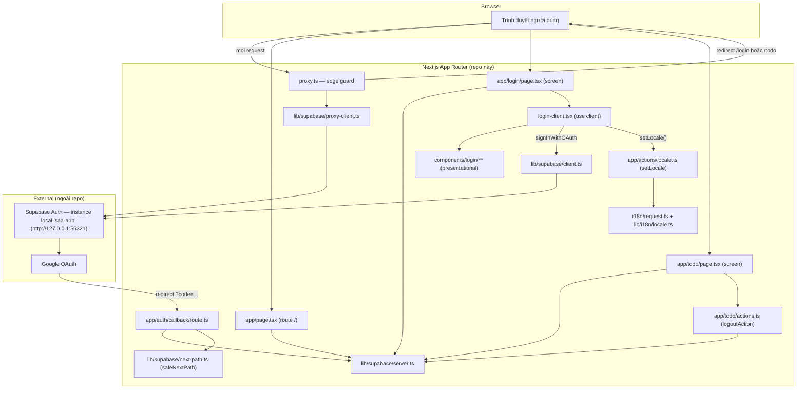
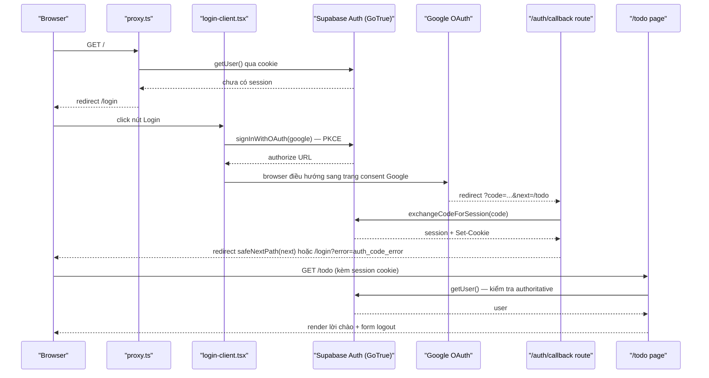

# Architecture

**Phạm vi**: toàn bộ source hiện có trong repo (2 screen: `/login`, `/todo`; route phụ `/`, `/auth/callback`). Mô tả code THỰC TẾ đang chạy, dựng ngược từ source — không phải kế hoạch.

## System Architecture

Ba khối chính: (1) Next.js App Router trong repo này — vừa render UI vừa là "backend" (Server Actions, Route Handler, edge guard), không có service backend riêng; (2) Supabase Auth — instance local `saa-app`, chạy ngoài repo, là nguồn xác thực + lưu session duy nhất; (3) Google OAuth — bên thứ ba, app không gọi trực tiếp mà qua Supabase GoTrue.

Hai lớp guard tách biệt (không phải một):
- `proxy.ts` — guard optimistic, chỉ đọc cookie qua `getUser()` (`proxy.ts:21-40,71-81`), khớp 3 route `/`, `/login`, `/todo/:path*` (`proxy.ts:108-110`), loại trừ `/auth/callback`.
- Guard authoritative nằm ở từng Server Component: `app/page.tsx:10-17`, `app/login/page.tsx:73-83`, `app/todo/page.tsx:17-25` — mỗi trang tự gọi lại `getUser()` qua `lib/supabase/server.ts:16`, không tin tưởng riêng lớp proxy.

`lib/supabase/{client,server,proxy-client}.ts` là 3 factory khác nhau cho cùng một SDK `@supabase/ssr` (browser / Server Component-Action-Route / proxy) — khác nhau ở nơi đọc/ghi cookie, không phải khác nhau về logic nghiệp vụ.

## Tech Stack

| Layer | Technology | Version |
|-------|------------|---------|
| Framework | Next.js (App Router) | 16.3.4 |
| UI | React / React DOM | 19.2.8 |
| Ngôn ngữ | TypeScript | ^5 |
| Styling | Tailwind CSS (`@tailwindcss/postcss`) | ^4 |
| i18n | next-intl (no-routing, cookie `NEXT_LOCALE`) | 4.14.2 |
| Auth SDK | `@supabase/ssr` | 0.12.5 |
| Auth SDK | `@supabase/supabase-js` | 2.115.0 |
| Auth backend | Supabase Auth (GoTrue) — instance local `saa-app`, ngoài repo | API `http://127.0.0.1:55321` |
| Backend (in-repo) | Next.js Server Actions + Route Handlers (không có service backend riêng) | — |
| Database | N/A trong repo — `auth.users` do Supabase quản lý, ngoài phạm vi code này | — |
| Cache | N/A — không tìm thấy | — |
| Queue | N/A — không tìm thấy | — |
| Testing (unit) | Vitest | ^3.2.7 |
| Testing (e2e) | `@playwright/test` | 1.62.1 |

Nguồn: `package.json:8-27`. Cache/Queue/Database ghi N/A vì scan repo không thấy dependency hay code tương ứng (`app/todo/actions.ts` chỉ gọi `signOut()`, không có model/schema nào trong repo — dữ liệu người dùng nằm hoàn toàn phía Supabase, ngoài phạm vi source này).

## Data Flow

Luồng trên là request lõi của app (đăng nhập Google OAuth qua PKCE, cấp bởi Supabase). Trích nguồn: `app/login/login-client.tsx:41-64` (kích hoạt OAuth), `app/auth/callback/route.ts:16-46` (exchange code, redirect matrix), `lib/supabase/next-path.ts:88-106` (`safeNextPath` chặn open-redirect trên tham số `?next=`), `app/todo/page.tsx:17-25` (kiểm tra authoritative). Nhánh lỗi (`?error=` từ Google, `exchangeCodeForSession` thất bại) đều redirect về `/login?error=...`, không lộ raw error ra client (`app/auth/callback/route.ts:39-42`).

Luồng phụ (không vẽ ở trên để giữ diagram gọn): đổi ngôn ngữ — `LoginClient` gọi Server Action `setLocale` (`app/actions/locale.ts:24-41`), ghi cookie `NEXT_LOCALE` (`lib/i18n/locale.ts:17,20`), vòng round-trip của chính Server Action khiến `i18n/request.ts:16-28` đọc lại cookie và trả bộ message mới — không cần `router.refresh()` (`app/login/login-client.tsx:66-72`).

## Deployment View

> Derived from repository infrastructure-as-code — not verified against production.

N/A — no infrastructure-as-code found in repository.

**Không tìm thấy cấu hình infrastructure-as-code/deployment nào trong repo.**

Đã quét root và các thư mục con cấp 1-3 (loại trừ `node_modules/`, `.next/`, `test-results/`, `playwright/`) tìm `Dockerfile*`, `docker-compose*`, `*.tf`, `Procfile`, `fly.toml`, `wrangler.toml`, `vercel.json`, `app.yaml`, `nginx.conf`, `*.yml`/`*.yaml`, k8s manifest — không có file nào khớp. `package.json` chỉ khai báo script `dev`/`build`/`start` chạy trực tiếp bằng Next.js CLI (`package.json:5-7`), không có target container/orchestration. Supabase (`saa-app`) là instance local chạy ngoài repo này, không có compose/IaC quản lý nó trong source đang xét. Không suy diễn thêm topology nào ngoài các sự thật trên.
