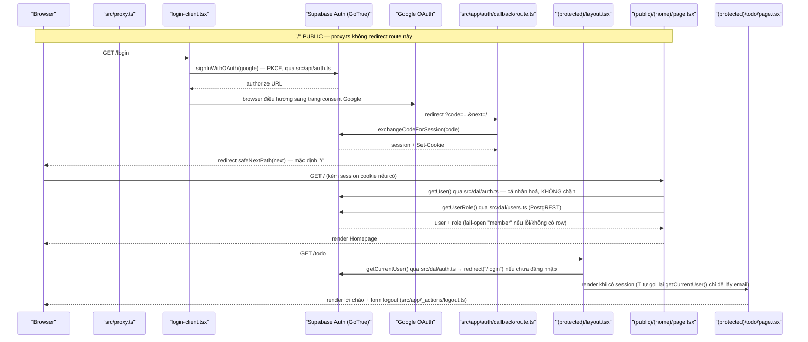

# Architecture

**Phạm vi**: toàn bộ source hiện có trong repo — 6 screen (`/`, `/awards`, `/login`, `/profile`,
`/standards`, `/todo`; route phụ `/auth/callback`), gồm cả F003_Homepage, F004_AwardSystemPage,
F005_StandardsRulesPage và F006_ProfilePage.

**Cập nhật 2026-09-06 (đợt 2 — route colocation)**: toàn bộ source đã chuyển vào `src/`
(`plans/260906-1150-src-route-colocation-refactor/`) — **URL, hành vi runtime, biến môi
trường, khoá `messages/*.json`, script `package.json` KHÔNG đổi**; chỉ đổi file nào chứa
logic, ranh giới import giữa các thư mục, và pattern mà config build/test dùng để tìm file.
Mọi trích dẫn `path:N-M` dưới đây đọc từ vị trí `src/` hiện tại.

**Cập nhật 2026-09-07 (F004_AwardSystemPage)**: thêm 1 route segment PUBLIC ngang hàng
`(home)`/`login` trong group `(public)`: `src/app/(public)/awards/` (Server Component
`page.tsx`, không qua guard nào — xem `permissions.md`). Ba component trước đây riêng của
`(home)` nay climb đúng 1 nấc scope-ladder lên `(public)/_components/` vì có consumer ở cả 2
segment, và đổi tên phản ánh phạm vi mới: `header.tsx` (`HomeHeader`) → `site-header.tsx`
(`SiteHeader`); `home-footer.tsx` (`HomeFooter`) → `site-footer.tsx` (`SiteFooter`);
`kudos-section.tsx` (`KudosSection`, không đổi tên). Cùng lý do, hàm đọc session+role
`getViewer()` (trước đây cục bộ trong `(home)/page.tsx`) được hoisted lên
`src/app/(public)/_utils/get-viewer.ts`, dùng chung bởi cả `(home)` và `awards`. `AwardCard`/
lưới giải trên `/` KHÔNG đổi vị trí — vẫn ở `(home)/_components/award-card.tsx`, chỉ đổi
import sang map asset dùng chung `(public)/_shared/award-name-graphics.ts` (`AWARD_NAME_GRAPHIC`,
2 consumer: `award-card.tsx` và `awards/_components/award-section.tsx`). Chi tiết đầy đủ:
`docs/vi/features/F004_AwardSystemPage/technical-spec.md`.

**Cập nhật 2026-09-07 (đợt 2 — F005_StandardsRulesPage)**: thêm 1 route segment PUBLIC ngang
hàng `awards`/`login` trong group `(public)`: `src/app/(public)/standards/` (Server Component
`page.tsx`, không qua guard nào, không đọc session/role — xem `permissions.md`). **Khác hẳn
`/awards`**: route này KHÔNG dùng lại `SiteHeader`/`SiteFooter`/`getViewer()` — design chỉ vẽ 1
panel, không có chrome nào trong node tree (xác nhận bởi E2E: `header`/`footer` count 0) — nên
không có thêm hoisting nào ở tầng `(public)/_utils` hay `(public)/_components` cho phần
header/footer. Nội dung 100% tĩnh từ i18n namespace `standards` — không DAL, không bảng Supabase
mới, không client Supabase nào được gọi từ route này. Một component DUY NHẤT climb scope-ladder:
`IconPencil` (`(home)/_components/icons/icon-pencil.tsx` → `(public)/_components/icons/icon-pencil.tsx`),
vì nút "Viết KUDOS" cần icon bút giống hệt `WidgetButton` trên `/` — cùng pattern climb-1-nấc đã
dùng cho `SiteHeader`/`SiteFooter`/`KudosSection` ở đợt F004, nhưng phạm vi hẹp hơn nhiều (1
file, không đổi tên, 2 consumer: `widget-button.tsx` và `standards-footer-actions.tsx`). Chi
tiết đầy đủ: `docs/vi/features/F005_StandardsRulesPage/technical-spec.md`.

**Cập nhật 2026-09-07 (đợt 3 — F006_ProfilePage)**: thêm 1 route segment PROTECTED mới trong
group `(protected)`, ngang hàng `todo`: `src/app/(protected)/profile/` (Server Component
`page.tsx`, gác bởi ĐÚNG `(protected)/layout.tsx` mà `/todo` dùng — không gate riêng). Điểm hạ
tầng mới: migration `0005_profile_cards_view.sql` thêm view `public.profile_cards`
(`security_invoker = false`, chạy quyền owner/`BYPASSRLS`) — ranh giới đọc THỨ 2 của hệ thống
(sau RLS own-row của `public.users`), phơi đúng 3 cột (`id, full_name, avatar_url`) cho
`authenticated`, không `anon`. DAL mới: `src/dal/profile-cards.ts` (`getProfileCard`, fail-open
`null`) + `src/dal/profile-cards-client.ts` (shim `toProfileCardsClient`, cùng pattern
`toAwardsClient`/`toUsersRoleClient` tránh TS2589).

**Đợt việc này cũng promote toàn bộ chrome dùng chung (`SiteHeader`/`SiteFooter`/`AccountMenu`/
`LogoLink`/`NavLink`/`NotificationBell`/`KeyvisualBackground`/`KudosSection`/`LanguageSelector`/
`icons/*`, cộng `site-chrome.ts`, `get-viewer.ts`, `use-select-locale.ts`, `logout.ts`,
`set-locale.ts`) TỪ `src/app/(public)/_*` LÊN `src/app/_*`** (thư mục private ở gốc `src/app/`,
ngang hàng mọi route-group) — vì `/profile` (nhóm `(protected)`) cần tái dùng CÙNG `SiteHeader`/
`SiteFooter` mà `(public)/(home)` và `(public)/awards` đang dùng, và rule `no-restricted-imports`
cấm 1 segment import `_*` của segment khác qua đường ngang hàng (`(protected)` không được import
`(public)/_components`). Promote lên `src/app/_*` (tổ tiên chung của cả `(public)` và
`(protected)`) là cách hợp lệ DUY NHẤT theo rule đó, không phải một ngoại lệ. `(public)/_shared/
award-name-graphics.ts` CỐ Ý KHÔNG promote — chỉ 2 consumer trong `(public)` (`award-card.tsx`,
`awards/_components/award-section.tsx`), `/profile` không dùng map asset này.

## System Architecture

Layout chia 2 zone:
- **Zone A — `src/<layer>/`**: code dùng chung, nhóm theo LOẠI — `api`, `dal`, `lib`, `hooks`,
  `utils`, `constants`, `i18n`, `mocks`, `styles`.
- **Zone B — `src/app/**`**: code theo FEATURE, nhóm theo ROUTE (`(public)/(home)`,
  `(public)/awards`, `(public)/standards`, `(public)/login`, `(protected)/todo`,
  `(protected)/profile`, `auth/callback`). Mỗi route segment giữ file riêng trong folder private
  của nó: `_components`, `_hooks`, `_actions`, `_utils`, `_shared`. `src/app/_*` (gốc, KHÔNG thuộc
  route-group nào) giữ chrome/action dùng chung bởi CẢ `(public)` lẫn `(protected)` — promote lên
  đây từ F006_ProfilePage vì `(protected)/profile` cần tái dùng `SiteHeader`/`SiteFooter` mà
  trước đó chỉ `(public)/_components` giữ.

Hướng phụ thuộc: Zone A không bao giờ import `src/app` (`eslint.config.mjs:74-92`, rule
`no-restricted-imports`). Trong `src/app/**`, một segment chỉ import folder private của
chính nó, của segment tổ tiên (relative path), hoặc `@/<layer>` — cấm import ngang hàng hay
xuống con vào `_*` của segment khác (`eslint.config.mjs:93-130`, regex-based).

```mermaid
graph TB
    subgraph "Browser"
        Client["Trình duyệt người dùng"]
    end
    subgraph "Next.js App Router (src/)"
        Proxy["src/proxy.ts — edge guard optimistic"]
        ProtectedLayout["src/app/(protected)/layout.tsx — auth gate, thay page tự gọi getUser()"]
        Root["src/app/(public)/(home)/page.tsx — HomePage (F003_Homepage)"]
        HomeClient["src/app/(public)/(home)/_components/home-client.tsx"]
        HomeComponents["src/app/(public)/(home)/_components/**"]
        AwardsRoute["src/app/(public)/awards/page.tsx — AwardsPage (F004_AwardSystemPage, PUBLIC)"]
        AwardsClient["src/app/(public)/awards/_components/awards-client.tsx"]
        AwardsComponents["src/app/(public)/awards/_components/**"]
        SiteChrome["src/app/_components/{site-header,site-footer,kudos-section,account-menu,...}.tsx (promoted lên gốc src/app/_*, dùng chung (home)+awards+profile)"]
        GetViewer["src/app/_utils/get-viewer.ts (promoted lên gốc, dùng chung (home)+awards+profile)"]
        AwardsDal["src/dal/awards.ts (getAwards)"]
        AwardsDalShim["src/dal/awards-client.ts"]
        StandardsRoute["src/app/(public)/standards/page.tsx — StandardsPage (F005_StandardsRulesPage, PUBLIC, static i18n only)"]
        StandardsClient["src/app/(public)/standards/_components/standards-client.tsx"]
        StandardsScreen["src/app/(public)/standards/_components/standards-screen.tsx"]
        RoleHelper["src/dal/users.ts (getUserRole)"]
        RoleShim["src/dal/users-role-client.ts"]
        CountdownLib["src/app/(public)/(home)/_utils/countdown.ts"]
        CountdownHook["src/app/(public)/(home)/_hooks/use-countdown.ts"]
        LocaleHook["src/app/_hooks/use-select-locale.ts (promoted lên gốc)"]
        LoginPage["src/app/(public)/login/page.tsx — self-check qua src/dal/auth.ts"]
        LoginClient["src/app/(public)/login/_components/login-client.tsx"]
        LoginActionsHook["src/app/(public)/login/_hooks/use-login-actions.ts"]
        TodoPage["src/app/(protected)/todo/page.tsx"]
        ProfileRoute["src/app/(protected)/profile/page.tsx — ProfilePage (F006_ProfilePage, PROTECTED)"]
        ProfileClient["src/app/(protected)/profile/_components/profile-client.tsx"]
        ProfileComponents["src/app/(protected)/profile/_components/**"]
        ProfileDal["src/dal/profile-cards.ts (getProfileCard)"]
        ProfileDalShim["src/dal/profile-cards-client.ts"]
        ProfileCardsView[("public.profile_cards — view, security_invoker=false")]
        AuthDal["src/dal/auth.ts (getCurrentUser)"]
        SharedLogout["src/app/_actions/logout.ts — dùng chung (home), (protected)/todo, (protected)/profile"]
        SharedLocaleAction["src/app/_actions/set-locale.ts"]
        Callback["src/app/auth/callback/route.ts"]
        SupaServer["src/lib/supabase/server.ts"]
        SupaProxyClient["src/lib/supabase/proxy-client.ts"]
        SupaBrowserClient["src/lib/supabase/client.ts"]
        AuthApi["src/api/auth.ts (signInWithGoogle)"]
        NextPathGuard["src/utils/url/next-path.ts (safeNextPath)"]
        I18nCfg["src/i18n/request.ts + src/lib/i18n/locale.ts"]
    end
    subgraph "External Services"
        Supabase["Supabase Auth + PostgREST — instance local 'saa-app' (config/migrations committed tai supabase/)"]
        Google["Google OAuth"]
    end

    Client -->|"mọi request"| Proxy
    Proxy --> SupaProxyClient --> Supabase
    Proxy -->|"redirect /login hoặc /todo (không redirect /)"| Client
    Client --> Root --> SupaServer
    Root -->|"getCurrentUser()"| AuthDal --> SupaServer
    Root --> HomeClient --> HomeComponents
    Root -->|"khi đã đăng nhập, đọc role"| RoleHelper --> RoleShim --> SupaServer
    HomeComponents --> CountdownHook --> CountdownLib
    HomeClient --> LocaleHook --> SharedLocaleAction
    HomeComponents --> SharedLogout --> SupaServer
    Client --> AwardsRoute --> SupaServer
    AwardsRoute -->|"đọc viewer dùng chung F003"| GetViewer --> RoleShim
    AwardsRoute --> AwardsDal --> AwardsDalShim --> SupaServer
    AwardsRoute --> AwardsClient --> AwardsComponents
    HomeComponents -.->|"dùng chung, promoted"| SiteChrome
    AwardsComponents -.->|"dùng chung, promoted"| SiteChrome
    Client --> StandardsRoute --> StandardsClient --> StandardsScreen
    Client --> LoginPage -->|"getCurrentUser(), redirect / nếu đã đăng nhập"| AuthDal
    LoginPage --> LoginClient --> LoginActionsHook
    LoginActionsHook -->|"signInWithGoogle()"| AuthApi --> SupaBrowserClient --> Supabase --> Google
    Google -->|"redirect ?code=...&next=/"| Callback
    Callback --> SupaServer
    Callback --> NextPathGuard
    Client --> ProtectedLayout -->|"getCurrentUser(), redirect /login nếu chưa đăng nhập"| AuthDal
    ProtectedLayout --> TodoPage --> SupaServer
    TodoPage --> SharedLogout
    ProtectedLayout --> ProfileRoute
    ProfileRoute -->|"parseProfileId(), lại getCurrentUser()"| AuthDal
    ProfileRoute -->|"đọc role cho header (dùng chung F003)"| RoleHelper --> RoleShim
    ProfileRoute --> ProfileDal --> ProfileDalShim --> SupaServer
    ProfileDalShim -.->|"security_invoker=false, BYPASSRLS"| ProfileCardsView --> Supabase
    ProfileRoute --> ProfileClient --> ProfileComponents
    ProfileComponents -.->|"dùng chung, promoted lên gốc"| SiteChrome
    ProfileComponents --> SharedLogout
```

Hai lớp guard tách biệt, cơ chế không đổi, chỉ đổi file:
- `src/proxy.ts` — guard optimistic (matcher `/`, `/login`, `/todo/:path*`, `/awards`,
  `/standards`, `/profile`; loại trừ `/auth/callback`). Predicate `isAuthPage`/`isProtectedPage`
  đọc từ mảng `PROTECTED_ROUTES = [ROUTES.TODO, ROUTES.PROFILE]` (mở rộng từ F006_ProfilePage,
  trước đó chỉ so khớp `ROUTES.TODO` đơn lẻ), đọc cookie qua `getUserOrNull` — chỉ redirect,
  không phải nguồn sự thật (comment trong `src/proxy.ts` trỏ thẳng vào layout dưới đây).
- `src/app/(protected)/layout.tsx` (`src/app/(protected)/layout.tsx:19-29`) — guard
  authoritative DUY NHẤT cho mọi route trong nhóm `(protected)` (`/todo` VÀ `/profile`, mở rộng
  từ F006_ProfilePage — không có gate thứ 2 nào viết riêng cho `/profile`): gọi
  `getCurrentUser()` (`src/dal/auth.ts:16-27`, fail-open `null` khi lỗi) rồi `redirect("/login")`
  nếu không có user, trước khi bất kỳ page con nào render. Thay cho việc trước đây
  `app/todo/page.tsx` tự gọi `getUser()` trong thân trang — `src/app/(protected)/todo/page.tsx`
  nay chỉ gọi `getCurrentUser()` lại một lần (`src/app/(protected)/todo/page.tsx:22`) để lấy
  email cho lời chào, KHÔNG phải để gác quyền truy cập (comment giải thích tại
  `src/app/(protected)/todo/page.tsx:15-19`); `src/app/(protected)/profile/page.tsx` cũng gọi lại
  `getCurrentUser()` một lần, cùng lý do — lấy `viewer.id` cho `parseProfileId()`.
- `src/app/(public)/login/page.tsx` KHÔNG nằm trong nhóm `(protected)` nên KHÔNG qua layout
  trên — trang tự gọi `getCurrentUser()` (`src/app/(public)/login/page.tsx:34-37`) và
  `redirect(ROUTES.HOME)` nếu đã đăng nhập, giữ nguyên hành vi guard cũ của `/login`.

Server Actions dùng chung nhiều route gộp về `src/app/_actions/`:
- `logout.ts` (`src/app/_actions/logout.ts`) — dùng bởi `(home)` (menu tài khoản),
  `(protected)/todo` (form đăng xuất), và `(protected)/profile` (menu tài khoản của `SiteHeader`
  dùng chung, F006_ProfilePage) — không còn sideways import giữa các segment.
- `set-locale.ts` (`src/app/_actions/set-locale.ts`) — root-shell concern, dùng bởi cả
  `login` (`use-login-actions.ts`) và `(home)` (`use-select-locale.ts`).

DAL: `src/dal/users.ts` (`getUserRole`, `import "server-only"`) và
`src/dal/users-role-client.ts` (shim `toUsersRoleClient`, thu hẹp kiểu builder tránh lỗi
TS2589). `src/dal/auth.ts` (`getCurrentUser`) là bổ sung mới của đợt việc này — điểm đọc
session DÙNG CHUNG cho `(protected)/layout.tsx`, `login/page.tsx`, và
`(protected)/todo/page.tsx`; browser-side Supabase call cho OAuth nằm ở `src/api/auth.ts`
(`signInWithGoogle`), gọi từ `use-login-actions.ts` (Zone B, hook). Bổ sung F004_AwardSystemPage:
`src/dal/awards.ts` (`getAwards`, `import "server-only"`, fail-open `[]`) và
`src/dal/awards-client.ts` (shim `toAwardsClient`, cùng pattern thu hẹp kiểu builder tránh
TS2589 như `users-role-client.ts`) — đọc bảng mới `public.awards` (Supabase `saa-app`, thứ 2
sau `public.users`), RLS mở cho cả `anon` và `authenticated` vì `/awards` là route public không
có khái niệm chủ sở hữu dòng. Bổ sung F006_ProfilePage: `src/dal/profile-cards.ts`
(`getProfileCard`, `import "server-only"`, fail-open `null`) và `src/dal/profile-cards-client.ts`
(shim `toProfileCardsClient`, cùng pattern thu hẹp kiểu builder) — đọc view mới
`public.profile_cards` (migration `0005`, thứ 3 sau `public.users`/`public.awards`), CHẠY VỚI
QUYỀN OWNER (`security_invoker = false`, role `BYPASSRLS`) để bỏ qua RLS own-row của
`public.users` — khác hẳn 2 DAL trước, đây là ranh giới đọc "vượt quyền own-row có chủ đích",
không phải RLS mở như `public.awards`. `GRANT SELECT` chỉ cho `authenticated`, không `anon`
(khác `public.awards`) vì `/profile` là route protected.

3 factory `@supabase/ssr` — `src/lib/supabase/{client,server,proxy-client}.ts` — không đổi
logic, chỉ đổi thư mục cha. `src/utils/url/next-path.ts` (`safeNextPath`, chống open-redirect,
business-agnostic) tách khỏi `lib/supabase/` vì không phải vendor glue cho Supabase.

`domain/`, `contexts/`, `components/` (shared, ngoài `language-selector`) CHƯA tồn tại — chưa
tạo trước, tạo khi có consumer thật đầu tiên (YAGNI). `src/configs/env.ts` cũng chưa tồn tại:
`EVENT_START_AT` tiếp tục đọc trực tiếp trong `src/app/(public)/(home)/page.tsx`
(`resolveTargetIso()`, dòng 177-188) cho tới khi có biến env thứ hai cần đọc.

## Tech Stack

| Layer | Technology | Version |
|-------|------------|---------|
| Framework | Next.js (App Router) | 16.3.4 |
| UI | React / React DOM | 19.2.8 |
| Ngôn ngữ | TypeScript | ^5 |
| Styling | Tailwind CSS (`@tailwindcss/postcss`) | ^4 |
| i18n | next-intl (no-routing, cookie `NEXT_LOCALE`) | 4.14.2 |
| Auth SDK | `@supabase/ssr` | 0.12.5 |
| Auth SDK | `@supabase/supabase-js` | 2.115.0 |
| Auth backend | Supabase Auth (GoTrue) — instance local `saa-app`, config/migrations committed tại `supabase/` | API `http://127.0.0.1:55321` |
| Backend (in-repo) | Next.js Server Actions + Route Handlers (không có service backend riêng) | — |
| Database | `public.users` (cột `role`, RLS own-row) + `public.awards` (F004, 6 hàng × locale, RLS mở cho `anon`+`authenticated`) + `public.profile_cards` (F006, view SECURITY-DEFINER-equivalent phái sinh từ `public.users`, `GRANT SELECT` chỉ `authenticated`) — 2 bảng + 1 view, cả ba đọc qua PostgREST | — |
| Package manager | pnpm (`packageManager` field, không dùng corepack) | 10.33.2 |
| Node.js | `engines.node` | `>=22 <25` (CI chạy Node `24`) |
| Testing (unit) | Vitest (2 project: `node`, `jsdom`) | ^3.2.7 |
| Testing (e2e) | `@playwright/test` (chromium) | 1.62.1 |
| Component docs | Storybook + `@storybook/nextjs-vite` + `msw-storybook-addon` | 10.6.0 / 10.6.0 / 3.0.0 |
| Lint | ESLint flat config + 2 rule `no-restricted-imports` (boundary) | ESLint ^9 |
| CI/CD | GitHub Actions (`.github/workflows/ci.yml`) — 2 job độc lập: `quality` và `e2e` | — |

Nguồn: `package.json`, `eslint.config.mjs`, `tsconfig.json`, `vitest.config.ts`.

**Config theo đợt di chuyển vào `src/`:**
- `tsconfig.json`: `"@/*": ["./src/*"]` (`tsconfig.json:22`).
- `vitest.config.ts`: alias `@` → `./src` (`vitest.config.ts:29-30`); project `node` =
  `src/**/*.test.ts` trừ `src/hooks/**` và `src/app/**/_hooks/**`; project `jsdom` =
  `src/hooks/**/*.test.ts` và `src/app/**/_hooks/**/*.test.ts`. Coverage `include` là allowlist
  tường minh: `src/{api,dal,lib,utils,hooks,domain,configs}/**/*.ts`,
  `src/app/**/{_hooks,_utils,_actions}/**/*.ts`, `src/app/**/actions.ts`, `src/app/**/route.ts`
  (`vitest.config.ts:97-110`). Ngưỡng `100%` giữ nguyên — không có glob `.tsx`, `components/**`
  (nay `_components/**`) và `page.tsx` vẫn ngoài mẫu số cùng lý do cũ (Storybook tài liệu hoá
  component; `async` Server Component chưa được Vitest hỗ trợ).
- `.storybook/main.ts`: `stories: ["../src/**/*.stories.@(ts|tsx)"]`.
- `eslint.config.mjs`: 2 block `no-restricted-imports` mới — Zone A cấm import `@/app/**`
  (`:74-92`); trong `src/app/**` cấm import private folder (`_*`) của segment khác qua alias
  hay đường ngang hàng/xuống con (`:93-130`, dùng `regex` vì glob `group` không phân biệt được
  `../login/_components` (cấm) với `../../_components` (tổ tiên, cho phép)).
- `src/constants/routes.ts` (mới) gom URL literal (`ROUTES.LOGIN/HOME/TODO`) dùng bởi
  `proxy.ts`, các page, và test — trừ `config.matcher` của `src/proxy.ts` (`:119-121`), nơi
  Next.js phân tích tĩnh tại build time nên bắt buộc giữ mảng literal.

**Ở lại gốc repo, không di chuyển**: `messages/` (next-intl default), `public/`,
`tests/{e2e,setup}/` (Playwright `testDir`, vitest `setupFiles`), mọi root config file.

## Data Flow

Luồng OAuth (PKCE), đích mặc định sau đăng nhập (`/`), và cơ chế `safeNextPath` KHÔNG đổi so
với trước — chỉ đổi file chứa logic (bảng path ở § System Architecture). Nguồn hành vi giữ
nguyên: `src/app/(public)/login/_hooks/use-login-actions.ts:43-58` (`handleLoginClick`),
`src/api/auth.ts:40-56` (`signInWithGoogle`, gọi `signInWithOAuth` thật),
`src/app/auth/callback/route.ts:17-47` (exchange code, redirect matrix), nhánh lỗi redirect
`/login?error=...` không lộ raw error (`src/app/auth/callback/route.ts:24-29,40-43`).

Locale action (`src/app/_actions/set-locale.ts`) và role/countdown flow (`src/dal/users.ts`,
`src/app/(public)/(home)/_hooks/use-countdown.ts` + `_utils/countdown.ts`) giữ nguyên cơ chế,
chỉ đổi path — `use-select-locale.ts` (Homepage) và `use-login-actions.ts` (`/login`) gọi
CÙNG Server Action nhưng qua hai hook riêng, không chia sẻ transition.

**Test topology.** Bộ Playwright (`tests/e2e/login.spec.ts`, 30 test; `tests/e2e/home.spec.ts`,
27 test; project `chromium` duy nhất, `playwright.config.ts`) chia 2 tập theo việc có cần một
Supabase Auth endpoint reachable hay không:
- **Tập CI-safe** (`--grep-invert @auth`): không cần Supabase thật — `src/proxy.ts` và các
  Server Component tự bọc `getUser()`/`getCurrentUser()` trong try/catch, coi mọi lỗi là "chưa
  có session" (fail-open, không đổi qua đợt di chuyển này).
- **Tập local-only** (tag `{ tag: "@auth" }`): đăng nhập thật qua session cookie, cần Supabase
  Auth instance reachable (`saa-app` local); `ci.yml` tự ghi rõ job `e2e` KHÔNG phủ đường xác
  thực và nhánh exchange-code-thành-công của `/auth/callback` không có test tự động nào.

MSW: một handler list (`src/mocks/handlers.ts`, 73 dòng, có handler `GET
{SUPABASE_URL}/rest/v1/users`) phục vụ cả `msw/node` (vitest) và service worker (Storybook) —
không đổi cơ chế qua đợt di chuyển này.

## Deployment View

> Derived from repository infrastructure-as-code — not verified against production.

N/A cho đích triển khai (deployment target) — repo không có infrastructure-as-code hay cấu
hình host/deploy nào (không `Dockerfile`/`*.tf`/`vercel.json`/`fly.toml`/k8s manifest).
`.github/workflows/ci.yml` là CI (kiểm tra chất lượng trước khi merge), không phải deployment
pipeline. **Không có branch protection** (xác minh 2026-09-05, `gh api
repos/.../branches/main/protection` → 404) — hiện không job nào thực sự chặn được merge.

CI giữ nguyên 2 job (`quality`, `e2e`), không đổi trigger (`push`/`pull_request` vào `main`,
`workflow_dispatch`). Cache khoá theo `pnpm-lock.yaml`; job `quality` chạy cùng script
`package.json` (`lint`, `format:check`, `test:unit:coverage`, `build`, `typecheck`) trên source
đã dời sang `src/`; job `e2e` build/chạy `next dev` không đổi vì `tests/e2e/` ở nguyên gốc
repo. **Gap còn mở**: `ci.yml` chưa set `EVENT_START_AT` cho bước `build` của job `quality` —
thiếu nó không fail build (countdown hiện `00/00/00`). Không job nào triển khai ứng dụng ra
môi trường chạy thật.
