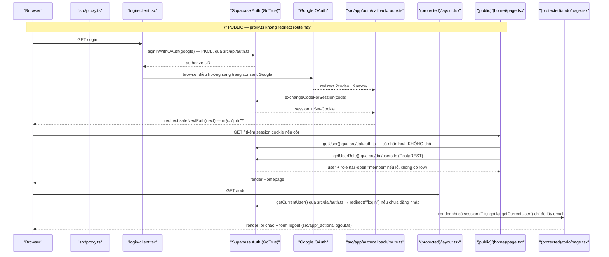

<!--
RECONCILED (F010_SecretBoxModal, plans/260908-1337-secret-box-modal): mục cuối file bên dưới
("Bổ sung dự kiến — SecretBoxModal") đã được đối chiếu lại với as-built sau khi feature merge —
không còn là forward-draft. Mọi dòng gốc phía trên giữ nguyên 100%.
-->


# Architecture

**Phạm vi**: toàn bộ source hiện có trong repo — 6 screen (`/`, `/awards`, `/login`, `/profile`,
`/standards`, `/todo`; route phụ `/auth/callback`), gồm cả F003_Homepage, F004_AwardSystemPage,
F005_StandardsRulesPage và F006_ProfilePage.

**Cập nhật 2026-09-06 (đợt 2 — route colocation)**: toàn bộ source đã chuyển vào `src/`
(`plans/260906-1150-src-route-colocation-refactor/`) — **URL, hành vi runtime, biến môi
trường, khoá `messages/*.json`, script `package.json` KHÔNG đổi**; chỉ đổi file nào chứa
logic, ranh giới import giữa các thư mục, và pattern mà config build/test dùng để tìm file.
Mọi trích dẫn `path:N-M` dưới đây đọc từ vị trí `src/` hiện tại.

**Cập nhật 2026-09-07 (F004_AwardSystemPage)**: thêm 1 route segment PUBLIC ngang hàng
`(home)`/`login` trong group `(public)`: `src/app/(public)/awards/` (Server Component
`page.tsx`, không qua guard nào — xem `permissions.md`). Ba component trước đây riêng của
`(home)` nay climb đúng 1 nấc scope-ladder lên `(public)/_components/` vì có consumer ở cả 2
segment, và đổi tên phản ánh phạm vi mới: `header.tsx` (`HomeHeader`) → `site-header.tsx`
(`SiteHeader`); `home-footer.tsx` (`HomeFooter`) → `site-footer.tsx` (`SiteFooter`);
`kudos-section.tsx` (`KudosSection`, không đổi tên). Cùng lý do, hàm đọc session+role
`getViewer()` (trước đây cục bộ trong `(home)/page.tsx`) được hoisted lên
`src/app/_utils/get-viewer.ts`, dùng chung bởi cả `(home)` và `awards`. `AwardCard`/
lưới giải trên `/` KHÔNG đổi vị trí — vẫn ở `(home)/_components/award-card.tsx`, chỉ đổi
import sang map asset dùng chung `(public)/_shared/award-name-graphics.ts` (`AWARD_NAME_GRAPHIC`,
2 consumer: `award-card.tsx` và `awards/_components/award-section.tsx`). Chi tiết đầy đủ:
`docs/vi/features/F004_AwardSystemPage/technical-spec.md`.

**Cập nhật 2026-09-07 (đợt 2 — F005_StandardsRulesPage)**: thêm 1 route segment PUBLIC ngang
hàng `awards`/`login` trong group `(public)`: `src/app/(public)/standards/` (Server Component
`page.tsx`, không qua guard nào, không đọc session/role — xem `permissions.md`). **Khác hẳn
`/awards`**: route này KHÔNG dùng lại `SiteHeader`/`SiteFooter`/`getViewer()` — design chỉ vẽ 1
panel, không có chrome nào trong node tree (xác nhận bởi E2E: `header`/`footer` count 0) — nên
không có thêm hoisting nào ở tầng `(public)/_utils` hay `(public)/_components` cho phần
header/footer. Nội dung 100% tĩnh từ i18n namespace `standards` — không DAL, không bảng Supabase
mới, không client Supabase nào được gọi từ route này. Một component DUY NHẤT climb scope-ladder:
`IconPencil` (`(home)/_components/icons/icon-pencil.tsx` → `(public)/_components/icons/icon-pencil.tsx`),
vì nút "Viết KUDOS" cần icon bút giống hệt `WidgetButton` trên `/` — cùng pattern climb-1-nấc đã
dùng cho `SiteHeader`/`SiteFooter`/`KudosSection` ở đợt F004, nhưng phạm vi hẹp hơn nhiều (1
file, không đổi tên, 2 consumer: `widget-button.tsx` và `standards-footer-actions.tsx`). Chi
tiết đầy đủ: `docs/vi/features/F005_StandardsRulesPage/technical-spec.md`.

**Cập nhật 2026-09-07 (đợt 3 — F006_ProfilePage)**: thêm 1 route segment PROTECTED mới trong
group `(protected)`, ngang hàng `todo`: `src/app/(protected)/profile/` (Server Component
`page.tsx`, gác bởi ĐÚNG `(protected)/layout.tsx` mà `/todo` dùng — không gate riêng). Điểm hạ
tầng mới: migration `0005_profile_cards_view.sql` thêm view `public.profile_cards`
(`security_invoker = false`, chạy quyền owner/`BYPASSRLS`) — ranh giới đọc THỨ 2 của hệ thống
(sau RLS own-row của `public.users`), phơi đúng 3 cột (`id, full_name, avatar_url`) cho
`authenticated`, không `anon`. DAL mới: `src/dal/profile-cards.ts` (`getProfileCard`, fail-open
`null`) + `src/dal/profile-cards-client.ts` (shim `toProfileCardsClient`, cùng pattern
`toAwardsClient`/`toUsersRoleClient` tránh TS2589).

**Đợt việc này cũng promote toàn bộ chrome dùng chung (`SiteHeader`/`SiteFooter`/`AccountMenu`/
`LogoLink`/`NavLink`/`NotificationBell`/`KeyvisualBackground`/`KudosSection`/`LanguageSelector`/
`icons/*`, cộng `site-chrome.ts`, `get-viewer.ts`, `use-select-locale.ts`, `logout.ts`,
`set-locale.ts`) TỪ `src/app/(public)/_*` LÊN `src/app/_*`** (thư mục private ở gốc `src/app/`,
ngang hàng mọi route-group) — vì `/profile` (nhóm `(protected)`) cần tái dùng CÙNG `SiteHeader`/
`SiteFooter` mà `(public)/(home)` và `(public)/awards` đang dùng, và rule `no-restricted-imports`
cấm 1 segment import `_*` của segment khác qua đường ngang hàng (`(protected)` không được import
`(public)/_components`). Promote lên `src/app/_*` (tổ tiên chung của cả `(public)` và
`(protected)`) là cách hợp lệ DUY NHẤT theo rule đó, không phải một ngoại lệ. `(public)/_shared/
award-name-graphics.ts` CỐ Ý KHÔNG promote — chỉ 2 consumer trong `(public)` (`award-card.tsx`,
`awards/_components/award-section.tsx`), `/profile` không dùng map asset này.

## System Architecture

Layout chia 2 zone:
- **Zone A — `src/<layer>/`**: code dùng chung, nhóm theo LOẠI — `api`, `dal`, `lib`, `hooks`,
  `utils`, `constants`, `i18n`, `mocks`, `styles`.
- **Zone B — `src/app/**`**: code theo FEATURE, nhóm theo ROUTE (`(public)/(home)`,
  `(public)/awards`, `(public)/standards`, `(public)/login`, `(protected)/todo`,
  `(protected)/profile`, `auth/callback`). Mỗi route segment giữ file riêng trong folder private
  của nó: `_components`, `_hooks`, `_actions`, `_utils`, `_shared`. `src/app/_*` (gốc, KHÔNG thuộc
  route-group nào) giữ chrome/action dùng chung bởi CẢ `(public)` lẫn `(protected)` — promote lên
  đây từ F006_ProfilePage vì `(protected)/profile` cần tái dùng `SiteHeader`/`SiteFooter` mà
  trước đó chỉ `(public)/_components` giữ.

Hướng phụ thuộc: Zone A không bao giờ import `src/app` (`eslint.config.mjs:74-92`, rule
`no-restricted-imports`). Trong `src/app/**`, một segment chỉ import folder private của
chính nó, của segment tổ tiên (relative path), hoặc `@/<layer>` — cấm import ngang hàng hay
xuống con vào `_*` của segment khác (`eslint.config.mjs:93-130`, regex-based).

```mermaid
graph TB
    subgraph "Browser"
        Client["Trình duyệt người dùng"]
    end
    subgraph "Next.js App Router (src/)"
        Proxy["src/proxy.ts — edge guard optimistic"]
        ProtectedLayout["src/app/(protected)/layout.tsx — auth gate, thay page tự gọi getUser()"]
        Root["src/app/(public)/(home)/page.tsx — HomePage (F003_Homepage)"]
        HomeClient["src/app/(public)/(home)/_components/home-client.tsx"]
        HomeComponents["src/app/(public)/(home)/_components/**"]
        AwardsRoute["src/app/(public)/awards/page.tsx — AwardsPage (F004_AwardSystemPage, PUBLIC)"]
        AwardsClient["src/app/(public)/awards/_components/awards-client.tsx"]
        AwardsComponents["src/app/(public)/awards/_components/**"]
        SiteChrome["src/app/_components/{site-header,site-footer,kudos-section,account-menu,...}.tsx (promoted lên gốc src/app/_*, dùng chung (home)+awards+profile)"]
        GetViewer["src/app/_utils/get-viewer.ts (promoted lên gốc, dùng chung (home)+awards+profile)"]
        AwardsDal["src/dal/awards.ts (getAwards)"]
        AwardsDalShim["src/dal/awards-client.ts"]
        StandardsRoute["src/app/(public)/standards/page.tsx — StandardsPage (F005_StandardsRulesPage, PUBLIC, static i18n only)"]
        StandardsClient["src/app/(public)/standards/_components/standards-client.tsx"]
        StandardsScreen["src/app/(public)/standards/_components/standards-screen.tsx"]
        RoleHelper["src/dal/users.ts (getUserRole)"]
        RoleShim["src/dal/users-role-client.ts"]
        CountdownLib["src/utils/countdown.ts"]
        CountdownHook["src/app/(public)/_hooks/use-countdown.ts"]
        LocaleHook["src/app/_hooks/use-select-locale.ts (promoted lên gốc)"]
        LoginPage["src/app/(public)/login/page.tsx — self-check qua src/dal/auth.ts"]
        LoginClient["src/app/(public)/login/_components/login-client.tsx"]
        LoginActionsHook["src/app/(public)/login/_hooks/use-login-actions.ts"]
        TodoPage["src/app/(protected)/todo/page.tsx"]
        ProfileRoute["src/app/(protected)/profile/page.tsx — ProfilePage (F006_ProfilePage, PROTECTED)"]
        ProfileClient["src/app/(protected)/profile/_components/profile-client.tsx"]
        ProfileComponents["src/app/(protected)/profile/_components/**"]
        ProfileDal["src/dal/profile-cards.ts (getProfileCard)"]
        ProfileDalShim["src/dal/profile-cards-client.ts"]
        ProfileCardsView[("public.profile_cards — view, security_invoker=false")]
        AuthDal["src/dal/auth.ts (getCurrentUser)"]
        SharedLogout["src/app/_actions/logout.ts — dùng chung (home), (protected)/todo, (protected)/profile"]
        SharedLocaleAction["src/app/_actions/set-locale.ts"]
        Callback["src/app/auth/callback/route.ts"]
        SupaServer["src/lib/supabase/server.ts"]
        SupaProxyClient["src/lib/supabase/proxy-client.ts"]
        SupaBrowserClient["src/lib/supabase/client.ts"]
        AuthApi["src/api/auth.ts (signInWithGoogle)"]
        NextPathGuard["src/utils/url/next-path.ts (safeNextPath)"]
        I18nCfg["src/i18n/request.ts + src/lib/i18n/locale.ts"]
    end
    subgraph "External Services"
        Supabase["Supabase Auth + PostgREST — instance local 'saa-app' (config/migrations committed tai supabase/)"]
        Google["Google OAuth"]
    end

    Client -->|"mọi request"| Proxy
    Proxy --> SupaProxyClient --> Supabase
    Proxy -->|"redirect /login hoặc /todo (không redirect /)"| Client
    Client --> Root --> SupaServer
    Root -->|"getCurrentUser()"| AuthDal --> SupaServer
    Root --> HomeClient --> HomeComponents
    Root -->|"khi đã đăng nhập, đọc role"| RoleHelper --> RoleShim --> SupaServer
    HomeComponents --> CountdownHook --> CountdownLib
    HomeClient --> LocaleHook --> SharedLocaleAction
    HomeComponents --> SharedLogout --> SupaServer
    Client --> AwardsRoute --> SupaServer
    AwardsRoute -->|"đọc viewer dùng chung F003"| GetViewer --> RoleShim
    AwardsRoute --> AwardsDal --> AwardsDalShim --> SupaServer
    AwardsRoute --> AwardsClient --> AwardsComponents
    HomeComponents -.->|"dùng chung, promoted"| SiteChrome
    AwardsComponents -.->|"dùng chung, promoted"| SiteChrome
    Client --> StandardsRoute --> StandardsClient --> StandardsScreen
    Client --> LoginPage -->|"getCurrentUser(), redirect / nếu đã đăng nhập"| AuthDal
    LoginPage --> LoginClient --> LoginActionsHook
    LoginActionsHook -->|"signInWithGoogle()"| AuthApi --> SupaBrowserClient --> Supabase --> Google
    Google -->|"redirect ?code=...&next=/"| Callback
    Callback --> SupaServer
    Callback --> NextPathGuard
    Client --> ProtectedLayout -->|"getCurrentUser(), redirect /login nếu chưa đăng nhập"| AuthDal
    ProtectedLayout --> TodoPage --> SupaServer
    TodoPage --> SharedLogout
    ProtectedLayout --> ProfileRoute
    ProfileRoute -->|"parseProfileId(), lại getCurrentUser()"| AuthDal
    ProfileRoute -->|"đọc role cho header (dùng chung F003)"| RoleHelper --> RoleShim
    ProfileRoute --> ProfileDal --> ProfileDalShim --> SupaServer
    ProfileDalShim -.->|"security_invoker=false, BYPASSRLS"| ProfileCardsView --> Supabase
    ProfileRoute --> ProfileClient --> ProfileComponents
    ProfileComponents -.->|"dùng chung, promoted lên gốc"| SiteChrome
    ProfileComponents --> SharedLogout
```



Hai lớp guard tách biệt, cơ chế không đổi, chỉ đổi file:
- `src/proxy.ts` — guard optimistic. `config.matcher` (`src/proxy.ts:187-189`) KHÔNG còn whitelist
  6-route literal (`/`, `/login`, `/todo/:path*`, `/awards`, `/standards`, `/profile`) — kể từ
  F011_CountdownPrelaunchPage đã đổi sang một negative lookahead khớp mọi path trừ `api`, `auth`,
  `_next/static`, `_next/image`, `favicon.ico`, và file tĩnh:
  `matcher: ["/((?!api|auth|_next/static|_next/image|favicon.ico|.*\\..*).*)"]` (pattern theo
  `node_modules/next/dist/docs/.../proxy.md` § Matcher, khuyến nghị cho "khớp mọi thứ trừ một danh
  sách loại trừ ngắn"). Route mới lộ ra do matcher rộng hơn (vd. `/kudos`) đi qua nhánh khoá
  prelaunch trước (§ CountdownPrelaunchPage bên dưới), trả `{ kind: "pass" }` với ZERO I/O khi
  không áp dụng — không hồi quy chi phí Supabase cho route chưa từng có. Predicate
  `isAuthPage`/`isProtectedPage` đọc từ mảng `PROTECTED_ROUTES = [ROUTES.TODO, ROUTES.PROFILE]`
  (mở rộng từ F006_ProfilePage, trước đó chỉ so khớp `ROUTES.TODO` đơn lẻ), đọc cookie qua
  `getUserOrNull` — chỉ redirect, không phải nguồn sự thật (comment trong `src/proxy.ts` trỏ thẳng
  vào layout dưới đây).
- `src/app/(protected)/layout.tsx` (`src/app/(protected)/layout.tsx:19-29`) — guard
  authoritative DUY NHẤT cho mọi route trong nhóm `(protected)` (`/todo` VÀ `/profile`, mở rộng
  từ F006_ProfilePage — không có gate thứ 2 nào viết riêng cho `/profile`): gọi
  `getCurrentUser()` (`src/dal/auth.ts:16-27`, fail-open `null` khi lỗi) rồi `redirect("/login")`
  nếu không có user, trước khi bất kỳ page con nào render. Thay cho việc trước đây
  `app/todo/page.tsx` tự gọi `getUser()` trong thân trang — `src/app/(protected)/todo/page.tsx`
  nay chỉ gọi `getCurrentUser()` lại một lần (`src/app/(protected)/todo/page.tsx:22`) để lấy
  email cho lời chào, KHÔNG phải để gác quyền truy cập (comment giải thích tại
  `src/app/(protected)/todo/page.tsx:15-19`); `src/app/(protected)/profile/page.tsx` cũng gọi lại
  `getCurrentUser()` một lần, cùng lý do — lấy `viewer.id` cho `parseProfileId()`.
- `src/app/(public)/login/page.tsx` KHÔNG nằm trong nhóm `(protected)` nên KHÔNG qua layout
  trên — trang tự gọi `getCurrentUser()` (`src/app/(public)/login/page.tsx:34-37`) và
  `redirect(ROUTES.HOME)` nếu đã đăng nhập, giữ nguyên hành vi guard cũ của `/login`.

Server Actions dùng chung nhiều route gộp về `src/app/_actions/`:
- `logout.ts` (`src/app/_actions/logout.ts`) — dùng bởi `(home)` (menu tài khoản),
  `(protected)/todo` (form đăng xuất), và `(protected)/profile` (menu tài khoản của `SiteHeader`
  dùng chung, F006_ProfilePage) — không còn sideways import giữa các segment.
- `set-locale.ts` (`src/app/_actions/set-locale.ts`) — root-shell concern, dùng bởi cả
  `login` (`use-login-actions.ts`) và `(home)` (`use-select-locale.ts`).

DAL: `src/dal/users.ts` (`getUserRole`, `import "server-only"`) và
`src/dal/users-role-client.ts` (shim `toUsersRoleClient`, thu hẹp kiểu builder tránh lỗi
TS2589). `src/dal/auth.ts` (`getCurrentUser`) là bổ sung mới của đợt việc này — điểm đọc
session DÙNG CHUNG cho `(protected)/layout.tsx`, `login/page.tsx`, và
`(protected)/todo/page.tsx`; browser-side Supabase call cho OAuth nằm ở `src/api/auth.ts`
(`signInWithGoogle`), gọi từ `use-login-actions.ts` (Zone B, hook). Bổ sung F004_AwardSystemPage:
`src/dal/awards.ts` (`getAwards`, `import "server-only"`, fail-open `[]`) và
`src/dal/awards-client.ts` (shim `toAwardsClient`, cùng pattern thu hẹp kiểu builder tránh
TS2589 như `users-role-client.ts`) — đọc bảng mới `public.awards` (Supabase `saa-app`, thứ 2
sau `public.users`), RLS mở cho cả `anon` và `authenticated` vì `/awards` là route public không
có khái niệm chủ sở hữu dòng. Bổ sung F006_ProfilePage: `src/dal/profile-cards.ts`
(`getProfileCard`, `import "server-only"`, fail-open `null`) và `src/dal/profile-cards-client.ts`
(shim `toProfileCardsClient`, cùng pattern thu hẹp kiểu builder) — đọc view mới
`public.profile_cards` (migration `0005`, thứ 3 sau `public.users`/`public.awards`), CHẠY VỚI
QUYỀN OWNER (`security_invoker = false`, role `BYPASSRLS`) để bỏ qua RLS own-row của
`public.users` — khác hẳn 2 DAL trước, đây là ranh giới đọc "vượt quyền own-row có chủ đích",
không phải RLS mở như `public.awards`. `GRANT SELECT` chỉ cho `authenticated`, không `anon`
(khác `public.awards`) vì `/profile` là route protected.

3 factory `@supabase/ssr` — `src/lib/supabase/{client,server,proxy-client}.ts` — không đổi
logic, chỉ đổi thư mục cha. `src/utils/url/next-path.ts` (`safeNextPath`, chống open-redirect,
business-agnostic) tách khỏi `lib/supabase/` vì không phải vendor glue cho Supabase.

`contexts/` CHƯA tồn tại — chưa tạo trước, tạo khi có consumer thật đầu tiên (YAGNI). `domain/`
và `components/` (shared, ngoài `language-selector`) TỪNG chưa tồn tại nhưng nay đã có consumer
đầu tiên từ CountdownPrelaunchPage: `src/domain/prelaunch-lock.ts` (`planProxy`,
`isPrelaunchLockEnabled`) và `src/app/(public)/_components/countdown-tiles.tsx` — xem § "Bổ sung dự kiến —
CountdownPrelaunchPage" cuối file. `src/configs/env.ts` vẫn chưa tồn tại: `EVENT_START_AT` nay đọc
trực tiếp ở BA nơi độc lập — `src/app/(public)/(home)/page.tsx` (`resolveTargetIso()`),
`src/app/(public)/prelaunch/page.tsx` (hàm cùng tên, cố ý KHÔNG chia sẻ — 8 dòng đọc env không
đáng tách, theo quyết định của phase build feature này) và `src/proxy.ts` (qua
`parseTargetDate`/`remaining` dùng chung từ `src/utils/countdown.ts`) — vẫn chưa tới ngưỡng cần
`src/configs/env.ts`.

## Tech Stack

| Layer | Technology | Version |
|-------|------------|---------|
| Framework | Next.js (App Router) | 16.3.4 |
| UI | React / React DOM | 19.2.8 |
| Ngôn ngữ | TypeScript | ^5 |
| Styling | Tailwind CSS (`@tailwindcss/postcss`) | ^4 |
| i18n | next-intl (no-routing, cookie `NEXT_LOCALE`) | 4.14.2 |
| Auth SDK | `@supabase/ssr` | 0.12.5 |
| Auth SDK | `@supabase/supabase-js` | 2.115.0 |
| Auth backend | Supabase Auth (GoTrue) — instance local `saa-app`, config/migrations committed tại `supabase/` | API `http://127.0.0.1:55321` |
| Backend (in-repo) | Next.js Server Actions + Route Handlers (không có service backend riêng) | — |
| Database | `public.users` (cột `role`, RLS own-row) + `public.awards` (F004, 6 hàng × locale, RLS mở cho `anon`+`authenticated`) + `public.profile_cards` (F006, view SECURITY-DEFINER-equivalent phái sinh từ `public.users`, `GRANT SELECT` chỉ `authenticated`) — 2 bảng + 1 view, cả ba đọc qua PostgREST | — |
| Package manager | pnpm (`packageManager` field, không dùng corepack) | 10.33.2 |
| Node.js | `engines.node` | `>=22 <25` (CI chạy Node `24`) |
| Testing (unit) | Vitest (2 project: `node`, `jsdom`) | ^3.2.7 |
| Testing (e2e) | `@playwright/test` (chromium) | 1.62.1 |
| Component docs | Storybook + `@storybook/nextjs-vite` + `msw-storybook-addon` | 10.6.0 / 10.6.0 / 3.0.0 |
| Lint | ESLint flat config + 2 rule `no-restricted-imports` (boundary) | ESLint ^9 |
| CI/CD | GitHub Actions (`.github/workflows/ci.yml`) — 2 job độc lập: `quality` và `e2e` | — |

Nguồn: `package.json`, `eslint.config.mjs`, `tsconfig.json`, `vitest.config.ts`.

**Config theo đợt di chuyển vào `src/`:**
- `tsconfig.json`: `"@/*": ["./src/*"]` (`tsconfig.json:22`).
- `vitest.config.ts`: alias `@` → `./src` (`vitest.config.ts:29-30`); project `node` =
  `src/**/*.test.ts` trừ `src/hooks/**` và `src/app/**/_hooks/**`; project `jsdom` =
  `src/hooks/**/*.test.ts` và `src/app/**/_hooks/**/*.test.ts`. Coverage `include` là allowlist
  tường minh: `src/{api,dal,lib,utils,hooks,domain,configs}/**/*.ts`,
  `src/app/**/{_hooks,_utils,_actions}/**/*.ts`, `src/app/**/actions.ts`, `src/app/**/route.ts`
  (`vitest.config.ts:97-110`). Ngưỡng `100%` giữ nguyên — không có glob `.tsx`, `components/**`
  (nay `_components/**`) và `page.tsx` vẫn ngoài mẫu số cùng lý do cũ (Storybook tài liệu hoá
  component; `async` Server Component chưa được Vitest hỗ trợ).
- `.storybook/main.ts`: `stories: ["../src/**/*.stories.@(ts|tsx)"]`.
- `eslint.config.mjs`: 2 block `no-restricted-imports` mới — Zone A cấm import `@/app/**`
  (`:74-92`); trong `src/app/**` cấm import private folder (`_*`) của segment khác qua alias
  hay đường ngang hàng/xuống con (`:93-130`, dùng `regex` vì glob `group` không phân biệt được
  `../login/_components` (cấm) với `../../_components` (tổ tiên, cho phép)).
- `src/constants/routes.ts` (mới) gom URL literal (`ROUTES.LOGIN/HOME/TODO`) dùng bởi
  `proxy.ts`, các page, và test — trừ `config.matcher` của `src/proxy.ts` (`:119-121`), nơi
  Next.js phân tích tĩnh tại build time nên bắt buộc giữ mảng literal.

**Ở lại gốc repo, không di chuyển**: `messages/` (next-intl default), `public/`,
`tests/{e2e,setup}/` (Playwright `testDir`, vitest `setupFiles`), mọi root config file.

## Data Flow



Luồng OAuth (PKCE), đích mặc định sau đăng nhập (`/`), và cơ chế `safeNextPath` KHÔNG đổi so
với trước — chỉ đổi file chứa logic (bảng path ở § System Architecture). Nguồn hành vi giữ
nguyên: `src/app/(public)/login/_hooks/use-login-actions.ts:43-58` (`handleLoginClick`),
`src/api/auth.ts:40-56` (`signInWithGoogle`, gọi `signInWithOAuth` thật),
`src/app/auth/callback/route.ts:17-47` (exchange code, redirect matrix), nhánh lỗi redirect
`/login?error=...` không lộ raw error (`src/app/auth/callback/route.ts:24-29,40-43`).

Locale action (`src/app/_actions/set-locale.ts`) và role/countdown flow (`src/dal/users.ts`,
`src/app/(public)/_hooks/use-countdown.ts` + `src/utils/countdown.ts`) giữ nguyên cơ chế,
chỉ đổi path — `use-select-locale.ts` (Homepage) và `use-login-actions.ts` (`/login`) gọi
CÙNG Server Action nhưng qua hai hook riêng, không chia sẻ transition.

**Test topology.** Bộ Playwright (`tests/e2e/login.spec.ts`, 30 test; `tests/e2e/home.spec.ts`,
27 test; project `chromium` duy nhất, `playwright.config.ts`) chia 2 tập theo việc có cần một
Supabase Auth endpoint reachable hay không:
- **Tập CI-safe** (`--grep-invert @auth`): không cần Supabase thật — `src/proxy.ts` và các
  Server Component tự bọc `getUser()`/`getCurrentUser()` trong try/catch, coi mọi lỗi là "chưa
  có session" (fail-open, không đổi qua đợt di chuyển này).
- **Tập local-only** (tag `{ tag: "@auth" }`): đăng nhập thật qua session cookie, cần Supabase
  Auth instance reachable (`saa-app` local); `ci.yml` tự ghi rõ job `e2e` KHÔNG phủ đường xác
  thực và nhánh exchange-code-thành-công của `/auth/callback` không có test tự động nào.

MSW: một handler list (`src/mocks/handlers.ts`, 73 dòng, có handler `GET
{SUPABASE_URL}/rest/v1/users`) phục vụ cả `msw/node` (vitest) và service worker (Storybook) —
không đổi cơ chế qua đợt di chuyển này.

## Deployment View

> Derived from repository infrastructure-as-code — not verified against production.

N/A cho đích triển khai (deployment target) — repo không có infrastructure-as-code hay cấu
hình host/deploy nào (không `Dockerfile`/`*.tf`/`vercel.json`/`fly.toml`/k8s manifest).
`.github/workflows/ci.yml` là CI (kiểm tra chất lượng trước khi merge), không phải deployment
pipeline. **Không có branch protection** (xác minh 2026-09-05, `gh api
repos/.../branches/main/protection` → 404) — hiện không job nào thực sự chặn được merge.

CI giữ nguyên 2 job (`quality`, `e2e`), không đổi trigger (`push`/`pull_request` vào `main`,
`workflow_dispatch`). Cache khoá theo `pnpm-lock.yaml`; job `quality` chạy cùng script
`package.json` (`lint`, `format:check`, `test:unit:coverage`, `build`, `typecheck`) trên source
đã dời sang `src/`; job `e2e` build/chạy `next dev` không đổi vì `tests/e2e/` ở nguyên gốc
repo. **Gap còn mở**: `ci.yml` chưa set `EVENT_START_AT` cho bước `build` của job `quality` —
thiếu nó không fail build (countdown hiện `00/00/00`). Không job nào triển khai ứng dụng ra
môi trường chạy thật.


## Bổ sung dự kiến — F007_KudosLiveBoard + F008_KudosHeartReaction

> **[F007/F008 draft — chưa merge]** Delta của hai feature trong
> `plans/260907-1725-kudos-live-board/`. Quyết định gốc: `clarifications.md § Quyết định`.

### Lần đầu ứng dụng có đường GHI

Sáu feature trước đều là đọc: DAL `server-only` → Server Component → HTML. F008 thêm mắt xích
chưa từng có — một **Server Action** ghi vào Supabase rồi làm mới dữ liệu đang hiển thị. Hình
dạng mới của luồng:

```text
đọc   : page.tsx (RSC) → src/dal/kudos.ts (server-only, client injected) → Supabase → HTML
ghi   : nút tim (client) → Server Action → Supabase (RLS enforce) → revalidate → RSC render lại
```

Ranh giới giữ nguyên như các feature trước: component không tự tạo Supabase client, DAL không
bao giờ được import vào client bundle, adapter `*-client.ts` là chỗ duy nhất bắc cầu.

### "Live board" KHÔNG phải Supabase Realtime

Tên frame là nhãn design. Không test case nào đòi dữ liệu tự cập nhật khi không reload, và repo
chưa có một ví dụ Realtime nào. Chốt: server render + revalidate sau mỗi lượt ghi. Ghi lại ở đây
để lần sau không ai đọc chữ "Live" rồi tưởng đã có kênh realtime.

### Vì sao Spotlight là layout tĩnh chứ không phải canvas

Cây node của frame cho thấy Spotlight (`2940:14174`) được dựng bằng ~120 TEXT node tĩnh của đúng
8 cái tên lặp lại, và nút `B.7.2_Pan zoom` là một FRAME rỗng — không có canvas, không có dữ liệu
node. Chỉ tổng số `388 KUDOS` (`3007:17482`) là query thật theo spec. Nên phần này được dựng như
một scatter tĩnh trên dữ liệu thật, không kéo thêm thư viện viz nào vào bundle.

## Bổ sung dự kiến — F009_KudosCompose ("Viết Kudo")

> **Đã lên code thật** (nhánh `feat/kudos-write-modal`, 2026-09-08) — đối chiếu lại với as-built;
> `pnpm build`/`typecheck`/`lint --max-warnings 0`/`format:check`/`test:unit:coverage` (100%, 61
> file/492 test) đều sạch, e2e `tests/e2e/kudos-compose.spec.ts` 27/27 (`evidence/green-evidence.md`).
> Quyết định gốc: `clarifications.md § Quyết định` + `plan.md` § AD-1..AD-8. Nguồn kỹ thuật:
> `plans/260907-2338-kudos-write-modal/research/researcher-data-layer-report.md`.

### Lần đầu ứng dụng có Supabase Storage — data-store thứ 3

Tính tới F008, hệ thống có 2 ranh giới đọc dữ liệu Supabase: RLS own-row
trên `public.users` (migration `0001`) và view SECURITY DEFINER
(`public.profile_cards`, `public.kudos_cards`). F009 thêm loại data-store
thứ 3 chưa từng dùng trong repo: **Supabase Storage**, bucket mới
`kudo-images`.

`supabase/config.toml:109-120` đã bật `[storage] enabled = true` +
`file_size_limit = "50MiB"` từ trước, nhưng khối `[storage.buckets.images]`
vẫn đang comment — không dùng khối này. F009 mở bucket bằng **migration SQL**
(`INSERT INTO storage.buckets`, `0010_kudo_images_bucket.sql`), không bật qua
`config.toml`, để mọi môi trường apply migration đều có bucket giống nhau —
cùng cách `0006`/`0007` đã tạo bảng, không phải một cơ chế riêng (quyết định
trong `clarifications.md § Quyết định` — "Upload ảnh"). Xác nhận đã apply
sạch trên instance local: `migration-transcript.md § 5` (`storage.buckets`
có hàng `kudo-images`, `public = true`).

Ai ghi, ai đọc:
- **Ghi**: Server Action `createKudo` (`create-kudo.ts:99,134-141`) — nhận
  file ảnh qua `FormData`, gọi `uploadKudoImages()` (`upload-kudo-images.ts`)
  → `.storage.from("kudo-images").upload(...)` bằng ĐÚNG client
  `@supabase/ssr` cookie-based mà action đã dùng để `auth.getUser()` và
  `INSERT` hàng `kudos` (không tạo client Storage riêng) — qua shim hẹp
  `toKudoStorageClient`, cùng pattern `toSunnerSearchClient` (tránh TS2589).
- **Đọc — KHÁC dự đoán ban đầu của draft này**: `` trên feed KHÔNG gọi
  thẳng URL public của Storage. `kudos-image-strip.tsx` dùng `next/image`
  (không `unoptimized`, F007 đã dùng `next/image` cho mọi ảnh) nên trình
  duyệt gọi qua **Next.js Image Optimizer** (`/_next/image?url=<percent-
  encoded>&w=...&q=...`), route này mới fetch URL Storage thật ở phía
  server. Hệ quả bắt buộc phải cấu hình `next.config.ts` (xem "Cấu hình
  next.config.ts" dưới) — thiếu nó, `next/image` throw đồng bộ tại render
  time ("Invalid src prop ... hostname ... is not configured") ngay khi
  kudo đầu tiên có ảnh Storage xuất hiện, crash `/kudos` (phát hiện thật
  trong lúc implement, không phải suy đoán — `implementer-phase-06-decisions.md`
  § "Follow-up fix").
- **Đích**: URL trả về từ `.getPublicUrl()` (dạng
  `.../storage/v1/object/public/kudo-images/<userId>/<uuid>.<ext>`, đuôi
  file suy từ MIME type, KHÔNG từ tên file người dùng upload — chặn path-
  traversal/va chạm tên) được nối vào mảng `kudos.image_urls text[]` (cột
  đã có sẵn từ `0006_kudos.sql:26`, comment `0006_kudos.sql:33` "Up to 5
  elements (BR-007); enforced by the UI, not a CHECK constraint here" —
  không migration nào cần sửa cột này).

### Luồng ghi 1 kudo — đối lập với luồng đọc đã có

Sáu feature đầu (F001–F006) và cả F007 đều là đọc thuần: DAL `server-only`
→ Server Component → HTML. F008 thêm Server Action ghi đầu tiên
(`toggle-kudo-heart.ts`) nhưng ghi vào bảng phụ (`kudo_hearts`), không đụng
`kudos`. F009 là lần đầu có một Server Action **INSERT** thẳng vào
`public.kudos`:

```text
đọc (không đổi) : page.tsx (RSC) → src/dal/kudos.ts (server-only) → kudos_cards (SECURITY DEFINER) → HTML
ghi (mới)       : dialog "Viết Kudo" (client) → create-kudo.ts (Server Action)
                    → (nếu có ảnh) Storage upload → 5 URL
                    → INSERT public.kudos (RLS kudos_insert_own, xem permissions.md)
                    → revalidatePath(ROUTES.KUDOS) → RSC render lại
```

Đừng nhầm hai luồng: `kudos_cards` là VIEW chỉ-đọc (join, không
updatable — `0006_kudos.sql:98` ghi rõ "NOT auto-updatable in Postgres"),
KHÔNG BAO GIỜ là đích INSERT. Action ghi thẳng vào bảng gốc `public.kudos`,
router đọc lại qua view như cũ.

Nút mở dialog đã có sẵn trong repo trước F009, cố tình vô hiệu (`<input
readOnly>`, không `onClick`). F009 lấp khoảng trống đó, nhưng KHÔNG đổi
pill thành `<button>` (F007's e2e C03 vẫn assert `<input readOnly>`) — thay
vào đó tách quyết định "mở dialog hay điều hướng" ra khỏi pill:
- `kudos-compose-pill.tsx` (giữ nguyên `<input readOnly>`, thêm `role="button"`
  vì WAI-ARIA không cho `<input>`/`textbox` mang `aria-expanded`) chỉ báo
  `onActivate()` lên trên qua `onClick`/`onKeyDown` (Enter/Space) — không tự
  quyết định đích đến.
- `kudos-compose-launcher.tsx` (mới) sở hữu quyết định đó: `handleActivate()`
  gọi `dialog.open()` (`<dialog>` native, `showModal()`, qua
  `useKudosComposeDialog`) khi `isSignedIn`, ngược lại `router.push(ROUTES.LOGIN)`
  — cùng file cũng wire `useKudosComposeForm` (toàn bộ state machine form) và
  đóng dialog khi submit thành công.

### DAL đọc mới: tìm người nhận qua `profile_cards`

`public.users` bật FORCE RLS own-row (`0001_...sql:55-59`) nên không ai
query trực tiếp bảng đó để tìm "Sunner khác" — kể cả để làm ô chọn người
nhận. F006_ProfilePage đã mở view `public.profile_cards`
(`security_invoker = false`, `GRANT SELECT` chỉ `authenticated`,
`0005_profile_cards_view.sql:70`) đúng cho việc này, nhưng chỉ có hàm
đọc-1-id (`getProfileCard`, `src/dal/profile-cards.ts:74`). F009 thêm một
hàm đọc-nhiều mới — file riêng, không sửa `src/dal/profile-cards.ts` (giữ
ranh giới sở hữu file theo feature, quyết định trong `clarifications.md`):

- `src/dal/sunner-search.ts` (mới) — hàm `searchSunners(client, query,
  limit)`, `ilike` trên `full_name` qua `profile_cards`, `import
  "server-only"`, nhận client injected như mọi DAL khác trong repo (không
  tự tạo client — pattern `getKudosBoard`/`getProfileCard`).
- `src/dal/sunner-search-client.ts` (mới) — adapter thu hẹp kiểu builder,
  cùng pattern `toProfileCardsClient`/`toAwardsClient`/`toUsersRoleClient`
  (tránh lỗi TS2589 khi truyền `ServerSupabaseClient` nguyên bản qua nhiều
  tầng gọi).

Không nới `SELECT` list của `profile_cards` — doc-comment của view tự cấm
(`0005_profile_cards_view.sql`, mã SEC_004) — 3 cột hiện có (`id,
full_name, avatar_url`) là đủ cho ô chọn người nhận.

### Không thêm bảng hashtag; gợi ý dẫn xuất từ dữ liệu đã đọc

Không có bảng vocabulary hashtag nào trong schema — `getKudosBoard`
(`src/dal/kudos.ts:132`) đã tự suy hashtag từ nội dung `kudos_cards` để
phục vụ bộ lọc trên `/kudos`. Dialog "Viết Kudo" nằm CÙNG trang, nên nhận
lại đúng danh sách đó qua prop có sẵn — không query thêm, không bảng mới
(quyết định `clarifications.md`, tránh trùng lặp một nguồn dữ liệu đã tồn
tại — DRY).

### ADR — Server Action upload ảnh, không phải browser-side upload trực tiếp

**Bối cảnh**: dialog cho phép đính tối đa 5 ảnh (BR-007,
`0006_kudos.sql:33`). Hai cách hợp lý để đưa ảnh lên Storage:

| | A — Server Action upload (chọn) | B — Browser upload trực tiếp |
|---|---|---|
| Client Supabase dùng | `@supabase/ssr` server (cookie), CÙNG client action đã dùng để `INSERT kudos` | `src/lib/supabase/client.ts` (factory đã tồn tại nhưng **0 lần được gọi để ghi** ở bất kỳ đâu trong `src/` — researcher-data-layer-report.md § 2, § "Client variant") |
| Điểm re-derive danh tính | 1 lần, trong action (`auth.getUser()`), gác cả upload lẫn insert | 2 lần tách rời: RLS Storage lúc browser upload, RLS `kudos_insert_own` lúc action insert |
| Khớp pattern có sẵn | Đúng 100% `toggleKudoHeart` (`createClient()` → `auth.getUser()` → fail-closed → `revalidatePath`) | Không có tiền lệ nào trong repo — mọi Supabase call ngoài OAuth (`src/api/auth.ts:40-56 signInWithGoogle`) đều chạy server-side |
| Độ phức tạp thêm vào client | Không — 1 `<form>` submit, JS y hệt các action khác | Thêm state machine 2 bước (upload → lấy URL → gọi action), thêm bundle logic upload phía client |
| Giới hạn thực tế | Payload Server Action qua `FormData` — ổn với ≤5 ảnh, `file_size_limit` Storage vẫn là `"50MiB"`/file (`config.toml:112`); không cần progress bar riêng vì spec không vẽ UI progress-per-file | Tốt hơn cho ảnh rất lớn/nhiều ảnh đồng thời — nhưng không phải bài toán ở đây (tối đa 5 ảnh, dialog 1 lần gửi) |

**Quyết định: A — Server Action upload.** Lý do theo đúng thứ tự ưu tiên
CLAUDE.md § "Quyết định thay tôi": **(b) khớp pattern đã có trong repo**
thắng — repo hiện có ĐÚNG MỘT client variant từng ghi dữ liệu
(`@supabase/ssr` server, cookie-based), không có service-role, không có
browser-side write nào ngoài luồng OAuth. Dựng thêm một luồng upload
browser-side là mở một class client-trust mới (khác OAuth redirect) chỉ để
phục vụ đúng 1 form, ngược YAGNI. Rủi ro đã canh khi implement (payload
Server Action chạm giới hạn body mặc định của Next) — xem cấu hình đã chốt
ngay dưới đây.

### Cấu hình `next.config.ts` — đã chốt (F009)

Đọc `node_modules/next/dist/docs/01-app/03-api-reference/05-config/
01-next-config-js/serverActions.md` trước khi sửa (bắt buộc theo AGENTS.md —
bản Next trong repo này khác thường, `proxy.ts` thay vì `middleware.ts`).
Xác nhận: mặc định `1MB`, nhận chuỗi kiểu `'Nmb'`, và tính trên RAW body kể
cả overhead `multipart/form-data` (docs khuyên chừa 10-20KB). Chốt
`bodySizeLimit: "28mb"` (5 ảnh × 5 MiB cap ở `validate-kudo-images.ts` ≈
26.2MB + chỗ chừa).

Thêm `images.remotePatterns` (bắt buộc — xem "Ai ghi, ai đọc" ở trên) đọc
`node_modules/next/dist/docs/01-app/03-api-reference/02-components/image.md`
§ `#remotepatterns` — `pathname` scope đúng
`/storage/v1/object/public/**` (không phải `**` trần), `protocol`/`hostname`/
`port` suy từ `NEXT_PUBLIC_SUPABASE_URL` tại config-load time (không hardcode
host, để local + hosted đều chạy được không cần sửa file). Cộng
`images.dangerouslyAllowLocalIP: true` — CHỈ khi hostname đã parse là
loopback/private (`127.0.0.1`, `localhost`, `::1`, `10.0.0.0/8`,
`172.16.0.0/12`, `192.168.0.0/16`); một hostname public/hosted luôn để
`false` (tránh mở SSRF qua Next Image Optimizer). Lý do bắt buộc thêm flag
này: Next 16 image optimizer tự chặn fetch một hostname resolve ra IP
private/loopback trừ khi bật cờ này (`node_modules/next/dist/server/
image-optimizer.js:921-941`), độc lập với `remotePatterns` — instance local
`saa-app` (`127.0.0.1:55321`) sẽ bị chặn nếu thiếu. Cả 3 field
(`bodySizeLimit`, `remotePatterns`, `dangerouslyAllowLocalIP`) đọc và verify
tại `next.config.ts:1-151` — không đoán số, cả hai lần đọc docs đều ghi lại
trong `implementer-phase-06-decisions.md`.

### Rendering định dạng — tách khỏi phạm vi F009, chạm đúng 1 file của F007

Toolbar định dạng (B/I/S/số thứ tự/link/quote) chèn marker
markdown-subset (`**b**`, `*i*`, `~~s~~`, `1. `, `[text](url)`, `> `) vào
một `<textarea>` thường (`insert-markdown-marker.ts`; không rich editor —
repo không có precedent contentEditable). `kudos-card.tsx` trước F009 render
`{card.content}` dạng plain text; nay gọi
`<KudoMarkdownText text={card.content} />` (`kudo-markdown-text.tsx`, mới) —
parser thuần `parse-kudo-markdown.ts` dựng cây token rồi renderer build
thẳng React element (`<strong>`/`<em>`/`<del>`/`<a>`/`<blockquote>`/`<ol><li>`),
KHÔNG `dangerouslySetInnerHTML`, KHÔNG thêm dependency markdown (quyết định
`clarifications.md`) — link chỉ tạo `<a>` khi `href` bắt đầu `http://`/
`https://` (whitelist, chặn `javascript:`), degrade về text thô khi marker
lỗi thay vì throw. Đây là điểm CHẠM DUY NHẤT của F009 vào file thuộc F007
(`kudos-card.tsx`, chỉ đổi 1 dòng render, không đổi test contract F007 vì
seed data không chứa marker nào).

### Không đổi

- Không route mới, không đổi `src/proxy.ts` matcher — `/kudos` vẫn PUBLIC,
  không route-guard (xem permissions.md).
- Không service-role client mới — action vẫn dùng `@supabase/ssr` server
  client hiện có (`src/lib/supabase/server.ts`).
- `domain/`, `contexts/`, `src/configs/env.ts` tiếp tục CHƯA tồn tại — F009
  không tạo consumer đầu tiên cho các thư mục này (YAGNI, cùng ghi chú ở
  mục gốc phía trên).

## Bổ sung dự kiến — SecretBoxModal

> **[F010_SecretBoxModal — đã merge]** Delta của feature đã build xong trong
> `plans/260908-1337-secret-box-modal/`. Quyết định gốc: `clarifications.md § Session 260908`.
> Mã feature `F010` đã cấp ở `feature-list.md`; PERM###/BL### riêng vẫn chờ Core `rebuild-spec`
> pass — KHÔNG tự đoán số ở đây.

### Lần đầu ứng dụng có đường gọi `.rpc()` — một lane mới cạnh DAL→table hiện có

Tính tới F009, MỌI đường đọc/ghi của repo đi qua `.from(table)` (query builder PostgREST) —
grep `src/` không có lệnh gọi `.rpc(...)` nào. SecretBoxModal thêm lane thứ hai: một Server
Action gọi `supabase.rpc("open_secret_box")` thay vì `.from("secret_box_openings").insert(...)`.
Lý do KHÔNG dùng `.from().insert()` như `kudos_insert_own`/`kudo_hearts_insert_own` đã làm: hai
policy đó chỉ cần đối chiếu danh tính hàng (`sender_id = auth.uid()`); ở đây phép tính "còn bao
nhiêu hộp" phải chạy TRƯỚC lượt ghi, TRONG cùng transaction, và không được lộ ra ngoài cho client
tự tính rồi gửi kết quả lên — một RLS `WITH CHECK` đơn thuần không diễn tả được yêu cầu đó, cần
hẳn một hàm Postgres. Tiền lệ ghi-có-thẩm-quyền gần nhất trong repo là trigger
`sync_kudo_heart_count` của `0007` (xem permissions.md § SecretBoxModal) — cùng cơ chế
`SECURITY DEFINER` + `SET search_path`, khác cách kích hoạt (gọi trực tiếp, không phải trigger).

```text
đọc (không đổi) : page.tsx (RSC) → getKudosStats (src/dal/kudos-stats.ts) → HTML
ghi (mới)       : nút "Mở Secret Box" (client) → Server Action → supabase.rpc("open_secret_box")
                    → Postgres: khoá theo user, tính lại entitlement, INSERT secret_box_openings
                    → trả badge_key → revalidatePath(ROUTES.KUDOS) → RSC render lại
```

Ranh giới component/DAL/adapter giữ nguyên như mọi feature trước: dialog không tự tạo Supabase
client, action vẫn dùng CÙNG client `@supabase/ssr` cookie-based đã gọi `auth.getUser()` cho
những Server Action khác trong repo — không có client mới, không có service-role mới.

### Biên kiểu runtime tại RPC — tiếp tục pattern `unknown`-boundary

`createClient()` không mang `Database` generic (`src/lib/supabase/server.ts`), nên kết quả của
`.rpc()` cũng KHÔNG có kiểu tĩnh nào hơn `any`/`unknown` — đúng vấn đề mà
`toggleKudoHeart` (`toggle-kudo-heart.ts:136-139`) đã gặp và giải quyết cho `heart_count`: gán
qua `unknown` trước, rồi `typeof` check thành kiểu thật, thay vì để `any` lọt ra ngoài function
boundary. Server Action đọc kết quả `open_secret_box()` (badge key, số hộp còn lại) áp dụng ĐÚNG
pattern đó — không phát minh cách kiểm tra kiểu mới cho response của RPC.

### Log mở hộp, không phải cột đếm — tránh lệch với trigger `0007`

`secret_box_openings` là một BẢNG LOG (mỗi lượt mở = 1 hàng), không phải một cột đếm cộng dồn
trên `public.users`. Lý do là bài học đã có sẵn trong repo: `kudos.heart_count` (một cột đếm)
sống được CHỈ vì đúng một trigger (`sync_kudo_heart_count`, `0007`) là writer DUY NHẤT của nó —
mọi writer thứ hai sẽ làm nó lệch khỏi dữ liệu gốc. Một cột đếm "số hộp đã mở" trên `secret_box`
sẽ phải đồng bộ với CHÍNH `open_secret_box()`, nghĩa là thêm một điểm có thể lệch mà không mang
lại lợi ích gì `count(*)` không cho sẵn. `opened = count(*) FROM secret_box_openings WHERE user_id
= viewer`, `unopened = entitlement − opened` — không có trạng thái nào tách rời khỏi log để lệch.

### Thuật toán rút thăm có trọng số (ALG)

Verbatim theo spec row C của MoMorph (không tự suy tỷ lệ khác): Stay Gold 30%, Flow to Horizon
25%, Touch of Light 20%, Beyond the Boundary 10%, Revival 10%, Root Further 5% (tổng 100%). Một
huy hiệu MỖI lượt mở; trùng huy hiệu giữa các lượt là hợp lệ — spec không có luật chống trùng
(xem permissions.md § SecretBoxModal cho lý lẽ đầy đủ). Rút thăm chạy TRONG hàm Postgres, không
phải phía client hay phía Server Action — cùng lý do bắt buộc dùng `.rpc()` ở trên.

### Luồng dữ liệu tới màn hình

`/kudos` server component (`page.tsx`) đã gọi `getKudosStats` cho 3 counter hiện có
(`received`/`sent`/`hearts`); SecretBoxModal thêm một đường đọc song song cho
`secretBoxOpened`/`secretBoxUnopened` (thay 2 giá trị hardcode `0` trước đây, qua
`buildViewerStats` tại `page.tsx:78`), gộp
vào CÙNG props đi xuống `KudosStatList` — không tạo Server Component riêng cho modal. Chuỗi:
server component đọc stats → props xuống dialog client → người dùng bấm → Server Action → RPC
`open_secret_box()` → `revalidatePath` → RSC render lại với số mới + huy hiệu vừa nhận.

### Phạm vi: chỉ `/kudos`, `src/proxy.ts` không đổi

Cùng lý lẽ F009 đã lập cho `/kudos` (§ "Vì sao `/kudos` KHÔNG vào `src/proxy.ts` dù đã có đường
ghi" ở trên): gate nằm ở HÀNH ĐỘNG (gọi RPC), không nằm ở ROUTE. `/kudos` tiếp tục PUBLIC, không
thêm vào `config.matcher`. Khác F009 ở một điểm: SecretBoxModal không cần lớp UX "mở dialog hay
điều hướng `/login`" riêng, vì nút "Mở Secret Box" chỉ tồn tại trên DOM khi `stats !== null` —
tức là chỉ render khi đã có viewer, không có nhánh anonymous nào để điều hướng (xem
permissions.md § SecretBoxModal). `/profile` không đổi gì — nút ở đó vẫn `disabled`, không route,
không component nào của `/profile` bị chạm bởi feature này.

## Bổ sung dự kiến — CountdownPrelaunchPage

> **[F011_CountdownPrelaunchPage — đã lên code, chưa merge main]** Delta của feature xây trong
> `plans/260908-1653-countdown-prelaunch-page/` (nhánh `feat/countdown-prelaunch-page`). Quyết
> định gốc: `clarifications.md § Session 2026-09-08`. Đối chiếu lại với `src/domain/prelaunch-lock.ts`
> và `src/proxy.ts` as-built — hai điểm SAU khi draft ban đầu được viết đã đổi (xem 2 mục cuối).

### Route mới, PUBLIC, không route-guard riêng cho chính nó

`src/app/(public)/prelaunch/` (Server Component `page.tsx`) — cùng nhóm `(public)` như `/`,
`/awards`, `/standards`; bản thân route không đọc session để quyết định hiển thị. Ba module đếm
ngược trước đây riêng của `(home)` đã CLIMB scope-ladder lên Zone A dùng chung — cùng nguyên tắc
climb đã áp dụng cho `SiteHeader`/`SiteFooter`/`get-viewer.ts` ở các đợt trước, khác ở chỗ lần này
lên hẳn `src/<layer>/` (không phải một `_*` private folder của route-group) vì cả 2 consumer
(`(home)` và `prelaunch`) là component/hook/util thuần:
- `src/utils/countdown.ts` (từ `(home)/_utils/countdown.ts`)
- `src/app/(public)/_hooks/use-countdown.ts` (từ `(home)/_hooks/use-countdown.ts`)
- `src/app/(public)/_components/countdown-tiles.tsx` (từ `(home)/_components/countdown-tiles.tsx`) — consumer
  ĐẦU TIÊN của `src/components/`, thư mục mới chưa từng tồn tại tính tới F010.

Domain logic thuần mới: `src/domain/prelaunch-lock.ts` (`planProxy`, `isPrelaunchLockEnabled`) —
zero I/O, không tự gọi `Date.now()` hay Supabase; consumer ĐẦU TIÊN của `src/domain/`, thư mục
cũng mới chưa từng tồn tại tính tới F010.

### Điểm thật sự mới: mở rộng edge guard `src/proxy.ts`, KHÔNG phải một guard thứ hai

Khoá điều hướng của feature này là một nhánh MỞ RỘNG chạy TRƯỚC nhánh guard đăng nhập optimistic
hiện có bên trong `proxy()` — không phải file guard mới. Cờ mới `PRELAUNCH_LOCK_ENABLED`, mặc định
TẮT (fail-safe: chỉ đúng chuỗi `"true"`, không phân biệt hoa/thường, mới bật khoá — thiếu biến,
rỗng, hay bất kỳ giá trị nào khác kể cả `"1"` đều là TẮT). Điều kiện khoá là AND của 2 vế:

```text
khoá khi:  PRELAUNCH_LOCK_ENABLED === "true"  AND  countdown (EVENT_START_AT) chưa về 0
```

`reached` tính bằng ĐÚNG `parseTargetDate`/`remaining` mà `/prelaunch` dùng (DRY — một phép tính
ngày cho cả feature); `EVENT_START_AT` thiếu/sai định dạng parse ra `null` → đọc là "chưa về 0"
(không bao giờ tự khoá lặp `/prelaunch` → `/` do lỗi parse, BR-004).

**Ngoại lệ miễn khoá** (không route nào trong danh sách bị redirect dù khoá đang bật): `/prelaunch`
(chính nó — có luật riêng, xem dưới), `/auth/*` (OAuth callback), `/api/*` (route handler),
`/_next/*` và mọi file tĩnh có phần mở rộng. Khi countdown đã về 0, khoá tự gỡ hoàn toàn dù cờ còn
`true`; vào lại `/prelaunch` lúc đó bị đưa về `/`.

### Đúng như draft đã lường trước: 2 điểm draft để ngỏ nay đã chốt bằng code thật

**(a) Thứ tự ưu tiên — khoá đè lên TOÀN BỘ whitelist cũ của `proxy.ts`, không chỉ các route mới.**
Draft ban đầu chỉ liệt kê ngoại lệ kỹ thuật (`/auth/*`, `/api/*`, `/_next/*`, static); as-built
(`src/domain/prelaunch-lock.ts:94-120`, hàm `planProxy`) xác nhận thứ tự quyết định là: (1) chính
`/prelaunch` → luật riêng; (2) 4 ngoại lệ kỹ thuật ở trên → `pass`; (3) khoá bật & chưa về 0 →
redirect `/prelaunch` — **nhánh này chạy TRƯỚC phép so khớp whitelist 6-route cũ**
(`isLegacyProxyRoute`: `/`, `/login`, `/awards`, `/standards`, `/profile`, `/todo`); (4) chỉ khi
không bị redirect, 6 route cũ đó mới được xử lý `auth` (session lookup), còn lại `pass`. Hệ quả
quan sát được: **khi khoá đang bật, MỌI route trang — kể cả `/`, `/login`, `/awards`, `/standards`,
`/profile`, `/todo` — đều redirect về `/prelaunch`**, không riêng gì các route mới lộ ra do
`config.matcher` mở rộng. `/login` và `/todo` không nằm trong danh sách miễn khoá, nên trước sự
kiện không có đường nào vào được luồng đăng nhập/khu vực bảo vệ — hai lớp guard hiện có
(`proxy.ts` optimistic + `(protected)/layout.tsx` authoritative) không hề bị tắt hay yếu đi, chúng
chỉ đơn giản không bao giờ được nhánh khoá nhường đường tới trong lúc khoá còn bật.

**(b) Một sửa lỗi phát sinh khi implement.** (Cú pháp matcher "tất cả trừ..." đã merge vào mục
"Hai lớp guard tách biệt" ở đầu file — không lặp lại ở đây.) Redirect của nhánh khoá dùng **303**,
không phải 307 mặc định của `NextResponse.redirect` — 307 giữ nguyên method nên một Server Action
POST bị khoá sẽ re-POST sang `/prelaunch` (không có action đó) và nhận 404
`x-nextjs-action-not-found` thay vì màn đếm ngược (đo được lúc implement, không phải suy đoán).
303 chỉ áp cho request không phải GET/HEAD; GET/HEAD vẫn nhận redirect mặc định của
`NextResponse.redirect`.

### Không đổi

Không service backend mới, không Supabase call mới trong nhánh khoá — feature không chạm database,
toàn bộ trạng thái tính từ 2 biến môi trường. Hai lớp guard hiện có cho `/todo`/`/profile` giữ
nguyên cơ chế; nhánh khoá prelaunch là một quyết định ĐỘC LẬP chạy trước chúng, không thay thế hay
làm yếu chúng.
