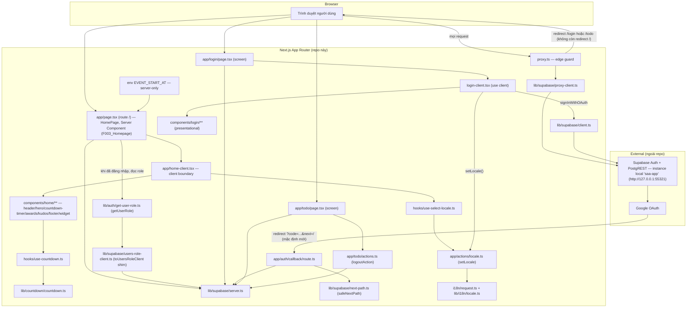
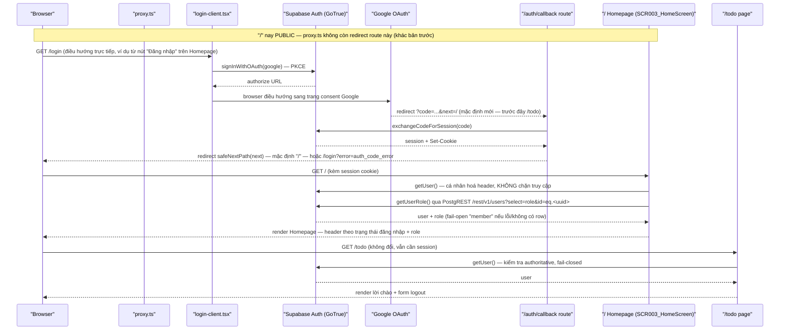

# Architecture

**Phạm vi**: toàn bộ source hiện có trong repo — 3 screen (`/`, `/login`, `/todo`; route phụ `/auth/callback`), gồm cả F003_Homepage đã lên code kể từ 2026-09-06 (xem `plans/260906-0042-homepage-saa-page/`).

Mô tả code THỰC TẾ đang chạy, dựng ngược từ source. **Cập nhật 2026-09-06**: mọi phần trước đây đánh
dấu `(planned)` cho Homepage SAA đã lên code thật — các trích dẫn `path:N-M` dưới đây đọc từ source
hiện tại, không còn là forward-draft.

## System Architecture

Ba khối chính (không đổi): (1) Next.js App Router trong repo này — vừa render UI vừa là "backend" (Server Actions, Route Handler, edge guard), không có service backend riêng; (2) Supabase — nay đóng vai trò kép: Auth (GoTrue, không đổi) VÀ nguồn dữ liệu `public.users` qua PostgREST (mới, kể từ F003_Homepage — chỉ để đọc `role`); (3) Google OAuth, bên thứ ba, app không gọi trực tiếp mà qua Supabase GoTrue.

Hai lớp guard tách biệt (không phải một) — **cập nhật cho `/` (F003_Homepage, 2026-09-06)**:
- `proxy.ts` — guard optimistic, chỉ đọc cookie qua `getUser()` (`proxy.ts:25-44,75-85`), khớp 3 route `/`, `/login`, `/todo/:path*` (`proxy.ts:112-114`), loại trừ `/auth/callback`. Hai predicate bên trong đã thu hẹp còn đúng `isAuthPage = pathname === "/login"` và `isProtectedPage = pathname.startsWith("/todo")` (`proxy.ts:33-34`) — `/` vẫn khớp matcher (để refresh session cookie mỗi lượt ghé) nhưng không còn nhánh redirect nào gắn với nó.
- Guard authoritative nằm ở từng Server Component: `app/login/page.tsx:73-83`, `app/todo/page.tsx:17-25` — không đổi. `app/page.tsx` (guard `/`, PERM001_RootRouteGuard — mã hiện có trong `docs/vi/generated/permissions-matrix.md`) nay **superseded**: file này đã được viết lại hoàn toàn để RENDER Homepage (`HomePage`, `app/page.tsx:30-142`) thay vì `redirect()`; nó vẫn tự gọi `getUser()` (`getViewer()`, `app/page.tsx:150-166`, try/catch fail-open `null`) và, khi có session, đọc `role` qua `lib/auth/get-user-role.ts` (`getUserRole`) — nhưng chỉ để cá nhân hoá giao diện, không còn chặn truy cập. Chi tiết phân quyền: `docs/vi/system/permissions.md`.

`lib/supabase/{client,server,proxy-client}.ts` là 3 factory khác nhau cho cùng một SDK `@supabase/ssr` (browser / Server Component-Action-Route / proxy) — khác nhau ở nơi đọc/ghi cookie, không phải khác nhau về logic nghiệp vụ. `lib/auth/get-user-role.ts` KHÔNG phải factory thứ 4 — nó nhận một client đã inject (`UsersRoleClient`, kiểu hẹp chỉ có `.from("users").select("role").eq("id",…).maybeSingle()`) và fail-open `"member"` khi lỗi/không có row. Caller thật (`app/page.tsx`) không truyền thẳng client Supabase — nó đi qua shim `lib/supabase/users-role-client.ts` (`toUsersRoleClient`), thu hẹp kiểu builder generic của SDK về đúng slice trên để tránh lỗi TypeScript TS2589 ("type instantiation is excessively deep") khi so khớp cấu trúc trực tiếp.

## Tech Stack

| Layer | Technology | Version |
|-------|------------|---------|
| Framework | Next.js (App Router) | 16.3.4 |
| UI | React / React DOM | 19.2.8 |
| Ngôn ngữ | TypeScript | ^5 |
| Styling | Tailwind CSS (`@tailwindcss/postcss`) | ^4 |
| i18n | next-intl (no-routing, cookie `NEXT_LOCALE`) | 4.14.2 |
| Auth SDK | `@supabase/ssr` | 0.12.5 |
| Auth SDK | `@supabase/supabase-js` | 2.115.0 |
| Auth backend | Supabase Auth (GoTrue) — instance local `saa-app`, ngoài repo | API `http://127.0.0.1:55321` |
| Backend (in-repo) | Next.js Server Actions + Route Handlers (không có service backend riêng) | — |
| Database | `public.users` — 1 bảng, cột `role` (`member`\|`admin`), đọc qua PostgREST dưới RLS own-row bằng JWT người dùng hiện tại (`lib/auth/get-user-role.ts`); `auth.users` vẫn do Supabase quản lý riêng, ngoài phạm vi code này | — |
| Cache | N/A — không tìm thấy | — |
| Queue | N/A — không tìm thấy | — |
| Package manager | pnpm, khóa version qua field `packageManager` (không dùng corepack) | 10.33.2 |
| Node.js | `engines.node` trong `package.json`; CI pin cứng | `>=22 <25` (CI chạy Node `24`) |
| Testing (unit) | Vitest | ^3.2.7 |
| Testing (e2e) | `@playwright/test` (1 project: chromium) | 1.62.1 |
| Testing (DOM env) | `jsdom` — chỉ cho vitest project `jsdom` (`hooks/**`) | ^30.0.1 |
| Testing (hook API) | `@testing-library/react` + `@testing-library/dom` (`renderHook`/`act`/`waitFor`) | ^16.3.3 / ^10.4.1 |
| API mocking | `msw` — một bộ handler dùng chung cho cả vitest (`msw/node`) lẫn Storybook (service worker) | 2.15.0 |
| Component docs | Storybook + `@storybook/nextjs-vite` + `msw-storybook-addon` | 10.6.0 / 10.6.0 / 3.0.0 |
| Lint | ESLint flat config (`eslint.config.mjs`): `eslint-config-next` (`core-web-vitals` + `typescript`) + `typescript-eslint` `recommendedTypeChecked` (scope `**/*.{ts,tsx}`, tắt lại trên `**/*.mjs`) + `import/order` + `jsx-a11y` full `recommended` + `eslint-plugin-playwright` (scope `tests/e2e/**/*.spec.ts`) + `@vitest/eslint-plugin` (scope `lib/**/*.test.ts`, `hooks/**/*.test.ts`, `app/**/*.test.ts`) | ESLint ^9 |
| Formatter | Prettier + `eslint-config-prettier` (đứng cuối config, chỉ tắt rule style trùng với ESLint, không thêm rule mới) | ^3.9.6 |
| CI/CD | GitHub Actions (`.github/workflows/ci.yml`) — 2 job độc lập: `quality` và `e2e` | — |

Nguồn: `package.json:1-49`, `eslint.config.mjs:1-112`, `.github/workflows/ci.yml`. Cache/Queue vẫn ghi N/A — Homepage không cần cache hay queue (đếm ngược tính client-side từ giá trị server truyền xuống, không polling). Database KHÔNG còn N/A kể từ khi Homepage lên code (F003_Homepage, 2026-09-06) — trước đây ghi N/A vì repo chưa từng đọc bảng nghiệp vụ nào ngoài `auth.users` (do Supabase quản lý); đây là lần đầu app đọc `public.users` qua PostgREST.

Chuyển từ npm sang pnpm: `package-lock.json` không còn tồn tại, `pnpm-lock.yaml` (~198KB) là lockfile hiện tại; không có `.npmrc` tùy chỉnh trong repo. Trong CI, `pnpm/action-setup@v6` không nhận `version:` — version pnpm dùng lấy trực tiếp từ field `packageManager` trong `package.json`, nên CI và máy dev luôn dùng cùng một bản pnpm.

Biến môi trường mới (server-only, KHÔNG `NEXT_PUBLIC_*`): `EVENT_START_AT` (ISO-8601) — đọc trong `app/page.tsx` (`resolveTargetIso()`, `app/page.tsx:176-187`), parse/validate bởi `lib/countdown/countdown.ts` (`parseTargetDate`, hàm thuần, 100% coverage theo `testPolicy: e2e-red-first`). Thiếu hoặc sai định dạng → `parseTargetDate` trả `null`, đếm ngược hiện `00/00/00` nhưng KHÔNG crash trang.

**Test coverage (cổng chặn, không còn là số đo).** `vitest.config.ts` tách hai runner qua `test.projects` (ổn định từ vitest 3.2, repo pin 3.2.7 — `environmentMatchGlobs` đã deprecated từ v3 nên không dùng):
- project `node` — `lib/**/*.test.ts` và `app/**/*.test.ts`: helper thuần và Server Action/Route Handler, chỉ cần mock ranh giới Next.js/Supabase, không cần DOM.
- project `jsdom` — `hooks/**/*.test.ts`: hook chạm `document`, focus và bàn phím.

`resolve.alias` (`@/`) và `coverage` khai ở gốc, cả hai project kế thừa (`extends: true`) — một báo cáo, một ngưỡng, một exit code.

Phạm vi đo là **allowlist tường minh**, không phải "tất cả trừ X":
`lib/**/*.ts`, `hooks/**/*.ts`, `app/actions/**/*.ts`, `app/todo/actions.ts`, `app/auth/callback/route.ts`; `exclude: ["**/*.test.ts"]`; `thresholds: { 100: true }`.

**Bổ sung allowlist (F003_Homepage, 2026-09-06):** `lib/countdown/countdown.ts`, `lib/auth/get-user-role.ts`, `lib/supabase/users-role-client.ts` đã khớp glob `lib/**/*.ts` sẵn có (không cần sửa `vitest.config.ts`); `hooks/use-countdown.ts`, `hooks/use-select-locale.ts` khớp `hooks/**/*.ts` sẵn có — ngưỡng 100% áp dụng nguyên trạng cho cả 5 file mới, không cần thay đổi cấu hình.

Không có glob `.tsx` nào trong `include` — đó chính là cơ chế loại `components/**` và `app/**/page.tsx` ra khỏi mẫu số: sai khác phần mở rộng, không phải một danh sách exclude phải bảo trì. Hai nhóm bị loại có lý do khác nhau và đều là lý do first-party:
- `app/**/page.tsx` là `async` Server Component — hướng dẫn vitest của chính Next.js nói thẳng là chưa hỗ trợ, khuyến nghị dùng E2E. Đây là giới hạn cấu trúc, không phải việc hoãn lại. (Áp dụng nguyên trạng cho `app/page.tsx` sau khi viết lại thành Homepage.)
- `components/**` là lớp trình bày: tài liệu hoá bằng Storybook, không bằng unit test (quyết định sản phẩm). (Áp dụng cho `components/home/**`.)

Con số 100% vì thế có nghĩa hẹp và trung thực: **mọi helper thuần, mọi máy trạng thái quan sát được của hook, và logic riêng của từng Server Action/Route Handler đều được test chạy qua.** Nó KHÔNG có nghĩa Server Component render đúng, Supabase/Google OAuth thật chạy được, hay giao diện trông đúng — ba thứ đó thuộc Playwright và Storybook.

Ngưỡng này thay thế quyết định "không đặt threshold" của phase-04 trước đây. Lúc đó chỉ có 2 file logic thuần chạy dưới vitest nên một tỉ lệ phần trăm là trang trí chứ không phải tín hiệu; điều thay đổi là phạm vi đo đã được vẽ lại cho trung thực. Nếu `include` về sau lại âm thầm nuốt `.tsx`/Server Component, phản biện của phase-04 lập tức đúng trở lại — allowlist chính là hàng rào chống việc đó.

Job `quality` trong CI chạy `pnpm test:unit:coverage` (không phải `test:unit`), nên ngưỡng 100% là cổng chặn thật trong pipeline chứ không phải số in ra rồi bỏ qua.

## Data Flow

Luồng OAuth lõi (PKCE, cấp bởi Supabase) KHÔNG đổi cơ chế so với trước — điểm đổi thật (khác với đợt việc trước, vốn chỉ đổi tooling): (1) `/` không còn bước redirect nào — trước đây `GET /` luôn mở đầu bằng redirect `/login` hoặc `/todo`; (2) đích mặc định sau đăng nhập đổi từ `/todo` sang `/`. Trích nguồn không đổi cho phần hành vi giữ nguyên: `hooks/use-login-actions.ts:42-57` (`handleLoginClick`), `lib/auth/sign-in-with-google.ts:39-55` (gọi `signInWithOAuth` thật), `app/auth/callback/route.ts:16-46` (exchange code, redirect matrix — giá trị mặc định của tham số đã đổi, xem `lib/supabase/next-path.ts:88`), `app/todo/page.tsx:17-25` (kiểm tra authoritative, không đổi). Nhánh lỗi (`?error=` từ Google, `exchangeCodeForSession` thất bại) đều redirect về `/login?error=...`, không lộ raw error ra client (`app/auth/callback/route.ts:39-42`) — không đổi.

Luồng phụ (không vẽ ở trên để giữ diagram gọn): đổi ngôn ngữ trên `/login` — `LoginClient` (qua `useLoginActions`) gọi Server Action `setLocale` (`app/actions/locale.ts:24-41`), ghi cookie `NEXT_LOCALE` (`lib/i18n/locale.ts:17,20`); Homepage dùng lại CÙNG `LanguageSelector` từ `components/login/` nhưng qua một hook riêng `hooks/use-select-locale.ts` (`useTransition` + `setLocale`, gọi từ `app/home-client.tsx`) — không đụng `useLoginActions` (theo quyết định trong `clarifications.md`).

**Luồng role + countdown (F003_Homepage) — không phải round-trip network riêng của user:**
- Đọc role: `app/page.tsx:161` (`getViewer()`) gọi `getUserRole(toUsersRoleClient(supabase), user.id)` (`lib/auth/get-user-role.ts:49-68`) — `try/catch` + `.maybeSingle()`; lỗi hoặc không có row → `"member"`. Đây là NHÃN cá nhân hoá menu, không phải guard (chi tiết: `docs/vi/system/permissions.md`).
- Đếm ngược: `app/page.tsx` đọc `EVENT_START_AT` (server-only, `resolveTargetIso()`, `app/page.tsx:176-187`), truyền `targetIso` + `initialNowMs = Date.now()` (`getInitialNowMs()`, `app/page.tsx:197-199`) xuống `app/home-client.tsx` → `components/home/countdown-timer.tsx`; `hooks/use-countdown.ts:33-63` seed `useState(initialNowMs)` rồi tick `setInterval(1000)` — không cần `suppressHydrationWarning` vì lần render client đầu khớp byte với SSR.

Bản thân luồng chạy (request path) của `/login`→`/auth/callback`→`/todo` không đổi so với bản trước; thay đổi trong đợt việc NÀY (khác đợt tooling trước) nằm ở HÀNH VI RUNTIME thật của `/` và đích mặc định sau đăng nhập — không phải chỉ tooling/CI.

**Test topology.** Ba lớp kiểm chứng, ranh giới không chồng lấn:

| Lớp | Công cụ | Phủ cái gì | Không phủ cái gì |
|-----|---------|------------|------------------|
| Unit | Vitest (2 project: `node`, `jsdom`) | Helper thuần `lib/**`, hook `hooks/**`, Server Action + Route Handler (`app/actions/**`, `app/todo/actions.ts`, `app/auth/callback/route.ts`) — ranh giới Next.js/Supabase được mock | Component `.tsx`, `async` Server Component, luồng thật qua mạng |
| Component docs | Storybook (`@storybook/nextjs-vite`) | Cách dùng từng common component; một story cho mỗi màn hình chính theo route | Assertion tự động — Storybook ở đây là tài liệu sống, không phải test runner |
| E2E | Playwright (chromium) | Luồng thật xuyên `next dev`: guard route, redirect, GUI `/login`; Homepage — nav, menu, countdown, đổi ngôn ngữ qua `tests/e2e/home.spec.ts` (27 test) | Nhánh PKCE exchange thành công (xem dưới) |

**MSW là lớp mock dùng chung.** Một module handler duy nhất (`mocks/handlers.ts`) phục vụ hai runtime: `msw/node` (`setupServer`) cho vitest, và service worker (`public/mockServiceWorker.js`) cho Storybook. Một giới hạn thật cần nói rõ: `signInWithOAuth` của Supabase gây **điều hướng top-level của trình duyệt**, không phải `fetch`/XHR — MSW không chặn được nó. Nên trong Storybook, hành vi đăng nhập được mock bằng cách truyền thẳng prop `onLoginClick`, không phải bằng handler `/auth/v1/authorize`. Giá trị thật của MSW ở repo này nằm ở phía Node/vitest: `/auth/v1/token`, `/auth/v1/user`, `/auth/v1/logout` đều được gọi server-side, và chúng phủ đúng khoảng trống mà `ci.yml` tự thừa nhận là chưa có test. **Bổ sung (F003_Homepage):** một handler mới `GET {SUPABASE_URL}/rest/v1/users` (`mocks/handlers.ts:67-72`) trả JSON array (`maybeSingle()` trên GET dùng `Accept: application/json`) phục vụ story admin-override — không unit test nào tiêu thụ handler này (`getUserRole` nhận client inject, test bằng stub, không qua MSW).

**Storybook chạy được cho cả 3 route chính** vì cây component của cả 3 đã thuần trình bày và nhận mọi thứ qua props — story chỉ cần truyền `copy`/`locale`/handler, không cần cờ RSC thử nghiệm nào. `/login` (`LoginScreen` và các con) và `/todo` (`components/todo/todo-screen.tsx`, tách ra từ JSX từng viết thẳng trong `async` Server Component) đã theo convention này từ trước. Homepage đi theo ĐÚNG convention đó: `components/home/**` (`home-screen.tsx` + 13 component con) thuần trình bày, có story riêng (`home-screen.stories.tsx` + story cho từng common component); `app/page.tsx` chỉ đọc `getUser()`/`getUserRole()`/`EVENT_START_AT` rồi truyền props xuống qua `app/home-client.tsx`.

**Test topology.** Bộ Playwright (`tests/e2e/login.spec.ts`, 30 test, project `chromium` duy nhất — `playwright.config.ts:31-36`) chia làm 2 tập, theo việc có cần một Supabase Auth endpoint reachable hay không:
- **Tập CI-safe** (chạy trong job `e2e` của GitHub Actions, `--grep-invert @auth`): không cần Supabase thật — `proxy.ts`/các Server Component tự bọc `getUser()` trong try/catch và coi mọi lỗi (host không reachable, thiếu env) là "chưa có session" (fail-open theo thiết kế sẵn có, không phải hành vi mới). Bao gồm mọi test GUI/tương tác của `/login` không xác thực, các test redirect chưa đăng nhập, 2 test chặn request `signInWithOAuth` phía client bằng `page.route(...).abort()` (không có request thật ra ngoài, không cần secret Google), và các test trong block `"Supabase unavailable"` chỉ chạy khi `process.env.CI` được set. **Hai assertion đã đổi (F003_Homepage):** test cũ "Unauthenticated GET / redirects to /login" bị XOÁ (không còn đúng — `/` public, thay bằng TC riêng "GET / renders the public homepage (no redirect)"); "Authenticated user redirects /login to /todo" → đích `/` ("Authenticated user redirects /login to /").
- **Tập local-only** (block `"Authenticated"` gắn tag `{ tag: "@auth" }`): đăng nhập thật bằng session cookie lấy qua email/password signup trên Supabase; cần một Supabase Auth instance reachable thật (ví dụ `saa-app` local). Đây là giới hạn có chủ đích, được ghi lại ngay trong `ci.yml`: **job `e2e` không phủ đường xác thực (authenticated path)**, và nhánh exchange-code-thành-công thật của `/auth/callback` (PKCE round-trip Google thật) hiện **không có test tự động nào**, CI hay local — không suy diễn ngược lại rằng CI đã bao phủ toàn bộ luồng đăng nhập. Homepage thêm bộ test riêng `tests/e2e/home.spec.ts` (27 test) và nhánh `@auth` mới cho menu "Trang quản trị" (cần user role=admin, provisioning qua `tests/e2e/helpers/promote-to-admin.ts` → `supabase db query`, không cần psql/service-role key).

## Deployment View

> Derived from repository infrastructure-as-code — not verified against production.

N/A — no infrastructure-as-code found in repository.

N/A cho đích triển khai (deployment target) — repo vẫn không có infrastructure-as-code hay cấu hình host/deploy nào (không `Dockerfile`, không `*.tf`, không `vercel.json`/`fly.toml`/k8s manifest). Việc thêm `.github/workflows/ci.yml` là một lớp **CI (kiểm tra chất lượng trước khi merge)**, không phải deployment pipeline — GitHub Actions ở đây không build image, không push artifact, không gọi tới bất kỳ host thật nào. Không suy diễn thêm topology triển khai nào ngoài các sự thật sau.

CI (`.github/workflows/ci.yml`) gồm 2 job, kích hoạt trên `push`/`pull_request` nhắm vào `main`, và `workflow_dispatch` (chạy tay trên bất kỳ branch nào). Cache dependency khóa theo `pnpm-lock.yaml` (qua `actions/setup-node@v4` với `cache: pnpm`); cả 2 job đều pin Node `24` qua `actions/setup-node@v4` và cài pnpm qua `pnpm/action-setup@v6` (không truyền `version:`, đọc từ `packageManager`).

> **Không có branch protection.** Xác minh 2026-09-05: `gh api repos/.../branches/main/protection` trả **404** — `main` chưa bật rule nào, nên hiện tại KHÔNG job nào thực sự chặn được merge. Hai job dưới đây mô tả thứ CI *kiểm tra*, không phải thứ nó *cưỡng chế*. Muốn chúng thật sự gác PR thì phải bật branch protection và đặt chúng làm required status check.

- **`quality`** (không phụ thuộc job khác): `pnpm install --frozen-lockfile` → `lint` (ESLint `--max-warnings 0`) → `format:check` (Prettier) → `test:unit:coverage` (Vitest, cả hai project `node`+`jsdom`, ngưỡng 100% là cổng chặn — thay cho `test:unit` trần trước đây) → `build` (Next.js) → `typecheck` (`tsc --noEmit`, chạy **sau** `build` vì Next.js chỉ sinh type `.next/types` sau khi build ít nhất một lần). Hai biến môi trường `NEXT_PUBLIC_SUPABASE_URL`/`NEXT_PUBLIC_SUPABASE_PUBLISHABLE_KEY` được set placeholder (không phải giá trị thật) để `build` chạy qua — Next.js inline chúng vào bundle client tại build time nhưng không có lệnh gọi Supabase thật nào trong lúc static generation. **Gap còn mở**: `.github/workflows/ci.yml` CHƯA set `EVENT_START_AT` cho bước `build` này (verify 2026-09-06, cả 2 chỗ set env trong file chỉ có 2 biến Supabase) — thiếu nó không làm fail build (countdown chỉ hiện `00/00/00`), nhưng nên set để giữ hành vi build nhất quán với dev/prod; chưa có ai theo dõi việc này thành action item.
- **`e2e`** (job riêng, không `needs: quality`): cài Playwright browser `chromium` (cache theo version pin), chạy tập CI-safe (`playwright test --grep-invert @auth`, 48/57 test tổng cộng — 27/30 từ `login.spec.ts`, 21/27 từ `home.spec.ts`) chống lại `next dev` local trong runner — không khởi động Supabase thật, không cần secret Google (mọi request OAuth trong tập CI-safe bị abort phía client trước khi rời browser). Bước "Coverage limitation notice" luôn chạy (`if: always()`) và in ra `$GITHUB_STEP_SUMMARY` số test đã chạy/tổng số và lời nhắc rằng luồng authenticated + nhánh callback PKCE thành công không được job này phủ. `home.spec.ts` CI-safe chạy trong job này bằng `webServer.env.EVENT_START_AT` cố định ở tương lai xa (`playwright.config.ts:44-47`, `2099-12-31T18:30:00+07:00` — deterministic, không phụ thuộc ngày chạy CI); 6 test tag `@auth` (menu admin, cần provisioning) loại khỏi CI như các test `@auth` khác của `login.spec.ts`.

Không job nào trong CI triển khai ứng dụng ra một môi trường chạy thật; Supabase (`saa-app`) tiếp tục là instance local ngoài repo như hiện tại, không được CI quản lý hay khởi tạo.
