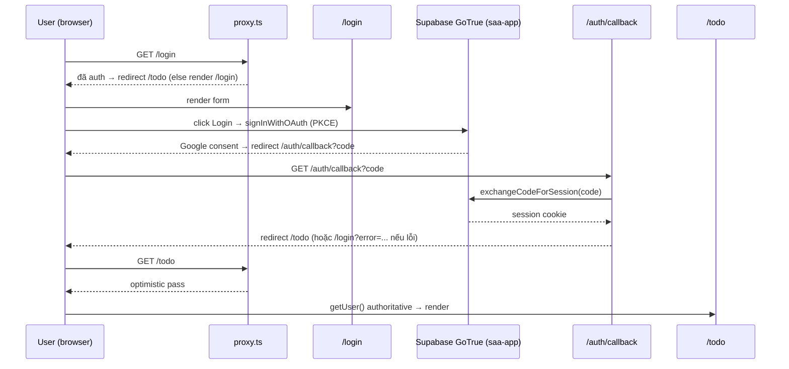

# Architecture

**Phạm vi**: F001_GoogleOAuthLogin, F002_LanguageSwitch (xem `spec/feature-list.md`) — forward-draft, chưa có code.

## Overview

SAA 2025 (Next.js 16 App Router) xác thực người dùng qua Google OAuth (Supabase Auth, PKCE); không có vai trò/RBAC — mọi tài khoản Google hợp lệ đều vào được `/todo` (placeholder được bảo vệ). Giao diện hỗ trợ 2 ngôn ngữ (vi mặc định, en) qua cookie, không dùng URL-prefix routing. Ba khối chính: Next.js app (frontend + route handler), Supabase Auth (local instance `saa-app`, ngoài repo), và Google OAuth (bên thứ ba).

## Runtime & Stack

| Layer | Technology | Version |
|---|---|---|
| Framework | Next.js (App Router) | 16.3.4 |
| UI | React | 19.2.8 |
| Styling | Tailwind CSS | 4 |
| Ngôn ngữ | TypeScript | — |
| Auth SDK | @supabase/ssr | 0.12.5 |
| Auth SDK | @supabase/supabase-js | 2.115.0 |
| i18n | next-intl | 4.14.2 (no-routing) |
| E2E | @playwright/test | 1.62.1 |
| Auth backend | Supabase (local `saa-app`) | API `http://127.0.0.1:55321` |

Nguồn: `research/researcher-01-supabase-google-oauth-nextjs16.md`. `proxy.ts` là tên mới của `middleware.ts` (Next 16); `cookies()`/`headers()` là async.

## Components/Layers

- `app/login/page.tsx` (Server Component) — header/hero/footer theo locale.
- Nút "LOGIN With Google" (Client Component) — gọi `signInWithOAuth`, pending/error qua `useTransition`.
- Language selector (Client Component, F002) — menu VN/EN, gọi Server Action `setLocale`.
- `app/auth/callback/route.ts` (Route Handler GET) — đổi PKCE code lấy session.
- `proxy.ts` — guard optimistic.
- `app/todo/page.tsx` (Server Component, placeholder được bảo vệ) — xác thực authoritative + nút Đăng xuất.
- `utils/supabase/client.ts`, `utils/supabase/server.ts` (factory Supabase client browser/server); `src/i18n/request.ts` (resolve locale từ cookie `NEXT_LOCALE`).

## Request & Auth Flow

## Integrations

- **Supabase Auth (GoTrue)** — local instance `saa-app`, external; Google provider bật sẵn, `additional_redirect_urls` chứa `http://localhost:3000/auth/callback`. App không tự quản lý OAuth client secret.
- **Google OAuth** — bên thứ ba qua GoTrue; app không gọi Google API trực tiếp.
- Không có integration khác (không email/payment/queue) trong phạm vi F001/F002.

## Data & Session Storage

- **Session**: Supabase quản lý qua cookie (`@supabase/ssr`); app không tự lưu session riêng.
- **Locale**: cookie `NEXT_LOCALE` (path=`/`, 1 năm), set qua Server Action `setLocale` (F002).
- **User/Auth data**: `auth.users` do Supabase quản lý — ngoài phạm vi data model của app.
- Không có database riêng của app trong phạm vi 2 feature này.

## Cross-cutting (i18n, testing)

- **i18n**: next-intl no-routing, locale từ cookie `NEXT_LOCALE` (`vi` mặc định, `en`), không URL-prefix.
- **Testing**: `testPolicy: e2e-red-first` — `tests/e2e/login.spec.ts`; OAuth-kickoff test chặn network qua `page.route` abort trên `**/auth/v1/authorize**`; authenticated-redirect test dùng setup-project `signInWithPassword` + `storageState`, không hit Google thật.

## Open Points

- Deployment/hosting topology: TBD (draft) — chưa có Dockerfile/IaC trong repo.
- Google OAuth client credentials của `saa-app`: giả định cấu hình qua env khi `supabase start`; verify bằng `GET /auth/v1/authorize?provider=google` → 302 `accounts.google.com` (`clarifications.md § Unresolved`).
- `ROUTE###`/`SCR###` codes: TBD (draft), cấp khi promote.
