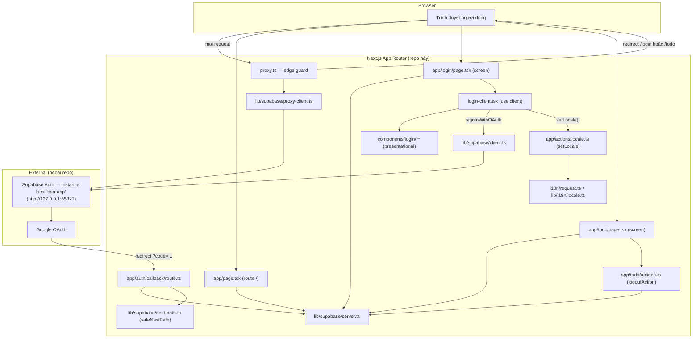
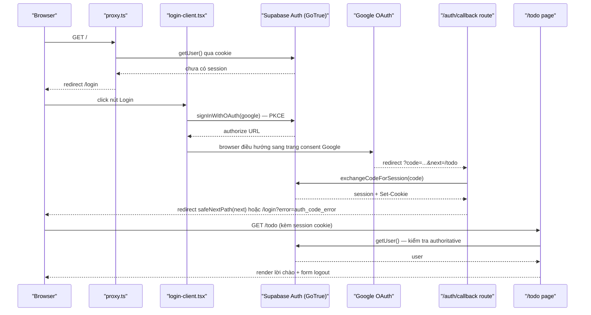

# Architecture

**Phạm vi**: toàn bộ source hiện có trong repo (2 screen: `/login`, `/todo`; route phụ `/`, `/auth/callback`). Mô tả code THỰC TẾ đang chạy, dựng ngược từ source — không phải kế hoạch.

## System Architecture

Ba khối chính: (1) Next.js App Router trong repo này — vừa render UI vừa là "backend" (Server Actions, Route Handler, edge guard), không có service backend riêng; (2) Supabase Auth — instance local `saa-app`, chạy ngoài repo, là nguồn xác thực + lưu session duy nhất; (3) Google OAuth — bên thứ ba, app không gọi trực tiếp mà qua Supabase GoTrue.

Hai lớp guard tách biệt (không phải một):
- `proxy.ts` — guard optimistic, chỉ đọc cookie qua `getUser()` (`proxy.ts:21-40,71-81`), khớp 3 route `/`, `/login`, `/todo/:path*` (`proxy.ts:108-110`), loại trừ `/auth/callback`.
- Guard authoritative nằm ở từng Server Component: `app/page.tsx:10-17`, `app/login/page.tsx:73-83`, `app/todo/page.tsx:17-25` — mỗi trang tự gọi lại `getUser()` qua `lib/supabase/server.ts:16`, không tin tưởng riêng lớp proxy.

`lib/supabase/{client,server,proxy-client}.ts` là 3 factory khác nhau cho cùng một SDK `@supabase/ssr` (browser / Server Component-Action-Route / proxy) — khác nhau ở nơi đọc/ghi cookie, không phải khác nhau về logic nghiệp vụ.

## Tech Stack

| Layer | Technology | Version |
|-------|------------|---------|
| Framework | Next.js (App Router) | 16.3.4 |
| UI | React / React DOM | 19.2.8 |
| Ngôn ngữ | TypeScript | ^5 |
| Styling | Tailwind CSS (`@tailwindcss/postcss`) | ^4 |
| i18n | next-intl (no-routing, cookie `NEXT_LOCALE`) | 4.14.2 |
| Auth SDK | `@supabase/ssr` | 0.12.5 |
| Auth SDK | `@supabase/supabase-js` | 2.115.0 |
| Auth backend | Supabase Auth (GoTrue) — instance local `saa-app`, ngoài repo | API `http://127.0.0.1:55321` |
| Backend (in-repo) | Next.js Server Actions + Route Handlers (không có service backend riêng) | — |
| Database | N/A trong repo — `auth.users` do Supabase quản lý, ngoài phạm vi code này | — |
| Cache | N/A — không tìm thấy | — |
| Queue | N/A — không tìm thấy | — |
| Package manager | pnpm, khóa version qua field `packageManager` (không dùng corepack) | 10.33.2 |
| Node.js | `engines.node` trong `package.json`; CI pin cứng | `>=22 <25` (CI chạy Node `24`) |
| Testing (unit) | Vitest | ^3.2.7 |
| Testing (e2e) | `@playwright/test` (1 project: chromium) | 1.62.1 |
| Lint | ESLint flat config (`eslint.config.mjs`): `eslint-config-next` (`core-web-vitals` + `typescript`) + `typescript-eslint` `recommendedTypeChecked` (scope `**/*.{ts,tsx}`, tắt lại trên `**/*.mjs`) + `import/order` + `jsx-a11y` full `recommended` + `eslint-plugin-playwright` (scope `tests/e2e/**/*.spec.ts`) + `@vitest/eslint-plugin` (scope `lib/**/*.test.ts`) | ESLint ^9 |
| Formatter | Prettier + `eslint-config-prettier` (đứng cuối config, chỉ tắt rule style trùng với ESLint, không thêm rule mới) | ^3.9.6 |
| CI/CD | GitHub Actions (`.github/workflows/ci.yml`) — 2 job độc lập: `quality` và `e2e` | — |

Nguồn: `package.json:1-49`, `eslint.config.mjs:1-112`, `.github/workflows/ci.yml`. Cache/Queue/Database ghi N/A vì scan repo không thấy dependency hay code tương ứng (`app/todo/actions.ts` chỉ gọi `signOut()`, không có model/schema nào trong repo — dữ liệu người dùng nằm hoàn toàn phía Supabase, ngoài phạm vi source này).

Chuyển từ npm sang pnpm: `package-lock.json` không còn tồn tại, `pnpm-lock.yaml` (~198KB) là lockfile hiện tại; không có `.npmrc` tùy chỉnh trong repo. Trong CI, `pnpm/action-setup@v6` không nhận `version:` — version pnpm dùng lấy trực tiếp từ field `packageManager` trong `package.json`, nên CI và máy dev luôn dùng cùng một bản pnpm.

**Test coverage (đo được, không phải mục tiêu)**: `vitest.config.ts` bật `coverage` (provider `v8`, `include: ["lib/**/*.ts"]`, `exclude: ["lib/**/*.test.ts"]`) — cố ý chỉ đo lớp `lib/**`, không đo `app/`/`components/`/`hooks/` (các thư mục đó do Playwright phủ, số coverage này không và không được xem là đại diện cho chúng). Chạy thực tế `pnpm test:unit:coverage` ngày 2026-09-05 cho baseline: **63.87% statements, 92.15% branch, 78.57% functions, 63.87% lines** trên toàn `lib/**`; `lib/i18n/locale.ts`, `lib/ui/roving-index.ts` và `lib/auth/sign-in-with-google.ts` đều đạt 100%, `lib/supabase/next-path.ts` đạt 96.42%, còn `lib/supabase/client.ts`, `lib/supabase/proxy-client.ts`, `lib/supabase/server.ts` đều ở **0%** (3 factory Supabase SDK không có unit test — chúng chỉ được chạm tới gián tiếp qua Playwright, không qua Vitest). `vitest.config.ts` không khai báo `coverage.thresholds` nào — con số trên là số đo, không phải cổng chặn. Job `quality` trong CI chạy `pnpm test:unit` (50 test, 5 file: `lib/i18n/locale.test.ts`, `lib/i18n/messages-parity.test.ts`, `lib/supabase/next-path.test.ts`, `lib/ui/roving-index.test.ts`, `lib/auth/sign-in-with-google.test.ts`) — **không chạy** biến thể `test:unit:coverage`, nên con số coverage ở trên không được đo lại và không chặn merge trong CI.

## Data Flow

Luồng trên là request lõi của app (đăng nhập Google OAuth qua PKCE, cấp bởi Supabase). Trích nguồn: `hooks/use-login-actions.ts:42-57` (`handleLoginClick`, kích hoạt OAuth từ boundary client), `lib/auth/sign-in-with-google.ts:39-55` (gọi `signInWithOAuth` thật), `app/auth/callback/route.ts:16-46` (exchange code, redirect matrix), `lib/supabase/next-path.ts:88-106` (`safeNextPath` chặn open-redirect trên tham số `?next=`), `app/todo/page.tsx:17-25` (kiểm tra authoritative). Nhánh lỗi (`?error=` từ Google, `exchangeCodeForSession` thất bại) đều redirect về `/login?error=...`, không lộ raw error ra client (`app/auth/callback/route.ts:39-42`).

Luồng phụ (không vẽ ở trên để giữ diagram gọn): đổi ngôn ngữ — `LoginClient` (qua `useLoginActions`) gọi Server Action `setLocale` (`app/actions/locale.ts:24-41`), ghi cookie `NEXT_LOCALE` (`lib/i18n/locale.ts:17,20`), vòng round-trip của chính Server Action khiến `i18n/request.ts:16-28` đọc lại cookie và trả bộ message mới — không cần `router.refresh()` (`hooks/use-login-actions.ts:59-64`).

Bản thân luồng chạy (request path) không đổi so với bản trước — thay đổi trong đợt việc này chỉ nằm ở tooling build/lint/CI/test, không ở hành vi runtime.

**Test topology.** Bộ Playwright (`tests/e2e/login.spec.ts`, 30 test, project `chromium` duy nhất — `playwright.config.ts:31-36`) chia làm 2 tập, theo việc có cần một Supabase Auth endpoint reachable hay không:
- **Tập CI-safe** (chạy trong job `e2e` của GitHub Actions, `--grep-invert @auth` → 27 test): không cần Supabase thật — `proxy.ts`/các Server Component tự bọc `getUser()` trong try/catch và coi mọi lỗi (host không reachable, thiếu env) là "chưa có session" (fail-open theo thiết kế sẵn có, không phải hành vi mới). Bao gồm mọi test GUI/tương tác của `/login` không xác thực, các test redirect chưa đăng nhập, 2 test chặn request `signInWithOAuth` phía client bằng `page.route(...).abort()` (không có request thật ra ngoài, không cần secret Google), và các test trong block `"Supabase unavailable"` (`tests/e2e/login.spec.ts:575-635`) chỉ chạy khi `process.env.CI` được set.
- **Tập local-only** (3 test, block `"Authenticated"` gắn tag `{ tag: "@auth" }` — `tests/e2e/login.spec.ts:636`): đăng nhập thật bằng session cookie lấy qua email/password signup trên Supabase; cần một Supabase Auth instance reachable thật (ví dụ `saa-app` local). Đây là giới hạn có chủ đích, được ghi lại ngay trong `ci.yml`: **job `e2e` không phủ đường xác thực (authenticated path)**, và nhánh exchange-code-thành-công thật của `/auth/callback` (PKCE round-trip Google thật) hiện **không có test tự động nào**, CI hay local — không suy diễn ngược lại rằng CI đã bao phủ toàn bộ luồng đăng nhập.

## Deployment View

> Derived from repository infrastructure-as-code — not verified against production.

N/A — no infrastructure-as-code found in repository.

N/A cho đích triển khai (deployment target) — repo vẫn không có infrastructure-as-code hay cấu hình host/deploy nào (không `Dockerfile`, không `*.tf`, không `vercel.json`/`fly.toml`/k8s manifest). Việc thêm `.github/workflows/ci.yml` là một lớp **CI (kiểm tra chất lượng trước khi merge)**, không phải deployment pipeline — GitHub Actions ở đây không build image, không push artifact, không gọi tới bất kỳ host thật nào. Không suy diễn thêm topology triển khai nào ngoài các sự thật sau.

CI (`.github/workflows/ci.yml`) gồm 2 job, kích hoạt trên `push`/`pull_request` nhắm vào `main`, và `workflow_dispatch` (chạy tay trên bất kỳ branch nào). Cache dependency khóa theo `pnpm-lock.yaml` (qua `actions/setup-node@v4` với `cache: pnpm`); cả 2 job đều pin Node `24` qua `actions/setup-node@v4` và cài pnpm qua `pnpm/action-setup@v6` (không truyền `version:`, đọc từ `packageManager`).

> **Không có branch protection.** Xác minh 2026-09-05: `gh api repos/.../branches/main/protection` trả **404** — `main` chưa bật rule nào, nên hiện tại KHÔNG job nào thực sự chặn được merge. Hai job dưới đây mô tả thứ CI *kiểm tra*, không phải thứ nó *cưỡng chế*. Muốn chúng thật sự gác PR thì phải bật branch protection và đặt chúng làm required status check.

- **`quality`** (không phụ thuộc job khác): `pnpm install --frozen-lockfile` → `lint` (ESLint `--max-warnings 0`) → `format:check` (Prettier) → `test:unit` (Vitest, 50 test — không phải biến thể coverage) → `build` (Next.js) → `typecheck` (`tsc --noEmit`, chạy **sau** `build` vì Next.js chỉ sinh type `.next/types` sau khi build ít nhất một lần). Hai biến môi trường `NEXT_PUBLIC_SUPABASE_URL`/`NEXT_PUBLIC_SUPABASE_PUBLISHABLE_KEY` được set placeholder (không phải giá trị thật) để `build` chạy qua — Next.js inline chúng vào bundle client tại build time nhưng không có lệnh gọi Supabase thật nào trong lúc static generation.
- **`e2e`** (job riêng, không `needs: quality`): cài Playwright browser `chromium` (cache theo version pin), chạy tập CI-safe (`playwright test --grep-invert @auth`, 27/30 test) chống lại `next dev` local trong runner — không khởi động Supabase thật, không cần secret Google (mọi request OAuth trong tập CI-safe bị abort phía client trước khi rời browser). Bước "Coverage limitation notice" luôn chạy (`if: always()`) và in ra `$GITHUB_STEP_SUMMARY` số test đã chạy/tổng số và lời nhắc rằng luồng authenticated + nhánh callback PKCE thành công không được job này phủ.

Không job nào trong CI triển khai ứng dụng ra một môi trường chạy thật; Supabase (`saa-app`) tiếp tục là instance local ngoài repo như hiện tại, không được CI quản lý hay khởi tạo.
