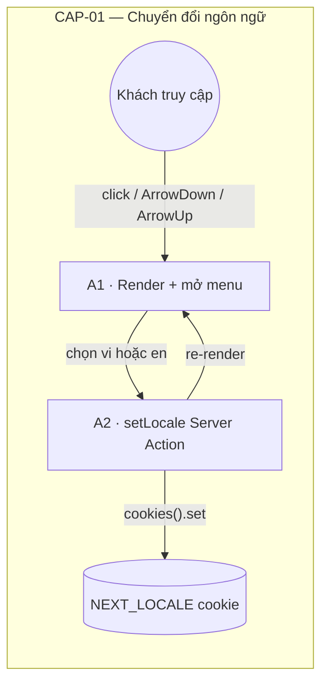
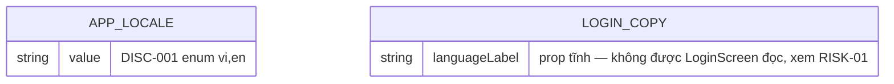
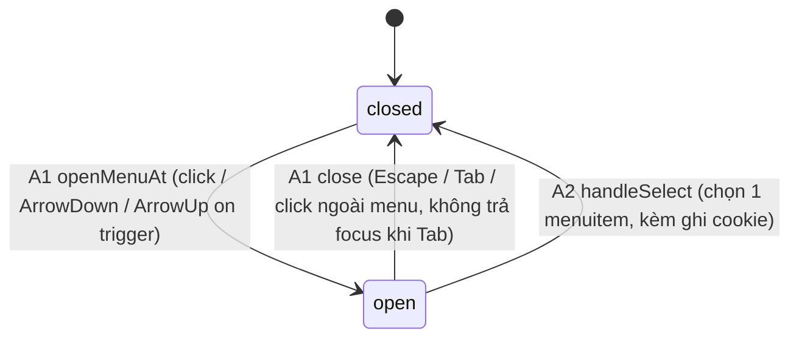

<!-- Contract: references/feature-spec-researcher-contract.md -->

# F002_LanguageSwitch — Technical Spec

**Priority**: P1
**Type**: ui
**Generated**: 2026-09-05

**See also:** [`functional-spec.md`](./functional-spec.md) — tổng quan bằng ngôn ngữ tự nhiên, Open
Decisions, yêu cầu/business rule ở dạng one-liner, screens, user stories, scenarios, edge cases,
configuration cho độc giả BA/QA.

**How to read this file:** § 2 là bảng chỉ mục — chọn action cần xem rồi đọc trọn block ở § 3. § 4
là phụ lục dùng chung — chỉ nhảy vào khi một block ở § 3 trỏ tới.

## 1. Technical Overview

F002 là bộ chọn ngôn ngữ giao diện (VN/EN) nằm trong header của `SCR001_LoginScreen`. Khách truy
cập (chưa đăng nhập) đổi ngôn ngữ bằng một menu kiểu ARIA menu-button; lựa chọn được ghi vào cookie
`NEXT_LOCALE` qua Server Action `setLocale`, và toàn bộ nội dung dịch (next-intl, no-routing mode)
render lại theo locale mới ngay trong cùng round-trip — không cần `router.refresh()`. Tính năng độc
lập hoàn toàn với trạng thái đăng nhập của F001 (không đi qua PERM### nào).



## 2. Action Index

| # | Action (handler) | Method · Path | Codes | Writes | Detail |
|---|---|---|---|---|---|
| **A0** | *cross-cutting — belongs to no single action* | — | — | — | — |
| **A1** | `LanguageSelector` + `useMenuKeyboardNav` *(client-only, no BE)* | — *(client render/open state, không có HTTP)* | FR-001, FR-101, FR-201, FR-202, SM-001, US001 | — *(read-only)* | § 3.1 |
| **A2** | `setLocale()` | `POST` `/login` *(Server Action call, không phải route riêng)* | FR-001, FR-401, FR-402, FR-601, BR-001, BR-002, US001 | `NEXT_LOCALE` *(cookie, không phải bảng DB)* | § 3.1 |

Không có row nào ở **A0**: F002 không có rule cross-cutting nào (không PERM###, không guard —
xem `permissions-matrix.md` ground-truth note "dự án này không có RBAC", và F002 tách biệt hoàn
toàn khỏi guard của F001). Row **A0** vẫn giữ vì bắt buộc theo template.

## 3. Actions

### 3.1 CAP-01 — Chuyển đổi ngôn ngữ giao diện

#### A1 · Hiển thị nhãn ngôn ngữ hiện tại và mở menu chọn
`—` (client state, không có HTTP) → `` `LanguageSelector` + `useMenuKeyboardNav` ``
`FR-001` `FR-101` `FR-201` `FR-202` `SM-001` `US001` · `SCR001_LoginScreen`

**Who** · Khách truy cập (Anonymous) tại `/login` *(không qua PERM### nào)*
**FE** · `components/login/language-selector.tsx:26-102` render nút trigger
(`button[aria-haspopup="menu"]`, nhãn "VN"/"EN" + `IconVnFlag` + `IconDown`) và menu
(`[role="menu"]` chứa 2 `[role="menuitem"]`). Vòng đời mở/đóng, focus roving-tabindex và mọi
keydown handler (ArrowDown/ArrowUp mở vào item đầu/cuối, mũi tên chạy vòng, Home/End nhảy hai
đầu, Escape đóng + trả focus, Tab đóng không trả focus) nằm ở
`hooks/use-menu-keyboard-nav.ts:58-171`. Phép tính chỉ số chạy vòng (wrap-around) tách riêng ở
`lib/ui/roving-index.ts:10-24` *(§ 4.5 ALG-001)*.
**Request** · *không có request* — nhãn hiện tại đến từ locale đã được server resolve, truyền
xuống qua prop `label` (`components/login/language-selector.tsx:9-14`).
**BE** · *không có handler BE riêng cho việc render* — nhãn VN/EN đến từ
`i18n/request.ts:22-41` (đọc cookie `NEXT_LOCALE`, `normalizeLocale`, `import` message bundle
tương ứng) rồi `app/login/page.tsx:38-49` gọi `getLocale()` và build prop `languageLabel`.
**Rule** · Không có business rule nào áp dụng riêng cho action này ngoài `SM-001` (đóng/mở) và
`DISC-001` (nhãn VN/EN — § 4.2 Polymorphic Behavior).

Không có DEC-### nào ở action này. **Decision Logic (DEC-###):** N/A — no user-facing decision
logic beyond DISC-001 Polymorphic Behavior in this feature (menu open/close chỉ là 1 toggle, thuộc
`SM-001`; nhãn VN/EN là single-field enum, thuộc `DISC-001` — không thoả điều kiện ≥2 predicate
của DEC theo contract).

**Result** · read-only — **no DB write**. Nhãn nút trigger đổi theo `DISC-001`'s giá trị `value`
(vi → "VN", en → "EN"). Mở menu hiển thị đúng 2 `menuitem` theo thứ tự `OPTIONS`
(`components/login/language-selector.tsx:16-19`).
**State** · `SM-001`: `closed` → `open` *(§ 4.3)*
**Source:** `components/login/language-selector.tsx:26-102` → `hooks/use-menu-keyboard-nav.ts:58-171` → `lib/ui/roving-index.ts:10-24` → `i18n/request.ts:22-41` → `app/login/page.tsx:38-49`

<!-- Không có diagram: dưới ngưỡng (không ghi ≥2 bảng, không phải background/async action;
     nội dung thật của action này là chuỗi rung tuyến tính, một sequenceDiagram sẽ không thêm
     thông tin gì so với các rung trên. -->

---

#### A2 · Chọn một ngôn ngữ (ghi cookie + re-render)
`POST` `/login` *(Server Action)* → `` `setLocale()` ``
`FR-001` `FR-401` `FR-402` `FR-601` `BR-001` `BR-002` `US001` · `SCR001_LoginScreen` · `SM-001`

**Who** · Khách truy cập (Anonymous) tại `/login`
**FE** · Click một `menuitem` gọi `handleSelect` (`components/login/language-selector.tsx:39-42`)
— đóng menu KHÔNG trả focus (`close(false)`) rồi gọi `onSelect(locale)`. Chuỗi prop-drilling:
`LanguageSelector.onSelect` → `LoginHeader.onSelectLocale` (`components/login/login-header.tsx:37`)
→ `LoginScreen.onSelectLocale` (`components/login/login-screen.tsx:27,43`) →
`LoginClient.onSelectLocale` (`app/login/login-client.tsx:45`) →
`useLoginActions.handleSelectLocale` (`hooks/use-login-actions.ts:59-65`).
**Request** · tham số hàm `locale` *(string, không có kiểu ràng buộc phía Server Action —
untrusted input)*, giá trị thực tế gửi lên luôn là `"vi"` hoặc `"en"` do `OPTIONS` cố định phía
client, nhưng Server Action không tin tưởng điều này.
**BE** · `` `setLocale(locale)` `` — `app/actions/locale.ts:25-44`. Gọi
`normalizeLocale(locale)` (`lib/i18n/locale.ts:49-51`) trước, sau đó
`cookieStore.set("NEXT_LOCALE", next, { path: "/", maxAge: 31536000, sameSite: "lax" })`.
**Rule**
- **BR-001 — Mọi giá trị locale từ client luôn được chuẩn hoá qua whitelist {vi, en} trước khi
  ghi cookie, bất kể input gửi lên là gì.** `normalizeLocale` (`lib/i18n/locale.ts:49-51`) gọi
  `isSupportedLocale` (`lib/i18n/locale.ts:34-39`) — giá trị không khớp đúng `"vi"`/`"en"`
  (kể cả sai hoa/thường, chuỗi rác, hay giá trị injection kiểu `"vi; en"`) luôn rơi về
  `DEFAULT_LOCALE = "vi"`. *(Bin 1 — chỉ dùng ở action này)*
- **BR-002 — Đổi ngôn ngữ dùng CHUNG một `useTransition` với hành động đăng nhập Google, nên
  nút đăng nhập cũng thoáng chuyển sang trạng thái pending khi người dùng chỉ đổi ngôn ngữ.**
  `hooks/use-login-actions.ts:38-39,59-65` — đây là hành vi cố ý được giữ nguyên qua lần refactor
  này (comment nguồn: "Giữ nguyên để refactor không đổi hành vi"), không phải bug. *(Bin 1 — chỉ
  dùng ở action này)*
**Result**
- Ghi cookie `NEXT_LOCALE` ← `normalizeLocale(locale)` — `app/actions/locale.ts:29-34`
  (`path: "/"`, `maxAge: 31536000` giây ~ 1 năm, `sameSite: "lax"`)
- Không có `redirect()` — round-trip của Server Action tự re-render cây trang với output mới của
  `i18n/request.ts`, nên `LoginScreen` (và mọi text next-intl) hiển thị lại đúng ngôn ngữ mới mà
  không cần tải lại trang (`app/actions/locale.ts:20-23` comment nguồn).
- Nếu `cookies().set()` bị gọi ngoài ngữ cảnh Server Action, hàm ném `Error` mô tả rõ nguyên nhân
  thay vì âm thầm không làm gì (`app/actions/locale.ts:35-43`) — xem § 5.3 Unresolved Questions #1.
**State** · `SM-001`: `open` → `closed` *(§ 4.3)*
**Source:** `components/login/language-selector.tsx:39-42` → `hooks/use-login-actions.ts:59-65` → `app/actions/locale.ts:25-44` → `lib/i18n/locale.ts:49-51`

<!-- Không có diagram: A2 chỉ ghi 1 cookie (không phải bảng DB, và không tính là "≥2 tables"),
     không phải background/async action. Nội dung thật của action là 2 business rule tuyến
     tính — đã đủ rõ trong rung Rule/Result ở trên, một sequenceDiagram sẽ không thêm gì. -->

### 3.2 Edge cases

| Action | Scenario | Behavior |
|---|---|---|
| A1 | Cookie `NEXT_LOCALE` mang giá trị rác/không hợp lệ (vd. `"fr"`, `"vi; en"`, `"EN"` sai hoa/thường) ở request kế tiếp | `normalizeLocale` (`lib/i18n/locale.ts:49-51`) âm thầm rơi về `DEFAULT_LOCALE = "vi"`; không có lỗi hiển thị, không có log — xem `lib/i18n/locale.test.ts:33-43` (test đã confirm 4/4 case rác này) |
| A1 | Lần đầu ghé thăm, chưa từng có cookie `NEXT_LOCALE` | `normalizeLocale(undefined)` trả về `"vi"` ngay từ request đầu tiên (`i18n/request.ts:24`) — không có nhấp nháy nội dung thiếu |
| A2 | Click nhanh 2 lựa chọn ngôn ngữ khác nhau trước khi round-trip đầu hoàn tất (race) | Không có debounce/lock — mỗi click gọi độc lập một `setLocale`; response Server Action nào hoàn tất SAU CÙNG quyết định locale hiển thị cuối cùng (last-write-wins tự nhiên của round-trip, không phải cơ chế khoá tường minh) |
| A2 | Chọn lại đúng ngôn ngữ đang active | `setLocale` vẫn chạy, ghi lại cùng giá trị cookie — UI không đổi hiển thị nhưng hạn cookie 1 năm được làm mới (sliding expiry), và `isPending` (`BR-002`) vẫn thoáng bật |
| A1-A2 | Bất kỳ lỗi bất đồng bộ nào trong `startTransition` (bao gồm `setLocale` ném `Error` — § 5.3 #1) | `[INFERRED]` không có `try/catch` nào ở `handleSelectLocale` (`hooks/use-login-actions.ts:59-65`) hay ở caller — lỗi thoát ra ngoài transition, khả năng cao bị React coi là uncaught exception; chưa xác nhận được hành vi thật vì lỗi chỉ xảy ra khi gọi ngoài ngữ cảnh Server Action, không tái hiện được trong test |

## 4. Shared Foundation

### 4.1 Components

| Component | Responsibility | Used in | File |
|---|---|---|---|
| `LanguageSelector` | Trình bày thuần: nút trigger + menu ARIA menu-button, class/a11y attribute | A1, A2 | `components/login/language-selector.tsx` |
| `useMenuKeyboardNav` | Giữ state open/close, outside-click listener, roving-focus effect, mọi keydown handler | A1 | `hooks/use-menu-keyboard-nav.ts` |
| `useLoginActions` | Bọc `setLocale` trong `startTransition` DÙNG CHUNG với hành động login (`BR-002`) | A2 | `hooks/use-login-actions.ts` |
| `setLocale` (Server Action) | Chuẩn hoá locale rồi ghi cookie `NEXT_LOCALE` | A2 | `app/actions/locale.ts` |
| `LoginHeader` | Host `LanguageSelector` trong header sticky, dùng chung khung màn hình với F001 | A1 | `components/login/login-header.tsx` |
| `getRequestConfig` (next-intl) | Đọc cookie, chuẩn hoá locale, import message bundle tương ứng cho mọi SSR render | A1 | `i18n/request.ts` |

### 4.2 Data Model



Không vẽ quan hệ FK nào — cả hai shape độc lập, không entity nào tham chiếu entity khác
(khớp `data-model.md`).

| Entity | Table | Used for | Action |
|---|---|---|---|
| `AppLocale` (MODEL001) | `NEXT_LOCALE` *(cookie, không phải bảng DB)* | Union type + hằng số chốt chặn mọi giá trị locale (cookie, tham số Server Action) | A1, A2 |
| `LoginCopy.languageLabel` (một field của MODEL003) | *(không persist — client prop tĩnh)* | Field mặc định `"VN"` trong `defaultLoginCopy`; server ghi đè bằng `LOCALE_LABEL[locale]` nhưng **không được `LoginScreen` đọc** (xem RISK-01) | A1 |

#### Polymorphic Behavior

##### DISC-001 — AppLocale.value

| Value | Render | Validation | Persistence |
|-------|--------|------------|-------------|
| `vi` | Nhãn nút trigger "VN"; load `messages/vi.json` (`i18n/request.ts:27-32`); mặc định khi cookie thiếu/rỗng/không hợp lệ | Là target fallback của `normalizeLocale` — mọi giá trị không khớp whitelist đều rơi về đây | Ghi khi người dùng chọn "VN" trong menu (A2); hoặc mặc định do `normalizeLocale`/`i18n/request.ts` khi cookie thiếu/sai (A1) |
| `en` | Nhãn nút trigger "EN"; load `messages/en.json` | Phải khớp chính xác chuỗi `"en"` (case-sensitive — `normalizeLocale("EN")` KHÔNG khớp, rơi về `vi`, xem `lib/i18n/locale.test.ts:37-39`) | Chỉ ghi khi người dùng chủ động chọn "EN" trong menu (A2) — không bao giờ là giá trị mặc định |

**Source:** `docs/vi/generated/entities.md` § MODEL001_AppLocale > Discriminator Fields

### 4.3 State Management

#### Trạng thái đóng/mở của menu chọn ngôn ngữ (SM-001)
**kind:** ui
**Linked FR:** FR-201, FR-202
**Source:** `hooks/use-menu-keyboard-nav.ts:61-171`



Ngưỡng `kind: ui` thoả: 2 state nhưng ≥2 transition khác nhau dẫn tới `closed` (đóng do huỷ vs.
đóng do chọn) — mỗi cạnh có ý nghĩa hành vi khác nhau (§ 3.1 A1/A2 nêu rõ guard + side-effect
từng cạnh, không lặp lại ở đây).

**Action transitions:** guard và side effect của mỗi cạnh nằm ở rung **Result** của action nêu
trên cạnh đó (§ 3.1) — không lặp lại ở đây (DRY).

### 4.4 Shared Rules

#### Bin 3 — cross-cutting, belongs to no single action

None — F002 không có rule cross-cutting nào (không PERM### nào áp dụng; hành vi guard duy nhất
của app thuộc F001, độc lập với F002).

#### Bin 2 — used by ≥2 named actions

None — `BR-001` và `BR-002` mỗi rule chỉ dùng ở đúng 1 action (`A2`), nên cả hai sống Bin 1,
inline trong rung **Rule** của `A2` (§ 3.1) — không lặp lại ở đây.

### 4.5 Algorithms & Integrations

### Tính chỉ số chạy vòng cho điều hướng roving-tabindex (ALG-001)
**Linked FR:** FR-202
**Used in:** A1
**Source:** `lib/ui/roving-index.ts:10-24`
**Input:** `(current: number, count: number)` · **Output:** chỉ số kế tiếp/liền trước/cuối cùng
(`number`) · **Complexity:** O(1)
**Description:** 3 hàm thuần (`lastIndex`, `nextIndex`, `prevIndex`) tính chỉ số item kế
tiếp/liền trước/cuối cùng trong menu, chạm biên thì vòng lại (wrap-around) — dùng bởi
`useMenuKeyboardNav` khi xử lý ArrowDown/ArrowUp/Home/End. 10 test case ở
`lib/ui/roving-index.test.ts`, coverage 100% (không React/DOM nên chạy được ở môi trường
`node` của vitest).

**Pseudocode:**
```text
function nextIndex(current, count):
  if count <= 0: return 0
  return current >= count - 1 ? 0 : current + 1

function prevIndex(current, count):
  if count <= 0: return 0
  return current <= 0 ? count - 1 : current - 1
```

Không có `INT-###` nào — F002 không gọi bất kỳ tích hợp bên ngoài nào (3 `BL###` Supabase
integration client trong `behavior-logic.md` đều thuộc F001, không được F002 dùng — khớp
`_canonical-fcodes.json`, F002's `bl: []`).

### 4.6 Configuration

```text
LOCALE_COOKIE = "NEXT_LOCALE"        # tên cookie (lib/i18n/locale.ts:17)
LOCALE_COOKIE_MAX_AGE = 31536000     # ~1 năm, tính bằng giây (lib/i18n/locale.ts:20)
DEFAULT_LOCALE = "vi"                 # locale fallback khi cookie thiếu/sai (lib/i18n/locale.ts:14)
SUPPORTED_LOCALES = ["vi", "en"]     # whitelist duy nhất (lib/i18n/locale.ts:9)
```

**Client behavior:** see
[`behavior-logic.md`](../../generated/behavior-logic.md) (client-side patterns — debounce, optimistic UI, polling, upload, realtime),
[`permissions.md`](../../system/permissions.md) (feature flags / experiments / env / locale gates),
[`screen-flow.md`](../../generated/screen-flow.md) (guards / deep-link state restoration / unsaved-changes protection).

## 5. Verification & Technical Notes

### 5.1 Technical Verification

- **SC-001** *(A1)* Mở menu bằng click hoặc ArrowDown/ArrowUp luôn đưa focus đúng vào item
  đầu/cuối tương ứng (covers FR-201, FR-202, SM-001) — Playwright `[KB a1f8c2d1]`, `[KB c4e7d9f2]`
  (`tests/e2e/login.spec.ts:349-397`)
- **SC-002** *(A1)* Mũi tên chạy vòng và Home/End nhảy đúng hai đầu danh sách (covers FR-202) —
  `[KB f7b2a4e8]`, `[KB e3c9b1a5]`, `[KB d6f1c3b9]`, `[KB b8e2d7a4]` (`tests/e2e/login.spec.ts:399-489`)
- **SC-003** *(A1)* Escape đóng menu VÀ trả focus về trigger; Tab đóng menu nhưng KHÔNG trả focus
  (covers FR-202) — `[KB c5a9f2d3]`, `[KB a2d8e6f1]` (`tests/e2e/login.spec.ts:491-539`)
- **SC-004** *(A1)* Nhãn trigger mặc định hiển thị "VN" và menu chứa đúng 2 item VN/EN (covers
  FR-201) — `[TC 8415b629]` (`tests/e2e/login.spec.ts:63-76`), `[TC 20d87e28]`
  (`tests/e2e/login.spec.ts:132-148`)
- **SC-005** *(A2)* Giá trị locale không hợp lệ luôn được chuẩn hoá về `vi` (covers FR-001,
  BR-001, FR-601 — cùng một lệnh gọi `normalizeLocale` thoả cả whitelist chuẩn hoá BR-001 lẫn
  yêu cầu bảo mật whitelist FR-601, xem `lib/i18n/locale.ts:49-51`) — unit test
  `lib/i18n/locale.test.ts` (8 case, bao gồm rác/injection/case-mismatch)
  — `[UNVERIFIED]` không có Playwright e2e nào thật sự click một `menuitem` rồi assert cookie
  `NEXT_LOCALE`/nội dung re-render (covers FR-401) — chỉ có unit test cấp `normalizeLocale`; xem
  § 5.3 #2
- **SC-006** *(A1)* Selector ngôn ngữ luôn hiển thị trong header ngay khi `/login` load, kèm
  accessible name chứa nhãn mặc định "VN" (covers FR-101) — Playwright `[TC 8415b629]`
  (`tests/e2e/login.spec.ts:63-76`)
- **SC-007** *(A1)* Khi cookie `NEXT_LOCALE` đã lưu sẵn một giá trị rác/không hợp lệ (vd. `"fr"`)
  từ trước, request kế tiếp đi qua path ĐỌC cookie (`i18n/request.ts:22-41`) phải âm thầm fallback
  về `vi` (covers FR-402) — phân biệt với `SC-005` vốn chỉ phủ path GHI (chọn menu → `setLocale`
  → `normalizeLocale`) — `[UNVERIFIED]` không tìm thấy test nào seed sẵn cookie `NEXT_LOCALE` rác
  rồi assert hành vi của `getRequestConfig` (`i18n/request.ts:22-41`) khi ĐỌC lại;
  `lib/i18n/locale.test.ts` chỉ kiểm `normalizeLocale` ở cấp đơn vị, không đi qua
  `i18n/request.ts`. Test còn thiếu sẽ cần: mock `next/headers`'s `cookies()` trả về
  `NEXT_LOCALE=fr`, gọi `getRequestConfig`'s callback, rồi assert `locale === "vi"` và bundle nạp
  là `messages/vi.json`

#### US001_SwitchLanguage *(A1, A2)*

**Independent Test:** Vào `/login`, mở menu (click hoặc bàn phím), chọn "English" — xác nhận nhãn
đổi thành "EN", nội dung trang dịch sang `en`, và (kiểm tra qua DevTools/cookie jar, không có
Playwright test nào tự động hoá bước này) cookie `NEXT_LOCALE=en` được set.

**Acceptance Scenarios:**

1. **Given** đang ở `/login` với locale hiện tại `vi`, **When** click menu rồi chọn "English",
   **Then** menu đóng, nhãn trigger đổi "EN", nội dung dịch sang `en` không tải lại trang.
2. **Given** cookie `NEXT_LOCALE` bị set giá trị rác (`"fr"`), **When** request kế tiếp đi qua
   `i18n/request.ts`, **Then** `normalizeLocale` trả về `vi`, không có lỗi nào được ném ra.

### 5.2 Assumptions

- *(A2)* `setLocale` được giả định LUÔN được gọi đúng bên trong ngữ cảnh Server Action (qua
  `startTransition` của `useLoginActions`) — pass này không chạy app thật, nên nhánh throw ở
  `app/actions/locale.ts:35-43` được ghi nhận là code đã đọc, chưa xác nhận runtime thật.
- *(A1)* Giả định `itemCount` (2, từ `OPTIONS.length`) không đổi trong vòng đời component — đúng
  như comment nguồn ở `hooks/use-menu-keyboard-nav.ts:53-56` (giới hạn hiện tại, không phải bug).
- *(A2)* Giả định không có cơ chế debounce/lock nào giữa các lần chọn ngôn ngữ liên tiếp — suy ra
  từ việc đọc `handleSelectLocale` (`hooks/use-login-actions.ts:59-65`), không kiểm chứng bằng
  test race-condition thật.

### 5.3 Unresolved Questions

1. **Hành vi khi `setLocale` ném lỗi** *(A2)*: `cookies().set()` ném ngoài ngữ cảnh Server Action
   (`app/actions/locale.ts:35-43`) nhưng `handleSelectLocale` không có `try/catch`
   (`hooks/use-login-actions.ts:59-65`) — chưa xác nhận được React/Next.js xử lý lỗi này ra sao
   trong `startTransition` (error boundary? unhandled rejection?) vì nhánh này không tái hiện được
   ngoài môi trường Server Action thật.
2. **Thiếu e2e test cho vòng ghi cookie đầy đủ** *(A2)*: không tìm thấy Playwright test nào click
   một `menuitem` rồi assert giá trị cookie `NEXT_LOCALE` hoặc nội dung trang đã re-render đúng
   ngôn ngữ mới — 10 test Playwright liên quan tới F002 (`[TC 8415b629]`, `[TC 20d87e28]`, 8 case
   `[KB ...]`) chỉ phủ phần trigger/menu/bàn phím, không phủ phần Server Action + re-render.

### 5.4 Source References

| Action | Order | Symbol | Path | Purpose |
|---|---|---|---|---|
| A1 | 1 | `AppLocale`, `normalizeLocale` | `lib/i18n/locale.ts:1-51` | Union type + choke-point chuẩn hoá locale, dùng bởi cả A1 và A2 |
| A1 | 2 | `LanguageSelector` | `components/login/language-selector.tsx:1-102` | Trigger + menu, trình bày thuần |
| A1 | 3 | `useMenuKeyboardNav` | `hooks/use-menu-keyboard-nav.ts:1-171` | State open/close, roving-focus, mọi keydown handler |
| A1 | 4 | `lastIndex`/`nextIndex`/`prevIndex` | `lib/ui/roving-index.ts:1-24` | Wrap-around index math cho roving-tabindex (ALG-001) |
| A1 | 5 | `getRequestConfig` | `i18n/request.ts:1-41` | Đọc cookie, chuẩn hoá locale, import message bundle mỗi SSR render |
| A1 | 6 | `LoginPage` | `app/login/page.tsx:32-49` | Build `languageLabel` từ `LOCALE_LABEL[locale]` (xem RISK-01) |
| A2 | 7 | `useLoginActions` | `hooks/use-login-actions.ts:38-68` | Bọc `setLocale` trong `startTransition` DÙNG CHUNG với login (BR-002) |
| A2 | 8 | `setLocale` | `app/actions/locale.ts:1-44` | Server Action chuẩn hoá + ghi cookie `NEXT_LOCALE` |

#### Data Flow

```text
click menuitem(locale) -> handleSelect() [close(false), onSelect(locale)]
  -> handleSelectLocale(locale) [startTransition]
    -> setLocale(locale) [Server Action]
      -> normalizeLocale(locale) -> "vi" | "en"
      -> cookies().set("NEXT_LOCALE", next, {path:"/", maxAge:31536000, sameSite:"lax"})
    -> round-trip response re-renders page tree
      -> i18n/request.ts đọc lại cookie mới -> import(messages/{locale}.json)
      -> LoginScreen/LoginHeader re-render với label + text mới
```

### 5.5 Artifact References

| Artifact | File | Codes Used | Reviewed |
|----------|------|------------|----------|
| System Overview | [overview.md](../../system/overview.md) | — | [x] |
| Feature List | [feature-list.md](../../generated/feature-list.md) | F002 | [x] |
| Entities | [entities.md](../../generated/entities.md) | MODEL001 | [x] |
| Screens | [functional-spec.md § 6](../../features/F002_LanguageSwitch/functional-spec.md#6-screens) | SCR001 | [x] |
| Route List | [route-list.md](../../generated/route-list.md) | — (F002 owns no routes) | [x] |
| Screen Flow | [screen-flow.md § Feature Entry Points](../../generated/screen-flow.md) | SCR001 | [x] |
| Behavior Logic | [behavior-logic.md](../../generated/behavior-logic.md) | — | [x] |
| Permissions Matrix | [permissions-matrix.md](../../generated/permissions-matrix.md) | — (không PERM### nào — dự án không có RBAC) | [x] |
| User Stories | [user-stories.md](../../generated/user-stories.md) | US001 | [x] |
