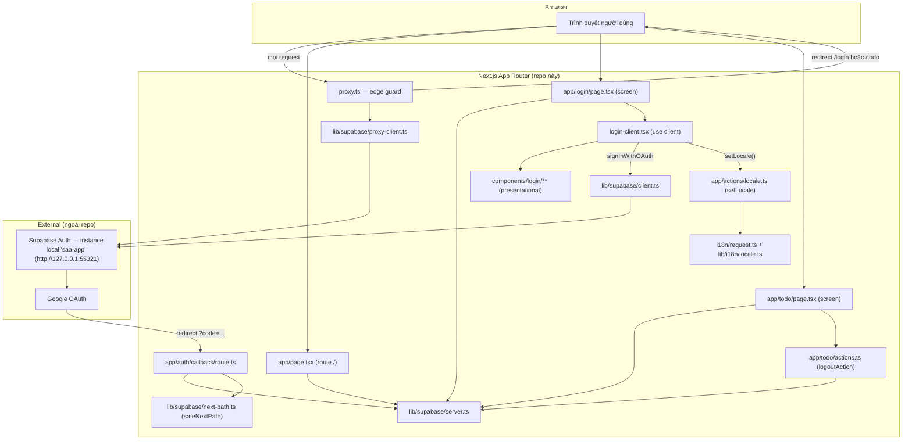
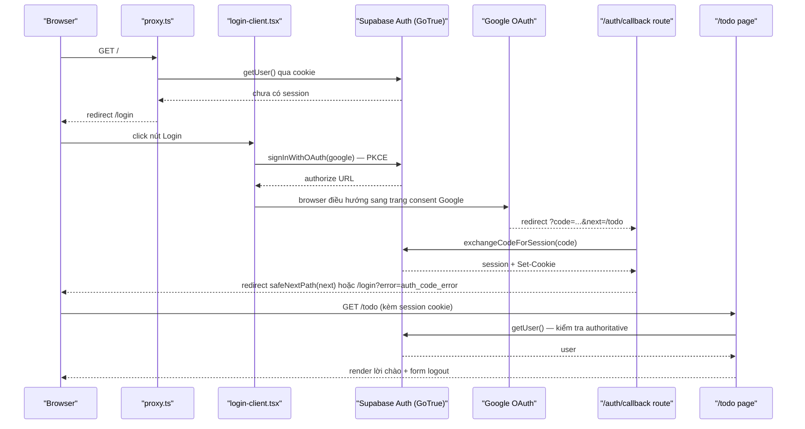

# Architecture

**Phạm vi**: toàn bộ source hiện có trong repo (2 screen: `/login`, `/todo`; route phụ `/`, `/auth/callback`). Mô tả code THỰC TẾ đang chạy, dựng ngược từ source — không phải kế hoạch.

## System Architecture

Ba khối chính: (1) Next.js App Router trong repo này — vừa render UI vừa là "backend" (Server Actions, Route Handler, edge guard), không có service backend riêng; (2) Supabase Auth — instance local `saa-app`, chạy ngoài repo, là nguồn xác thực + lưu session duy nhất; (3) Google OAuth — bên thứ ba, app không gọi trực tiếp mà qua Supabase GoTrue.

Hai lớp guard tách biệt (không phải một):
- `proxy.ts` — guard optimistic, chỉ đọc cookie qua `getUser()` (`proxy.ts:21-40,71-81`), khớp 3 route `/`, `/login`, `/todo/:path*` (`proxy.ts:108-110`), loại trừ `/auth/callback`.
- Guard authoritative nằm ở từng Server Component: `app/page.tsx:10-17`, `app/login/page.tsx:73-83`, `app/todo/page.tsx:17-25` — mỗi trang tự gọi lại `getUser()` qua `lib/supabase/server.ts:16`, không tin tưởng riêng lớp proxy.

`lib/supabase/{client,server,proxy-client}.ts` là 3 factory khác nhau cho cùng một SDK `@supabase/ssr` (browser / Server Component-Action-Route / proxy) — khác nhau ở nơi đọc/ghi cookie, không phải khác nhau về logic nghiệp vụ.

## Tech Stack

| Layer | Technology | Version |
|-------|------------|---------|
| Framework | Next.js (App Router) | 16.3.4 |
| UI | React / React DOM | 19.2.8 |
| Ngôn ngữ | TypeScript | ^5 |
| Styling | Tailwind CSS (`@tailwindcss/postcss`) | ^4 |
| i18n | next-intl (no-routing, cookie `NEXT_LOCALE`) | 4.14.2 |
| Auth SDK | `@supabase/ssr` | 0.12.5 |
| Auth SDK | `@supabase/supabase-js` | 2.115.0 |
| Auth backend | Supabase Auth (GoTrue) — instance local `saa-app`, ngoài repo | API `http://127.0.0.1:55321` |
| Backend (in-repo) | Next.js Server Actions + Route Handlers (không có service backend riêng) | — |
| Database | N/A trong repo — `auth.users` do Supabase quản lý, ngoài phạm vi code này | — |
| Cache | N/A — không tìm thấy | — |
| Queue | N/A — không tìm thấy | — |
| Quản lý gói (package manager) | pnpm, tự quản lý version qua `manage-package-manager-versions` (không dùng corepack) | 10.33.2 |
| Ràng buộc Node.js | `engines.node` trong `package.json` | `>=22 <25` |
| Testing (unit) | Vitest | ^3.2.7 |
| Testing (e2e) | `@playwright/test` | 1.62.1 |
| Lint | ESLint flat config: `eslint-config-next` (`core-web-vitals` + `typescript`) + `typescript-eslint` `recommendedTypeChecked` + `import/order` + `jsx-a11y` full `recommended` + `eslint-plugin-playwright` (scope `tests/e2e/**`) + `@vitest/eslint-plugin` (scope `lib/**/*.test.ts`) | ESLint ^9 |
| Formatter | Prettier + `eslint-config-prettier` (tắt rule style trùng với ESLint, không thêm rule mới) | — |
| CI/CD | GitHub Actions — 2 job: `quality` (lint + prettier check + typecheck + unit test + build) và `e2e` (Playwright, chỉ chạy tập con CI-safe) | — |

Nguồn: `package.json` (dependencies + `packageManager`/`engines` sau migrate), `eslint.config.mjs`, `.github/workflows/*.yml`. Cache/Queue/Database ghi N/A vì scan repo không thấy dependency hay code tương ứng (`app/todo/actions.ts` chỉ gọi `signOut()`, không có model/schema nào trong repo — dữ liệu người dùng nằm hoàn toàn phía Supabase, ngoài phạm vi source này).

Việc chuyển từ npm sang pnpm không đổi version nào đã resolve trong lockfile (`pnpm import` giữ nguyên các version đã khoá) và không cần override `.npmrc` nào — layout `node_modules` mặc định của pnpm (non-flat, strict) tương thích với flat-config ESLint của repo (import plugin trực tiếp qua ESM, không dựa vào name-based resolution như `.eslintrc` cũ) cũng như với Tailwind 4, `@supabase/ssr`, và Playwright (Playwright tải browser binary qua bước `playwright install` riêng, không qua postinstall script).

## Data Flow

Luồng trên là request lõi của app (đăng nhập Google OAuth qua PKCE, cấp bởi Supabase). Trích nguồn: `app/login/login-client.tsx:41-64` (kích hoạt OAuth), `app/auth/callback/route.ts:16-46` (exchange code, redirect matrix), `lib/supabase/next-path.ts:88-106` (`safeNextPath` chặn open-redirect trên tham số `?next=`), `app/todo/page.tsx:17-25` (kiểm tra authoritative). Nhánh lỗi (`?error=` từ Google, `exchangeCodeForSession` thất bại) đều redirect về `/login?error=...`, không lộ raw error ra client (`app/auth/callback/route.ts:39-42`).

Luồng phụ (không vẽ ở trên để giữ diagram gọn): đổi ngôn ngữ — `LoginClient` gọi Server Action `setLocale` (`app/actions/locale.ts:24-41`), ghi cookie `NEXT_LOCALE` (`lib/i18n/locale.ts:17,20`), vòng round-trip của chính Server Action khiến `i18n/request.ts:16-28` đọc lại cookie và trả bộ message mới — không cần `router.refresh()` (`app/login/login-client.tsx:66-72`).

Bản thân luồng chạy (request path) không đổi trong đợt việc này — thay đổi chỉ nằm ở tooling build/lint/CI và ở việc luồng nào trong số trên có bài test tự động chạm tới, không ở hành vi runtime.

**Test topology.** Bộ Playwright (`tests/e2e/**`) chia làm 2 tập, theo việc có cần một Supabase Auth endpoint reachable hay không:
- **Tập CI-safe** (chạy trong job `e2e` của GitHub Actions): toàn bộ test không cần Supabase thật — nhờ `proxy.ts`/các Server Component tự bọc `getUser()` trong try/catch và coi mọi lỗi (host không reachable, thiếu env) là "chưa có session" (fail-open theo thiết kế sẵn có, không phải hành vi mới). Bao gồm mọi test GUI/tương tác của `/login` không xác thực, các test redirect chưa đăng nhập, và 2 test chặn request `signInWithOAuth` phía client (không bao giờ có request thật ra ngoài, nên không cần secret Google nào trong CI).
- **Tập local-only** (không chạy trong CI job `e2e`): block `Authenticated` (đăng nhập thật bằng session cookie lấy qua email/password signup trên Supabase) cùng một test mới lái trực tiếp `GET /auth/callback` (exchange code, nhánh `?error=`, fallback thiếu code) — cả hai đều cần một Supabase Auth instance reachable thật (ví dụ `saa-app` local). Đây là giới hạn được ghi nhận có chủ đích: **job `e2e` trong CI không phủ đường xác thực (authenticated path)** — không suy diễn ngược lại rằng CI đã bao phủ toàn bộ luồng đăng nhập.

## Deployment View

> Derived from repository infrastructure-as-code — not verified against production.

N/A cho đích triển khai (deployment target) — repo vẫn không có infrastructure-as-code hay cấu hình host/deploy nào (không `Dockerfile`, không `*.tf`, không `vercel.json`/`fly.toml`/k8s manifest). Việc thêm `.github/workflows/*.yml` là một lớp **CI (kiểm tra chất lượng trước khi merge)**, không phải deployment pipeline — GitHub Actions ở đây không build image, không push artifact, không gọi tới bất kỳ host nào. Không suy diễn thêm topology triển khai nào ngoài các sự thật này.

CI gồm 2 job, kích hoạt trên `push`/`pull_request` nhắm vào `main`, cache khoá theo `pnpm-lock.yaml`:
- **`quality`** (chặn merge): cài đặt qua pnpm → `lint` (ESLint `--max-warnings 0`) → `prettier --check` → `tsc --noEmit` → `test:unit` (Vitest) → `build` (Next.js). Hai biến môi trường `NEXT_PUBLIC_SUPABASE_URL`/`NEXT_PUBLIC_SUPABASE_PUBLISHABLE_KEY` cần có giá trị (không nhất thiết là giá trị thật) để `build` chạy qua, vì Next.js inline chúng vào bundle client tại build time nhưng không gọi Supabase trong lúc static generation.
- **`e2e`** (chặn merge, job riêng để không chờ theo `quality`): chạy tập CI-safe của Playwright (xem "Test topology" ở mục Data Flow) chống lại `next dev`/build local trong runner — không khởi động Supabase thật, không cần secret Google.

Không job nào trong CI triển khai ứng dụng ra một môi trường chạy thật; Supabase (`saa-app`) tiếp tục là instance local ngoài repo như hiện tại, không được CI quản lý hay khởi tạo.
