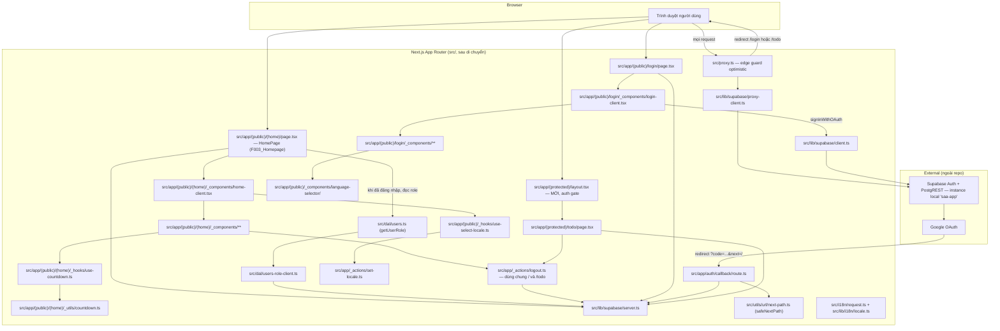
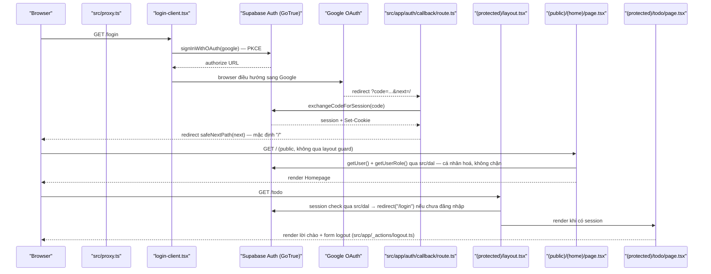

# Architecture

**Phạm vi**: forward-draft mô tả layout `src/` MỤC TIÊU sau khi PR di chuyển merge
(checklist đầy đủ: `.claude/skills/nextjs-route-colocation-architecture/references/migration-map.md`).
Tại thời điểm viết tài liệu này code CHƯA di chuyển — `app/`, `components/`, `hooks/`, `lib/`
gốc vẫn là source thật đang chạy. Tài liệu "đã implement" hiện hành là
`docs/vi/system/architecture.md`; file này KHÔNG thay thế nó, chỉ là input cho planner của
đợt di chuyển.

**Không đổi qua đợt di chuyển này**: URL (`/`, `/login`, `/todo`, `/auth/callback`), hành vi
runtime (OAuth, guard, đếm ngược, đổi ngôn ngữ, đọc role), biến môi trường, khoá trong
`messages/*.json`, script `package.json`. Đổi: file nằm ở thư mục nào, ranh giới import giữa
các thư mục, và pattern mà config build/test dùng để tìm file.

## System Architecture

Layout chia 2 zone (rule 1, SKILL.md):
- **Zone A — `src/<layer>/`**: code dùng chung, nhóm theo LOẠI — `api`, `dal`, `lib`, `hooks`,
  `utils`, `constants`, `configs`, `styles`, `mocks`, `i18n`.
- **Zone B — `src/app/**`**: code theo FEATURE, nhóm theo ROUTE. Mỗi segment giữ file riêng
  trong folder private của nó: `_components`, `_hooks`, `_actions`, `_utils`, `_shared`.

Hướng phụ thuộc (rule 3): Zone A không bao giờ import `src/app`. Trong Zone A:
`types/constants/utils` ← `domain` ← `configs/lib` ← `api/dal` ← `hooks` ← `components`. Một
segment chỉ import folder private của chính nó, của segment tổ tiên (relative path), hoặc
`@/<layer>` — không import ngang hàng, không import xuống con.

Hai lớp guard tách biệt vẫn giữ nguyên nguyên tắc cũ, chỉ đổi vị trí file:
- `src/proxy.ts` — guard optimistic. Matcher (`/`, `/login`, `/todo/:path*`, loại trừ
  `/auth/callback`) và logic redirect KHÔNG đổi.
- `src/app/(protected)/layout.tsx` (MỚI) — guard authoritative: session check qua `src/dal`
  → `redirect("/login")` (đúng theo cây mục tiêu trong SKILL.md). Thay cho việc
  `src/app/(protected)/todo/page.tsx` tự gọi `getUser()` như `app/todo/page.tsx` hiện tại —
  trang bỏ đoạn guard này sau khi layout tồn tại.

Server Actions dùng chung nhiều route gộp về `src/app/_actions/`:
- `logout.ts` — hiện là `app/todo/actions.ts`. Root (`/`) đang import chéo (sideways import)
  file này để lấy `logoutAction` cho mục "Đăng xuất" trong menu tài khoản; sau di chuyển hai
  segment `(home)` và `(protected)/todo` cùng dùng bản dùng-chung này, xoá sideways import.
- `set-locale.ts` — hiện là `app/actions/locale.ts`; root-shell concern vì `layout.tsx` set
  `lang`, dùng bởi cả `login` (`use-login-actions`) và `(home)` (`use-select-locale`).

DAL: `src/dal/users.ts` (hiện `lib/auth/get-user-role.ts`, thêm `import "server-only"`) và
`src/dal/users-role-client.ts` (shim thu hẹp kiểu builder, hiện
`lib/supabase/users-role-client.ts`). Browser-side Supabase call chuyển sang `src/api/auth.ts`
(hiện `lib/auth/sign-in-with-google.ts`) — gọi từ `use-login-actions` (Zone B, hook).

3 factory `@supabase/ssr` chuyển nguyên khối sang `src/lib/supabase/{client,server,proxy-client}.ts`
— không đổi logic, chỉ đổi thư mục cha. `next-path.ts` (open-redirect guard, business-agnostic)
tách khỏi `lib/supabase/` sang `src/utils/url/next-path.ts` — nó không phải vendor glue.

`domain/`, `contexts/`, `components/` (shared, ngoài `language-selector`) CHƯA tồn tại — đợt
di chuyển này không tạo trước; tạo khi có consumer thật đầu tiên (rule 6, YAGNI). Tương tự,
`src/configs/env.ts` là optional: `EVENT_START_AT` tiếp tục đọc trực tiếp trong
`src/app/(public)/(home)/page.tsx` (`resolveTargetIso()`) cho tới khi có biến env thứ hai cần
đọc.

## Tech Stack

Phiên bản không đổi — đây là di chuyển thư mục, không phải nâng cấp dependency.

| Layer | Technology | Version |
|-------|------------|---------|
| Framework | Next.js (App Router) | 16.3.4 |
| UI | React / React DOM | 19.2.8 |
| Ngôn ngữ | TypeScript | ^5 |
| Styling | Tailwind CSS (`@tailwindcss/postcss`) | ^4 |
| i18n | next-intl (no-routing, cookie `NEXT_LOCALE`) | 4.14.2 |
| Auth SDK | `@supabase/ssr` / `@supabase/supabase-js` | 0.12.5 / 2.115.0 |
| Package manager | pnpm (`packageManager` field) | 10.33.2 |
| Node.js | `engines.node` | `>=22 <25` (CI chạy 24) |
| Testing (unit) | Vitest | ^3.2.7 |
| Testing (e2e) | `@playwright/test` (chromium) | 1.62.1 |
| Component docs | Storybook + `@storybook/nextjs-vite` + `msw-storybook-addon` | 10.6.0 / 10.6.0 / 3.0.0 |
| Lint | ESLint flat config + `eslint-plugin-boundaries` khi cần | ESLint ^9 |

**Config đổi theo di chuyển** (chi tiết đầy đủ: migration-map.md § Config changes):
- `tsconfig.json`: `"@/*": ["./src/*"]`.
- `vitest.config.ts`: alias `@` → `./src`; `test.projects` tách theo pattern — project `node`
  = `src/**/*.test.ts` trừ `src/hooks/**` và `src/app/**/_hooks/**`; project `jsdom` =
  `src/hooks/**/*.test.ts` và `src/app/**/_hooks/**/*.test.ts`. Coverage `include` là allowlist
  tường minh: `src/api|dal|lib|utils|hooks|domain|configs/**/*.ts`,
  `src/app/**/_hooks|_utils|_actions/**/*.ts`, `src/app/**/actions.ts`, `src/app/**/route.ts`.
  Ngưỡng `100%` giữ nguyên. Không có glob `.tsx` — `components/**` và `page.tsx` vẫn ngoài
  mẫu số, lý do không đổi (Storybook tài liệu hoá component; `async` Server Component chưa
  được Vitest hỗ trợ).
- `.storybook/main.ts`: `stories: ["../src/**/*.stories.@(ts|tsx)"]`.
  `.storybook/preview.tsx`: import `../src/mocks/handlers`, `../src/styles/globals.css`.
- `eslint.config.mjs`: 2 rule `no-restricted-imports` mới — Zone A (`src/!(app)/**`) cấm import
  `@/app/**`; trong `src/app/**` cấm import private folder (`_*`) qua alias hoặc qua đường
  ngang hàng/xuống con (`../*/_*`, `./*/_*`) — chỉ được import relative tới chính segment hoặc
  tổ tiên. Dùng core ESLint, không thêm dependency; nâng lên `eslint-plugin-boundaries` lần
  đầu có vi phạm lọt qua.

**Ở lại gốc repo, không di chuyển**: `messages/` (next-intl default), `public/`,
`tests/{e2e,setup}/` (Playwright `testDir`, vitest `setupFiles`), mọi root config file.

## Data Flow

Luồng OAuth (PKCE), đích mặc định sau đăng nhập (`/`), và cơ chế `safeNextPath` KHÔNG đổi so
với `docs/vi/system/architecture.md` hiện hành — chỉ đổi file chứa logic (xem bảng path ở
System Architecture). Locale action (`src/app/_actions/set-locale.ts`) và role/countdown flow
(`src/dal/users.ts`, `src/app/(public)/(home)/_hooks/use-countdown.ts` +
`_utils/countdown.ts`) cũng giữ nguyên cơ chế, chỉ đổi path.

**Test topology** (path mục tiêu, cơ chế không đổi):

| Lớp | Công cụ | Phủ (path mục tiêu) |
|-----|---------|----------------------|
| Unit | Vitest (`node` + `jsdom`) | `src/dal/**`, `src/lib/**`, `src/utils/**`, `src/hooks/**`, `src/app/**/_hooks/**`, `src/app/**/_actions/**`, `src/app/**/actions.ts`, `src/app/**/route.ts` |
| Component docs | Storybook (`@storybook/nextjs-vite`) | `src/app/**/_components/**/*.stories.tsx` (22 story, dời cùng component) |
| E2E | Playwright (chromium), `tests/e2e/` (không đổi vị trí) | Luồng thật qua `next dev`: guard route, redirect, GUI `/login`, Homepage |

MSW: một handler list (`src/mocks/handlers.ts`, hiện `mocks/handlers.ts`) phục vụ cả
`msw/node` (vitest) và service worker (Storybook) — không đổi cơ chế.

## Deployment View

> Derived from repository infrastructure-as-code — not verified against production.

N/A — không có infrastructure-as-code trong repo, không đổi qua đợt di chuyển này (không
`Dockerfile`, không `*.tf`, không `vercel.json`/`fly.toml`/k8s manifest).

CI (`.github/workflows/ci.yml`) giữ nguyên 2 job (`quality`, `e2e`), không đổi trigger
(`push`/`pull_request` vào `main`, `workflow_dispatch`). Path assumption bên trong từng job đổi
theo config ở § Tech Stack: cache key vẫn khoá theo `pnpm-lock.yaml`; job `quality` chạy cùng
script `package.json` (`lint`, `format:check`, `test:unit:coverage`, `build`, `typecheck`) trên
source đã dời sang `src/`; job `e2e` build/chạy `next dev` không đổi vì `tests/e2e/` ở nguyên
gốc repo. Không job nào triển khai ứng dụng ra môi trường chạy thật — không đổi.
