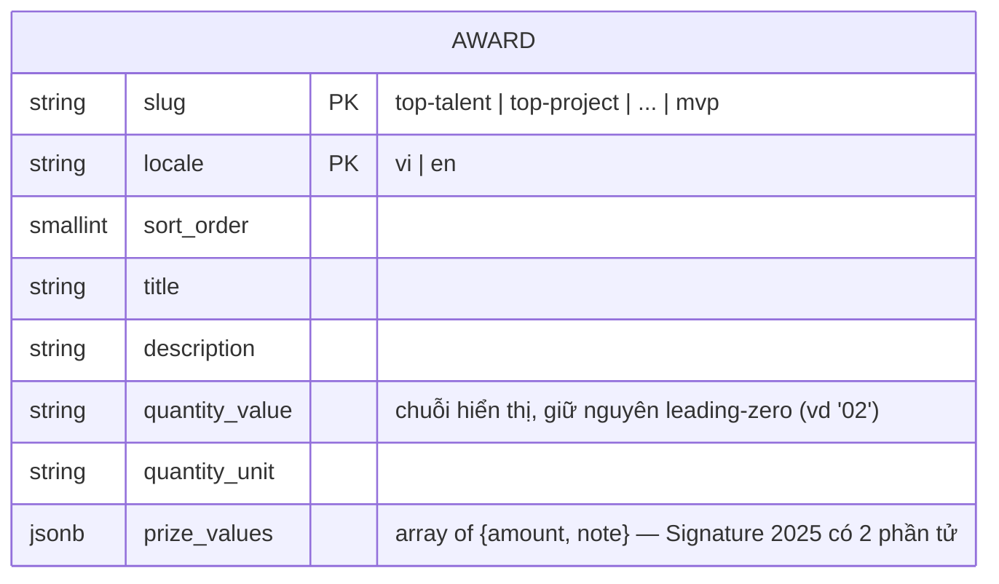

# F004_AwardSystemPage

**Priority**: P1
**Type**: ui
**Generated**: 2026-09-06

**See also:** [`functional-spec.md`](./functional-spec.md) — tổng quan, Open Decisions, FR/BR
one-liner, screens, user stories, scenarios, edge cases cho độc giả BA/QA.

**How to read this file:** § 2 bảng chỉ mục. § 3 chi tiết action. § 4 schema/DAL/DOM contract/
component reuse. § 5 verification + nguồn.

## 1. Technical Overview

Trang công khai mới `/awards` (`src/app/(public)/awards/page.tsx`, planned) — 1 Server
Component đọc 6 hạng mục giải từ bảng mới `public.awards` qua DAL (mirror `src/dal/users.ts`),
cộng 1 client hook (`useAwardCategoryNav`) cho nav trái (click-scroll + scroll-spy). Không
action nào ghi DB — toàn bộ read-only. `KudosSection` (đã có ở F003) được PROMOTE từ
`(home)/_components/` lên `(public)/_components/` để dùng chung 2 route — xem § 4.1. Chỉ 1
capability (`CAP-01`), 3 action, không action nào cần diagram.

## 2. Action Index

| # | Action (handler) | Method · Path | Codes | Writes | Detail |
|---|---|---|---|---|---|
| **A1** | `AwardsPage` (Server Component) | `GET` `/awards` | FR-001, FR-002, FR-003, FR-201, FR-202, FR-203, FR-204, FR-205, FR-206, BR-001, BR-002, BR-005, BR-006, US001, US003 | — *(read-only)* | § 3.1 |
| **A2** | `AwardCategoryNav` + `useAwardCategoryNav` *(client-only, no BE)* | — *(click/scroll, không HTTP)* | FR-101, FR-102, FR-103, FR-104, BR-003, BR-004, US002 | — *(read-only)* | § 3.1 |

## 3. Actions

### 3.1 CAP-01 — Xem & điều hướng Hệ thống giải thưởng SAA 2025

#### A1 · Render trang `/awards` (đọc 6 hạng mục giải, dựng nội dung)

`GET` `/awards` → `` `AwardsPage` ``
`FR-001` `FR-002` `FR-003` `FR-201` `FR-202` `FR-203` `FR-204` `FR-205` `FR-206` · `SCR004_Awards`
· `US001` `US003`

**Who** · Bất kỳ khách truy cập nào — Anonymous hoặc Authenticated, không qua guard nào (khác
`/todo`; giống `/`).
**FE** · `app/(public)/awards/page.tsx` gọi DAL rồi render `AwardsScreen` (presentational,
`_components/awards-screen.tsx`): header/footer tái dùng (§ 4.1), `<h1>`+caption, `AwardCategoryNav`,
6× `AwardSection`, `KudosSection`. Chrome tĩnh (h1, caption, nhãn "Số lượng giải thưởng:"/"Giá
trị giải thưởng:", `aria-label` nav) từ `messages/*.json` khoá mới `awards.*` (mirror
`home.*` shape).
**Request** · không tham số — chỉ `NEXT_LOCALE` cookie (qua `getLocale()`, giống F003)
**BE** · `getAwards(toAwardsClient(supabase), locale)` (`src/dal/awards.ts`) — 1 lần đọc
`public.awards` lọc theo `locale`, sắp theo `sort_order`.
**Rule**
- **BR-001 — Không guard đăng nhập nào áp dụng cho `/awards`.** *(§ permissions.md delta)*
- **BR-002 — DAL lỗi/rỗng → `getAwards` trả `[]`; trang render `AwardsScreen` với
  `awards=[]`, `AwardCategoryNav` và 6 `AwardSection` không render, vùng nội dung hiện
  empty-state; header/footer/h1 vẫn render bình thường.** *(Bin 1 — chỉ dùng ở A1)*
- **BR-005 — `prizeValues` là `{amount, note}[]`; render mỗi phần tử thành 1 dòng giá trị.**
**Result** · read-only — không ghi DB. Props xuống `AwardsScreen`: `awards: Award[]`, `copy`
(chrome tĩnh).
**Source:** `app/(public)/awards/page.tsx` (planned) → `src/dal/awards.ts` (planned)

---

#### A2 · Nav trái: click-scroll + scroll-spy

— *(client, không HTTP)* → `` `AwardCategoryNav` + `useAwardCategoryNav` ``
`FR-101` `FR-102` `FR-103` `FR-104` · `SCR004_Awards` · `US002`

**Who** · Bất kỳ khách truy cập nào đang xem `/awards`
**FE** · `_components/award-category-nav.tsx` (client leaf) render `nav[aria-label="Danh mục
giải thưởng"]` + 6 `<a href="#<slug>">`; toàn bộ logic uỷ quyền cho `useAwardCategoryNav`
(`_hooks/use-award-category-nav.ts`) theo `separate-hook-logic-from-components`: pure layer
`_utils/scroll-spy.ts` tính section nào đang "active" từ danh sách `IntersectionObserverEntry`
(không JSX, test được không cần DOM thật ngoài `jsdom`); hook owns
`useState<activeSlug>` + `useEffect` gắn 1 `IntersectionObserver` (root=null, threshold hợp lý
cho section cao) + `useRef` callback cho từng section; component chỉ render, gọi đúng 1 hook.
**Request** · không có
**BE** · không có
**Rule**
- **BR-003 — Đúng 1 `aria-current="true"` tại một thời điểm; click ghi `activeSlug` ngay lập
  tức (không chờ observer), observer ghi đè khi người dùng tự cuộn.** *(Bin 1 — chỉ dùng ở A2)*
- **BR-004 — `matchMedia("(prefers-reduced-motion: reduce)").matches` → `scrollIntoView`/
  `scrollTo` dùng `behavior: "auto"` thay vì `"smooth"`.**
**Result** · read-only — không ghi DB, không điều hướng trang (chỉ hash `#slug` + scroll nội
trang).
**Source:** `_components/award-category-nav.tsx` → `_hooks/use-award-category-nav.ts` →
`_utils/scroll-spy.ts`

### 3.2 Edge cases

| Action | Scenario | Behavior |
|---|---|---|
| A1 | Supabase lỗi hoặc `awards` rỗng cho locale hiện tại (TC ID-3/6 không áp dụng được) | `getAwards` trả `[]`; `AwardsScreen` render empty-state, không throw, không 500 |
| A2 | `prefers-reduced-motion: reduce` (TC ID-9 biến thể) | Cuộn tức thời, active vẫn cập nhật đúng |
| A1 (link Kudos) | `/kudos` chưa tồn tại (TC ID-12/ID-14) | Link vẫn render `href="/kudos"`, điều hướng thật trả 404 — E2E chỉ assert `href` |

## 4. Shared Foundation

### 4.1 Components

| Component | Responsibility | Used in | File | Status |
|---|---|---|---|---|
| `AwardsPage` (Server Component) | Entry point `/awards`, đọc locale + gọi DAL | A1 | `src/app/(public)/awards/page.tsx` | **new** |
| `AwardsScreen` | Presentational root — h1/caption, nav, 6 section, Kudos, empty-state | A1 | `src/app/(public)/awards/_components/awards-screen.tsx` | **new** |
| `AwardCategoryNav` | Nav trái/thanh chip, render `useAwardCategoryNav` | A2 | `src/app/(public)/awards/_components/award-category-nav.tsx` | **new** |
| `AwardSection` | 1 section giải: ảnh + h2 + mô tả + số lượng + giá trị, layout xen kẽ theo index | A1 | `src/app/(public)/awards/_components/award-section.tsx` | **new** |
| `useAwardCategoryNav` | Hook click-scroll + IntersectionObserver scroll-spy + reduced-motion | A2 | `src/app/(public)/awards/_hooks/use-award-category-nav.ts` | **new** |
| `IconTarget`/`IconDiamond`/`IconLicense` | 3 icon 24px mới (nav/tiêu đề, số lượng, giá trị) | A1, A2 | `src/app/(public)/awards/_components/icons/icon-{target,diamond,license}.tsx` | **new**, mirror `(home)/_components/icons/icon-*.tsx` |
| `HomeHeader` → **`SiteHeader`** (rename khi promote) | Header dùng chung — role-aware bell/account | A1 | `src/app/(public)/_components/site-header.tsx` | **promoted** từ `(home)/_components/header.tsx` (xem note dưới) |
| `HomeFooter` → **`SiteFooter`** | Footer dùng chung | A1 | `src/app/(public)/_components/site-footer.tsx` | **promoted** từ `(home)/_components/home-footer.tsx` |
| `KudosSection` | Khối Sun* Kudos — cùng component instance Figma, không sửa nội dung | A1 | `src/app/(public)/_components/kudos-section.tsx` | **promoted** từ `(home)/_components/kudos-section.tsx` |
| `getAwards` | Đọc `public.awards` theo locale, fail-open `[]` | A1 | `src/dal/awards.ts` | **new** |
| `toAwardsClient` | Shim thu hẹp kiểu client Supabase cho `getAwards` | A1 | `src/dal/awards-client.ts` | **new** |

**Vì sao promote Header/Footer/KudosSection:** scope-ladder rule (`nextjs-route-colocation-
architecture` SKILL.md:30) — file leo đúng 1 nấc khi có consumer ngoài scope hiện tại. `(home)`
và `awards` là 2 segment anh em cùng group `(public)`; cả 3 component nay có consumer ở cả 2
segment → nấc đúng là `(public)/_components/`, không nhân bản (delta ghi ở `architecture.md`).
Rename `HomeHeader`→`SiteHeader`, `HomeFooter`→`SiteFooter` phản ánh phạm vi mới;
`home-client.tsx` đổi import, props giữ nguyên. `AwardCard`/lưới giải trên `/` KHÔNG đổi — 2 UI
khác nhau (thẻ tóm tắt vs. section chi tiết).

**Assets tái dùng (không tải mới):** ảnh 336×336 của `AwardSection` dùng lại đúng cặp
`/home/Award_BG.png` + PNG tên giải theo slug — map `AWARD_NAME_GRAPHIC` (hiện cục bộ trong
`award-card.tsx`) leo lên `src/app/(public)/_shared/award-name-graphics.ts` (2 consumer nay),
`award-card.tsx` đổi import, hành vi không đổi.

### 4.2 Data Model



Không vẽ quan hệ — bảng độc lập, không tham chiếu `public.users` hay entity nào khác.

| Entity | Table | Used for | Action |
|---|---|---|---|
| `Award` (chưa có MODEL### — cấp bởi `rebuild-spec` Core pass kế tiếp) | `public.awards` *(saa-app, Supabase ngoài repo, MỚI)* | Nguồn sự thật nội dung 6 hạng mục giải | A1 |
| `AppLocale` (MODEL001, tái dùng nguyên trạng từ F002) | `NEXT_LOCALE` cookie | Lọc `awards.locale`, nhãn chrome tĩnh | A1 |

#### Polymorphic Behavior

N/A — không có discriminator field. `locale` là khoá lọc (kèm `slug` làm composite PK), không
phải nhánh hành vi theo `code-formats.md` § DISC vs DEC.

### 4.3 Schema — bảng mới `public.awards`

Migration `supabase/migrations/0003_awards_table.sql` (planned, KHÔNG tạo file trên đĩa ở
Stage này) — đặt tên sequential nối tiếp `0001_users_table.sql`/`0002_handle_new_user_trigger.sql`
(quyết định: giữ style sequential có sẵn, KHÔNG dùng timestamp mặc định của
`supabase migration new`, theo report 02 § Recommendation).

```sql
CREATE TABLE IF NOT EXISTS public.awards (
    slug            text         NOT NULL,
    locale          text         NOT NULL CHECK (locale IN ('vi', 'en')),
    sort_order      smallint     NOT NULL,
    title           text         NOT NULL,
    description     text         NOT NULL,
    quantity_value  text         NOT NULL,
    quantity_unit   text         NOT NULL,
    prize_values    jsonb        NOT NULL,
    created_at      timestamptz  NOT NULL DEFAULT now(),
    updated_at      timestamptz  NOT NULL DEFAULT now(),
    PRIMARY KEY (slug, locale)
);

COMMENT ON TABLE public.awards IS
  'Read-only SAA award category content for /awards (F004_AwardSystemPage), one row per (slug, locale).';
COMMENT ON COLUMN public.awards.prize_values IS
  'Array of {amount: string, note: string}. Signature 2025 has 2 entries, the other 5 have 1.';

ALTER TABLE public.awards ENABLE ROW LEVEL SECURITY;
ALTER TABLE public.awards FORCE ROW LEVEL SECURITY;

CREATE POLICY awards_select_all ON public.awards
    FOR SELECT TO anon, authenticated
    USING (true);

-- RLS alone không đủ nếu role chưa có GRANT bảng; `anon` chưa xác nhận có SELECT mặc định
-- (khác `authenticated`, xem § 5.2).
GRANT SELECT ON public.awards TO anon, authenticated;
```

**Khác `0001_users_table.sql` có chủ đích:** không `TO authenticated`-only — trang PUBLIC nên
cả `anon` lẫn `authenticated` cần SELECT; không cột owner nên `USING (true)` thay vì
`auth.uid() = id`; không policy UPDATE/INSERT/DELETE (default-deny, bảng chỉ đọc).

**PK `(slug, locale)`** thay vì `id uuid` riêng — không entity nào FK vào `awards`, composite
key vừa định danh vừa là unique constraint tự nhiên (KISS).

### 4.4 Seed data

Chỉ seed `locale = 'vi'` (D002). Đặt cùng trong `0003_awards_table.sql` (không tách `seed.sql`
riêng — repo chưa có tiền lệ, KISS, 1 file/1 feature).

Mô tả `top-talent`/`signature-2025-creator` trích NGUYÊN VĂN từ MoMorph (`zFYDgyj_pD`, node
`313:8467`, `313:8471`/`313:8472`). 4 mô tả còn lại **KHÔNG trích được** — node tương ứng
(`313:8468`, `313:8469`, `313:8470`, `313:8510`) trả về nguyên văn "Top Talent" (placeholder
chưa điền, § 3 D001); dùng lại mô tả đã CHẤP NHẬN ở F003 `home-copy.ts` (Top Project/Top
Project Leader) hoặc placeholder lặp của chính F003 (Best Manager/MVP) — không tự soạn mới.

```sql
INSERT INTO public.awards
  (slug, locale, sort_order, title, description, quantity_value, quantity_unit, prize_values)
VALUES
  ('top-talent', 'vi', 1, 'Top Talent',
   'Giải thưởng Top Talent vinh danh những cá nhân xuất sắc toàn diện – những người không ngừng khẳng định năng lực chuyên môn vững vàng, hiệu suất công việc vượt trội, luôn mang lại giá trị vượt kỳ vọng, được đánh giá cao bởi khách hàng và đồng đội. Với tinh thần sẵn sàng nhận mọi nhiệm vụ tổ chức giao phó, họ luôn là nguồn cảm hứng, thúc đẩy động lực và tạo ảnh hưởng tích cực đến cả tập thể.',
   '10', 'Cá nhân',
   '[{"amount":"7.000.000 VNĐ","note":"cho mỗi giải thưởng"}]'::jsonb),

  -- [INFERRED — reused from F003 home-copy.ts, real content, not this frame's placeholder]
  ('top-project', 'vi', 2, 'Top Project',
   'Vinh danh dự án xuất sắc trên mọi phương diện, dự án có doanh thu nổi bật',
   '02', 'Tập thể',
   '[{"amount":"15.000.000 VNĐ","note":"cho mỗi giải thưởng"}]'::jsonb),

  -- [INFERRED — reused from F003 home-copy.ts, real content, not this frame's placeholder]
  ('top-project-leader', 'vi', 3, 'Top Project Leader',
   'Vinh danh người quản lý truyền cảm hứng và dẫn dắt dự án bứt phá',
   '03', 'Cá nhân',
   '[{"amount":"7.000.000 VNĐ","note":"cho mỗi giải thưởng"}]'::jsonb),

  -- [CONTENT DEBT — no real description in either MoMorph frame; F003 placeholder reused]
  ('best-manager', 'vi', 4, 'Best Manager',
   'Vinh danh người quản lý có năng lực quản lý tốt, dẫn dắt đội nhóm',
   '01', 'Cá nhân',
   '[{"amount":"10.000.000 VNĐ","note":""}]'::jsonb),

  ('signature-2025-creator', 'vi', 5, 'Signature 2025 - Creator',
   'Giải thưởng Signature vinh danh cá nhân hoặc tập thể thể hiện tinh thần đặc trưng mà Sun* hướng tới trong từng thời kỳ. Trong năm 2025, giải thưởng Signature vinh danh Creator - cá nhân/tập thể mang tư duy chủ động và nhạy bén, luôn nhìn thấy cơ hội trong thách thức và tiên phong trong hành động. Họ là những người nhạy bén với vấn đề, nhanh chóng nhận diện và đưa ra những giải pháp thực tiễn, mang lại giá trị rõ rệt cho dự án, khách hàng hoặc tổ chức. Với tư duy kiến tạo và tinh thần "Creator" đặc trưng của Sun*, họ không chỉ phản ứng tích cực trước sự thay đổi mà còn chủ động tạo ra cải tiến, góp phần định hình chuẩn mực mới cho cách mà người Sun* tạo giá trị.',
   '01', 'Cá nhân hoặc tập thể',
   '[{"amount":"5.000.000 VNĐ","note":"cho giải cá nhân"},{"amount":"8.000.000 VNĐ","note":"cho giải tập thể"}]'::jsonb),

  -- [CONTENT DEBT — no real description in either MoMorph frame; F003 placeholder reused]
  ('mvp', 'vi', 6, 'MVP (Most Valuable Person)',
   'Vinh danh người quản lý có năng lực quản lý tốt, dẫn dắt đội nhóm',
   '01', 'Cá nhân',
   '[{"amount":"15.000.000 VNĐ","note":""}]'::jsonb);
```

**Quan trọng cho implementer:** `tests/e2e/awards.spec.ts` (đã tồn tại, RED hiện tại, TC ID-0,3-
9,11,13) assert đúng các giá trị trên — không seed 6 dòng này thì GREEN không đạt dù code đúng.

### 4.5 DAL Contract

`src/dal/awards.ts` (mirror `src/dal/users.ts` 1:1 — `import "server-only"`, client hẹp được
inject, fail-open):

```ts
import "server-only";

export type AwardPrizeValue = { amount: string; note: string };
export type Award = {
  slug: string;
  title: string;
  description: string;
  quantityValue: string;
  quantityUnit: string;
  prizeValues: AwardPrizeValue[];
};

type AwardRow = { slug: string; title: string; description: string; quantity_value: string; quantity_unit: string; prize_values: AwardPrizeValue[] };
type AwardsListResult = { data: AwardRow[] | null; error: unknown };

export type AwardsClient = {
  from: (table: "awards") => {
    select: (columns: string) => {
      eq: (column: "locale", value: string) => {
        order: (column: "sort_order", opts: { ascending: true }) => PromiseLike<AwardsListResult>;
      };
    };
  };
};

export async function getAwards(supabase: AwardsClient, locale: string): Promise<Award[]> {
  try {
    const { data, error } = await supabase
      .from("awards")
      .select("slug,title,description,quantity_value,quantity_unit,prize_values")
      .eq("locale", locale)
      .order("sort_order", { ascending: true });
    if (error || !data) return [];
    return data.map((row) => ({
      slug: row.slug, title: row.title, description: row.description,
      quantityValue: row.quantity_value, quantityUnit: row.quantity_unit, prizeValues: row.prize_values,
    }));
  } catch {
    return [];
  }
}
```

`src/dal/awards-client.ts` (mirror `src/dal/users-role-client.ts` — shim tránh TS2589, cùng
hình dạng `toUsersRoleClient` nhưng chain thêm `.order(...)`):

```ts
import "server-only";
import type { AwardsClient } from "./awards";
import type { createClient } from "@/lib/supabase/server";

type ServerSupabaseClient = Awaited<ReturnType<typeof createClient>>;

export function toAwardsClient(supabase: ServerSupabaseClient): AwardsClient {
  return {
    from: (table) => ({
      select: (columns) => ({
        eq: (column, value) => ({
          order: (column2, opts) =>
            supabase.from(table).select(columns).eq(column, value).order(column2, opts),
        }),
      }),
    }),
  };
}
```

### 4.6 DOM / a11y Contract (authoritative — E2E viết đúng theo đây)

- `<h1>` text `Hệ thống giải thưởng SAA 2025`; caption phụ phía trên `Sun* annual awards 2025`.
- `<nav aria-label="Danh mục giải thưởng">` chứa ĐÚNG 6 `<a>` theo thứ tự với href:
  `#top-talent`, `#top-project`, `#top-project-leader`, `#best-manager`,
  `#signature-2025-creator`, `#mvp`.
- Mục active mang `aria-current="true"`; đúng 1 mục tại một thời điểm.
- 6 `<section>` với `id` bằng slug tương ứng, mỗi section chứa `<h2>` tiêu đề giải.
- Tiêu đề theo thứ tự: `Top Talent`, `Top Project`, `Top Project Leader`, `Best Manager`,
  `Signature 2025 - Creator`, `MVP (Most Valuable Person)`.
- Mỗi section có 1 dòng số lượng và ít nhất 1 dòng giá trị giải.
- Khối Kudos: `<h2>Sun* Kudos</h2>` cùng 1 link `href="/kudos"`.

Contract khớp 100% với `tests/e2e/awards.spec.ts` (RED hiện tại) — implementer code cho khớp,
không tự suy diễn lại.

## 5. Verification & Technical Notes

### 5.1 Technical Verification

- **SC-001** *(A1)* `/awards` trả nội dung thành công cho cả Anonymous và Authenticated, không
  redirect (covers FR-001, TC ID-0)
- **SC-002** *(A1)* Thứ tự DOM header→h1→nav→6 section→Kudos→footer đúng (covers FR-202, TC ID-3)
- **SC-003** *(A1)* Cả 6 section đúng tiêu đề/số lượng/giá trị theo § 4.4 seed (covers FR-204,
  TC ID-6)
- **SC-004** *(A2)* Click nav cuộn đúng section + active đúng 1 mục (covers FR-102/103, TC ID-9,
  ID-11)
- **SC-005** *(A1)* Supabase lỗi → không 500, header/footer còn nguyên (covers FR-003)

### 5.2 Assumptions & Unresolved Questions

- *(§ 4.3)* `GRANT SELECT ON public.awards TO anon` đủ để PostgREST phục vụ `anon` — CHƯA verify
  bằng `supabase db query` (constraint: không chạy lệnh supabase ở Stage này); khác
  `public.users` nơi `authenticated` đã xác nhận có SELECT mặc định — `anon` chưa từng xác nhận
  tương tự, implementer verify khi áp migration.
- *(A2)* `IntersectionObserver` không cần polyfill (target hiện tại của repo).
- Nội dung thật 4/6 mô tả giải (§ 4.4 D001) — chờ product owner; hiện dùng lại nội dung F003 đã
  chấp nhận, chưa phải bản final cho `/awards`.
- Ngưỡng `threshold`/`rootMargin` chưa chốt — implementer chọn giá trị hợp lý theo section thực tế.

### 5.3 Source References

| Action | Order | Symbol | Path | Purpose |
|---|---|---|---|---|
| A1 | 1 | `AwardsPage` | `src/app/(public)/awards/page.tsx` | Entry point `/awards` |
| A1 | 2 | `getAwards`, `toAwardsClient` | `src/dal/awards.ts`, `src/dal/awards-client.ts` | Đọc bảng `awards`, fail-open |
| A1 | 3 | `AwardsScreen`, `AwardSection` | `_components/awards-screen.tsx`, `_components/award-section.tsx` | Render 6 section + Kudos |
| A2 | 4 | `AwardCategoryNav`, `useAwardCategoryNav` | `_components/award-category-nav.tsx`, `_hooks/use-award-category-nav.ts` | Nav click-scroll + scroll-spy |
| — | 5 | `SiteHeader`, `SiteFooter`, `KudosSection` | `(public)/_components/*` (promoted) | Chrome dùng chung F003+F004 |

#### Data Flow

```text
GET /awards -> AwardsPage [đọc locale cookie] -> getAwards(toAwardsClient(supabase), locale)
  -> Award[] (hoặc [] nếu lỗi) -> AwardsScreen render nav + 6 section + Kudos + empty-state
client: click nav -> useAwardCategoryNav.handleClick(slug) -> scrollIntoView + setActive(slug)
client: cuộn tay -> IntersectionObserver callback -> scroll-spy pure fn -> setActive(slug)
```

### 5.4 Artifact References

| Artifact | File | Codes Used | Reviewed |
|----------|------|------------|----------|
| Architecture (delta) | [architecture.md](../system/architecture.md) | — | [ ] |
| Permissions (delta) | [permissions.md](../system/permissions.md) | — | [ ] |
| F003_Homepage | [technical-spec.md](../../../../docs/vi/features/F003_Homepage/technical-spec.md) | KudosSection reuse | [ ] |
| Screens | [functional-spec.md § 6](./functional-spec.md#6-screens) | SCR004_Awards (draft) | [ ] |
