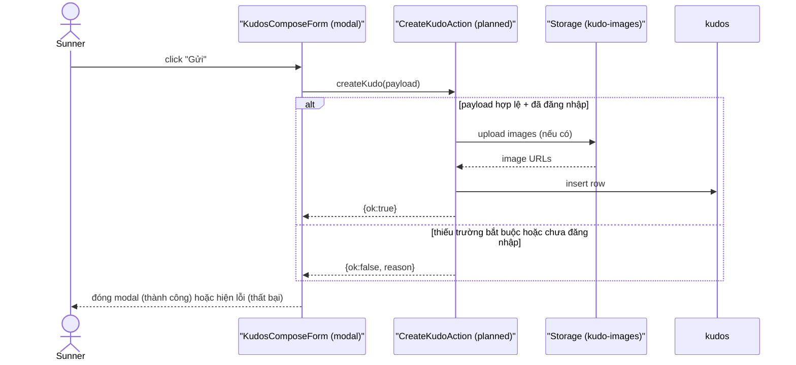
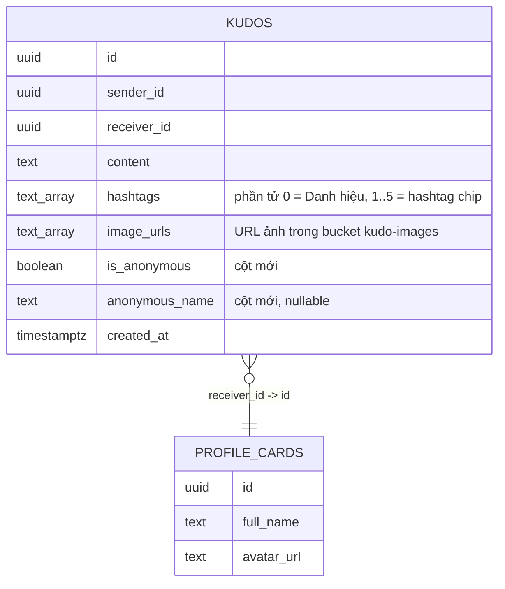
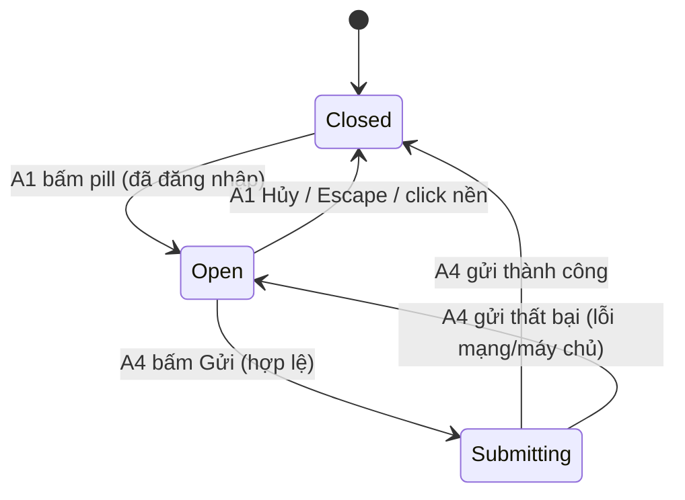

# F009_KudosCompose

**Priority**: P1
**Type**: ui
**Generated**: 2026-09-07

**See also:** [`functional-spec.md`](./functional-spec.md) — tổng quan ngôn ngữ thường, Open
Decisions, Requirements/Business Rules một dòng, Screens, User Stories, Scenarios, Edge Cases.

## 1. Technical Overview

Tính năng cho Sunner đã đăng nhập mở dialog "Viết Kudo" đè lên trang `/kudos` để soạn và gửi một
lời cảm ơn có định dạng cơ bản tới đồng đội, kèm tối đa 5 hashtag, tối đa 5 ảnh và tuỳ chọn gửi ẩn
danh. Gồm 2 Server Action mới (tìm người nhận, ghi Kudo) và 1 migration mới (RLS insert + 2 cột
ẩn danh + bucket Storage); phần UI dựng bằng `<dialog>` native vì repo chưa có precedent modal nào.

## 2. Action Index

| # | Action (handler) | Method · Path | Codes | Writes | Detail |
|---|---|---|---|---|---|
| **A0** | *cross-cutting — belongs to no single action* | — | FR-601, BR-006 | — | § 4.4 |
| **A1** | `` `KudosComposePill#onClick` `` *(planned)* | — *(client-side)* | FR-101, FR-102, SM-001 | — | § 3.1 |
| **A2** | `` `SunnerSearchAction#execute` `` *(planned)* | `server action` · `searchSunners` | FR-202, US001 | — *(read-only)* | § 3.1 |
| **A3** | `` `KudosComposeForm` `` *(planned)* | — *(client-side)* | FR-203, FR-204, FR-205, FR-206, FR-207, FR-403, FR-404, BR-002, BR-003, BR-004, BR-005, DEC-001, US002, US003, US004 | — | § 3.1 |
| **A4** | `` `CreateKudoAction#execute` `` *(planned)* | `server action` · `createKudo` | FR-001, FR-002, FR-201, FR-208, FR-401, FR-402, BR-001, BR-002, BR-003, BR-004, DEC-002, US001, SM-001, INT-001 | `kudos`, `storage.objects` | § 3.1 ▸ **diagram** |

## 3. Actions

### 3.1 CAP-01 — Soạn và gửi Kudo

#### A1 · Mở modal Viết Kudo
`— (client-side)` → `` `KudosComposePill#onClick` `` *(planned)*
`FR-101` `FR-102` · `SM-001` · `SCR-kudos-compose (draft)`

**Who** · Sunner đang xem trang `/kudos`.
**FE** · Pill hiện tại (`kudos-compose-pill.tsx:8-17`) là `<input readOnly>` không có `onClick` —
comment trong file nói rõ dialog chưa tồn tại. Sẽ thêm `onClick` gọi `showModal()` khi đã đăng
nhập, hoặc điều hướng `/login` khi chưa đăng nhập (`FR-102`).
**Request** · không có request server — quyết định dựa trên prop trạng thái đăng nhập page cha
truyền xuống.
**BE** · không có — hoàn toàn phía client bằng `<dialog>` native.
**Rule** · **BR-006 — Chưa đăng nhập thì không mở được modal, luôn có lớp chặn phía máy chủ đi
kèm.** Pill kiểm tra prop đăng nhập trước khi gọi `showModal()`. *(§ 4.4)*
**Result** · Modal chuyển từ `Closed` sang `Open`, không ghi dữ liệu.
**State** · `SM-001`: `Closed` → `Open` *(§ 4.3)*
**Source:** TBD (draft)

<!-- Không cần diagram: dưới ngưỡng — 0 write, 1 predicate render, đồng bộ. -->

---

#### A2 · Tìm kiếm người nhận
`server action` `searchSunners` → `` `SunnerSearchAction#execute` `` *(planned)*
`FR-202` · `US001` · `SCR-kudos-compose (draft)`

**Who** · Sunner đang gõ vào ô "Người nhận" trong modal đang mở *(gate A0 — § 4.4)*.
**FE** · Ô tìm kiếm autocomplete gọi Server Action theo mỗi lần gõ.
**Request** · tham số `query` *(string, tối thiểu 1 ký tự)*.
**BE** · `` `searchSunners(client, query)` `` *(planned DAL mới, `src/dal/sunner-search.ts`)* — đọc
view `profile_cards` bằng `ilike` trên `full_name`, giới hạn số dòng trả về.
**Rule** · Chỉ đọc 3 cột `id, full_name, avatar_url` mà `profile_cards` đã phơi ra (`GRANT SELECT`
cho `authenticated`); không mở rộng SELECT list của view.
**Result** · Trả danh sách Sunner khớp tên để hiển thị trong dropdown gợi ý; không ghi dữ liệu.
**Source:** TBD (draft)

<!-- Không cần diagram: read-only, một bảng, đồng bộ. -->

---

#### A3 · Soạn nội dung Kudo
`— (client-side)` → `` `KudosComposeForm` `` *(planned)*
`FR-203` `FR-204` `FR-205` `FR-206` `FR-207` `FR-403` `FR-404` · `US002` `US003` `US004`

**Who** · Sunner đang điền form trong modal đang mở *(gate A0 — § 4.4)*.
**FE** · Toolbar định dạng (B/I/S/số/link/quote), textarea Nội dung, dropdown Hashtag (tái dùng dữ
liệu tính sẵn của trang `/kudos`), khung Image, checkbox ẩn danh — toàn bộ state cục bộ trong
component, chưa gửi lên máy chủ.
**Request** · không có request server ở bước này.
**BE** · không có.
**Rule**
- **BR-002 — Hashtag tối thiểu 1 (kể cả Danh hiệu), tối đa 5 chip hiển thị thêm.** Nút "+ Hashtag"
  bị chặn thêm khi đã có 5 chip, hiện thông báo "Tối đa 5 hashtag". *(§ 4.4)*
- **BR-003 — Ảnh tối đa 5 file, chỉ nhận `.jpg`/`.png`.** Nút "+ Image" ẩn khi đã đủ 5 ảnh; file
  sai định dạng bị từ chối ngay tại bước chọn, chưa upload. *(§ 4.4)*
- **BR-004 — Bật ẩn danh bắt buộc có tên ẩn danh.** Checkbox bật thì ô tên ẩn danh hiện ra và trở
  thành điều kiện để nút Gửi được bật. *(§ 4.4)*
- **BR-005 — Toolbar chèn ký hiệu markdown-subset (`**b**`, `*i*`, `~~s~~`, `1. `, `[text](url)`,
  `> `) vào `<textarea>` thường, không dùng `dangerouslySetInnerHTML`.** Điểm chạm duy nhất vào file
  của F007: thêm renderer nhỏ ở `kudos-card.tsx` (hiện render `content` dạng plain text) để hiện
  lại đúng định dạng.

| DEC | subtype | Condition | What the user sees | Source |
|---|---|---|---|---|
| **DEC-001** | interaction | click checkbox "Gửi ẩn danh" | hiện/ẩn ô nhập "Tên ẩn danh" | TBD |

**Result** · Cập nhật state cục bộ (`recipientId, title, content, hashtags[], images[],
isAnonymous, anonymousName`) — chưa ghi gì xuống máy chủ; state này là input cho `A4`.
**Source:** TBD (draft)

<!-- Không cần diagram: chỉ mutate state client, bảng DEC ở trên đã đủ thể hiện nhánh rẽ. -->

---

#### A4 · Gửi Kudo
`server action` `createKudo` → `` `CreateKudoAction#execute` `` *(planned)*
`FR-001` `FR-002` `FR-201` `FR-208` `FR-401` `FR-402` · `US001` · `SM-001` · `INT-001`

**Who** · Sunner bấm nút "Gửi" *(gate A0 — § 4.4)*.
**FE** · Nút "Gửi" disable cho tới khi 4 trường bắt buộc (Người nhận, Danh hiệu, Nội dung, Hashtag
≥1) hợp lệ (`FR-208`); khi bấm, nút chuyển sang trạng thái đang gửi.
**Request** · payload: `recipientId, title, content, hashtags[1..5], images[0..5], isAnonymous,
anonymousName?`.
**BE** · `` `createKudo(formData)` `` *(planned Server Action,
`src/app/(public)/kudos/_actions/create-kudo.ts`)* — theo đúng khuôn `toggle-kudo-heart.ts`: tự
`auth.getUser()`, validate tay (không dùng zod), upload ảnh lên Storage trước rồi insert bảng
`kudos`. Cần migration mới bật RLS insert + 2 cột ẩn danh (`FR-002`) và bucket Storage (`FR-001`)
trước khi action này chạy được.
**Rule**
- **BR-001 — Danh hiệu lưu vào `hashtags[0]`, hashtag chip là `hashtags[1..5]`.** Mảng dài tối đa
  6 phần tử; không thêm cột `title` riêng để khỏi sửa lại `kudos_cards`/`kudos-card.tsx` đã ship ở
  F007.
- **BR-002 — Hashtag tối thiểu 1, tối đa 5.** Máy chủ chặn submit nếu mảng hashtag rỗng, lặp lại
  cùng luật đã áp ở client. *(§ 4.4)*
- **BR-003 — Ảnh tối đa 5, chỉ `.jpg`/`.png`.** Máy chủ validate lại loại file trước khi upload lên
  Storage, không tin riêng phía client. *(§ 4.4)*
- **BR-004 — Bật ẩn danh bắt buộc có tên ẩn danh.** [NEEDS_DOMAIN_CONFIRMATION] hành vi khi tên ẩn
  danh rỗng lúc bấm Gửi chưa được xác nhận — mặc định coi như lỗi trường bắt buộc (xem § 5.3, và
  Open Decision D001 trong functional-spec.md). *(§ 4.4)*

| DEC | subtype | Condition | What the user sees | Source |
|---|---|---|---|---|
| **DEC-002** | flow | thiếu ≥1 trong 4 trường bắt buộc khi submit | viền đỏ + thông báo lỗi đúng tại trường đó, modal không đóng | TBD |

**Result**
- Ghi `kudos.sender_id, receiver_id, content, hashtags, image_urls, is_anonymous,
  anonymous_name, created_at` ← từ payload đã validate.
- Ghi file ảnh vào Storage bucket `kudo-images` *(mới, tạo bằng migration)* qua `INT-001` — trả về
  URL công khai để lưu vào `image_urls`. *(§ 4.5)*
- Gửi thành công: modal đóng, revalidate `/kudos` để Kudo mới xuất hiện trên bảng (`FR-401`).
- Gửi thất bại (lỗi mạng/máy chủ): modal ở lại `Open`, hiện thông báo lỗi chung.
**State** · `SM-001`: `Submitting` → `Closed` *(§ 4.3)*
**Source:** TBD (draft)



### 3.2 Edge cases

| Action | Scenario | Behavior |
|---|---|---|
| A1 | bấm pill khi chưa đăng nhập | điều hướng `/login` thay vì mở modal (`FR-102`) |
| A2 | gõ ký tự đặc biệt (`@ # $`) vào ô Người nhận | danh sách lọc chính xác hoặc rỗng, không lỗi hệ thống |
| A3 | thêm hashtag/ảnh thứ 6 | bị chặn thêm, hiện thông báo giới hạn, không văng lỗi |
| A3 | chọn file không phải `.jpg`/`.png` | bị từ chối ngay tại bước chọn, không upload |
| A4 | bấm "Gửi" khi thiếu ≥1 trong 4 trường bắt buộc | viền đỏ + thông báo lỗi đúng trường, không đóng modal |
| A4 | chưa đăng nhập nhưng gọi thẳng Server Action (bỏ qua điều hướng) | `{ok:false, reason:"unauthenticated"}`, không ghi gì (`BR-006`, gate A0) |
| A1, A4 | bấm "Hủy" hoặc Escape giữa chừng | modal đóng ngay, không lưu dữ liệu đã nhập |

## 4. Shared Foundation

### 4.1 Components

| Component | Responsibility | Used in | File |
|---|---|---|---|
| `KudosComposePill` | điểm vào mở modal trên `/kudos` | A1 | `src/app/(public)/kudos/_components/kudos-compose-pill.tsx` *(đã tồn tại, sẽ sửa)* |
| `KudosComposeForm` *(planned)* | toàn bộ UI form trong modal (`<dialog>`) | A1, A3, A4 | TBD (draft) |
| `SunnerSearchAction` *(planned)* | Server Action tìm Sunner theo tên | A2 | TBD (draft) |
| `CreateKudoAction` *(planned)* | Server Action validate + ghi Kudo mới | A4 | TBD (draft) |

### 4.2 Data Model



| Entity | Table | Used for | Action |
|---|---|---|---|
| `Kudos` | `kudos` | Kudo mới được ghi khi Gửi thành công | A4 |
| `ProfileCard` | `profile_cards` *(view)* | Tìm và hiển thị Sunner làm người nhận | A2 |
| `KudosImage` | `storage.objects` *(bucket `kudo-images`, mới)* | Lưu file ảnh đính kèm | A4 |

#### Polymorphic Behavior

N/A — no discriminator fields in Key Entities.

### 4.3 State Management

**kind:** ui
**Linked FR:** FR-401
**Source:** TBD (draft)

### Trạng thái hiển thị của modal Viết Kudo (SM-001)
**kind:** ui
**Linked FR:** FR-101, FR-102
**Source:** TBD (draft) — chưa có code; hành vi đã chốt tại `functional-spec.md § 4` (FR-101, FR-102) và `screens/SCR008_KudosCompose/spec.md § UI States`.



**Action transitions:** guard và side effect của mỗi cạnh nằm ở rung **Result** của action được
nêu trên cạnh đó (§ 3.1) — không lặp lại ở đây.

### 4.4 Shared Rules

#### Bin 3 — cross-cutting, belongs to no single action

**A0 · FR-601 — mọi hành động ghi dữ liệu đều yêu cầu phiên đăng nhập hợp lệ.**
Server Action tự `auth.getUser()` trước khi làm bất cứ điều gì khác — **áp dụng cho toàn bộ tính
năng**, không phải một action riêng lẻ. Cùng gate với `toggle-kudo-heart.ts:44-51`; không phải một
rule chỉ của feature này. Khi thất bại: trả `{ok:false, reason:"unauthenticated"}`, không ghi gì.
**Source:** TBD (draft)

#### Bin 2 — used by ≥2 named actions

**BR-002 — Hashtag tối thiểu 1 (kể cả Danh hiệu), tối đa 5 chip.**
Used in: **A3** · **A4**. Client chặn thêm chip thứ 6 ngay tại UI; Server Action chặn lại lần nữa
nếu mảng hashtag rỗng khi submit — hai lớp kiểm tra cho cùng một luật.
**Source:** TBD (draft)
```text
if hashtags.length < 1: reject("Không được để trống")
if hashtags.length > 5: reject("Tối đa 5 hashtag")
```

**BR-003 — Ảnh tối đa 5 file, chỉ nhận `.jpg`/`.png`.**
Used in: **A3** · **A4**. Client ẩn nút "+ Image" khi đủ 5 và từ chối file sai định dạng tại bước
chọn; Server Action validate lại loại file trước khi upload lên Storage.
**Source:** TBD (draft)
```text
if images.length > 5: reject("Tối đa 5 ảnh")
if not mimeType in [image/jpeg, image/png]: reject("Định dạng file không hợp lệ")
```

**BR-004 — Bật "Gửi ẩn danh" bắt buộc có tên ẩn danh.**
Used in: **A3** · **A4**. Checkbox bật thì lộ ô nhập tên; Server Action ghi `is_anonymous=true` kèm
tên đó. [NEEDS_DOMAIN_CONFIRMATION] hành vi khi tên ẩn danh để trống lúc submit — xem § 5.3.
**Source:** TBD (draft)
```text
if isAnonymous and anonymousName.trim() == "": reject("Không được để trống") # mặc định, chưa xác nhận
```

### 4.5 Algorithms & Integrations

None.

### Tải ảnh đính kèm lên Supabase Storage (INT-001)

**Linked FR:** FR-206
**Used in:** A4
**Source:** TBD (draft) — chưa có code; bucket và policy đã chốt tại `docs/vi/system/permissions.md § Bổ sung dự kiến — F009_KudosCompose`.
**Type:** api-call
**Target:** Supabase Storage bucket `kudo-images` *(mới, tạo bằng migration — `config.toml:114-120`
hiện đang comment khối bucket này, bật bằng migration để mọi môi trường apply migration đều có)*.
**Payload:** tối đa 5 file ảnh `.jpg`/`.png`, mỗi ảnh gắn với kudo sắp tạo.
**Failure handling:** TBD (draft) — chưa chốt rollback insert `kudos` khi upload ảnh thất bại hay
chỉ bỏ qua ảnh lỗi (xem § 5.3).

### 4.6 Configuration

```text
KUDOS_IMAGES_BUCKET = "kudo-images"   # tên bucket Supabase Storage cho ảnh đính kèm Kudo (A4)
```

**Client behavior:** see
[`behavior-logic.md`](../../docs/generated/behavior-logic.md) (client-side patterns — debounce, optimistic UI, polling, upload, realtime),
[`permissions.md`](../../docs/system/permissions.md) (feature flags / experiments / env / locale gates),
[`architecture.md`](../../docs/system/architecture.md) (guards / deep-link state restoration / unsaved-changes protection).

## 5. Verification & Technical Notes

### 5.1 Technical Verification

- **SC-001** *(A4)* Gửi thành công → modal đóng và Kudo mới xuất hiện trên bảng `/kudos` (covers
  FR-401, BR-001)
- **SC-002** *(A4)* Thiếu ≥1 trong 4 trường bắt buộc → submit bị chặn, lỗi hiển thị đúng trường
  (covers FR-402, DEC-002)
- **SC-003** *(A3)* Thêm hashtag/ảnh vượt giới hạn → bị chặn (covers FR-403, FR-404, BR-002, BR-003)

#### US001_SendKudo *(A2, A4)*

**Independent Test:** Mở modal, chọn 1 recipient hợp lệ, điền danh hiệu/nội dung/1 hashtag, bấm
Gửi — xác nhận modal đóng và Kudo mới có mặt trên bảng.

**Acceptance Scenarios:**
1. **Given** đã đăng nhập và đã mở modal, **When** điền đủ 4 trường bắt buộc rồi bấm Gửi, **Then**
   modal đóng và Kudo mới xuất hiện trên bảng `/kudos`.
2. **Given** để trống bất kỳ trường bắt buộc nào, **When** bấm Gửi, **Then** trường đó hiện viền đỏ
   kèm thông báo lỗi, form không submit.

#### US002_ManageHashtags *(A3)*

**Independent Test:** Thêm lần lượt 5 hashtag rồi thử thêm thêm 1 cái nữa — xác nhận cái thứ 6 bị
chặn.

**Acceptance Scenarios:**
1. **Given** modal đang mở, **When** thêm 5 hashtag hợp lệ, **Then** cả 5 hiển thị dạng chip.
2. **Given** đã có 5 hashtag, **When** cố thêm hashtag thứ 6, **Then** hệ thống chặn và hiện "Tối
   đa 5 hashtag".

#### US003_AttachImages *(A3, A4)*

**Independent Test:** Upload 5 ảnh hợp lệ rồi thử thêm ảnh thứ 6 — xác nhận nút "+ Image" đã ẩn.

**Acceptance Scenarios:**
1. **Given** modal đang mở, **When** chọn 1 ảnh `.jpg`, **Then** ảnh hiển thị thumbnail kèm nút
   xoá.
2. **Given** chọn file `.pdf`, **When** cố upload, **Then** hệ thống từ chối và hiện lỗi định dạng.

#### US004_SendAnonymousKudo *(A3, A4)*

**Independent Test:** Bật checkbox ẩn danh, nhập tên ẩn danh, gửi — xác nhận `is_anonymous=true` và
tên ẩn danh được lưu.

**Acceptance Scenarios:**
1. **Given** modal đang mở, **When** bật checkbox "Gửi ẩn danh", **Then** ô nhập tên ẩn danh hiện
   ra.
2. **Given** đã bật ẩn danh và nhập tên, **When** bấm Gửi, **Then** Kudo được lưu với
   `is_anonymous=true` và tên ẩn danh tương ứng.

### 5.2 Assumptions

- *(A2)* Giả định danh sách gợi ý người nhận trả về đủ nhanh để dùng trực tiếp trong autocomplete
  mà không cần debounce riêng — số Sunner trong hệ thống được giả định nhỏ (nội bộ công ty), chưa
  xác nhận bằng benchmark thật.
- *(A4)* Giả định upload ảnh và insert `kudos` chạy tuần tự trong cùng một Server Action (không
  phải job nền) — phù hợp với việc repo hiện không có hạ tầng queue nào.
- *(A1)* Giả định trạng thái đăng nhập được Server Component trang `/kudos` truyền xuống pill dưới
  dạng prop có sẵn — chưa xác nhận `page.tsx` hiện đã truyền prop này hay cần thêm khi implement.

### 5.3 Unresolved Questions

1. **Xử lý lỗi upload ảnh giữa chừng** *(A4)*: khi upload thành công 2/5 ảnh rồi ảnh thứ 3 lỗi
   mạng, có rollback (xoá 2 ảnh đã lên) hay giữ nguyên và chỉ báo lỗi chung? Chưa xác nhận được vì
   Server Action chưa tồn tại.
2. **Debounce cho ô tìm kiếm người nhận** *(A2)*: có cần debounce (và giá trị ms) trước khi gọi
   Server Action mỗi lần gõ, hay gọi ngay mỗi keystroke? Không có precedent debounce nào trong repo
   để tham chiếu.
3. **Tên ẩn danh rỗng khi Gửi** *(A4)*: hành vi cụ thể chưa được xác nhận — xem Open Decision D001
   trong functional-spec.md.

### 5.4 Source References

Chưa có code triển khai cho tính năng này — xem `## 7. User Stories` trong `functional-spec.md` để
biết hành vi dự kiến. Hai file đã tồn tại và sẽ bị chỉnh sửa khi implement: pill mở modal (hiện là
`<input readOnly>` không có `onClick`) và renderer nội dung trên thẻ Kudo (hiện render `content`
dạng plain text).

#### Data Flow

```text
{payload form} -> CreateKudoAction validate -> Storage upload (nếu có ảnh) -> insert kudos -> revalidate /kudos
```

### 5.5 Artifact References

| Artifact | File | Codes Used | Reviewed |
|----------|------|------------|----------|
| System Overview | [system-overview.md](../../docs/system/system-overview.md) | TBD (draft) | [ ] |
| Architecture | [architecture.md](../../docs/system/architecture.md) | TBD (draft) | [ ] |
| Feature List | [feature-list.md](../../docs/generated/feature-list.md) | F009 | [ ] |
| API Map | [api-map.md](../../docs/generated/api-map.md) | TBD (draft) | [ ] |
| Entities | [entities.md](../../docs/generated/entities.md) | TBD (draft) | [ ] |
| Screens | [functional-spec.md § 6](./functional-spec.md#6-screens) | SCR-kudos-compose (draft) | [ ] |
| Behavior Logic | [behavior-logic.md](../../docs/generated/behavior-logic.md) | TBD (draft) | [ ] |
| Permissions Matrix | [permissions-matrix.md](../../docs/generated/permissions-matrix.md) | TBD (draft) | [ ] |
| User Stories | [user-stories.md](../../docs/generated/user-stories.md) | US001, US002, US003, US004 | [ ] |
