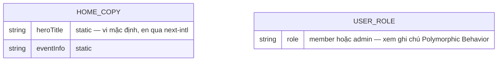
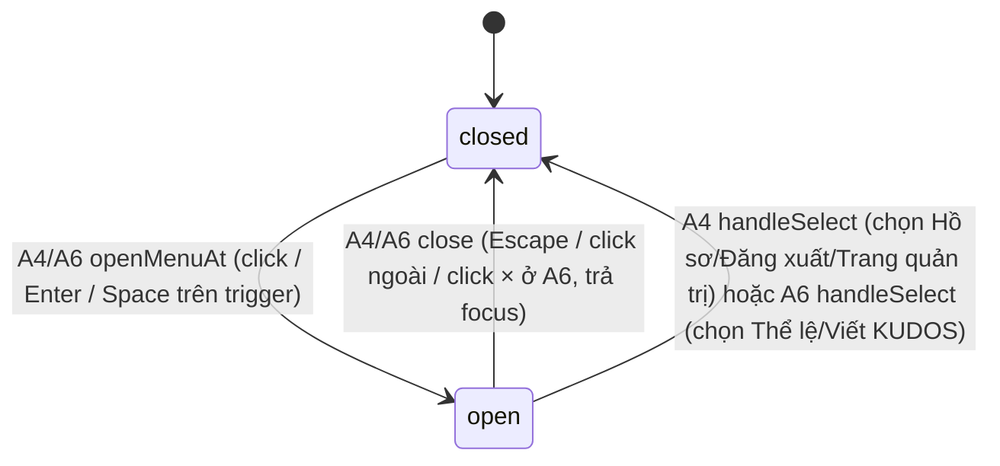

# F003_Homepage (revision: Widget Button trạng thái mở rộng)

**Priority**: P0
**Type**: ui
**Generated**: 2026-09-08

**Revision note:** Bản sửa của `docs/vi/features/F003_Homepage/technical-spec.md`
(`status: implemented`). Chỉ Action **A6** (widget) đổi nội dung/hành vi; A0-A5 giữ nguyên, chép
lại nguyên văn để file còn đọc trọn vẹn. Xem
`plans/260908-1103-home-widget-fab/clarifications.md` cho quyết định gốc.

**See also:** [`functional-spec.md`](./functional-spec.md) — tổng quan bằng ngôn ngữ tự nhiên, Open Decisions, yêu cầu/business rule ở dạng one-liner, screens, user stories, scenarios, edge cases, configuration cho độc giả BA/QA.

**How to read this file:** § 2 là bảng chỉ mục — chọn action cần xem rồi đọc trọn block ở § 3. § 4 là phụ lục dùng chung — chỉ nhảy vào khi một block ở § 3 trỏ tới.

## 1. Technical Overview

Trang chủ công khai (`/`) của SAA 2025 — render đầy đủ nội dung marketing (hero, đếm ngược, thông
tin sự kiện, 6 thẻ giải thưởng, quảng bá Sun* Kudos, footer) cho MỌI khách truy cập, đồng thời
điều chỉnh header (chuông thông báo, menu tài khoản role-aware) và widget hành động nhanh theo
trạng thái đăng nhập đọc được phía server. **Revision này** thay nội dung widget mở rộng: trigger
pill morph thành nút đóng (×) đỏ, panel hiện 2 lối tắt thật ("Thể lệ" → `/standards`, "Viết KUDOS"
→ `/kudos`) thay cho 2 mục suy diễn trước đó ("Sun* Kudos"/"Award Information") — xem
`functional-spec.md` § 3 D001 (RESOLVED). Không có route BE mới nào: toàn bộ vẫn 1 Server
Component (`app/page.tsx`) cộng vài client hook nhỏ — không action nào ghi DB. Vẫn 1 capability
(`CAP-01`), 6 action (`A1`-`A6`) tuyến tính; chỉ `A6` đổi nội dung ở revision này.

## 2. Action Index

| # | Action (handler) | Method · Path | Codes | Writes | Detail |
|---|---|---|---|---|---|
| **A0** | *cross-cutting — thuộc về không action nào* | — | FR-001 | — | § 4.4 |
| **A1** | `HomePage` (Server Component) | `GET` `/` | FR-002, FR-003, FR-101, FR-201, FR-203, FR-204, FR-205, FR-206, FR-207, FR-208, FR-209, BR-001, BR-004, INT-001, US001, US002 | — *(read-only)* | § 3.1 |
| **A2** | `useCountdown` *(client-only, no BE)* | — *(client tick, không HTTP)* | FR-202, BR-003, BR-004, ALG-001, US001 | — *(read-only)* | § 3.1 |
| **A3** | `NavLink` *(client-only)* | — *(client, không HTTP)* | FR-102, DEC-001, US001 | — *(read-only)* | § 3.1 |
| **A4** | `AccountMenu` + `useMenuKeyboardNav` + `logoutAction` | `POST` `/` *(Server Action, không phải route riêng)* | FR-401, FR-403, FR-601, BR-002, BR-006, SM-001, US002 | — *(kết thúc session — không phải bảng DB)* | § 3.1 |
| **A5** | `NotificationBell` *(client-only, no BE)* | — *(client render/open state)* | FR-402, BR-005, US003 | — *(read-only)* | § 3.1 |
| **A6** | `WidgetButton` + `useMenuKeyboardNav` *(client-only, no BE)* *(sửa ở revision này)* | — *(client render/open state)* | FR-210, FR-401, BR-006, BR-007, SM-001, US004 | — *(read-only)* | § 3.1 |

## 3. Actions

### 3.1 CAP-01 — Xem & tương tác với trang chủ SAA 2025

#### A1 · Render trang chủ (đọc session + role, dựng toàn bộ nội dung)
`GET` `/` → `` `HomePage` ``
`FR-002` `FR-003` `FR-101` `FR-201` `FR-203` `FR-204` `FR-205` `FR-206` `FR-207` `FR-208` `FR-209` · `SCR003_Home` · `US001` `US002`

**Who** · Bất kỳ khách truy cập nào — Anonymous hoặc Authenticated (member/admin), không qua guard nào *(gate A0 — § 4.4)*
**FE** · `app/page.tsx` render toàn bộ cây trang: `HomeHeader`, hero + `CountdownTimer` (props seed cho A2), khối thông tin sự kiện + CTA, nội dung Root Further, `AwardCard` × 6, khối Sun* Kudos, `HomeFooter`. Nội dung tĩnh lấy từ `components/home/home-copy.ts`'s `defaultHomeCopy` (vi) + `messages/{locale}.json` `home.*` (en, next-intl) — không bịa dữ liệu.
**Request** · không có tham số — chỉ có session cookie Supabase (đọc qua `@supabase/ssr` server client)
**BE** · `getViewer()` (`app/page.tsx`) gọi `supabase.auth.getUser()` rồi (nếu có user) đọc `role` qua `getUserRole(toUsersRoleClient(supabase), user.id)` (`lib/auth/get-user-role.ts`, shim `lib/supabase/users-role-client.ts`) *(INT-001 — § 4.5)*
**Rule**
- **BR-001 — Header chỉ hiện chuông thông báo và nút tài khoản khi đã đăng nhập; khách chưa đăng nhập thấy một link đăng nhập thay thế ở đúng vị trí đó.** Nhánh theo sự tồn tại (truthy) của `user`, không phải một field cụ thể. *(Bin 1 — chỉ dùng ở A1)*
- **BR-004 — Biến môi trường `EVENT_START_AT` thiếu/sai định dạng ISO-8601 không làm trang lỗi; parse ra `null`, countdown hiển thị trạng thái "chưa biết mốc" (00/00/00, vẫn hiện "Coming soon").** *(§ 4.4 Bin 2)*
**Result** · read-only — **không ghi DB nào**. Trả `targetIso`, `initialNowMs`, `role`, `email` làm props cho `HomeHeader`/`CountdownTimer`/`AccountMenu`. Không redirect (khác PERM001 cũ — xem A0 § 4.4).
**Source:** `app/page.tsx` → `lib/auth/get-current-user-role.ts` → `components/home/home-copy.ts`

---

#### A2 · Đếm ngược thời gian thực (client hook)
— *(client tick, không HTTP)* → `` `useCountdown` ``
`FR-202` · `SCR003_Home` · `US001`

**Who** · Bất kỳ khách truy cập nào đang xem trang chủ
**FE** · `components/home/countdown-timer.tsx` gọi `useCountdown(targetIso, initialNowMs)` — state đầu SEED từ prop server, không gọi `Date.now()` ở render đầu (khớp SSR); `setInterval` 1000ms cập nhật `nowMs` (hiển thị đổi theo phút); render client đầu trùng byte với SSR nhờ seed `initialNowMs`, KHÔNG dùng `suppressHydrationWarning`.
**Request** · không có — input là 2 prop tĩnh từ A1 (`targetIso`, `initialNowMs`)
**BE** · không có handler BE riêng — phép tính thuần chạy trong `lib/countdown/countdown.ts` *(ALG-001 — § 4.5)*
**Rule**
- **BR-003 — Khi còn lại ≤ 0 (đã tới/qua mốc sự kiện), 3 ô số giữ nguyên `00/00/00` và nhãn "Coming soon" bị ẩn; giá trị không bao giờ âm.** *(Bin 1 — chỉ dùng ở A2)*
- **BR-004 — Env thiếu/sai → `parseTargetDate` trả `null`, countdown hiện 00/00/00 + vẫn "Coming soon" vì chưa biết mốc.** *(§ 4.4 Bin 2, gloss giống A1)*
**Result** · read-only — không ghi DB. Re-render 3 ô số (DAYS/HOURS/MINUTES) khi giá trị phút đổi; không side effect khác.
**Source:** `hooks/use-countdown.ts` → `lib/countdown/countdown.ts`

---

#### A3 · Click logo/nav link đang active → cuộn lên đầu trang
— *(client, không HTTP)* → `` `NavLink` ``
`FR-102` · `SCR003_Home` · `US001`

**Who** · Bất kỳ khách truy cập nào, đang ở `/` và click logo hoặc link "About SAA 2025"
**FE** · `components/home/nav-link.tsx` — client leaf dùng `usePathname()` so khớp `href`; nếu đang active thì gắn `onClick` gọi `window.scrollTo({top:0, behavior:"smooth"})` thay vì để Next điều hướng lại
**Request** · không có
**BE** · không có
**Rule**

| DEC | subtype | Condition | What the user sees | Source |
|---|---|---|---|---|
| **DEC-001** | flow | `pathname === href` (đã ở đúng trang) | Trang cuộn mượt lên đầu, không tải lại; nếu KHÔNG active thì Next điều hướng bình thường | `components/home/nav-link.tsx` |

**Result** · read-only — không ghi DB, không điều hướng khi active (chỉ scroll).
**Source:** `components/home/nav-link.tsx`

---

#### A4 · Mở/đóng menu tài khoản, chọn Hồ sơ/Đăng xuất/Trang quản trị
`POST` `/` *(Server Action, không phải route riêng)* → `` `AccountMenu` + `useMenuKeyboardNav` + `logoutAction` ``
`FR-401` `FR-403` `FR-601` · `SCR003_Home` · `SM-001` · `US002`

**Who** · Người dùng đã đăng nhập (member hoặc admin)
**FE** · `components/home/account-menu.tsx` render `button[aria-haspopup="menu"]` + `[role="menu"]`; mở/đóng/roving-focus qua `useMenuKeyboardNav` (đã có, tái dùng từ F002) *(BR-006 — § 4.4)*. Item "Trang quản trị" chỉ render khi prop `role === "admin"` (nhận từ A1, không tự tính lại).
**Request** · không có request cho việc mở menu; chọn "Đăng xuất" submit `<form action={logoutAction}>` (Server Action đã có, tái dùng nguyên trạng từ `app/todo/actions.ts`)
**BE** · `logoutAction` (đã có) — gọi `supabase.auth.signOut()` rồi `redirect("/login")`
**Rule** · **BR-002 — Mục "Trang quản trị" trong menu tài khoản chỉ hiện khi vai trò người dùng (đọc phía server ở A1) là `admin`; mọi vai trò khác (kể cả lỗi đọc role, fail-open về `member`) không thấy mục này.** *(Bin 1 — chỉ dùng ở A4)*
**Result** · read-only cho việc mở/chọn menu; "Đăng xuất" kết thúc phiên (không phải ghi bảng DB) rồi điều hướng `/login`.
**State** · `SM-001`: `closed` → `open` *(§ 4.3)*
**Source:** `components/home/account-menu.tsx` → `hooks/use-menu-keyboard-nav.ts` (đã có) → `app/todo/actions.ts` (`logoutAction`, đã có, tái dùng)

---

#### A5 · Mở panel thông báo (bell)
— *(client render/open state)* → `` `NotificationBell` ``
`FR-402` · `SCR003_Home` · `US003`

**Who** · Người dùng đã đăng nhập (bell không render khi Anonymous — xem BR-001 ở A1)
**FE** · `components/home/notification-bell.tsx` render `button[aria-haspopup="dialog"]`; click mở `[role="dialog"]` chứa text "Bạn chưa có thông báo" (empty state, không fetch API vì chưa có bảng notifications — xem functional-spec.md § 12)
**Request** · không có
**BE** · không có
**Rule** · **BR-005 — Badge đỏ chỉ render khi `unreadCount > 0`; hiện tại giá trị luôn được truyền là `0` (không có nguồn dữ liệu thật), nên badge không bao giờ hiện cho tới khi bảng notifications tồn tại.** *(Bin 1 — chỉ dùng ở A5)*
**Result** · read-only — không ghi DB. Mở/đóng panel là toàn bộ hành vi quan sát được.
**Source:** `components/home/notification-bell.tsx`

---

#### A6 · Mở/đóng panel hành động nhanh (widget morph pill↔×) *(sửa ở revision này)*
— *(client render/open state)* → `` `WidgetButton` + `useMenuKeyboardNav` ``
`FR-210` `FR-401` `BR-007` · `SCR003_Home` · `SM-001` · `US004`

**Who** · Bất kỳ khách truy cập nào (không phân biệt trạng thái đăng nhập)
**FE** · `src/app/(public)/(home)/_components/widget-button.tsx` (đã có — trigger + wiring
`useMenuKeyboardNav({itemCount: 2})` không đổi ở revision này) render MỘT `<button>` duy nhất
morph giữa pill đóng (106×64, `IconPencil` + "/" + logo Sun*, `mm:313:9137`) và nút đóng (×) đỏ mở
(56×56, `bg-[rgba(212,39,29,1)]`, icon `IconClose currentColor` trắng, `mm:I313:9140;214:3827`)
theo `open` trả về từ hook (không đổi hook, không đổi `itemCount`). Panel mở rộng
(`mm:313:9140`, 214×224, `flex flex-col gap-5 items-end`, neo `right-[19px]` cùng điểm với pill —
cả 2 frame `endY: 904`) chứa 2 `[role="menuitem"]`:
- `A_Button thể lệ` (`mm:I313:9140;214:3799`, 149×64, `Link href="/standards"`, logo Sun* 24×24 +
  text "Thể lệ")
- `B_Button viết kudos` (`mm:I313:9140;214:3732`, 214×64, `Link href="/kudos"`, `IconPencil` +
  text "Viết KUDOS")

Cả 2 option: `padding: 16px`, `gap: 8px`, `border-radius: 4px`, `bg-login-button`
(`rgba(255,234,158,1)`), text Montserrat 700 24px/32px màu `text-login-button-text`; hover tăng
nhẹ shadow (node data không có shadow nghỉ trên option, chỉ pill có). Logo Sun* 24×24 trích từ SVG
inline sẵn có trong pill thành `src/app/_components/icons/icon-sun-logo.tsx` (mới, chưa viết) để
tái dùng, không copy path data. `IconClose` (`currentColor`, `mm:214:3851`) promote từ
`src/app/(public)/kudos/_components/kudos-compose-icons.tsx` lên
`src/app/_components/icons/icon-close.tsx` (2 consumer khác route-group — kudos compose + widget
— theo scope ladder `nextjs-route-colocation-architecture`; `kudos-compose-icons.tsx` re-export).
Copy: `home.widget.standardsItem` ("Thể lệ"/"Rules"), `home.widget.writeKudosItem` ("Viết
KUDOS"/"Viết KUDOS" — cùng chuỗi 2 locale, đúng như `standards-footer-actions.tsx`'s
`copy.writeKudos`), `home.widget.cancelLabel` ("Hủy"/"Cancel", dùng cho `<title>`/nhãn phụ của icon × — **KHÔNG**
làm `aria-label` của nút, xem BR-007);
giữ `home.widget.label` ("Hành động nhanh"/"Quick actions", dùng làm `aria-label` CỐ ĐỊNH của
trigger ở cả 2 trạng thái); bỏ `home.widget.kudosItem`/`awardsItem`.
**Request** · không có
**BE** · không có
**Rule**
- **BR-006 — dùng chung `useMenuKeyboardNav` (§ 4.4 Bin 2) cho mở/đóng/roving-focus — không sửa
  hook, không đổi `itemCount` (vẫn 2, chỉ đổi 2 mục thật thay 2 mục suy diễn).**
- **BR-007 — Trigger là một `<button>` DOM node duy nhất, morph nội dung/style pill↔× theo
  `open`; `aria-label="Hành động nhanh"` (`home.widget.label`) giữ cố định ở cả 2 trạng thái, chỉ
  `aria-expanded` đổi. Nút × KHÔNG phải `menuitem` — đứng ngoài `[role="menu"]`, đóng panel qua
  `close()` của hook (cùng đường ra Escape/click ngoài), không phải `handleSelect`.** *(Bin 1 —
  chỉ dùng ở A6)*
**Result** · read-only — không ghi DB. Chọn "Thể lệ" hoặc "Viết KUDOS" điều hướng bằng `next/link`
thường (không phải Server Action). Đóng qua trigger lần 2 / click ngoài / Escape / click × đều
đóng panel + trả focus về trigger (không điều hướng) — 4 lối ra cho cùng 1 kết quả.
**State** · `SM-001`: `closed` → `open` *(§ 4.3 — transitions không đổi, chỉ nội dung `open` hiển
thị khác)*
**Source:** `src/app/(public)/(home)/_components/widget-button.tsx` (đã có — trigger + hook wiring
không đổi phần khung) → panel mở rộng + `icon-close.tsx` + `icon-sun-logo.tsx`: `TBD (draft)`
(chưa viết ở revision này)

### 3.2 Edge cases

| Action | Scenario | Behavior |
|---|---|---|
| A1, A2 | `EVENT_START_AT` thiếu hoặc không parse được (TC ID-60) | `parseTargetDate` trả `null`; countdown hiện `00/00/00`, "Coming soon" VẪN hiện; không throw, không crash trang |
| A2 | Đã tới hoặc qua mốc sự kiện (TC ID-41/42) | 3 ô giữ `00/00/00`, "Coming soon" bị ẩn, không hiển thị số âm |
| A1 | Đọc role từ Supabase lỗi hoặc không có row `public.users` khớp `id` | `getUserRole` fail-open trả `"member"` — Trang quản trị không hiện dù người dùng thật có thể là admin (xem BR-002) |
| A1 (link `AwardCard`) | Slug hashtag rỗng/không khớp hạng mục nào (TC ID-62) | Điều hướng `/awards` KHÔNG có hashtag, không tự cuộn — không lỗi |
| A6 *(mới)* | Click nút × trong panel mở rộng | Đóng panel, trả focus về trigger — cùng đường ra Escape/click ngoài; KHÔNG phải `menuitem`, không điều hướng |
| A4, A6 *(sửa ở revision này)* | 3 route đích còn thiếu (`/awards`, `/profile`, `/admin`) chưa được implement (TC ID-59); `/standards`, `/kudos` — 2 đích mới của A6 — đã implement | Link vẫn render đúng `href` cho cả 5; điều hướng thật 404 chỉ còn cho 3 route thiếu — E2E cho A6 giờ assert cả `href` LẪN điều hướng thật thành công (route đích tồn tại) |

## 4. Shared Foundation

### 4.1 Components

| Component | Responsibility | Used in | File |
|---|---|---|---|
| `HomePage` (Server Component) | Render toàn bộ trang, đọc session+role, build props | A1 | `app/page.tsx` |
| `HomeHeader` | Header: logo, nav, LanguageSelector (F002), bell/account hoặc login link | A1, A4, A5 | `components/home/home-header.tsx` |
| `CountdownTimer` | Hiển thị 3 ô số + nhãn, dùng `useCountdown` | A2 | `components/home/countdown-timer.tsx` |
| `AwardCard` | Thẻ giải thưởng (ảnh+tiêu đề+mô tả+Chi tiết) | A1 | `components/home/award-card.tsx` |
| `NotificationBell` | Nút chuông + panel dialog rỗng | A5 | `components/home/notification-bell.tsx` |
| `AccountMenu` | Nút tài khoản + menu Hồ sơ/Đăng xuất/Trang quản trị | A4 | `components/home/account-menu.tsx` |
| `WidgetButton` *(sửa ở revision này)* | Nút nổi góc dưới phải, morph pill↔×, panel 2 mục thật (Thể lệ/Viết KUDOS) | A6 | `src/app/(public)/(home)/_components/widget-button.tsx` |
| `IconClose` (promoted) *(mới)* | Icon × `currentColor` dùng chung — kudos compose + widget | A6 (+ kudos compose, không re-spec ở đây) | `src/app/_components/icons/icon-close.tsx` (planned promote từ `kudos-compose-icons.tsx`) |
| `icon-sun-logo` *(mới)* | Logo Sun* 24×24 trích từ SVG inline trong pill, dùng ở option "Thể lệ" | A6 | `src/app/_components/icons/icon-sun-logo.tsx` (planned) |
| `HomeFooter` | Footer: logo+4 link+bản quyền | A1 | `components/home/home-footer.tsx` |
| `getUserRole` | Đọc `public.users.role` phía server với client được inject, fail-open member | A1 | `lib/auth/get-user-role.ts` |
| `useCountdown` | Hook tick 1s từ prop server-seeded, trả chuỗi pad 2 chữ số | A2 | `hooks/use-countdown.ts` |
| `useMenuKeyboardNav` | Hook dùng chung mở/đóng+roving tabindex (tái dùng F002, không đổi) | A4, A6 | `src/hooks/use-menu-keyboard-nav.ts` (đã có) |

### 4.2 Data Model



Không vẽ quan hệ nào — cả 2 shape mới của feature này độc lập, không tham chiếu entity nào khác
(không đổi ở revision này — widget vẫn read-only, không thêm entity nào).

| Entity | Table | Used for | Action |
|---|---|---|---|
| `HomeCopy` (chưa có MODEL### — nội dung tĩnh, xem `entities.md` honest-scope note) | — *(không persist, giống MODEL003_LoginCopy)* | Nguồn copy vi mặc định cho toàn bộ trang chủ; bản en qua next-intl `home.*` | A1 |
| `UserRole` (mở rộng MODEL002_SupabaseUser — chưa có MODEL### riêng) | `public.users` *(Supabase `saa-app`, schema committed tại `supabase/migrations/0001_users_table.sql`)* | Xác định hiện/ẩn mục "Trang quản trị" | A1, A4 |
| `AppLocale` (MODEL001, tái dùng nguyên trạng từ F002) | `NEXT_LOCALE` cookie | Nhãn ngôn ngữ hiện tại trên LanguageSelector tái dùng | A1 |

#### Polymorphic Behavior

N/A — no discriminator fields in Key Entities. `HomeCopy`/`UserRole` chưa có mục trong `entities.md` (feature mới); việc hiện/ẩn "Trang quản trị" theo `role` là single-predicate, ghi nhận ở `BR-002` thay vì DISC theo `code-formats.md` § DISC vs DEC boundary. `AppLocale`'s `DISC-001` thuộc F002, không re-spec ở đây.

### 4.3 State Management

#### Trạng thái đóng/mở của menu tài khoản & widget hành động nhanh (SM-001)
**kind:** ui
**Linked FR:** FR-401
**Source:** `hooks/use-menu-keyboard-nav.ts` (đã có, tái dùng nguyên trạng từ F002)



Ngưỡng `kind: ui` thoả: 2 state nhưng ≥2 transition dẫn tới `closed` (huỷ vs. chọn) — dùng CHUNG
một SM cho cả 2 component (`AccountMenu`, `WidgetButton`) vì cả hai đều gọi cùng
`useMenuKeyboardNav`, không phải trùng lặp DRY. **Ghi chú (revision này):** pill↔× ở A6 là RENDER
OUTPUT của `open` (không phải state riêng) — SM-001 vẫn chỉ đúng 2 state `closed`/`open`; nút ×
mới chỉ thêm 1 cạnh `open → closed` (qua `close()`), không thêm state.

**Action transitions:** guard + side effect của mỗi cạnh nằm ở rung **Result**/**Rule** của action tương ứng (§ 3.1 A4, A6) — không lặp lại ở đây.

### 4.4 Shared Rules

#### Bin 3 — cross-cutting, thuộc về không action nào

**A0 · FR-001 — Route `/` không còn qua bất kỳ guard đăng nhập nào; mọi request tới `/` đều được render, không redirect.** Trước đây `PERM001_RootRouteGuard` (thuộc F001) redirect `anonymous→/login`, `authenticated→/todo`; guard này NGƯNG áp dụng cho `/` kể từ feature này — `proxy.ts` vẫn giữ `/` trong `config.matcher` để làm mới session cookie, nhưng nhánh redirect bị gỡ. **Đây là thay đổi thuộc F001** (permissions-matrix.md cần cập nhật PERM001 thành "lỗi thời" ở bước Delivery).
**Source:** `proxy.ts` · `app/page.tsx`

#### Bin 2 — used by ≥2 named actions

**BR-004 — Biến môi trường `EVENT_START_AT` thiếu hoặc không parse được theo ISO-8601 không làm hệ thống lỗi; `parseTargetDate` trả về `null`, và mọi nơi tiêu thụ giá trị này (server lẫn client) coi như "chưa biết mốc sự kiện" — vẫn hiện `00/00/00` và vẫn hiện "Coming soon".**
Used in: **A1** · **A2**. Server (A1) đọc `process.env.EVENT_START_AT` một lần, truyền `targetIso: string | null` xuống client; client hook (A2) nhận `null` thì trả thẳng trạng thái "chưa biết mốc".
**Source:** `lib/countdown/countdown.ts` (`parseTargetDate`) · `app/page.tsx`
```text
function parseTargetDate(iso):
  if not iso: return null
  d = new Date(iso)
  return isNaN(d) ? null : d
```

**BR-006 — Mọi menu điều khiển bởi `useMenuKeyboardNav` (tài khoản, widget) dùng chung một hợp đồng bàn phím: Enter/Space/click mở, ArrowDown/ArrowUp di chuyển vòng, Escape đóng + trả focus, click ngoài đóng, roving tabindex.**
Used in: **A4** · **A6**. Hook đã có (tái dùng nguyên trạng từ F002), không sửa ở revision này — chỉ gọi lại với `itemCount` khác nhau (2 cho widget, 2-3 cho account tuỳ role). Nút × mới của A6 KHÔNG đi qua contract này — nó gọi thẳng `close()`, xem BR-007 (§ 3.1 A6).
**Source:** `hooks/use-menu-keyboard-nav.ts` (đã có)

### 4.5 Algorithms & Integrations

### Tính số ngày/giờ/phút còn lại tới mốc sự kiện, có 0-padding (ALG-001)
**Linked FR:** FR-202
**Used in:** A2
**Source:** `lib/countdown/countdown.ts`
**Input:** `(target: Date, nowMs: number)` · **Output:** `{days, hours, minutes, reached}` (số, `pad2` áp dụng ở tầng trình bày) · **Complexity:** O(1)
**Description:** Quy đổi chênh lệch `target - nowMs` (ms) sang tổng số phút, rồi tách thành ngày/giờ/phút; `reached=true` khi chênh lệch ≤ 0. Days không giới hạn 2 chữ số (≥100 hiện 3 chữ số), hours 00–23, minutes 00–59, luôn pad tối thiểu 2 chữ số.

**Pseudocode:**
```text
function remaining(target, nowMs):
  totalMin = floor(max(0, target - nowMs) / 60000)
  return {
    days: floor(totalMin / 1440),
    hours: floor((totalMin % 1440) / 60),
    minutes: totalMin % 60,
    reached: target <= nowMs
  }
```

### Đọc vai trò người dùng từ Supabase, fail-open (INT-001)
**Linked FR:** FR-003, FR-601
**Used in:** A1
**Source:** `lib/auth/get-current-user-role.ts`
**Type:** api-call
**Target:** Supabase REST — `GET {SUPABASE_URL}/rest/v1/users?select=role&id=eq.<uuid>` (qua `@supabase/ssr` server client, RLS own-row)
**Payload:** không có body gửi đi (GET); response `[{role: "member"|"admin"}]` (mảng, vì `.maybeSingle()` trên GET dùng `Accept: application/json`)
**Failure handling:** try/catch bọc toàn bộ lời gọi — bất kỳ lỗi nào (network, RLS từ chối, không có row) đều fail-open về `role: "member"`, không throw, không chặn render trang (khác `/todo`'s fail-closed).

### 4.6 Configuration

```text
EVENT_START_AT   # server-only ISO-8601 datetime (không NEXT_PUBLIC_), mốc sự kiện SAA 2025 (A1, A2)
```

**Client behavior:** see [`behavior-logic.md`](../../generated/behavior-logic.md) (client-side patterns — debounce, optimistic UI, polling, upload, realtime — homepage hiện không dùng pattern nào trong 5 loại này), [`permissions.md`](../../system/permissions.md) (feature flags / experiments / env / locale gates — PERM001 lỗi thời được ghi thật ở F001 lúc Delivery), [`architecture.md`](../../system/architecture.md) (guards / deep-link state restoration / unsaved-changes protection).

## 5. Verification & Technical Notes

### 5.1 Technical Verification

- **SC-001** *(A1)* Trang `/` trả về nội dung thành công cho cả Anonymous và Authenticated, không redirect nào xảy ra (covers FR-001)
- **SC-002** *(A1)* Header hiện đúng theo trạng thái đăng nhập: login link khi Anonymous; chuông + nút tài khoản khi Authenticated (covers FR-208, BR-001)
- **SC-003** *(A2)* Sau 1 phút (giả lập bằng `page.clock`), số phút countdown giảm đúng 1 (hoặc giờ/ngày điều chỉnh theo) (covers FR-202)
- **SC-004** *(A1, A2)* Tới/qua mốc sự kiện: 3 ô giữ `00/00/00`, "Coming soon" ẩn, không âm; env thiếu/sai vẫn `00/00/00` nhưng "Coming soon" VẪN hiện (covers FR-202, BR-003, BR-004)
- **SC-005** *(A4)* Admin thấy "Trang quản trị" trong menu tài khoản; member không thấy (covers FR-403, FR-601, BR-002)
- **SC-006** *(A6, sửa ở revision này)* Widget mở đúng panel 2 mục thật (Thể lệ → `/standards`, Viết KUDOS → `/kudos`); trigger morph pill↔× giữ `aria-label` cố định ("Hành động nhanh"), `aria-expanded` đổi đúng; đóng bằng trigger lần 2 / click ngoài / Escape / click × đều trả focus về trigger (covers FR-210, FR-401, BR-007)

#### US001_BrowseHomepage *(A1, A2, A3)*
**Independent Test:** Vào `/` không đăng nhập — xác nhận thấy đủ hero/đếm ngược/thông tin sự kiện/CTA/Root Further/6 thẻ giải thưởng/Sun* Kudos/footer, và mọi link dẫn đúng route/hashtag.
**Acceptance Scenarios:** **Given** `EVENT_START_AT` không hợp lệ, **When** vào `/`, **Then** countdown hiện `00/00/00` + "Coming soon" vẫn hiện, trang không lỗi.

#### US002_ManageAccountFromHeader *(A1, A4)*
**Independent Test:** Đăng nhập, mở menu tài khoản — xác nhận đúng danh sách mục theo role, đăng xuất về `/login`.
**Acceptance Scenarios:** **Given** đọc role lỗi (Supabase outage), **When** mở menu tài khoản, **Then** không thấy Trang quản trị (fail-open member).

#### US003_CheckNotifications *(A5)*
**Independent Test:** Đăng nhập, click bell — xác nhận panel mở với trạng thái rỗng, không có badge.
**Acceptance Scenarios:** **Given** đã đăng nhập, **When** click bell, **Then** panel mở, hiện "Bạn chưa có thông báo".

#### US004_UseQuickActionWidget *(A6, sửa ở revision này)*
**Independent Test:** Click widget góc dưới phải — xác nhận trigger morph pill→×, panel mở đúng 2 mục thật, chọn 1 mục điều hướng đúng route; đóng bằng × cũng trả focus về trigger.
**Acceptance Scenarios:** **Given** đang ở `/`, **When** click widget rồi chọn "Viết KUDOS", **Then** điều hướng `/kudos`. **Given** panel đang mở, **When** click nút ×, **Then** panel đóng + focus về trigger.

### 5.2 Assumptions

- *(A1)* `public.users` RLS own-row (`authenticated` có SELECT) hoạt động đúng qua `@supabase/ssr` server client trong Server Component Next 16 — xác nhận bằng `supabase db query` (research report 02), chưa qua đúng code path thật của app.
- *(A2)* Render client đầu tiên trùng byte với SSR nhờ `useState(initialNowMs)` seed từ server; không dùng `suppressHydrationWarning` (research 01 § 1).
- *(A5)* Bảng notifications sẽ thêm ở feature sau, ngoài phạm vi hiện tại; panel rỗng vĩnh viễn là hành vi ĐÚNG cho tới lúc đó.
- *(A6, mới)* `useMenuKeyboardNav`'s `registerButton` tiếp tục phục vụ cả 2 trạng thái pill/× vì vẫn là cùng 1 DOM node — không cần sửa hook để hỗ trợ morph.

### 5.3 Unresolved Questions

1. **Áp dụng RLS qua code path thật** *(A1)*: report 02 xác nhận quyền SELECT bằng `supabase db query` (superuser), chưa xác nhận bằng chính request thật từ `app/page.tsx` một khi code được viết.
2. **`itemCount` cố định của `useMenuKeyboardNav`** *(A4)*: hook giả định `itemCount` không đổi trong vòng đời component — menu tài khoản có 2 hoặc 3 mục tuỳ role; chưa xác nhận role đổi giữa các lần render trong cùng phiên có vi phạm giả định này hay không.
3. **Menu widget hành động nhanh — RESOLVED 2026-09-08** *(gap ux, đã mở từ 2026-09-06)*: 2 mục suy diễn từ icon (bút chì → Sun* Kudos `/kudos`, icon SAA → Award Information `/awards`; nhãn sửa chính tả "Awards Information" → "Award Information" ngày 2026-09-07) nay được thay bằng nội dung thật từ 2 frame MoMorph (`_hphd32jN2`/`Sv7DFwBw1h`, component set `214:3916`): "Thể lệ" → `/standards`, "Viết KUDOS" → `/kudos`; "Award Information" bị bỏ. Xem `functional-spec.md` § 3 D001 và `plans/260908-1103-home-widget-fab/clarifications.md`.
4. **Thông tin sự kiện** *(gap other — auto-resolved theo recommended 2026-09-06, KHÔNG đổi ở revision này)*: dùng giá trị spec/TC (18h30 · Nhà hát nghệ thuật quân đội · Group Facebook Sun* Family) thay cho design (26/12/2025 · Âu Cơ Art Center · Livestream); options: theo spec/TC / theo design / giá trị khác / TBD. Chờ chốt trước sự kiện.
5. **Test case MoMorph cho FAB rỗng** *(mới, quy trình)*: `get_frame_test_cases` trả `[]` cho cả 2 frame `_hphd32jN2`/`Sv7DFwBw1h`; E2E (RED-first) được viết trực tiếp từ spec + design thay vì từ test case tải về. Chưa quyết định có ghi ngược test case lên MoMorph hay không.
6. **`design_status` của frame thu gọn** *(mới, quy trình)*: `_hphd32jN2` vẫn `design_status: in_progress` trên MoMorph dù đã có node data đầy đủ và repo đã dựng đúng theo nó từ phase homepage trước. Chưa quyết định có cần đánh dấu `done` trên MoMorph hay không.

### 5.4 Source References

| Action | Order | Symbol | Path | Purpose |
|---|---|---|---|---|
| — | 1 | `HomeCopy` | `components/home/home-copy.ts` | Nguồn nội dung tĩnh mặc định (vi) cho toàn trang chủ |
| A1 | 2 | `HomePage` | `app/page.tsx` | Server Component, entry point `/`, thay thế `redirect()` cũ |
| A1 | 3 | `getViewer`, `getUserRole` | `app/page.tsx`, `lib/auth/get-user-role.ts`, `lib/supabase/users-role-client.ts` | Đọc session + role, fail-open `member` |
| A2 | 4 | `useCountdown`, `remaining`, `parseTargetDate` | `hooks/use-countdown.ts`, `lib/countdown/countdown.ts` | Tính + tick đếm ngược |
| A3 | 5 | `NavLink` | `components/home/nav-link.tsx` | Active-link scroll-to-top |
| A4, A6 | 6 | `useMenuKeyboardNav` | `src/hooks/use-menu-keyboard-nav.ts` (đã có) | Hook dùng chung mở/đóng menu (tái dùng nguyên trạng từ F002) |
| A6 | 7 | `WidgetButton` (revised) | `src/app/(public)/(home)/_components/widget-button.tsx` (đã có, cần sửa panel + copy) | Trigger morph pill↔× + panel mở rộng 2 mục thật |
| A6 | 8 | `IconClose` (promoted) | `src/app/_components/icons/icon-close.tsx` (planned) ← `src/app/(public)/kudos/_components/kudos-compose-icons.tsx` | Icon × dùng chung close-panel |
| A6 | 9 | `icon-sun-logo` | `src/app/_components/icons/icon-sun-logo.tsx` (planned) | Logo Sun* trích từ SVG inline trong pill |

#### Data Flow

```text
GET / -> HomePage [đọc cookie session] -> getViewer(): getUser() -> getUserRole(...) -> {email, isAdmin}
  -> props xuống HomeHeader/CountdownTimer/AccountMenu -> render tĩnh + targetIso/initialNowMs
client tick: useCountdown(targetIso, initialNowMs) -> setInterval 1000ms -> remaining() -> re-render 3 ô số
client (revision này): WidgetButton click -> useMenuKeyboardNav.handleButtonClick -> open=true
  -> render panel (Thể lệ→/standards, Viết KUDOS→/kudos) + morph trigger pill→×
  -> chọn mục: next/link điều hướng | click ×/Esc/click ngoài: close() -> open=false, focus trigger
```

### 5.5 Artifact References

| Artifact | File | Codes Used | Reviewed |
|----------|------|------------|----------|
| System Overview | [overview.md](../../system/overview.md) | — | [ ] |
| Architecture | [architecture.md](../../system/architecture.md) | — | [ ] |
| Feature List | [feature-list.md](../../generated/feature-list.md) | F003 | [ ] |
| Entities | [entities.md](../../generated/entities.md) | MODEL001 (tái dùng từ F002); HomeCopy/UserRole: TBD (draft) | [ ] |
| Screens | [functional-spec.md § 6](./functional-spec.md#6-screens) | SCR003_Home | [ ] |
| Route List | [route-list.md](../../generated/route-list.md) | TBD (draft) | [ ] |
| Behavior Logic | [behavior-logic.md](../../generated/behavior-logic.md) | TBD (draft) | [ ] |
| Permissions Matrix | [permissions-matrix.md](../../generated/permissions-matrix.md) | PERM001 (ghi chú lỗi thời — xem § 4.4 Bin 3, cập nhật thật ở F001 lúc Delivery) | [ ] |
| User Stories | [user-stories.md](../../generated/user-stories.md) | US001-US004 (US004 sửa ở revision này) | [ ] |
