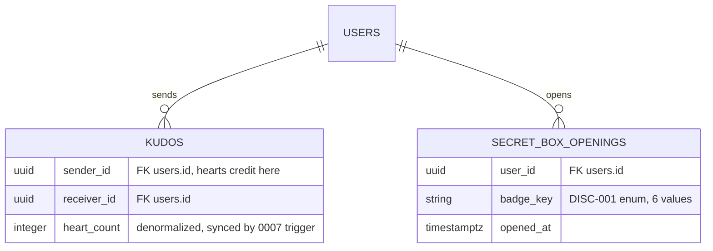
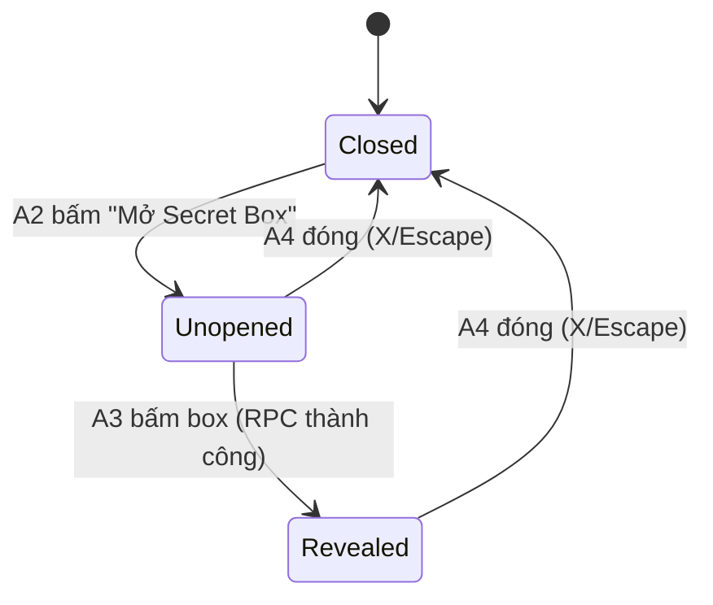

# F000_SecretBoxModal

**Priority**: P2
**Type**: mixed
**Generated**: 2026-09-08

**See also:** [`functional-spec.md`](./functional-spec.md) — plain-language overview, open
decisions, requirements/business rules stated in one-liners, screens, user stories, scenarios,
edge cases, and configuration for a BA/QA audience.

**How to read this file:** § 2 is the index — pick the action you care about and read its block
in § 3 straight through; each block is one complete thread, top to bottom. § 4 is the shared
appendix — jump in only when a § 3 block points you there.

## 1. Technical Overview

Người dùng Kudos đã đăng nhập mở modal Secret Box trên `/kudos`, bấm vào box để máy chủ rút ngẫu
nhiên 1 trong 6 huy hiệu và ghi lại lượt mở. Toàn bộ tính entitlement, rút ngẫu nhiên, và chống
double-click chạy trong một hàm Postgres `SECURITY DEFINER` mới (`open_secret_box()`, migration
`0011`) — đây là `.rpc()` đầu tiên của repo. Client chỉ hiển thị những gì máy chủ trả về, không tự
tính hay tự chọn huy hiệu.

## 2. Action Index

| # | Action (handler) | Method · Path | Codes | Writes | Detail |
|---|---|---|---|---|---|
| **A0** | *cross-cutting — belongs to no single action* | — | `FR-601` | — | § 4.4 |
| **A1** | `KudosPage` (Server Component) | `GET` `/kudos` | `FR-001, FR-002, FR-101, FR-602, BR-002, DEC-001, US001` | — *(read-only)* | § 3.1 |
| **A2** | `SecretBoxLauncher#openDialog` | — | `FR-201, FR-202, SM-001, US001` | — *(read-only)* | § 3.1 |
| **A3** | `openSecretBoxAction` → `open_secret_box` (RPC) | `POST` `/kudos (server action)` | `FR-203, FR-204, FR-205, FR-601, BR-001, BR-002, BR-003, BR-004, DEC-002, DEC-003, SM-001, US002` | `secret_box_openings` | § 3.1 |
| **A4** | `SecretBoxLauncher#closeDialog` | — | `FR-401, SM-001, US003` | — *(read-only)* | § 3.1 |

## 3. Actions

### 3.1 CAP-01 — Mở Secret Box trên /kudos

#### A1 · Hiển thị trạng thái Secret Box trên /kudos

`GET` `/kudos` → `` `KudosPage` (Server Component) ``
`FR-001` `FR-002` `FR-101` `FR-602` · `US001`

**Who** · Người dùng Kudos đã đăng nhập, hoặc khách ẩn danh.
**FE** · `KudosPage` render `KudosStatList` với `secretBoxOpened`/`secretBoxUnopened` thật thay
cho giá trị cứng `0`. Khách ẩn danh: `KudosStatList` trả `null`, không render nút/số liệu nào
(hành vi có sẵn, không đổi trong spec này).
**Request** · không tham số — dữ liệu lấy theo phiên đăng nhập hiện tại (`auth.uid()`).
**BE** · `getKudosStats` (mở rộng) đọc `kudos.heart_count` theo `sender_id = viewer` và đếm
`secret_box_openings` theo `user_id = viewer` để tính `secretBoxUnopened`.
**Rule** · Quyết định nút "Mở Secret Box" hiển thị thế nào theo số hộp còn lại:

| DEC | subtype | Condition | What the user sees | Source |
|---|---|---|---|---|
| **DEC-001** | render | `secretBoxUnopened === 0` | nút hiển thị **disabled**, giữ nguyên tooltip `title` đã có | TBD (draft) |
| — | — | `secretBoxUnopened > 0` | nút **enabled**, bấm được để mở modal (§ A2) | TBD (draft) |

**BR-002 — Entitlement tính theo lượt tim mà chính người xem đã GỬI, không phải nhận.**
`secretBoxUnopened = floor(sum(kudos.heart_count WHERE sender_id = viewer)/5) −
count(secret_box_openings WHERE user_id = viewer)`. *(§ 4.4)*
**Result** · Read-only — không ghi DB. Khách ẩn danh (`viewer = null`, `FR-602`) không đi qua
nhánh tính entitlement này.
**Source:** TBD (draft)

<!-- No diagram: read-only, single query path, below threshold. -->

---

#### A2 · Mở modal Secret Box (trạng thái chưa mở)

— → `` `SecretBoxLauncher` `` (`useSecretBoxDialog` hook, ref-callback + `showModal()`, cùng
pattern `kudos-compose-dialog.tsx`)
`FR-201` `FR-202` `SM-001` · `US001`

**Who** · Người dùng Kudos đã đăng nhập, khi nút "Mở Secret Box" đang `enabled` (§ A1 DEC-001).
**FE** · Bấm nút → `ref={registerDialog}` gọi `.showModal()`; khoá scroll
(`document.body.style.overflow`) theo đúng effect của `use-kudos-compose-dialog.ts`.
**Request** · không gọi máy chủ — chỉ đổi trạng thái UI cục bộ (mở dialog).
**BE** · *không có* — hành động thuần client.
**Rule** · `SecretBoxModal` nhận `unopenedCount`/`copy`/`badges` làm props (không tự import copy,
giữ pattern `KudosLinkDialogCopy`), luôn render trạng thái chưa mở khi vừa mở: tiêu đề "KHÁM PHÁ
SECRET BOX CỦA BẠN", dòng hướng dẫn "Click vào box để tiếp tục mở", hộp quà chưa mở, nhãn
"Secretbox chưa mở" + số.
**Result** · Không ghi DB. Chuyển trạng thái UI cục bộ từ `Closed` sang `Unopened` (`SM-001`,
*(§ 4.3)*).
**Source:** TBD (draft)

<!-- No diagram: client-only, no DB write. -->

---

#### A3 · Bấm box để mở Secret Box và nhận huy hiệu

`POST` `/kudos (server action)` → `` `openSecretBoxAction` `` → RPC `` `open_secret_box()` ``
`FR-203` `FR-204` `FR-205` `FR-601` `DEC-002` `DEC-003` `SM-001` · `US002`

**Who** · Người dùng Kudos đã đăng nhập *(gate A0 — § 4.4: chỉ `authenticated` mới gọi được RPC)*.
**FE** · Bấm vào ảnh box trong `SecretBoxModal` (khi còn bấm được, xem DEC-002) — gọi server
action, hiện trạng thái loading ngắn trên box.
**Request** · không tham số — RPC tự đọc `auth.uid()` phía server, client không gửi badge hay số
hộp.
**BE** · `openSecretBoxAction` gọi `.rpc("open_secret_box")`; do repo chưa có Supabase generated
types, kiểm tra runtime hình dạng `{badge_key, unopened}` trả về qua `unknown` trước khi tin, theo
đúng pattern `toggleKudoHeart` (fail CLOSED khi hình dạng sai).
**Rule** · Hàm Postgres `open_secret_box()` (`SECURITY DEFINER`, `SET search_path`) khoá
`pg_advisory_xact_lock` theo user, kiểm lại entitlement TRONG CÙNG transaction trước khi ghi, rồi
rút ngẫu nhiên có trọng số:

| DEC | subtype | Condition | What the user sees | Source |
|---|---|---|---|---|
| **DEC-003** | render, flow | RPC trả về thành công `{badge_key, unopened}` | modal chuyển tiêu đề sang "MỞ SECRET BOX THÀNH CÔNG", hiện ảnh huy hiệu `badge_key` ở 64×64 gốc, không phóng to | TBD (draft) |
| **DEC-002** | render | `unopened === 0` sau khi RPC trả về | ẩn dòng hướng dẫn, box hết bấm được (trạng thái vẫn "đã mở") | TBD (draft) |
| — | — | RPC báo lỗi `no_boxes_left` (đã hết hộp lúc kiểm lại) | client hiện thông báo lỗi, KHÔNG hiển thị huy hiệu giả | TBD (draft) |

- **BR-001 — Tỷ lệ 6 huy hiệu cố định, cho phép trùng giữa các lần mở.** Stay Gold 30% · Flow to
  Horizon 25% · Touch of Light 20% · Beyond the Boundary 10% · Revival 10% · Root Further 5%; mỗi
  lần rút độc lập, không chống trùng. Chi tiết thuật toán: `ALG-001` *(§ 4.5)*.
- **BR-002 — Entitlement tính theo lượt tim đã GỬI (như A1).** Kiểm lại y hệt công thức ở A1
  nhưng lần này TRONG transaction ghi, để double-click không thể vượt quyền. *(§ 4.4)*
- **BR-003 — Chống double-click/đa tab bằng khoá theo user trong transaction.**
  `pg_advisory_xact_lock(hashtextextended(user_id, 0))`; request thua chờ đến khi request thắng
  commit, đọc lại `count(secret_box_openings)` đã tăng, rồi tự nhận `no_boxes_left` nếu hết quyền
  — không cần client tự retry.
- **BR-004 — Không có asset hộp đã mở riêng; reveal giữ layer hiệu ứng nền + PNG huy hiệu đúng
  64×64 gốc, không phóng to** (tránh vỡ nét/mất chi tiết).

**Result**
- Ghi `secret_box_openings(user_id, badge_key, opened_at)` ← 1 dòng mỗi lần mở thành công
- Trả về `{badge_key, unopened}`; client dùng để render reveal + cập nhật số đếm, không tự tính
  lại phía client
**Source:** TBD (draft)

<!-- No diagram: 1 bảng ghi, đồng bộ, dưới ngưỡng (< 2 bảng, không phải background action) —
     bảng DEC ở trên đã đủ thể hiện các nhánh. -->

---

#### A4 · Đóng modal Secret Box

— → `` `SecretBoxLauncher#closeDialog` `` (nút X hoặc phím Escape qua `onCancel`)
`FR-401` `SM-001` · `US003`

**Who** · Người dùng Kudos đã đăng nhập, ở bất kỳ trạng thái modal nào (chưa mở hoặc đã mở).
**FE** · Nút X gọi `.close()`; phím Escape kích event `cancel` gốc của `<dialog>`, cùng wiring
`onCancel={onCancel}` như `kudos-compose-dialog.tsx`. Khôi phục `document.body.style.overflow`
khi cleanup.
**Request** · không gọi máy chủ.
**BE** · *không có*.
**Rule** · Đóng theo đúng 2 đường (X, Escape) — không có backdrop-click-to-close, giữ nguyên
pattern gốc `<dialog>` của repo.
**Result** · Không ghi DB. Chuyển trạng thái UI cục bộ về `Closed` (`SM-001`, *(§ 4.3)*), bất kể
đang ở `Unopened` hay `Revealed`.
**Source:** TBD (draft)

<!-- No diagram: client-only, no DB write. -->

### 3.2 Edge cases

| Action | Scenario | Behavior |
|---|---|---|
| A1 | `secretBoxUnopened === 0` khi tải trang | Nút hiển thị `disabled`, tooltip giải thích (copy có sẵn, không đổi) |
| A3 | Double-click hoặc 2 tab cùng mở khi chỉ còn đúng 1 hộp | `pg_advisory_xact_lock` serialize theo user; request thua nhận lỗi `no_boxes_left`, không hiển thị huy hiệu giả |
| A3 | `unopened` về 0 ngay trong modal đang mở | Ẩn dòng hướng dẫn, box hết bấm được, huy hiệu vừa nhận vẫn hiển thị nguyên |
| A1 | Khách ẩn danh (chưa đăng nhập) | `KudosStatList` trả `null`; không nút, không số liệu Secret Box nào (`FR-602`) |

## 4. Shared Foundation

### 4.1 Components

| Component | Responsibility | Used in | File |
|---|---|---|---|
| `SecretBoxLauncher` (+ `useSecretBoxDialog`) | Sở hữu vòng đời mở/đóng dialog, gắn nút trigger có sẵn | A1, A2, A4 | `src/app/(public)/kudos/_components/secret-box-launcher.tsx`, `src/app/(public)/kudos/_hooks/use-secret-box-dialog.ts` |
| `SecretBoxModal` | Component thuần trình bày — nhận `badges`/`copy`/`unopenedCount` làm props, render 2 trạng thái | A2, A3 | `src/app/(public)/kudos/_components/secret-box-modal.tsx` |
| `openSecretBoxAction` | Server action bọc `.rpc("open_secret_box")`, boundary-check hình dạng trả về | A3 | `src/app/(public)/kudos/_actions/open-secret-box.ts` |
| `open_secret_box()` (Postgres function, `SECURITY DEFINER`) | Rút ngẫu nhiên có trọng số + kiểm lại entitlement + ghi, trong 1 transaction có khoá | A3 | `supabase/migrations/0011_secret_box.sql` |
| `getKudosStats` (mở rộng) | Bổ sung `secretBoxOpened`/`secretBoxUnopened` thật vào summary | A1 | `src/dal/kudos-stats.ts` |
| `SECRET_BOX_BADGES` / `SECRET_BOX_BADGE_SIZE` (dời lên tầng shell) | Bảng slug badge → asset/kích thước, dời từ `(public)/standards` lên `src/app/_shared` để `(public)/kudos` import được mà không phạm luật import sideways giữa 2 route con cùng cấp | A3 | `src/app/_shared/secret-box-copy.ts` (dời từ `src/app/(public)/standards/_shared/standards-copy.ts`, file cũ re-import lại) |

### 4.2 Data Model



| Entity | Table | Used for | Action |
|---|---|---|---|
| `Kudo` | `kudos` | Nguồn tính entitlement — chỉ đọc `sender_id`, `heart_count` | A1, A3 |
| `SecretBoxOpening` | `secret_box_openings` | Log mở hộp — nguồn duy nhất tính `unopened`, ghi 1 dòng mỗi lần mở | A1, A3 |
| `User` | `users` | Xác định danh tính người gọi RPC qua `auth.uid()` (FK-only, không ghi) | A1, A3 |

#### Polymorphic Behavior

##### DISC-001 — SecretBoxOpening.badge_key

| Value | Render | Validation | Persistence |
|-------|--------|------------|-------------|
| `stay-gold` | Ảnh `badge-stay-gold.png` ở reveal, 64×64 | `CHECK (badge_key IN (...))` giới hạn 6 giá trị | Ghi 1 lần khi mở (A3), không bao giờ update |
| `flow-to-horizon` | Ảnh `badge-flow-to-horizon.png` ở reveal, 64×64 | như trên | như trên |
| `touch-of-light` | Ảnh `badge-touch-of-light.png` ở reveal, 64×64 | như trên | như trên |
| `beyond-the-boundary` | Ảnh `badge-beyond-the-boundary.png` ở reveal, 64×64 | như trên | như trên |
| `revival` | Ảnh `badge-revival.png` ở reveal, 64×64 | như trên | như trên |
| `root-further` | Ảnh `badge-root-further.png` ở reveal, 64×64 | như trên | như trên |

**Source:** docs/generated/entities.md § SecretBoxOpening > Discriminator Fields (chưa đăng ký —
sẽ đăng ký khi promote)

### 4.3 State Management

### Trạng thái hiển thị modal Secret Box (đóng / chưa mở / đã mở) (SM-001)
**kind:** ui
**Linked FR:** FR-201
**Source:** TBD (draft)



**Action transitions:** guard và side effect của từng cạnh nằm trong rung **Result** của action
tương ứng (§ 3.1) — không lặp lại ở đây.

### 4.4 Shared Rules

#### Bin 3 — cross-cutting, belongs to no single action

**A0 · `FR-601` — Chỉ người dùng đã xác thực mới gọi được hàm mở hộp.** RPC `open_secret_box()`
`REVOKE ALL ... FROM anon, PUBLIC` rồi `GRANT EXECUTE ... TO authenticated`; `RAISE EXCEPTION
'unauthenticated'` nếu `auth.uid()` null — áp dụng cho toàn bộ luồng mở hộp, không riêng hành
động nào. Khách ẩn danh không có entry point tới A3 vì nút vốn không tồn tại (A1, `FR-602`).
**Source:** TBD (draft)

#### Bin 2 — used by ≥2 named actions

**BR-002 — Entitlement tính theo lượt tim NGƯỜI GỬI đã tích luỹ, không phải người nhận.**
Used in: **A1** · **A3**. A1 tính để hiển thị; A3 tính lại y hệt TRONG transaction ghi để chặn
double-click vượt quyền.
**Source:** TBD (draft)
```text
entitlement = floor(sum(heart_count where sender_id = viewer) / 5)
unopened = entitlement - count(secret_box_openings where user_id = viewer)
```

### 4.5 Algorithms & Integrations

### Rút ngẫu nhiên có trọng số 1 trong 6 huy hiệu (ALG-001)
**Linked FR:** FR-203
**Used in:** A3
**Source:** TBD (draft)
**Input:** không có input từ client · **Output:** `badge_key` (1 trong 6 giá trị) · **Complexity:** O(1)
**Description:** Sinh một số ngẫu nhiên đều trong `[0,100)` rồi map theo ngưỡng tích luỹ của 6 mức
xác suất (30/25/20/10/10/5) để chọn đúng 1 `badge_key`; chạy bên trong `open_secret_box()` sau khi
entitlement được xác nhận còn hộp.

**Pseudocode:**
```text
roll = random() * 100
if roll < 30: badge = 'stay-gold'
elif roll < 55: badge = 'flow-to-horizon'
elif roll < 75: badge = 'touch-of-light'
elif roll < 85: badge = 'beyond-the-boundary'
elif roll < 95: badge = 'revival'
else: badge = 'root-further'
```

Không có tích hợp bên ngoài (không gọi API/webhook/queue nào) cho tính năng này.

### 4.6 Configuration

```text
SECRET_BOX_HEARTS_PER_BOX = 5   # số lượt tim gửi đi cần để được mở thêm 1 Secret Box (A1, A3)
SECRET_BOX_BADGE_WEIGHTS        # 30/25/20/10/10/5 %, xem ALG-001 (A3)
```

**Client behavior:** see
[`behavior-logic.md`](../../docs/generated/behavior-logic.md) (client-side patterns — debounce, optimistic UI, polling, upload, realtime),
[`permissions.md`](../../docs/system/permissions.md) (feature flags / experiments / env / locale gates),
[`architecture.md`](../../docs/system/architecture.md) (guards / deep-link state restoration / unsaved-changes protection).

## 5. Verification & Technical Notes

### 5.1 Technical Verification

- **SC-001** *(A1)* nút hiển thị đúng `disabled`/`enabled` theo `secretBoxUnopened` (covers FR-001, FR-002, DEC-001)
- **SC-002** *(A3)* bấm box trả về đúng 1 badge hợp lệ và giảm `unopened` đúng 1 (covers FR-203, BR-001)
- **SC-003** *(A3)* double-click/đa tab khi chỉ còn 1 hộp không bao giờ ghi quá số dòng `secret_box_openings` vượt entitlement (covers FR-601, BR-003)
- **SC-004** *(A3)* huy hiệu reveal render đúng 64×64, không phóng to (covers FR-204, BR-004)

#### US001 *(A1, A2)*

**Independent Test:** Đăng nhập với dữ liệu test có lượt tim gửi ở các mốc chia hết cho 5 = 0 và
> 0; kiểm tra nút `disabled`/`enabled` và nội dung modal khi mở.

**Acceptance Scenarios:**

1. **Given** `secretBoxUnopened = 0`, **When** tải `/kudos`, **Then** nút hiển thị `disabled`, bấm không mở được modal.
2. **Given** `secretBoxUnopened > 0`, **When** bấm nút, **Then** modal mở đúng trạng thái chưa mở với số hộp thật.

#### US002 *(A3)*

**Independent Test:** Gọi `open_secret_box()` 2 lần song song khi entitlement chỉ còn đúng 1;
xác nhận đúng 1 request ghi thành công.

**Acceptance Scenarios:**

1. **Given** modal ở trạng thái chưa mở với `unopened > 0`, **When** bấm box, **Then** modal chuyển sang trạng thái đã mở với đúng 1 badge và `unopened` giảm 1.
2. **Given** 2 request mở hộp gửi gần như đồng thời khi chỉ còn 1 hộp, **When** cả 2 tới server, **Then** chỉ 1 ghi thành công, request còn lại nhận lỗi `no_boxes_left`.

#### US003 *(A4)*

**Independent Test:** Mở modal ở cả 2 trạng thái (chưa mở, đã mở), đóng bằng X và bằng Escape,
xác nhận cả 2 đường đều đóng đúng và khôi phục scroll.

**Acceptance Scenarios:**

1. **Given** modal đang mở, **When** bấm X, **Then** modal đóng.
2. **Given** modal đang mở, **When** nhấn Escape, **Then** modal đóng giống hệt bấm X.

### 5.2 Assumptions

- *(A3)* Giả định `.rpc("open_secret_box")` của Supabase JS trả đúng hình dạng
  `{badge_key, unopened}` như hàm SQL định nghĩa — repo chưa có generated types nên đây là giả
  định runtime, sẽ được boundary-check qua `unknown`, không phải xác nhận compile-time.
- *(A3)* Giả định cần dời `SECRET_BOX_BADGES`/`SECRET_BOX_BADGE_SIZE` từ
  `src/app/(public)/standards/_shared/standards-copy.ts` lên `src/app/_shared/secret-box-copy.ts`
  để `(public)/kudos` import được mà không phạm luật import sideways giữa 2 route con cùng cấp —
  đây là quyết định kiến trúc của spec này, chưa xác nhận bằng code thật.
- *(A1)* Giả định tooltip `title` hiện có trên nút disabled ở `kudos-stat-list.tsx` đã đủ giải
  thích lý do, không cần đổi copy.

### 5.3 Unresolved Questions

1. **Copy song ngữ** *(A3)*: chưa xác nhận `messages/en.json` có đủ 6 khoá
   `standards.secretBoxSection.badges.*` giống `vi.json` hay không — cần đọc file thật.
2. **Hình dạng RPC thật** *(A3)*: chưa chạy được migration + RPC thật để xác nhận
   `.rpc("open_secret_box")` trả về đúng field name `badge_key`/`unopened` như sketch — cần xác
   nhận khi code thật được viết.

### 5.4 Source References

Chưa có source code nào được viết — xem `functional-spec.md` § 7 User Stories và file này § 3
Actions cho hành vi dự kiến. Các file dự kiến chạm tới: `supabase/migrations/0011_secret_box.sql`,
`src/dal/secret-box.ts`, `src/dal/kudos-stats.ts` (mở rộng), `src/app/(public)/kudos/page.tsx`,
`src/app/(public)/kudos/_components/secret-box-launcher.tsx`,
`src/app/(public)/kudos/_components/secret-box-modal.tsx` (+ story),
`src/app/(public)/kudos/_hooks/use-secret-box-dialog.ts` (+ test),
`src/app/(public)/kudos/_actions/open-secret-box.ts`,
`src/app/_shared/secret-box-copy.ts` (dời từ `standards-copy.ts`), `messages/vi.json` +
`messages/en.json`, `tests/e2e/secret-box.spec.ts`, `tests/e2e/kudos.spec.ts` (cập nhật dòng
745-747).

#### Data Flow

```text
Click box (no payload) -> openSecretBoxAction (server action, no params, reads session)
  -> supabase.rpc("open_secret_box") -> Postgres SECURITY DEFINER function
  -> advisory lock + entitlement re-check -> INSERT secret_box_openings
  -> RETURN {badge_key, unopened} -> client reveal render + counter update
```

### 5.5 Artifact References

| Artifact | File | Codes Used | Reviewed |
|----------|------|------------|----------|
| System Overview | [system-overview.md](../../docs/system/system-overview.md) | — | [ ] |
| Architecture | [architecture.md](../../docs/system/architecture.md) | — | [ ] |
| Feature List | [feature-list.md](../../docs/generated/feature-list.md) | F000 (provisional) | [ ] |
| API Map | [api-map.md](../../docs/generated/api-map.md) | TBD (draft) | [ ] |
| Entities | [entities.md](../../docs/generated/entities.md) | TBD (draft) | [ ] |
| Screens | [functional-spec.md § 6](./functional-spec.md#6-screens) | TBD (draft) | [ ] |
| Behavior Logic | [behavior-logic.md](../../docs/generated/behavior-logic.md) | TBD (draft) | [ ] |
| Permissions Matrix | [permissions-matrix.md](../../docs/generated/permissions-matrix.md) | TBD (draft) | [ ] |
| User Stories | [user-stories.md](../../docs/generated/user-stories.md) | TBD (draft) | [ ] |
