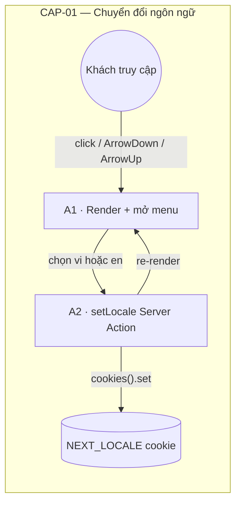
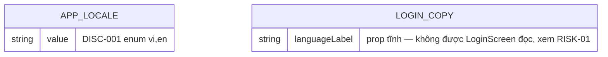
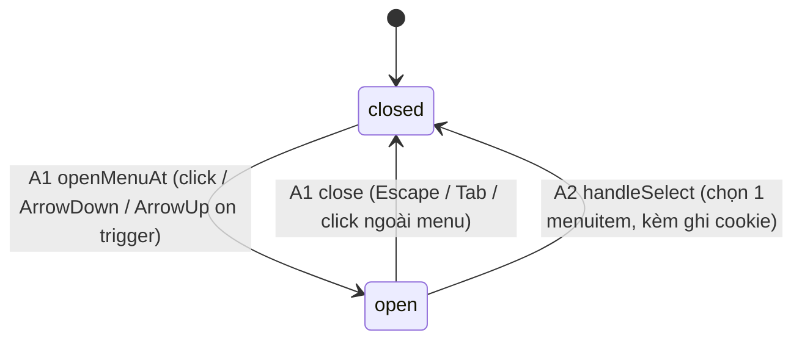

<!-- REVISION draft — xem functional-spec.md đầu file cho phạm vi sửa/thêm. -->

# F002_LanguageSwitch — Technical Spec

**Priority**: P1
**Type**: ui
**Generated**: 2026-09-10

**See also:** [`functional-spec.md`](./functional-spec.md) — tổng quan bằng ngôn ngữ tự nhiên, Open
Decisions, yêu cầu/business rule ở dạng one-liner, screens, user stories, scenarios, edge cases,
configuration cho độc giả BA/QA.

**How to read this file:** § 2 là bảng chỉ mục — chọn action cần xem rồi đọc trọn block ở § 3. § 4
là phụ lục dùng chung — chỉ nhảy vào khi một block ở § 3 trỏ tới.

## 1. Technical Overview

F002 là bộ chọn ngôn ngữ giao diện (VN/EN) nằm trong header của `SCR001_LoginScreen`. Khách truy
cập (chưa đăng nhập) đổi ngôn ngữ bằng một menu kiểu ARIA menu-button; lựa chọn được ghi vào cookie
`NEXT_LOCALE` qua Server Action `setLocale`, và toàn bộ nội dung dịch (next-intl, no-routing mode)
render lại theo locale mới ngay trong cùng round-trip — không cần `router.refresh()`. Tính năng độc
lập hoàn toàn với trạng thái đăng nhập của F001 (không đi qua PERM### nào).

**REVISION (2026-09-10):** MoMorph spec `hUyaaugye2` (3 row: A, A.1, A.2) yêu cầu trigger + mỗi
menu item hiển thị ĐÚNG cờ theo locale, item active có nền phân biệt, và box 110×56px nền tối —
code hiện tại KHÔNG làm điều này (chi tiết § 3.1 A1 "Known Gap" bên dưới). Đồng thời phát hiện
`messages/en.json` còn 7 leaf sót tiếng Việt, và 3 nhãn nav dùng chung header cần được ghi lại là
KHÔNG dịch có chủ đích (FR-002, FR-003 — xem § 4.4 A0).



## 2. Action Index

| # | Action (handler) | Method · Path | Codes | Writes | Detail |
|---|---|---|---|---|---|
| **A0** | *cross-cutting — content-purity contract* | — | FR-002, FR-003 | — | § 4.4 |
| **A1** | `LanguageSelector` + `useMenuKeyboardNav` *(client-only, no BE)* | — *(client render/open state, không có HTTP)* | FR-001, FR-101, FR-201, FR-202, FR-203, SM-001, US001 | — *(read-only)* | § 3.1 |
| **A2** | `setLocale()` | `POST` `/login` *(Server Action call, không phải route riêng)* | FR-001, FR-401, FR-402, FR-601, BR-001, BR-002, US001 | `NEXT_LOCALE` *(cookie, không phải bảng DB)* | § 3.1 |

## 3. Actions

### 3.1 CAP-01 — Chuyển đổi ngôn ngữ giao diện

#### A1 · Hiển thị nhãn ngôn ngữ hiện tại và mở menu chọn
`—` (client state, không có HTTP) → `` `LanguageSelector` + `useMenuKeyboardNav` ``
`FR-001` `FR-101` `FR-201` `FR-202` `FR-203` `SM-001` `US001` · `SCR001_LoginScreen`

**Who** · Khách truy cập (Anonymous) tại `/login` *(không qua PERM### nào)*
**FE** · `src/app/_components/language-selector/language-selector.tsx:26-102` render nút trigger
(`button[aria-haspopup="menu"]`, nhãn "VN"/"EN" + `IconVnFlag` + `IconDown`) và menu
(`[role="menu"]` chứa 2 `[role="menuitem"]`). Vòng đời mở/đóng, focus roving-tabindex và mọi
keydown handler nằm ở `src/hooks/use-menu-keyboard-nav.ts:64-177`. Phép tính chỉ số chạy vòng
tách riêng ở `src/utils/a11y/roving-index.ts:10-24` *(§ 4.5 ALG-001)*.

**Known Gap (FR-201, FR-203 — chưa implement, ghi lại để dev bám theo):**
- `language-selector.tsx:62` render `IconVnFlag` KHÔNG ĐIỀU KIỆN — trigger luôn hiện cờ Việt Nam
  dù `label` đang là `"EN"`. Cần: chọn icon theo `label`/`locale`, và tạo mới `IconEnFlag` (chưa
  tồn tại trong `src/app/_components/language-selector/`).
- `language-selector.tsx:85-97` mỗi `menuitem` chỉ render `{option.label}` (text thuần), không có
  icon cờ nào, không có class phân biệt item đang active (`option.locale === currentLocale`), và
  kích thước item ăn theo `px-4 py-2` (co giãn), không cố định 110×56px. MoMorph row A.1/A.2 yêu
  cầu cả 3 điều này.

**Request** · *không có request* — nhãn hiện tại đến từ locale đã được server resolve, truyền
xuống qua prop `label` (`src/app/_components/language-selector/language-selector.tsx:9-14`).
**BE** · *không có handler BE riêng cho việc render* — nhãn VN/EN đến từ
`src/i18n/request.ts:22-41` (đọc cookie `NEXT_LOCALE`, `normalizeLocale`, `import` message bundle
tương ứng) rồi `src/app/(public)/login/page.tsx:39-51` gọi `getLocale()` và build prop `languageLabel`.
**Rule** · Không có business rule nào áp dụng riêng cho action này ngoài `SM-001` (đóng/mở) và
`DISC-001` (nhãn VN/EN — § 4.2 Polymorphic Behavior).

Không có DEC-### nào ở action này.

**Result** · read-only — **no DB write**. Nhãn nút trigger đổi theo `DISC-001`'s giá trị `value`
(vi → "VN", en → "EN"); **đúng theo FR-201, cờ cũng phải đổi theo — hiện code chưa làm (Known Gap
ở trên).** Mở menu hiển thị đúng 2 `menuitem` theo thứ tự `OPTIONS`
(`src/app/_components/language-selector/language-selector.tsx:16-19`).
**State** · `SM-001`: `closed` → `open` *(§ 4.3)*
**Source:** `src/app/_components/language-selector/language-selector.tsx:26-102` → `src/hooks/use-menu-keyboard-nav.ts:64-177` → `src/utils/a11y/roving-index.ts:10-24` → `src/i18n/request.ts:22-41` → `src/app/(public)/login/page.tsx:39-51`

---

#### A2 · Chọn một ngôn ngữ (ghi cookie + re-render)
`POST` `/login` *(Server Action)* → `` `setLocale()` ``
`FR-001` `FR-401` `FR-402` `FR-601` `BR-001` `BR-002` `US001` · `SCR001_LoginScreen` · `SM-001`

**Who** · Khách truy cập (Anonymous) tại `/login`
**FE** · Click một `menuitem` gọi `handleSelect` (`src/app/_components/language-selector/language-selector.tsx:39-42`)
— đóng menu KHÔNG trả focus (`close(false)`) rồi gọi `onSelect(locale)`. Chuỗi prop-drilling:
`LanguageSelector.onSelect` → `LoginHeader.onSelectLocale` (`src/app/(public)/login/_components/login-header.tsx:37`)
→ `LoginScreen.onSelectLocale` (`src/app/(public)/login/_components/login-screen.tsx:28,44`) →
`LoginClient.onSelectLocale` (`src/app/(public)/login/_components/login-client.tsx:47`) →
`useLoginActions.handleSelectLocale` (`src/app/(public)/login/_hooks/use-login-actions.ts:60-66`).
**Request** · tham số hàm `locale` *(string, không có kiểu ràng buộc phía Server Action —
untrusted input)*.
**BE** · `` `setLocale(locale)` `` — `src/app/_actions/set-locale.ts:25-44`. Gọi
`normalizeLocale(locale)` (`src/lib/i18n/locale.ts:49-51`) trước, sau đó
`cookieStore.set("NEXT_LOCALE", next, { path: "/", maxAge: 31536000, sameSite: "lax" })`.
**Rule**
- **BR-001 — Mọi giá trị locale từ client luôn được chuẩn hoá qua whitelist {vi, en} trước khi
  ghi cookie, bất kể input gửi lên là gì.** `normalizeLocale` (`src/lib/i18n/locale.ts:49-51`) gọi
  `isSupportedLocale` (`src/lib/i18n/locale.ts:34-39`). *(Bin 1 — chỉ dùng ở action này)*
- **BR-002 — Đổi ngôn ngữ dùng CHUNG một `useTransition` với hành động đăng nhập Google, nên
  nút đăng nhập cũng thoáng chuyển sang trạng thái pending khi người dùng chỉ đổi ngôn ngữ.**
  `src/app/(public)/login/_hooks/use-login-actions.ts:40,60-66` — hành vi cố ý. *(Bin 1)*
**Result**
- Ghi cookie `NEXT_LOCALE` ← `normalizeLocale(locale)` — `src/app/_actions/set-locale.ts:29-34`
  (`path: "/"`, `maxAge: 31536000` giây ~ 1 năm, `sameSite: "lax"`) — **đây là bằng chứng thật cho
  FR-401's yêu cầu "sống sót qua reload".**
- Không có `redirect()` — round-trip tự re-render với output mới của `i18n/request.ts`.
**State** · `SM-001`: `open` → `closed` *(§ 4.3)*
**Source:** `src/app/_components/language-selector/language-selector.tsx:39-42` → `src/app/(public)/login/_hooks/use-login-actions.ts:60-66` → `src/app/_actions/set-locale.ts:25-44` → `src/lib/i18n/locale.ts:49-51`

### 3.2 Edge cases

| Action | Scenario | Behavior |
|---|---|---|
| A1 | Cookie `NEXT_LOCALE` mang giá trị rác/không hợp lệ (vd. `"fr"`, `"vi; en"`, `"EN"` sai hoa/thường) ở request kế tiếp | `normalizeLocale` (`src/lib/i18n/locale.ts:49-51`) âm thầm rơi về `DEFAULT_LOCALE = "vi"`; không có lỗi hiển thị, không có log — xem `src/lib/i18n/locale.test.ts` (4/4 case rác) |
| A1 | Lần đầu ghé thăm, chưa từng có cookie `NEXT_LOCALE` | `normalizeLocale(undefined)` trả về `"vi"` ngay từ request đầu tiên (`src/i18n/request.ts:24`) |
| A2 | Click nhanh 2 lựa chọn ngôn ngữ khác nhau trước khi round-trip đầu hoàn tất (race) | Không có debounce/lock — response Server Action nào hoàn tất SAU CÙNG quyết định locale hiển thị cuối cùng |
| A2 | Chọn lại đúng ngôn ngữ đang active | `setLocale` vẫn chạy, ghi lại cùng giá trị cookie — hạn cookie 1 năm được làm mới (sliding expiry) |

## 4. Shared Foundation

### 4.1 Components

| Component | Responsibility | Used in | File |
|---|---|---|---|
| `LanguageSelector` | Trình bày thuần: nút trigger + menu ARIA menu-button, class/a11y attribute | A1, A2 | `src/app/_components/language-selector/language-selector.tsx` |
| `IconEnFlag` *(MỚI — chưa tồn tại)* | Icon cờ Anh cho trigger/menu khi locale `en` (FR-201, FR-203) | A1 | `src/app/_components/language-selector/icon-en-flag.tsx` *(chưa tạo)* |
| `useMenuKeyboardNav` | Giữ state open/close, outside-click listener, roving-focus effect, mọi keydown handler | A1 | `src/hooks/use-menu-keyboard-nav.ts` |
| `useLoginActions` | Bọc `setLocale` trong `startTransition` DÙNG CHUNG với hành động login (`BR-002`) | A2 | `src/app/(public)/login/_hooks/use-login-actions.ts` |
| `setLocale` (Server Action) | Chuẩn hoá locale rồi ghi cookie `NEXT_LOCALE` | A2 | `src/app/_actions/set-locale.ts` |
| `LoginHeader` | Host `LanguageSelector` trong header sticky, dùng chung khung màn hình với F001 | A1 | `src/app/(public)/login/_components/login-header.tsx` |
| `getRequestConfig` (next-intl) | Đọc cookie, chuẩn hoá locale, import message bundle tương ứng cho mọi SSR render | A1 | `src/i18n/request.ts` |

### 4.2 Data Model



| Entity | Table | Used for | Action |
|---|---|---|---|
| `AppLocale` (MODEL001) | `NEXT_LOCALE` *(cookie, không phải bảng DB)* | Union type + hằng số chốt chặn mọi giá trị locale | A1, A2 |
| `LoginCopy.languageLabel` (một field của MODEL003) | *(không persist)* | Field mặc định `"VN"`; server ghi đè bằng `LOCALE_LABEL[locale]` nhưng không được `LoginScreen` đọc (RISK-01) | A1 |

#### Polymorphic Behavior

##### DISC-001 — AppLocale.value

| Value | Render | Validation | Persistence |
|-------|--------|------------|-------------|
| `vi` | Nhãn nút trigger "VN" + cờ Việt Nam *(REVISION: cờ phải theo locale, xem Known Gap § 3.1 A1)*; load `messages/vi.json`; mặc định khi cookie thiếu/rỗng/không hợp lệ | Target fallback của `normalizeLocale` | Ghi khi người dùng chọn "VN" (A2); hoặc mặc định khi cookie thiếu/sai (A1) |
| `en` | Nhãn nút trigger "EN" + cờ Anh *(REVISION — MỚI, hiện code KHÔNG render cờ này, xem Known Gap § 3.1 A1)*; load `messages/en.json` | Phải khớp chính xác chuỗi `"en"` (case-sensitive) | Chỉ ghi khi người dùng chủ động chọn "EN" (A2) |

**Source:** `docs/vi/generated/entities.md` § MODEL001_AppLocale > Discriminator Fields

### 4.3 State Management

#### Trạng thái đóng/mở của menu chọn ngôn ngữ (SM-001)
**kind:** ui
**Linked FR:** FR-201, FR-202, FR-203
**Source:** `src/hooks/use-menu-keyboard-nav.ts:64-177`



### 4.4 Shared Rules

#### Bin 3 — cross-cutting, belongs to no single action

**A0 · FR-002, FR-003 — content-purity contract cho gói nội dung.**
- **FR-002** `messages/en.json` không được chứa leaf tiếng Việt. **Deviation hiện tại (chưa fix):**
  7 leaf còn nguyên tiếng Việt — `kudos.banner.title`, `kudos.compose.placeholder`,
  `kudos.heroSearch.placeholder`, `kudos.heroSearch.ariaLabel`, `kudos.spotlight.searchPlaceholder`,
  `kudos.feed.empty`, `kudos.sidebar.emptyBoard` (xác nhận trực tiếp trong `messages/en.json`).
- **FR-003** 3 nhãn nav dùng chung header ("About SAA 2025", "Award(s) Information", "Sun* Kudos")
  KHÔNG dịch — giữ tiếng Anh ở cả 2 locale, theo chủ đích tại
  `src/app/_shared/site-chrome.ts:64-71` (`defaultSiteChromeCopy.nav`).
**Source:** `messages/en.json` · `src/app/_shared/site-chrome.ts:64-71`

#### Bin 2 — used by ≥2 named actions

None — `BR-001` và `BR-002` mỗi rule chỉ dùng ở đúng 1 action (`A2`).

### 4.5 Algorithms & Integrations

### Tính chỉ số chạy vòng cho điều hướng roving-tabindex (ALG-001)
**Linked FR:** FR-202
**Used in:** A1
**Source:** `src/utils/a11y/roving-index.ts:10-24`
**Input:** `(current: number, count: number)` · **Output:** chỉ số kế tiếp/liền trước/cuối cùng
(`number`) · **Complexity:** O(1)
**Description:** 3 hàm thuần (`lastIndex`, `nextIndex`, `prevIndex`) tính chỉ số item kế
tiếp/liền trước/cuối cùng trong menu, chạm biên thì vòng lại — dùng bởi `useMenuKeyboardNav`.

**Pseudocode:**
```text
function nextIndex(current, count):
  if count <= 0: return 0
  return current >= count - 1 ? 0 : current + 1

function prevIndex(current, count):
  if count <= 0: return 0
  return current <= 0 ? count - 1 : current - 1
```

### 4.6 Configuration

```text
LOCALE_COOKIE = "NEXT_LOCALE"        # tên cookie (src/lib/i18n/locale.ts:17)
LOCALE_COOKIE_MAX_AGE = 31536000     # ~1 năm, tính bằng giây (src/lib/i18n/locale.ts:20)
DEFAULT_LOCALE = "vi"                 # locale fallback khi cookie thiếu/sai (src/lib/i18n/locale.ts:14)
SUPPORTED_LOCALES = ["vi", "en"]     # whitelist duy nhất (src/lib/i18n/locale.ts:9)
```

**Client behavior:** see
[`behavior-logic.md`](../../generated/behavior-logic.md),
[`permissions.md`](../../system/permissions.md),
[`screen-flow.md`](../../generated/screen-flow.md).

## 5. Verification & Technical Notes

### 5.1 Technical Verification

- **SC-001** *(A1)* Mở menu bằng click hoặc ArrowDown/ArrowUp luôn đưa focus đúng vào item
  đầu/cuối tương ứng (covers FR-201, FR-202, SM-001) — Playwright `[KB a1f8c2d1]`, `[KB c4e7d9f2]`
- **SC-002** *(A1)* Mũi tên chạy vòng và Home/End nhảy đúng hai đầu danh sách (covers FR-202) —
  `[KB f7b2a4e8]`, `[KB e3c9b1a5]`, `[KB d6f1c3b9]`, `[KB b8e2d7a4]`
- **SC-003** *(A1)* Escape đóng menu VÀ trả focus về trigger; Tab đóng menu nhưng KHÔNG trả focus
  (covers FR-202) — `[KB c5a9f2d3]`, `[KB a2d8e6f1]`
- **SC-004** *(A1)* Nhãn trigger mặc định hiển thị "VN" và menu chứa đúng 2 item VN/EN (covers
  FR-201) — `[TC 8415b629]`, `[TC 20d87e28]`
- **SC-005** *(A2)* Giá trị locale không hợp lệ luôn được chuẩn hoá về `vi` (covers FR-001,
  BR-001, FR-601) — unit test `src/lib/i18n/locale.test.ts` (8 case)
  — `[UNVERIFIED]` không có Playwright e2e nào thật sự click một `menuitem` rồi assert cookie
  `NEXT_LOCALE`/nội dung re-render (covers FR-401) — xem § 5.3 #2
- **SC-006** *(A1)* Selector ngôn ngữ luôn hiển thị trong header ngay khi `/login` load (covers
  FR-101) — Playwright `[TC 8415b629]`
- **SC-NEW-01** *(A1)* — **[UNVERIFIED — chưa có test, cần bổ sung]** trigger đổi ĐÚNG cờ theo
  locale, mỗi menu item có cờ riêng + item active có nền phân biệt + box 110×56px (covers FR-201,
  FR-203) — không test nào tồn tại vì code chưa implement (Known Gap § 3.1 A1).
- **SC-NEW-02** — **[UNVERIFIED — chưa có test]** `messages/en.json` sạch, không leaf tiếng Việt
  (covers FR-002).

#### US001_SwitchLanguage *(A1, A2)*

**Independent Test:** Vào `/login`, mở menu (click hoặc bàn phím), chọn "English" — xác nhận
trigger đổi cờ + nhãn "EN", nội dung trang dịch sang `en`, cookie `NEXT_LOCALE=en` được set, và
sau khi reload vẫn còn `en`.

**Acceptance Scenarios:**

1. **Given** đang ở `/login` với locale hiện tại `vi`, **When** click menu rồi chọn "English",
   **Then** menu đóng, trigger đổi cờ + nhãn "EN", nội dung dịch sang `en` không tải lại trang.
2. **Given** cookie `NEXT_LOCALE` bị set giá trị rác (`"fr"`), **When** request kế tiếp đi qua
   `i18n/request.ts`, **Then** `normalizeLocale` trả về `vi`, không có lỗi nào được ném ra.

### 5.2 Assumptions

- *(A2)* `setLocale` được giả định LUÔN được gọi đúng bên trong ngữ cảnh Server Action.
- *(A1)* Giả định `itemCount` (2, từ `OPTIONS.length`) không đổi trong vòng đời component.
- *(A2)* Giả định không có cơ chế debounce/lock nào giữa các lần chọn ngôn ngữ liên tiếp.

### 5.3 Unresolved Questions

1. **Hành vi khi `setLocale` ném lỗi** *(A2)*: chưa xác nhận React/Next.js xử lý lỗi này ra sao
   trong `startTransition`.
2. **Thiếu e2e test cho vòng ghi cookie đầy đủ** *(A2)*: không tìm thấy Playwright test nào click
   một `menuitem` rồi assert giá trị cookie `NEXT_LOCALE` hoặc nội dung trang đã re-render.
3. **REVISION — mới:** trigger/menu cờ theo locale (FR-201, FR-203) và content-purity của
   `messages/en.json` (FR-002) đều CHƯA có test nào, vì code chưa implement — xem § 3.1 A1 Known
   Gap và § 4.4 A0.

### 5.4 Source References

| Action | Order | Symbol | Path | Purpose |
|---|---|---|---|---|
| A1 | 1 | `AppLocale`, `normalizeLocale` | `src/lib/i18n/locale.ts:1-51` | Union type + choke-point chuẩn hoá locale |
| A1 | 2 | `LanguageSelector` | `src/app/_components/language-selector/language-selector.tsx:1-102` | Trigger + menu, trình bày thuần |
| A1 | 3 | `useMenuKeyboardNav` | `src/hooks/use-menu-keyboard-nav.ts:1-177` | State open/close, roving-focus, keydown |
| A1 | 4 | `lastIndex`/`nextIndex`/`prevIndex` | `src/utils/a11y/roving-index.ts:1-24` | Wrap-around index math (ALG-001) |
| A1 | 5 | `getRequestConfig` | `src/i18n/request.ts:1-41` | Đọc cookie, chuẩn hoá locale, import message bundle |
| A1 | 6 | `LoginPage` | `src/app/(public)/login/page.tsx:33-51` | Build `languageLabel` (xem RISK-01) |
| A0 | 7 | `messages/en.json` | `messages/en.json` | Content-purity target — FR-002 |
| A0 | 8 | `defaultSiteChromeCopy.nav` | `src/app/_shared/site-chrome.ts:64-71` | Nhãn nav giữ tiếng Anh — FR-003 |
| A2 | 9 | `useLoginActions` | `src/app/(public)/login/_hooks/use-login-actions.ts:39-69` | Bọc `setLocale` trong `startTransition` (BR-002) |
| A2 | 10 | `setLocale` | `src/app/_actions/set-locale.ts:1-44` | Server Action chuẩn hoá + ghi cookie `NEXT_LOCALE` |

#### Data Flow

```text
click menuitem(locale) -> handleSelect() [close(false), onSelect(locale)]
  -> handleSelectLocale(locale) [startTransition]
    -> setLocale(locale) [Server Action]
      -> normalizeLocale(locale) -> "vi" | "en"
      -> cookies().set("NEXT_LOCALE", next, {path:"/", maxAge:31536000, sameSite:"lax"})
    -> round-trip response re-renders page tree
      -> i18n/request.ts đọc lại cookie mới -> import(messages/{locale}.json)
      -> LoginScreen/LoginHeader re-render với label + text mới
```

### 5.5 Artifact References

| Artifact | File | Codes Used | Reviewed |
|----------|------|------------|----------|
| System Overview | [overview.md](../../system/overview.md) | — | [ ] |
| Feature List | [feature-list.md](../../generated/feature-list.md) | F002 | [ ] |
| Entities | [entities.md](../../generated/entities.md) | MODEL001 | [ ] |
| Screens | [functional-spec.md § 6](../../features/F002_LanguageSwitch/functional-spec.md#6-screens) | SCR001 | [ ] |
| Route List | [route-list.md](../../generated/route-list.md) | — (F002 owns no routes) | [ ] |
| Screen Flow | [screen-flow.md § Feature Entry Points](../../generated/screen-flow.md) | SCR001 | [ ] |
| Behavior Logic | [behavior-logic.md](../../generated/behavior-logic.md) | — | [ ] |
| Permissions Matrix | [permissions-matrix.md](../../generated/permissions-matrix.md) | — | [ ] |
| User Stories | [user-stories.md](../../generated/user-stories.md) | US001 | [ ] |
