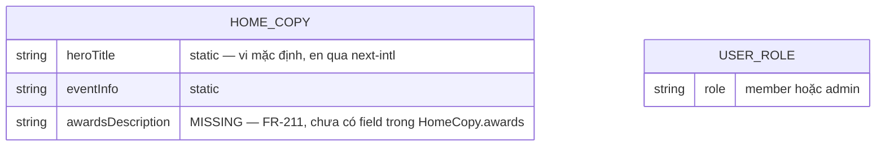
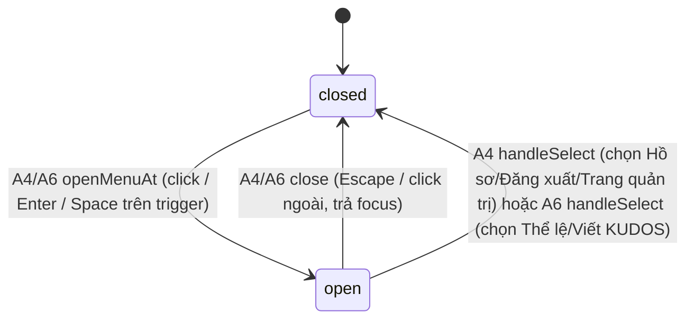

<!-- REVISION draft — xem functional-spec.md đầu file cho phạm vi sửa/thêm (FR-211..FR-214). -->

# F003_Homepage

**Priority**: P0
**Type**: ui
**Generated**: 2026-09-10

**See also:** [`functional-spec.md`](./functional-spec.md) — tổng quan bằng ngôn ngữ tự nhiên, Open Decisions, yêu cầu/business rule ở dạng one-liner, screens, user stories, scenarios, edge cases, configuration cho độc giả BA/QA.

**How to read this file:** § 2 là bảng chỉ mục — chọn action cần xem rồi đọc trọn block ở § 3. § 4 là phụ lục dùng chung — chỉ nhảy vào khi một block ở § 3 trỏ tới.

## 1. Technical Overview

Trang chủ công khai (`/`) của SAA 2025 — trước đây route này chỉ là redirect thuần theo trạng thái đăng nhập (`PERM001_RootRouteGuard`, nay lỗi thời), giờ render đầy đủ nội dung marketing (hero, đếm ngược, thông tin sự kiện, 6 thẻ giải thưởng, quảng bá Sun* Kudos, footer) cho MỌI khách truy cập, đồng thời điều chỉnh header (chuông thông báo, menu tài khoản role-aware) và widget hành động nhanh theo trạng thái đăng nhập đọc được phía server. Không có route BE mới nào. Chỉ 1 capability (`CAP-01`), 6 action (`A1`-`A6`) tuyến tính.

**REVISION (2026-09-10) — 4 điểm sai/thiếu so với bản trước, đối chiếu MoMorph `i87tDx10uM` + code
thật:**
1. Khối C1 (Giải thưởng) thiếu dòng mô tả thứ 3 (FR-211) — § 3.1 A1.
2. Nhãn nav "Award Information" ship số ít dù comment ngay bên cạnh nói số nhiều thắng (FR-212) —
   § 3.1 A1.
3. Logo header 52×48px, spec đòi 64×60px (FR-213) — § 3.1 A1.
4. Font LED "Digital Numbers" không nạp được, digit đếm ngược render `monospace` (FR-214, dùng
   chung với F011) — § 3.1 A2.

FAB pill 106×64/42×32 (D001) GIỮ NGUYÊN — accepted deviation đã ký, không phải mục sửa.

## 2. Action Index

| # | Action (handler) | Method · Path | Codes | Writes | Detail |
|---|---|---|---|---|---|
| **A0** | *cross-cutting — thuộc về không action nào* | — | FR-001 | — | § 4.4 |
| **A1** | `HomePage` (Server Component) | `GET` `/` | FR-002, FR-003, FR-101, FR-201, FR-203, FR-204, FR-205, FR-206, FR-207, FR-208, FR-209, FR-211, FR-212, FR-213, BR-001, BR-004, INT-001, US001, US002 | — *(read-only)* | § 3.1 |
| **A2** | `useCountdown` *(client-only, no BE)* | — *(client tick, không HTTP)* | FR-202, FR-214, BR-003, BR-004, ALG-001, US001 | — *(read-only)* | § 3.1 |
| **A3** | `NavLink` *(client-only)* | — *(client, không HTTP)* | FR-102, DEC-001, US001 | — *(read-only)* | § 3.1 |
| **A4** | `AccountMenu` + `useMenuKeyboardNav` + `logoutAction` | `POST` `/` *(Server Action, không phải route riêng)* | FR-401, FR-403, FR-601, BR-002, BR-006, SM-001, US002 | — *(kết thúc session — không phải bảng DB)* | § 3.1 |
| **A5** | `NotificationBell` *(client-only, no BE)* | — *(client render/open state)* | FR-402, BR-005, US003 | — *(read-only)* | § 3.1 |
| **A6** | `WidgetButton` + `useMenuKeyboardNav` *(client-only, no BE)* | — *(client render/open state)* | FR-210, FR-401, BR-006, SM-001, US004 | — *(read-only)* | § 3.1 |

## 3. Actions

### 3.1 CAP-01 — Xem & tương tác với trang chủ SAA 2025

#### A1 · Render trang chủ (đọc session + role, dựng toàn bộ nội dung)
`GET` `/` → `` `HomePage` ``
`FR-002` `FR-003` `FR-101` `FR-201` `FR-203` `FR-204` `FR-205` `FR-206` `FR-207` `FR-208` `FR-209` `FR-211` `FR-212` `FR-213` · `SCR003_Home` · `US001` `US002`

**Who** · Bất kỳ khách truy cập nào — Anonymous hoặc Authenticated (member/admin), không qua guard nào *(gate A0 — § 4.4)*
**FE** · `src/app/(public)/(home)/page.tsx` build `HomeCopy` rồi render `HomeClient` → `HomeScreen` — cây trang thật: `SiteHeader`, hero + `CountdownTimer` (props seed cho A2), khối thông tin sự kiện + CTA, nội dung Root Further, `AwardsSection` (C1 + `AwardCard` × 6), khối Sun* Kudos, `SiteFooter`.

**Known Gap (FR-211, FR-212, FR-213 — chưa implement, ghi lại để dev bám theo):**
- **FR-211** — `AwardsSection` (`src/app/(public)/(home)/_components/awards-section.tsx:27-38`) chỉ
  render `copy.awards.caption` + `copy.awards.heading`, không có dòng mô tả thứ 3. `HomeCopy.awards`
  type (`src/app/(public)/(home)/_shared/home-copy.ts:53-57`) không có field mô tả — cần thêm field
  mới (vd. `description`) + giá trị ở `defaultHomeCopy.awards` (vi) và `messages/en.json` `home.*`
  (en), rồi render thêm 1 `<p>` trong `AwardsSection`.
- **FR-212** — `src/app/_shared/site-chrome.ts:66-69`: `defaultSiteChromeCopy.nav.awardsInfo =
  "Award Information"` (số ít) — MẶC DÙ comment ngay bên trên (dòng 67-68) ghi rõ "spec A1.3/7.3 +
  TC ID-21/23 win as content acceptance" (tức số nhiều "Awards Information" mới đúng). Code tự mâu
  thuẫn với comment của chính nó — cần sửa giá trị thành `"Awards Information"`.
- **FR-213** — `src/app/_components/site-header.tsx:56-64`: `<Image width={52} height={48}>` +
  class `h-12 w-[52px]` — cần đổi thành 64×60px (`width={64} height={60}`, class tương ứng).

**Request** · không có tham số — chỉ có session cookie Supabase.
**BE** · `getViewer()` (`src/app/_utils/get-viewer.ts`) — gọi `getCurrentUser()` rồi (nếu có user)
đọc `role` + `unreadCount`, fail-open `null` *(INT-001 — § 4.5)*.
**Rule**
- **BR-001 — Header chỉ hiện chuông thông báo và nút tài khoản khi đã đăng nhập; khách chưa đăng nhập thấy một link đăng nhập thay thế ở đúng vị trí đó.** *(Bin 1 — chỉ dùng ở A1)*
- **BR-004 — Biến môi trường `EVENT_START_AT` thiếu/sai định dạng ISO-8601 không làm trang lỗi; parse ra `null`, countdown hiển thị trạng thái "chưa biết mốc" (00/00/00, vẫn hiện "Coming soon").** *(§ 4.4 Bin 2)*
**Result** · read-only — không ghi DB nào. Trả `targetIso`, `initialNowMs`, `viewer` làm props cho `HomeClient`. Không redirect.
**Source:** `src/app/(public)/(home)/page.tsx` → `src/app/_utils/get-viewer.ts` → `src/app/(public)/(home)/_shared/home-copy.ts` → `src/app/(public)/(home)/_components/awards-section.tsx` → `src/app/_components/site-header.tsx` → `src/app/_shared/site-chrome.ts`

---

#### A2 · Đếm ngược thời gian thực (client hook)
— *(client tick, không HTTP)* → `` `useCountdown` ``
`FR-202` `FR-214` · `SCR003_Home` · `US001`

**Who** · Bất kỳ khách truy cập nào đang xem trang chủ
**FE** · `src/app/(public)/(home)/_components/countdown-timer.tsx` gọi `useCountdown(targetIso, initialNowMs)` (dùng chung ở Zone A với F011) — state đầu SEED từ prop server; `setInterval` 1000ms cập nhật `nowMs`. Render 3 `DigitBox` qua `CountdownTiles` (dùng chung với F011).

**Known Gap (FR-214 — chưa implement, dùng chung với F011, xem D003):**
- `src/app/(public)/_components/countdown-tiles.tsx:38-41`: `style={{ fontFamily: '"Digital
  Numbers", monospace' }}` — font `"Digital Numbers"` KHÔNG có file nào nạp trong app (không có
  gì dưới `public/`, `app/fonts.ts` không khai báo) → trình duyệt luôn fallback `monospace`. Cần
  D003 (functional-spec.md § 3) chốt font thật/thay thế trước khi sửa code.

**Request** · không có — input là 2 prop tĩnh từ A1 (`targetIso`, `initialNowMs`)
**BE** · không có handler BE riêng — phép tính thuần chạy trong `src/utils/countdown.ts` *(ALG-001 — § 4.5)*
**Rule**
- **BR-003 — Khi còn lại ≤ 0, 3 ô số giữ nguyên `00/00/00` và nhãn "Coming soon" bị ẩn; giá trị không bao giờ âm.** *(Bin 1)*
- **BR-004 — Env thiếu/sai → `parseTargetDate` trả `null`, countdown hiện 00/00/00 + vẫn "Coming soon".** *(§ 4.4 Bin 2)*
**Result** · read-only — không ghi DB. Re-render 3 ô số khi giá trị phút đổi.
**Source:** `src/app/(public)/_hooks/use-countdown.ts` → `src/utils/countdown.ts` → `src/app/(public)/_components/countdown-tiles.tsx:26-46`

---

#### A3 · Click logo/nav link đang active → cuộn lên đầu trang
— *(client, không HTTP)* → `` `NavLink` ``
`FR-102` · `SCR003_Home` · `US001`

**Who** · Bất kỳ khách truy cập nào, đang ở `/` và click logo hoặc link "About SAA 2025"
**FE** · `src/app/_components/nav-link.tsx` — client leaf dùng `usePathname()` so khớp `href`; nếu đang active thì gắn `onClick` gọi `window.scrollTo({top:0, behavior:"smooth"})` thay vì để Next điều hướng lại
**Request** · không có
**BE** · không có
**Rule**

| DEC | subtype | Condition | What the user sees | Source |
|---|---|---|---|---|
| **DEC-001** | flow | `pathname === href` (đã ở đúng trang) | Trang cuộn mượt lên đầu, không tải lại; nếu KHÔNG active thì Next điều hướng bình thường | `src/app/_components/nav-link.tsx` |

**Result** · read-only — không ghi DB, không điều hướng khi active (chỉ scroll).
**Source:** `src/app/_components/nav-link.tsx`

---

#### A4 · Mở/đóng menu tài khoản, chọn Hồ sơ/Đăng xuất/Trang quản trị
`POST` `/` *(Server Action, không phải route riêng)* → `` `AccountMenu` + `useMenuKeyboardNav` + `logoutAction` ``
`FR-401` `FR-403` `FR-601` · `SCR003_Home` · `SM-001` · `US002`

**Who** · Người dùng đã đăng nhập (member hoặc admin)
**FE** · `src/app/_components/account-menu.tsx` render `button[aria-haspopup="menu"]` + `[role="menu"]`; mở/đóng/roving-focus qua `useMenuKeyboardNav` *(BR-006 — § 4.4)*. Item "Trang quản trị" chỉ render khi prop `role === "admin"`.
**Request** · không có request cho việc mở menu; chọn "Đăng xuất" submit `<form action={logoutAction}>`
**BE** · `logoutAction` (đã có) — gọi `supabase.auth.signOut()` rồi `redirect("/login")`
**Rule** · **BR-002 — Mục "Trang quản trị" trong menu tài khoản chỉ hiện khi vai trò người dùng là `admin`.** *(Bin 1)*
**Result** · read-only cho việc mở/chọn menu; "Đăng xuất" kết thúc phiên rồi điều hướng `/login`.
**State** · `SM-001`: `closed` → `open` *(§ 4.3)*
**Source:** `src/app/_components/account-menu.tsx` → `src/hooks/use-menu-keyboard-nav.ts` → `src/app/_actions/logout.ts`

---

#### A5 · Mở panel thông báo (bell)
— *(client render/open state)* → `` `NotificationBell` ``
`FR-402` · `SCR003_Home` · `US003`

**Who** · Người dùng đã đăng nhập
**FE** · `src/app/_components/notification-bell.tsx` render `button[aria-haspopup="dialog"]` với badge số khi `unreadCount > 0`; click mở `NotificationPanel` (F012, chi tiết đầy đủ ở
`docs/vi/features/F012_NotificationsPanel/technical-spec.md`).
**Request** · `unreadCount` khởi tạo từ `viewer.unreadCount` (A1); sau đó `useNotifications` tự fetch/subscribe Realtime.
**BE** · `getUnreadCount` (từ `getViewer()` ở A1); `markReadAction`/`markAllReadAction` cho tương tác trong panel.
**Rule** · badge số, hiện khi `unreadCount > 0`, giá trị từ `SiteViewer.unreadCount` thật (F012).
**Result** · Đọc + ghi thật qua Server Action.
**Source:** `src/app/_components/notification-bell.tsx` → `src/app/_hooks/use-notifications.ts` → `src/dal/notifications.ts`

---

#### A6 · Mở menu hành động nhanh (widget)
— *(client render/open state)* → `` `WidgetButton` + `useMenuKeyboardNav` ``
`FR-210` `FR-401` · `SCR003_Home` · `SM-001` · `US004`

**Who** · Bất kỳ khách truy cập nào
**FE** · `src/app/(public)/(home)/_components/widget-button.tsx` render pill cố định góc dưới phải; mở `[role="menu"]` 2 `menuitem` ("Thể lệ" → `/standards`, "Viết KUDOS" → `/kudos`). Pill 106×64 ↔ nút tròn 56×56 — **RISK-03 accepted deviation, không đụng.**
**Request** · không có
**BE** · không có
**Rule** · Không có business rule riêng ngoài `BR-006` và `SM-001`.
**Result** · read-only — không ghi DB. Chọn 1 mục điều hướng bằng `next/link` thường.
**State** · `SM-001`: `closed` → `open` *(§ 4.3)*
**Source:** `src/app/(public)/(home)/_components/widget-button.tsx` → `src/hooks/use-menu-keyboard-nav.ts`

### 3.2 Edge cases

| Action | Scenario | Behavior |
|---|---|---|
| A1, A2 | `EVENT_START_AT` thiếu hoặc không parse được | `parseTargetDate` trả `null`; countdown hiện `00/00/00`, "Coming soon" VẪN hiện; không throw |
| A2 | Đã tới hoặc qua mốc sự kiện | 3 ô giữ `00/00/00`, "Coming soon" bị ẩn, không hiển thị số âm |
| A1 | Đọc role từ Supabase lỗi hoặc không có row `public.users` khớp `id` | `getUserRole` fail-open trả `"member"` |
| A1 (link `AwardCard`) | Slug hashtag rỗng/không khớp hạng mục nào | Điều hướng `/awards` KHÔNG có hashtag, không tự cuộn |
| A4, A6 | 5 route đích liên kết từ trang chủ — CHỈ `/admin` chưa tồn tại | 4 route còn lại điều hướng thành công; `/admin` 404 thật cho admin (RISK-01) |

## 4. Shared Foundation

### 4.1 Components

| Component | Responsibility | Used in | File |
|---|---|---|---|
| `HomePage` (Server Component) | Entry `/`, gọi `getViewer()` + build `HomeCopy`, giao cho `HomeClient` | A1 | `src/app/(public)/(home)/page.tsx` |
| `getViewer` | Đọc session + role + unread-count dùng chung (F012), fail-open `null` | A1 | `src/app/_utils/get-viewer.ts` |
| `HomeClient` / `HomeScreen` | Ranh giới client + composition thật của cây trang | A1 | `src/app/(public)/(home)/_components/home-client.tsx`, `home-screen.tsx` |
| `SiteHeader` | Header: logo (FR-213 gap), nav (FR-212 gap), LanguageSelector, bell/account hoặc login link | A1, A4, A5 | `src/app/_components/site-header.tsx` |
| `AwardsSection` | Khối C1 + 6 `AwardCard` (FR-211 gap: thiếu dòng mô tả thứ 3) | A1 | `src/app/(public)/(home)/_components/awards-section.tsx` |
| `CountdownTiles`/`DigitBox` | 3 ô số LED (FR-214 gap: font fallback `monospace`), dùng chung F011 | A2 | `src/app/(public)/_components/countdown-tiles.tsx` |
| `AwardCard` | Thẻ giải thưởng (ảnh+tiêu đề+mô tả+Chi tiết) | A1 | `src/app/(public)/(home)/_components/award-card.tsx` |
| `NotificationBell` | Nút chuông + panel thông báo thật (F012) | A5 | `src/app/_components/notification-bell.tsx` |
| `AccountMenu` | Nút tài khoản + menu Hồ sơ/Đăng xuất/Trang quản trị | A4 | `src/app/_components/account-menu.tsx` |
| `WidgetButton` | Nút nổi góc dưới phải + menu 2 mục | A6 | `src/app/(public)/(home)/_components/widget-button.tsx` |
| `SiteFooter` | Footer: logo+4 link+bản quyền | A1 | `src/app/_components/site-footer.tsx` |
| `getUserRole` | Đọc `public.users.role` phía server, fail-open member | A1 | `src/dal/users.ts` |
| `useCountdown` | Hook tick 1s từ prop server-seeded, trả chuỗi pad 2 chữ số | A2 | `src/app/(public)/_hooks/use-countdown.ts` |
| `useMenuKeyboardNav` | Hook dùng chung mở/đóng+roving tabindex | A4, A6 | `src/hooks/use-menu-keyboard-nav.ts` |

### 4.2 Data Model



| Entity | Table | Used for | Action |
|---|---|---|---|
| `HomeCopy` | — *(không persist)* | Nguồn copy vi mặc định cho toàn bộ trang chủ; `awards` thiếu field mô tả thứ 3 (FR-211) | A1 |
| `UserRole` (mở rộng MODEL002) | `public.users` | Xác định hiện/ẩn mục "Trang quản trị" | A1, A4 |
| `AppLocale` (MODEL001, tái dùng từ F002) | `NEXT_LOCALE` cookie | Nhãn ngôn ngữ hiện tại trên LanguageSelector tái dùng | A1 |

#### Polymorphic Behavior

N/A — no discriminator fields in Key Entities.

### 4.3 State Management

#### Trạng thái đóng/mở của menu tài khoản & widget hành động nhanh (SM-001)
**kind:** ui
**Linked FR:** FR-401
**Source:** `src/hooks/use-menu-keyboard-nav.ts`



**Action transitions:** guard + side effect của mỗi cạnh nằm ở rung **Result**/**Rule** của action tương ứng (§ 3.1 A4, A6).

### 4.4 Shared Rules

#### Bin 3 — cross-cutting, thuộc về không action nào

**A0 · FR-001 — Route `/` không còn qua bất kỳ guard đăng nhập nào; mọi request tới `/` đều được render, không redirect.** Đây là thay đổi thuộc F001 (permissions-matrix.md cần cập nhật PERM001 thành "lỗi thời").
**Source:** `src/proxy.ts` · `src/app/(public)/(home)/page.tsx`

#### Bin 2 — used by ≥2 named actions

**BR-004 — `EVENT_START_AT` thiếu/sai không làm hệ thống lỗi; `parseTargetDate` trả `null`.**
Used in: **A1** · **A2**.
**Source:** `src/utils/countdown.ts` (`parseTargetDate`)
```text
function parseTargetDate(iso):
  if not iso: return null
  d = new Date(iso)
  return isNaN(d) ? null : d
```

**BR-006 — Mọi menu điều khiển bởi `useMenuKeyboardNav` dùng chung một hợp đồng bàn phím.**
Used in: **A4** · **A6**.
**Source:** `src/hooks/use-menu-keyboard-nav.ts`

### 4.5 Algorithms & Integrations

### Tính số ngày/giờ/phút còn lại tới mốc sự kiện, có 0-padding (ALG-001)
**Linked FR:** FR-202
**Used in:** A2
**Source:** `src/utils/countdown.ts`
**Input:** `(target: Date, nowMs: number)` · **Output:** `{days, hours, minutes, reached}` · **Complexity:** O(1)
**Description:** Days không giới hạn 2 chữ số (≥100 hiện 3 chữ số), hours 00–23, minutes 00–59.

**Pseudocode:**
```text
function remaining(target, nowMs):
  totalMin = floor(max(0, target - nowMs) / 60000)
  return {
    days: floor(totalMin / 1440),
    hours: floor((totalMin % 1440) / 60),
    minutes: totalMin % 60,
    reached: target <= nowMs
  }
```

### Đọc vai trò người dùng từ Supabase, fail-open (INT-001)
**Linked FR:** FR-003, FR-601
**Used in:** A1
**Source:** `src/dal/users.ts`
**Type:** api-call
**Target:** Supabase REST — `GET {SUPABASE_URL}/rest/v1/users?select=role&id=eq.<uuid>`
**Payload:** không có body gửi đi; response `[{role: "member"|"admin"}]`
**Failure handling:** try/catch — mọi lỗi fail-open về `role: "member"`, không throw.

### 4.6 Configuration

```text
EVENT_START_AT   # server-only ISO-8601 datetime (không NEXT_PUBLIC_), mốc sự kiện SAA 2025 (A1, A2)
```

**Client behavior:** see [`behavior-logic.md`](../../generated/behavior-logic.md), [`permissions.md`](../../system/permissions.md), [`architecture.md`](../../system/architecture.md).

## 5. Verification & Technical Notes

### 5.1 Technical Verification

- **SC-001** *(A1)* Trang `/` trả về nội dung thành công cho cả Anonymous và Authenticated, không redirect nào xảy ra (covers FR-001)
- **SC-002** *(A1)* Header hiện đúng theo trạng thái đăng nhập (covers FR-208, BR-001)
- **SC-003** *(A2)* Sau 1 phút (giả lập bằng `page.clock`), số phút countdown giảm đúng 1 (covers FR-202)
- **SC-004** *(A1, A2)* Tới/qua mốc sự kiện: 3 ô giữ `00/00/00`, "Coming soon" ẩn (covers FR-202, BR-003, BR-004)
- **SC-005** *(A4)* Admin thấy "Trang quản trị" trong menu tài khoản; member không thấy (covers FR-403, FR-601, BR-002)
- **SC-006** *(A6)* Widget mở đúng 2 `menuitem`, mỗi mục điều hướng đúng route (covers FR-210)
- **SC-NEW-01** — **[UNVERIFIED — chưa có test]** Khối C1 render đủ 3 dòng mô tả (covers FR-211) — không test nào tồn tại vì field chưa có trong `HomeCopy.awards`.
- **SC-NEW-02** — **[UNVERIFIED — chưa có test]** Nav label đọc đúng "Awards Information" số nhiều (covers FR-212) — hiện code ship số ít nên mọi assertion số nhiều sẽ đỏ.
- **SC-NEW-03** — **[UNVERIFIED — chưa có test]** Logo header đo 64×60px (covers FR-213).
- **SC-NEW-04** — **[UNVERIFIED — chưa có test, phụ thuộc D003]** `font-family` chữ số đếm ngược không phải `monospace` (covers FR-214).

#### US001_BrowseHomepage *(A1, A2, A3)*
**Independent Test:** Vào `/` không đăng nhập — xác nhận thấy đủ hero/đếm ngược/thông tin sự kiện/CTA/Root Further/khối Giải thưởng 3 dòng/6 thẻ giải thưởng/Sun* Kudos/footer, header đúng 64×60px logo + nhãn "Awards Information", và mọi link dẫn đúng route/hashtag.
**Acceptance Scenarios:** **Given** `EVENT_START_AT` không hợp lệ, **When** vào `/`, **Then** countdown hiện `00/00/00` + "Coming soon" vẫn hiện, trang không lỗi.

#### US002_ManageAccountFromHeader *(A1, A4)*
**Independent Test:** Đăng nhập, mở menu tài khoản — xác nhận đúng danh sách mục theo role, đăng xuất về `/login`.
**Acceptance Scenarios:** **Given** đọc role lỗi, **When** mở menu tài khoản, **Then** không thấy Trang quản trị.

#### US003_CheckNotifications *(A5)*
**Independent Test:** Đăng nhập, gửi/nhận 1 Kudos hoặc 1 lượt tim, click bell — xác nhận badge số hiện đúng `unreadCount`, panel mở hiện thông báo thật. Chi tiết đầy đủ: `docs/vi/features/F012_NotificationsPanel/technical-spec.md § 5.1`.

#### US004_UseQuickActionWidget *(A6)*
**Independent Test:** Click widget góc dưới phải — xác nhận menu mở đúng 2 mục, chọn 1 mục điều hướng đúng route.

### 5.2 Assumptions

- *(A1)* `public.users` RLS own-row hoạt động đúng qua `@supabase/ssr` server client.
- *(A2)* Render client đầu tiên trùng byte với SSR nhờ `useState(initialNowMs)` seed từ server.

### 5.3 Unresolved Questions

1. **Áp dụng RLS qua code path thật** *(A1)*: chưa xác nhận bằng chính request thật.
2. **`itemCount` cố định của `useMenuKeyboardNav`** *(A4)*: chưa xác nhận role đổi giữa các lần
   render trong cùng phiên có vi phạm giả định này hay không.
3. **REVISION — mới:** FR-211/FR-212/FR-213 đều CHƯA có test hoặc code implement — xem § 3.1 A1
   Known Gap.
4. **REVISION — mới:** FR-214 (font LED) phụ thuộc D003 (functional-spec.md § 3) — chưa thể viết
   assertion "đúng font" cho tới khi có quyết định font thật/thay thế; assertion tối thiểu có thể
   viết ngay là "không phải `monospace`".

### 5.4 Source References

| Action | Order | Symbol | Path | Purpose |
|---|---|---|---|---|
| — | 1 | `HomeCopy` | `src/app/(public)/(home)/_shared/home-copy.ts` | Nguồn nội dung tĩnh mặc định (vi); `awards` thiếu field mô tả (FR-211) |
| A1 | 2 | `HomePage` | `src/app/(public)/(home)/page.tsx` | Server Component, entry point `/` |
| A1 | 3 | `getViewer`, `getUserRole` | `src/app/_utils/get-viewer.ts`, `src/dal/users.ts` | Đọc session + role + unread-count |
| A1 | 4 | `AwardsSection` | `src/app/(public)/(home)/_components/awards-section.tsx:27-38` | Render C1 — thiếu dòng mô tả thứ 3 (FR-211) |
| A1 | 5 | `SiteHeader` | `src/app/_components/site-header.tsx:56-64` | Logo 52×48px, cần 64×60px (FR-213) |
| A1 | 6 | `defaultSiteChromeCopy.nav` | `src/app/_shared/site-chrome.ts:64-71` | Nhãn nav số ít, cần số nhiều (FR-212) |
| A2 | 7 | `useCountdown`, `remaining`, `parseTargetDate` | `src/app/(public)/_hooks/use-countdown.ts`, `src/utils/countdown.ts` | Tính + tick đếm ngược |
| A2 | 8 | `DigitBox` | `src/app/(public)/_components/countdown-tiles.tsx:26-46` | Font fallback `monospace` (FR-214) |
| A3 | 9 | `NavLink` | `src/app/_components/nav-link.tsx` | Active-link scroll-to-top |
| A4, A6 | 10 | `useMenuKeyboardNav` | `src/hooks/use-menu-keyboard-nav.ts` | Hook dùng chung mở/đóng menu |

#### Data Flow

```text
GET / -> HomePage [đọc cookie session] -> getViewer() -> {email, isAdmin, unreadCount}
  -> HomeClient -> HomeScreen -> props xuống SiteHeader/CountdownTimer/AccountMenu/NotificationBell -> render + targetIso/initialNowMs
client tick: useCountdown(targetIso, initialNowMs) -> setInterval 1000ms -> remaining() -> re-render 3 ô số
```

### 5.5 Artifact References

| Artifact | File | Codes Used | Reviewed |
|----------|------|------------|----------|
| System Overview | [overview.md](../../system/overview.md) | — | [ ] |
| Architecture | [architecture.md](../../system/architecture.md) | — | [ ] |
| Feature List | [feature-list.md](../../generated/feature-list.md) | F003 | [ ] |
| Entities | [entities.md](../../generated/entities.md) | MODEL001 (tái dùng từ F002); HomeCopy/UserRole: TBD (draft) | [ ] |
| Screens | [functional-spec.md § 6](./functional-spec.md#6-screens) | SCR003_Home (draft) | [ ] |
| Route List | [route-list.md](../../generated/route-list.md) | TBD (draft) | [ ] |
| Behavior Logic | [behavior-logic.md](../../generated/behavior-logic.md) | TBD (draft) | [ ] |
| Permissions Matrix | [permissions-matrix.md](../../generated/permissions-matrix.md) | PERM001 (ghi chú lỗi thời) | [ ] |
| User Stories | [user-stories.md](../../generated/user-stories.md) | US001-US004 (draft, local) | [ ] |
